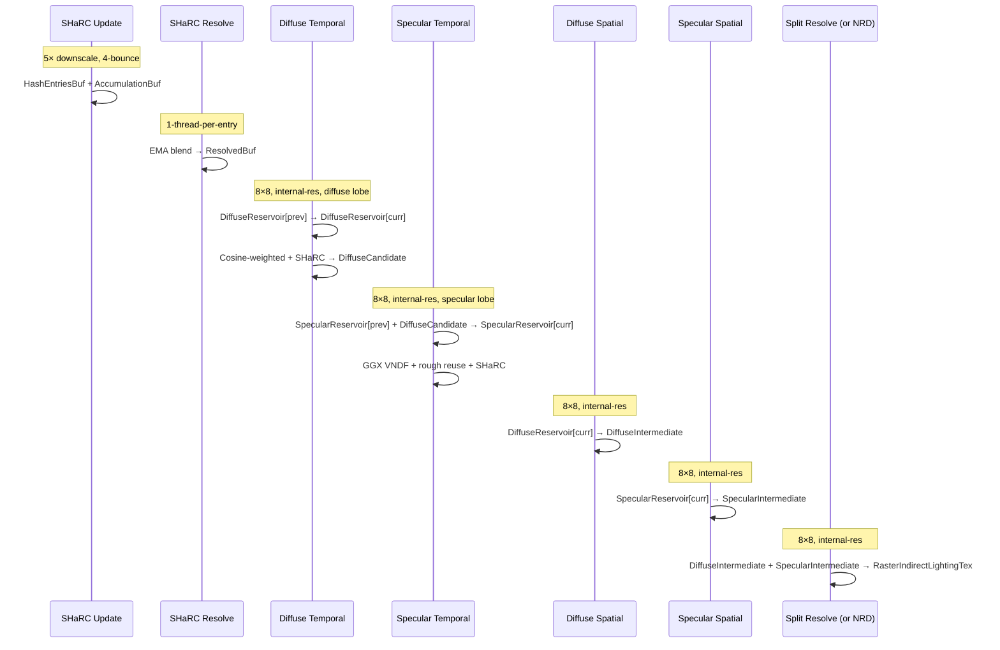
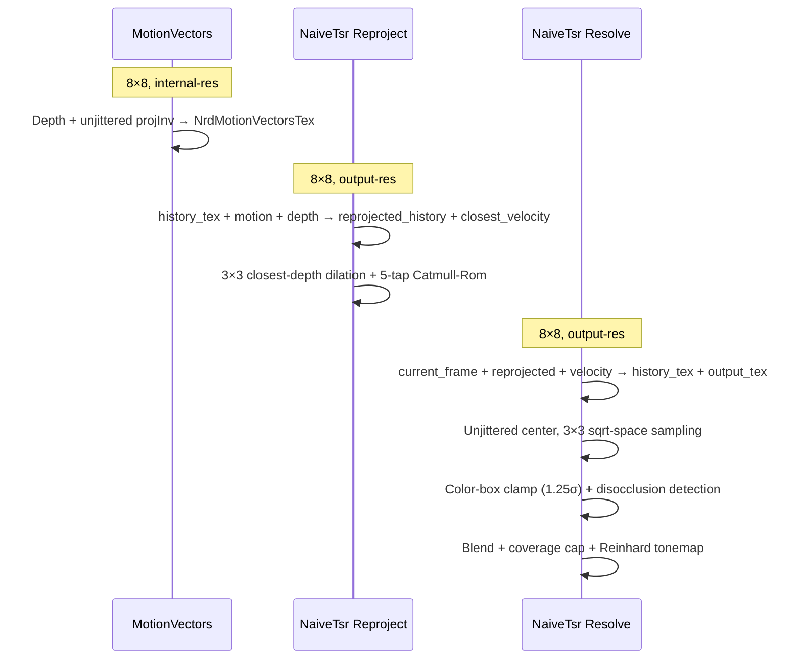

# TortureRed — ReSTIR GI Implementation Reference

_Built from source analysis of shaders and Renderer integration — June 2026_

---

## 📋 Overview

TortureRed implements two ReSTIR GI pipelines, selectable at runtime via `FrameConstants` flags:

| Pipeline | Activation | Use case |
|---|---|---|
| **Split Diffuse/Specular** (Raster) | `enableRasterIndirectGI=1` | Production ReSTIR with split diffuse/specular lobes, SHaRC radiance cache, optional NRD denoising |
| **Raster Unified** (Raster, Legacy) | `enableRasterIndirectGI=1` (alternate codepath) | Single-lobe raster ReSTIR with roughness-adaptive parameters |

The split diffuse/specular pipeline is the **primary focus** of this document — it represents the production-ready ReSTIR GI implementation with the most architectural depth.

---

## 📦 Core Data Structures

### `Reservoir` — per-pixel reservoir state

Defined in [`SharedTypes.h`](../Sources/Shared/SharedTypes.h). Byte-aligned, written as UAV / read as SRV in structured buffers.

| Field | Type | Description |
|---|---|---|
| `hitPos` | `float3` | World-space position of the selected indirect sample |
| `hitNormal` | `float3` | World-space normal at the sample |
| `radiance` | `float3` | Incident continuation radiance `L_i` at the sample |
| `w_sum` | `float` | Running sum of RIS weights `Σwᵢ` |
| `W` | `float` | Normalized weight `W = w_sum / (M · p̂)` |
| `M` | `float` | Effective sample count (history length) |
| `firstBounceHitT` | `float` | Ray distance to the first indirect bounce hit |
| `historyAge` | `uint` | **Bit 31**: lobe flag (0=diffuse, 1=specular). **Bits[0–30]**: age in frames |

### `DiffuseCandidate` — cross-stream sample sharing

Written by the RTDGI diffuse temporal pass; read by the RTR specular temporal pass for rough-surface reuse (Kajiya strategy).

| Field | Type | Description |
|---|---|---|
| `hitPos` | `float3` | First-bounce hit position |
| `hitT` | `float` | Ray distance; `-1.0` = invalid |
| `hitNormal` | `float3` | Surface normal at hit |
| `radiance` | `float3` | Continuation radiance at hit |

### `BindlessIndices` — per-dispatch binding table

| Slot | Use |
|---|---|
| `InputIdx0` | Primary SRV input (varies by pass) |
| `InputIdx1` | Secondary SRV input |
| `InputIdx2` | Tertiary SRV input |
| `OutputIdx0` | Primary UAV output |
| `OutputIdx1` | Secondary UAV output |
| `OutputIdx2` | Tertiary UAV output (debug heatmap) |

### Reservoir Helper Functions

Defined in [`Common.hlsl`](../Sources/Shaders/Common.hlsl):

```hlsl
bool updateReservoir(r, hitPos, hitNormal, radiance, firstBounceHitT, risWeight, rnd)
bool mergeReservoirs(curRes, neighbourRes, shiftedTargetPDF, rnd)
bool mergeReservoirsWithWeight(curRes, neighbourRes, risWeight, rnd)
void capReservoirHistory(r, maxHistoryLength)
bool ReservoirIsSpecular(r)       // lobe flag from bit 31
uint ReservoirAge(r)              // age from bits [0-30]
uint ReservoirPackAge(age, specular)
```

### Target / Jacobian Functions

Defined in [`CommonTracing.hlsl`](../Sources/Shaders/CommonTracing.hlsl):

```hlsl
float GetTargetPDF(surface, samplePos, sampleRadiance, enableSpecular)
float GetTargetShape(surface, samplePos, enableSpecular)
float ComputeJacobian(primaryPos, neighborPos, hitPos, hitNormal)
```

---

## 📐 Reservoir Indexing

All native pipeline reservoirs are stored in 1D `StructuredBuffer<Reservoir>` arrays indexed by a flat pixel index derived from the 2D screen position. There is no indirection table or hash map — the mapping is a direct linear layout.

### 1D Linear Index (all native passes)

Every compute shader thread maps its 2D `SV_DispatchThreadID` to a 1D buffer index:

```hlsl
uint2 screenPos  = DTid.xy;                         // [0..W-1] × [0..H-1]
uint2 launchDims = uint2(g_Frame.screenWidth, g_Frame.screenHeight);
uint  pixelIndex = screenPos.y * launchDims.x + screenPos.x;
```

All reservoir reads and writes in the current frame use this same linear index:
```hlsl
Reservoir prev = prevReservoirs[pixelIndex];   // SRV read
currReservoirs[pixelIndex] = r;                // UAV write
```

The index range is `[0, screenWidth × screenHeight - 1]`, matching dispatch dimensions exactly. There is a 1∶1 correspondence between screen pixel and reservoir slot — every pixel has a reservoir regardless of whether it hit geometry (sky pixels get zeroed).

### Temporal Back-Projection

Temporal reuse looks up a different pixel's reservoir by reprojecting the current surface position into the previous frame's clip space, then converting to screen coordinates:

```hlsl
// Project current world position into previous frame
float4 prevClipPos = mul(float4(surface.worldPos, 1.0f), g_Frame.viewProjPrevious);
prevClipPos /= prevClipPos.w;

// NDC [-1,1] → UV [0,1], Y-flip for D3D conventions
float2 prevUV = prevClipPos.xy * float2(0.5f, -0.5f) + 0.5f;

if (all(prevUV >= 0.0f && prevUV < 1.0f)) {
    uint2 prevScreenPos = min((uint2)(prevUV * (float2)launchDims), launchDims - 1);
    Reservoir prevR = prevReservoirs[prevScreenPos.y * launchDims.x + prevScreenPos.x];
}
```

This is the only cross-pixel index operation in the temporal pass. The reservoir at the reprojected pixel is validated (depth, normal, material, Jacobian) before being merged into the current pixel's reservoir.

### Spatial Neighbor Sampling

Spatial reuse picks random neighbors within a fixed pixel radius, then applies the same 1D linear index:

```hlsl
float radius = 20.0f;
float2 offset = float2(next_float(rng) * 2.0f - 1.0f, next_float(rng) * 2.0f - 1.0f) * radius;
int2 neighborPos = int2(screenPos) + int2(offset);

if (all(neighborPos >= 0 && neighborPos < (int2)launchDims)) {
    uint neighborIndex = neighborPos.y * launchDims.x + neighborPos.x;
    Reservoir neighborR = currReservoirs[neighborIndex];
}
```

The radius of 20 pixels is in screen space; neighbors are clamped to valid bounds.

### Ping-Pong Double Buffering

Reservoir buffers are double-buffered. A single `m_CurrentReservoirIndex` (0 or 1) toggles each frame via `m_CurrentReservoirIndex = 1 - m_CurrentReservoirIndex`:

```
Frame N:   write → ReservoirBuffer[currIndex],   read ← ReservoirBuffer[1-currIndex]
Frame N+1: write → ReservoirBuffer[1-currIndex], read ← ReservoirBuffer[currIndex]
```

The split diffuse/specular pipeline maintains two independent ping-pong pairs:
- `DiffuseReservoirBuffer[0]` / `DiffuseReservoirBuffer[1]`
- `SpecularReservoirBuffer[0]` / `SpecularReservoirBuffer[1]`

### Resolution

All reservoir buffers are sized at **internal resolution** (`screenWidth × screenHeight`), not output resolution. TAA upscaling happens downstream and is independent of the ReSTIR pipeline.

### Indexing Summary

| Operation | Index Formula | Buffer |
|---|---|---|
| Current-frame read/write | `y * W + x` | `ReservoirBuffer[curr]` |
| Temporal back-projection | `prevScreenPos.y * W + prevScreenPos.x` | `ReservoirBuffer[prev]` |
| Spatial neighbor | `neighborPos.y * W + neighborPos.x` | `ReservoirBuffer[curr]` |

---

## 🔀 Pipeline 1 — Split Diffuse/Specular ReSTIR (Raster)

**Source files**:
- [`RestirGI_Diffuse_Temporal.hlsl`](../Sources/Shaders/RestirGI_Diffuse_Temporal.hlsl) — RTDGI stream
- [`RestirGI_Specular_Temporal.hlsl`](../Sources/Shaders/RestirGI_Specular_Temporal.hlsl) — RTR stream
- [`RestirGI_Diffuse_Spatial.hlsl`](../Sources/Shaders/RestirGI_Diffuse_Spatial.hlsl)
- [`RestirGI_Specular_Spatial.hlsl`](../Sources/Shaders/RestirGI_Specular_Spatial.hlsl)
- [`RestirGI_Split_Resolve.hlsl`](../Sources/Shaders/RestirGI_Split_Resolve.hlsl)

**Activation**: `enableRasterIndirectGI=1`

This is the **primary production pipeline**. Diffuse and specular are handled by completely separate reservoir streams with lobe-specific sampling, thresholds, and optimizations. A shared `DiffuseCandidateBuffer` enables rough-surface specular reuse of diffuse samples.

### Pipeline Flow



---

### Architectural Rationale

**Why split the lobes?** A unified reservoir (as in the legacy Pipeline 3) must use a combined diffuse+specular PDF for candidate generation, which dilutes RIS efficiency — diffuse samples waste speculative lobe weight and vice versa. Splitting creates two independent RIS streams, each with lobe-specific sampling, thresholds, and history lengths optimized for the target distribution:

| Property | Diffuse Stream (RTDGI) | Specular Stream (RTR) |
|---|---|---|
| **Sampling** | Cosine-weighted hemisphere | GGX VNDF importance sampling |
| **Max history `M`** | 16 frames | 3 frames |
| **Init gain clamp** | 12.0 | 3.0 |
| **Reuse weight clamp** | 64.0 | 8.0 |
| **Jacobian clamp** | `[0.1, 10.0]` | `[0.1, 1.5]` |
| **Reflection check** | None | `dot(refl, refl) > 0.995` (temporal), `> 0.98` (spatial) |

The diffuse stream tolerates aggressive temporal accumulation (up to 16 frames) because diffuse lighting changes slowly under camera motion. The specular stream uses a tight window (3 frames) because specular highlights shift rapidly with view angle, and the reflection-direction check (`dot > 0.995`) filters out mismatched reuse.

### Cross-Stream Reuse: DiffuseCandidate

The key insight borrowed from Kajiya's approach: **rough specular surfaces behave quasi-diffusely**. When roughness exceeds `rtrRoughReuseThreshold` (default `0.6`), the specular temporal pass skips its own GGX trace entirely and instead reads the diffuse candidate (`DiffuseCandidateBuffer`) written by the diffuse temporal pass:

```
Diffuse Temporal                           Specular Temporal
  ↓                                           ↓
  Cosine-weighted sample                      if (roughness ≥ rtrRoughReuseThreshold):
  ↓                                             Read DiffuseCandidate (hitPos, hitNormal, radiance)
  Write DiffuseCandidateBuffer                 Use it as the sole initial candidate
  ↓                                           else:
                                                ImportanceSampleGGX() → single bounce
```

Each `DiffuseCandidate` carries: `hitPos` (first-bounce world position), `hitT` (ray distance; `-1.0` = invalid), `hitNormal` (surface normal at hit), `radiance` (continuation radiance at hit). The specular pass validates `hitT > 0` before reuse.

This eliminates redundant traces: a rough surface at `roughness=0.7` would trace nearly the same GGX lobe as a cosine-weighted lobe. The RIS framework still applies the correct target PDF through the `updateReservoir()` merge, so the reused sample is correctly weighted — it's just sampled from the diffuse PDF instead of the specular PDF.

### Continuation Radiance: SHaRC

All candidates (both diffuse and specular) resolve their continuation radiance from **SHaRC** (Spatio-temporal Hash-grid Radiance Cache). When a ray hits a secondary surface, the shader calls `SharcGetCachedRadiance(hitPos, hitNormal)` to look up the accumulated radiance at that world-space position. If the cache has a valid entry, the result is returned directly with no further tracing. If the cache miss, it falls back to `GetDirectLightingHybrid()` (light-sampled NEE at the hit point).

This is what makes the pipeline "raster" — the primary visibility is rasterized (GBuffer), and only a single indirect bounce is traced per pixel per frame. SHaRC provides an amortized multi-bounce effect by caching radiance from previous frames' traces.

**SHaRC in the frame schedule**:
1. **Update pass** (5× downscale): traces 4-bounce paths from rotating sub-pixel positions, deposits radiance into a spatial hash grid
2. **Resolve pass**: EMA-blends accumulated radiance per hash entry, evicts stale entries
3. **ReSTIR passes**: look up SHaRC at each bounce hit point for continuation radiance

### Dispatch Summary

| Pass | Thread group | Buffer flow |
|---|---|---|
| SHaRC Update | `ceil(W/5)/8 × ceil(H/5)/8` | `→ HashEntriesBuf + AccumulationBuf` |
| SHaRC Resolve | `(entries + 255) / 256` | `AccumulationBuf → ResolvedBuf` |
| Diffuse Temporal | `W/8 × H/8` | `DiffuseReservoir[prev] → DiffuseReservoir[curr] + DiffuseCandidate` |
| Specular Temporal | `W/8 × H/8` | `SpecularReservoir[prev] + DiffuseCandidate → SpecularReservoir[curr]` |
| Diffuse Spatial | `W/8 × H/8` | `DiffuseReservoir[curr] → DiffuseIntermediate` |
| Specular Spatial | `W/8 × H/8` | `SpecularReservoir[curr] → SpecularIntermediate` |
| Split Resolve (or NRD) | `W/8 × H/8` | `DiffuseInter. + SpecularInter. → RasterIndirectLightingTex` |

---

### Pre-Pass A — SHaRC Update

**Shader**: [`SHaRC_Update.hlsl`](../Sources/Shaders/SHaRC_Update.hlsl) — entry `main`, `[numthreads(8,8,1)]`

Compiled with `-DSHARC_UPDATE=1 -DSHARC_PROPAGATION_DEPTH=4`. Dispatched at `ceil(W/5)/8 × ceil(H/5)/8` groups (5× downscale).

**Algorithm**: Each thread picks one rotating pixel in a 5×5 tile. Traces up to `SHARC_PROPAGATION_DEPTH=4` bounces with `SampleIndirectRay()` + Russian roulette. Deposits direct lighting at each hit via `SharcUpdateHit()` into `SharcHashEntriesBuf` + `SharcAccumulationBuf`.

---

### Pre-Pass B — SHaRC Resolve

**Shader**: [`SHaRC_Resolve.hlsl`](../Sources/Shaders/SHaRC_Resolve.hlsl) — entry `main`, `[numthreads(256,1,1)]`

Dispatched at `(SHARC_HASH_ENTRIES_NUM + 255) / 256` groups (one thread per hash entry).

**Algorithm**: `SharcResolveEntry()` — EMA blend accumulation → resolved buffer (`SharcResolvedBuf`); evict stale entries; clear accumulation slot.

---

### Pass 1 — Diffuse Temporal (RTDGI)

**Shader**: [`RestirGI_Diffuse_Temporal.hlsl`](../Sources/Shaders/RestirGI_Diffuse_Temporal.hlsl) — entry `main`, `[numthreads(8,8,1)]`

**Lobe**: Diffuse-only. Cosine-weighted hemisphere sampling. Reads previous-frame `DiffuseReservoirBuffer[prev]`, GBuffer depth/albedo/normal/material, `SharcResolvedBuf`, `LightsBuffer`.

**Algorithm**

1. Trace primary ray → reconstruct `Surface` from GBuffer
2. **Diffuse sampling**: `sample_cosine_weighted()` → `align_to_normal()` → single bounce trace
3. **Continuation**: query SHaRC (`SharcGetCachedRadiance()`); fallback to `GetDirectLightingHybrid()` (NEE)
4. Write `DiffuseCandidate` for RTR reuse (invalid → `hitT=-1`)
5. **Initial reservoir**: `updateReservoir()` with `risWeight = min(targetShape/pdf, INIT_GAIN_CLAMP) × radianceLuma`
6. **Temporal reuse** (diffuse-optimized — no reflection-direction check):
   - Reproject via `viewProjPrevious`; validate depth (`±10%`), normal (`>0.95`), material similarity
   - Compute Jacobian; clamp `[0.1, 10.0]`; `mergeReservoirsWithWeight()` with weight clamped to 64
   - Cap `M` to `MAX_HISTORY_LENGTH=16`
7. Normalize `W = w_sum / (M · selectedPDF)`
8. Outputs: `DiffuseReservoirBuffer[curr]`, `DiffuseCandidateBuffer`, debug heatmap (conditional)

**Key Constants**

| Constant | Value |
|---|---|
| `RESTIR_TEMPORAL_MAX_HISTORY_LENGTH` | `16.0` |
| `RESTIR_TEMPORAL_MAX_HISTORY_AGE` | `12` frames |
| `RESTIR_TEMPORAL_INIT_GAIN_CLAMP` | `12.0` |
| `RESTIR_TEMPORAL_REUSE_WEIGHT_CLAMP` | `64.0` |
| `RESTIR_TEMPORAL_MAX_JACOBIAN` | `10.0` |
| `RESTIR_TEMPORAL_MIN_JACOBIAN` | `0.1` |
| `RESTIR_TEMPORAL_DEPTH_THRESHOLD` | `0.1` |
| `RESTIR_TEMPORAL_NORMAL_THRESHOLD` | `0.95` |

---

### Pass 2 — Specular Temporal (RTR)

**Shader**: [`RestirGI_Specular_Temporal.hlsl`](../Sources/Shaders/RestirGI_Specular_Temporal.hlsl) — entry `main`, `[numthreads(8,8,1)]`

**Lobe**: Specular-only. GGX VNDF importance sampling. Rough surfaces (`roughness ≥ rtrRoughReuseThreshold`, default `0.6`) reuse the diffuse candidate from Pass 1. Reads `SpecularReservoirBuffer[prev]`, `DiffuseCandidateBuffer`, GBuffer, `SharcResolvedBuf`, `LightsBuffer`.

**Outputs**: `SpecularReservoirBuffer[curr]`, debug heatmap (conditional).

**Algorithm**

1. Trace primary ray → compute `currentReflectionDir = reflect(-viewDir, normal)`
2. **Two-path candidate generation**:

   **Path A — Rough reuse** (`roughness ≥ rtrRoughReuseThreshold`):
   - Read `DiffuseCandidate`; if valid (`hitT > 0`), use cosine-weighted PDF

   **Path B — Specular trace** (`roughness < rtrRoughReuseThreshold`):
   - `ImportanceSampleGGX()` VNDF → single bounce → SHaRC or NEE fallback

3. **Initial reservoir**: `updateReservoir()` with `risWeight = min(targetShape/pdf, INIT_GAIN_CLAMP=3) × radianceLuma`; tag `historyAge` with specular flag bit
4. **Temporal reuse** (specular-optimized):
   - Validate depth, normal, material **and** reflection direction: `dot(currentReflection, prevReflection) > 0.995`
   - Jacobian clamp `[0.1, 1.5]`; weight clamp `8`
   - Cap `M` to `MAX_HISTORY_LENGTH=3`
5. Normalize `W`

**Key Constants**

| Constant | Value |
|---|---|
| `RESTIR_TEMPORAL_MAX_HISTORY_LENGTH` | `3.0` |
| `RESTIR_TEMPORAL_MAX_HISTORY_AGE` | `12` frames |
| `RESTIR_TEMPORAL_INIT_GAIN_CLAMP` | `3.0` |
| `RESTIR_TEMPORAL_REUSE_WEIGHT_CLAMP` | `8.0` |
| `RESTIR_TEMPORAL_MAX_JACOBIAN` | `1.5` |
| `RESTIR_TEMPORAL_REFLECTION_THRESHOLD` | `0.995` |

---

### Pass 3 — Diffuse Spatial

**Shader**: [`RestirGI_Diffuse_Spatial.hlsl`](../Sources/Shaders/RestirGI_Diffuse_Spatial.hlsl) — entry `main`, `[numthreads(8,8,1)]`

Reads `DiffuseReservoirBuffer[curr]` (post-temporal), outputs to `DiffuseReservoirIntermediate`.

**Algorithm**

- 3 random neighbors, radius 20 pixels
- Validate: `dot(normals) > 0.95`, `|depth_diff| ≤ 10% × depth`, material similarity
- No reflection-direction check (diffuse)
- Jacobian clamp `[0.1, 10.0]`; weight clamp `64.0`
- Normalize `W`

**Key Constants**

| Constant | Value |
|---|---|
| `RESTIR_SPATIAL_MAX_JACOBIAN` | `10.0` |
| `RESTIR_SPATIAL_MIN_JACOBIAN` | `0.1` |
| `RESTIR_SPATIAL_REUSE_WEIGHT_CLAMP` | `64.0` |
| Neighbors | 3 |
| Radius | 20 px |

---

### Pass 4 — Specular Spatial

**Shader**: [`RestirGI_Specular_Spatial.hlsl`](../Sources/Shaders/RestirGI_Specular_Spatial.hlsl) — entry `main`, `[numthreads(8,8,1)]`

Reads `SpecularReservoirBuffer[curr]` (post-temporal), outputs to `SpecularReservoirIntermediate`.

**Algorithm**

- 3 random neighbors, radius 20 pixels
- Validate: depth, normal, material **and** reflection-direction check: `dot(centerReflection, candidateDir) > 0.98`
- Jacobian clamp `[0.1, 1.25]` (tight); weight clamp `6.0`
- Normalize `W`

**Key Constants**

| Constant | Value |
|---|---|
| `RESTIR_SPATIAL_MAX_JACOBIAN` | `1.25` |
| `RESTIR_SPATIAL_MIN_JACOBIAN` | `0.1` |
| `RESTIR_SPATIAL_REUSE_WEIGHT_CLAMP` | `6.0` |
| `RESTIR_SPATIAL_REFLECTION_THRESHOLD` | `0.98` |
| Neighbors | 3 |
| Radius | 20 px |

---

### Pass 5 — Split Resolve

**Shader**: [`RestirGI_Split_Resolve.hlsl`](../Sources/Shaders/RestirGI_Split_Resolve.hlsl) — entry `main`, `[numthreads(8,8,1)]`

Reads `DiffuseReservoirIntermediate` + `SpecularReservoirIntermediate`, outputs to `RasterIndirectLightingTex`.

**Algorithm**

1. Trace primary ray
2. Evaluate diffuse reservoir with **diffuse BRDF only**: `diffBRDF · radiance · W · NdotL`
3. If `enableIndirectSpecular`, evaluate specular reservoir with **specular BRDF only**: `specBRDF · radiance · W · NdotL`
4. Sum and clamp to 10.0; coverage = 1.0

---

### NRD Denoising Path (Optional — Replaces Pass 5)

Active when `enableNrdRelax=1 && restirReservoirDebugMode=0 && sharcDebug=0`.

### NRD Denoising Path (Optional — Replaces Pass 5)

Active when `enableNrdRelax=1 && restirReservoirDebugMode=0 && sharcDebug=0`.

#### NRD Pre-Pass — Prepare Guides

**Shader**: [`NrdPrepareGuides.hlsl`](../Sources/Shaders/NrdPrepareGuides.hlsl) — `[numthreads(8,8,1)]`

Reads GBuffer depth/normal/material, outputs `NrdMotionVectorsTex` (screen-space motion), `NrdNormalRoughnessTex` (NRD-packed normal+roughness), `NrdViewZTex` (view-space Z).

#### NRD Pack Signals

**Shader**: [`NrdPackRasterIndirect.hlsl`](../Sources/Shaders/NrdPackRasterIndirect.hlsl) — `[numthreads(8,8,1)]`

Reads `DiffuseReservoirIntermediate` + `SpecularReservoirIntermediate` + GBuffer. Evaluates diffuse and specular reservoirs using `NRD_MaterialFactors()` for correct denoiser BRDF normalization, then packs with `RELAX_FrontEnd_PackRadianceAndHitDist()` into `NrdNoisyDiffuseTex` + `NrdNoisySpecularTex`.

#### NRD Relax Denoising

NVIDIA NRD Relax denoiser (diffuse + specular). Max accumulation: 12 frames diffuse, 8 frames specular.

**Outputs**: `NrdDenoisedDiffuseTex`, `NrdDenoisedSpecularTex`

#### NRD Composite

**Shader**: [`NrdCompositeIndirect.hlsl`](../Sources/Shaders/NrdCompositeIndirect.hlsl) — `[numthreads(8,8,1)]`

Reads `NrdDenoisedDiffuseTex` + `NrdDenoisedSpecularTex` + GBuffer. Unpacks denoised radiance with `RELAX_BackEnd_UnpackRadiance()`, multiplies by `NRD_MaterialFactors()` for each lobe, composites into `RasterIndirectLightingTex`, clamped to 10.0.
---

## 🔀 Pipeline 2 — Raster Unified ReSTIR (Legacy)

**Source files**: [`RestirGI_Raster_Temporal.hlsl`](../Sources/Shaders/RestirGI_Raster_Temporal.hlsl), [`RestirGI_Raster_Spatial.hlsl`](../Sources/Shaders/RestirGI_Raster_Spatial.hlsl), [`RestirGI_Raster_Resolve.hlsl`](../Sources/Shaders/RestirGI_Raster_Resolve.hlsl)

Single reservoir stream handling both diffuse and specular via roughness-adaptive thresholds. Defines `glossyFactor = 1 - saturate((roughness - 0.05) / 0.25)` to interpolate all parameters.

### Pass 1 — Raster Temporal

**Algorithm**: `SampleIndirectRay()` (combined lobe) → single bounce → SHaRC or NEE → initial reservoir written to `ReservoirBuffer[curr]` → temporal reuse with roughness-interpolated parameters (see table below).

**Roughness-Adaptive Parameters**

| Parameter | Rough (`α > 0.30`) | Glossy (`α < 0.05`) |
|---|---|---|
| Max history length | `16.0` | `3.0` |
| Max Jacobian | `10.0` | `1.5` |
| Init gain clamp | `12.0` | `3.0` |
| Reuse weight clamp | `64.0` | `8.0` |
| Reflection threshold | N/A | `0.995` |

### Pass 2 — Raster Spatial

**Algorithm**: 3 neighbors, radius 20. When `enableReservoirLobeCheck=1` and `glossyFactor > 0`, applies reflection-direction check with threshold interpolated `[0.80, 0.98]`. Jacobian clamp interpolated `[10.0, 1.25]`. Weight clamp interpolated `[48.0, 6.0]`. Outputs to `ReservoirIntermediate`.

### Pass 3 — Raster Resolve

**Algorithm**: `(diffBRDF + specBRDF) · NdotL · radiance · W`, clamped to 10.0, written to `RasterIndirectLightingTex`. `specBRDF = 0` when `enableIndirectSpecular=0`.

---

## 🎬 TAA / Temporal Super-Resolution (Naive TSR)

**Source files**: [`MotionVectors.hlsl`](../Sources/Shaders/MotionVectors.hlsl), [`NaiveTsr_Reproject.hlsl`](../Sources/Shaders/NaiveTsr_Reproject.hlsl), [`NaiveTsr_Resolve.hlsl`](../Sources/Shaders/NaiveTsr_Resolve.hlsl)

**Activation**: `antiAliasingMode=AA_MODE_TAA` (`2`) and `taaEnabled=1`

Operates at **output resolution**; upscales from internal resolution when they differ. Runs after all ReSTIR passes on both the ray-traced and raster paths.

### TAA Flow



---

### TAA Pre-Pass — Generate Motion Vectors

**Shader**: [`MotionVectors.hlsl`](../Sources/Shaders/MotionVectors.hlsl) — entry `main`, `[numthreads(8,8,1)]`

Dispatched at internal resolution (`screenWidth × screenHeight`). Uses GBuffer depth, unjittered `projectionInverseUnjittered`, and `viewProjPrevious` to generate screen-space motion vectors into `NrdMotionVectorsTex`.

**Algorithm**

1. Reconstruct world position from depth using **unjittered** `projectionInverseUnjittered` (avoids jitter contamination in motion vectors)
2. Project to previous frame via `viewProjPrevious` → `prevUV`
3. Output `prevUV - currUV`; sky/background pixels output `(0, 0)`

---

### TAA Pass 1 — Reproject History

**Shader**: [`NaiveTsr_Reproject.hlsl`](../Sources/Shaders/NaiveTsr_Reproject.hlsl) — entry `main`, `[numthreads(8,8,1)]`

Dispatched at **output resolution** (`outputWidth × outputHeight`). Reads `TaaHistoryTex[prev]`, `NrdMotionVectorsTex`, GBuffer depth.

**Algorithm**

1. Map output pixel to internal-resolution pixel: `reproj_px = (px + 0.5) × (internalSize / outputSize)`
2. **3×3 closest-depth velocity dilation**: pick motion vector from the pixel with smallest depth (closest surface) in 3×3 neighborhood → `TaaClosestVelocityTex`
3. Compute history UV: `currUV + motionVector`
4. **5-tap Catmull-Rom** sampling of history texture for sharper reprojection
5. Out-of-bounds → zero history
6. Outputs: `TaaReprojectedHistoryTex` + `TaaClosestVelocityTex`

---

### TAA Pass 2 — Resolve

**Shader**: [`NaiveTsr_Resolve.hlsl`](../Sources/Shaders/NaiveTsr_Resolve.hlsl) — entry `main`, `[numthreads(8,8,1)]`

Dispatched at **output resolution** (`outputWidth × outputHeight`). Reads current-frame HDR (`RasterHdrOutputTex`/`PathTracerHdrOutput`), `TaaReprojectedHistoryTex`, `TaaClosestVelocityTex`. Outputs to `TaaHistoryTex[curr]` + `TaaOutputTex`.

**Algorithm**

1. **Unjittered center**: `dst_unjittered_internal = (px + 0.5) × scale - taaJitter`
2. **3×3 Gaussian-weighted** sampling of current frame in perceptual (`sqrt`) space:
   - Center weight: `exp2(-10 × d²)` (tight)
   - Neighborhood weight: `exp2(-d²)` (wider, for variance estimation)
3. Compute neighborhood mean `ex` and variance `ex2` → `input_dev = sqrt(ex2 - ex²)`
4. **History clamping**: `clamp(tonemap(history), ex - 1.25σ, ex + 1.25σ)`
5. **Disocclusion detection**: measure clamp amount → reduce `history_coverage` by `saturate(1 - clampAmount × 2)`
6. **Coverage blend**: `(clamped_history × history_coverage + center × coverage) / total_coverage`
7. **Coverage cap**: `min(total_coverage, max(2, TARGET_SAMPLE_COUNT / (scale.x × scale.y)))` where `TARGET_SAMPLE_COUNT=8`
8. Write history: `float4(final_color, total_coverage)`
9. Write output: `exposure × final_color` → Reinhard tonemap → `saturate`

---

## 📐 Full Frame Rendering Order

### Raster Path (Split Diffuse/Specular)

```
Depth Pre-Pass
  → GBuffer Pass
  → SHaRC Update     (SharcHashEntriesBuf + SharcAccumulationBuf)
  → SHaRC Resolve    (SharcAccumulationBuf → SharcResolvedBuf)
  → Diffuse Temporal (DiffuseReservoirBuffer[prev] → DiffuseReservoirBuffer[curr] + DiffuseCandidateBuffer)
  → Specular Temporal(SpecularReservoirBuffer[prev] + DiffuseCandidateBuffer → SpecularReservoirBuffer[curr])
  → Diffuse Spatial  (DiffuseReservoirBuffer[curr] → DiffuseReservoirIntermediate)
  → Specular Spatial (SpecularReservoirBuffer[curr] → SpecularReservoirIntermediate)
  → if NRD:
      NrdPrepareGuides   (GBuffer → NrdMotionVectorsTex + NrdNormalRoughnessTex + NrdViewZTex)
      NrdPackSignals     (DiffuseInter. + SpecularInter. → NrdNoisyDiffuse + NrdNoisySpecular)
      NRD Relax Denoise  (noisy → NrdDenoisedDiffuse + NrdDenoisedSpecular)
      NrdComposite       (denoised → RasterIndirectLightingTex)
  → else:
      Split Resolve      (DiffuseInter. + SpecularInter. → RasterIndirectLightingTex)
  → [SHaRC Debug — optional, overwrites RasterIndirectLightingTex]
  → Lighting Pass    (RasterIndirectLightingTex → RasterHdrOutputTex)
  → if TAA:
      MotionVectors       (depth → NrdMotionVectorsTex)
      NaiveTsr_Reproject  (TaaHistoryTex[prev] + motion → TaaReprojectedHistoryTex + TaaClosestVelocityTex)
      NaiveTsr_Resolve    (RasterHdrOutputTex + reprojected → TaaHistoryTex[curr] + TaaOutputTex)
  → Transparency Pass (Forward)
```

### Reservoir Ping-Pong

`m_CurrentReservoirIndex` (0 or 1) toggles each frame:

| Frame parity | `currentReservoir` | `previousReservoir` |
|---|---|---|
| Even | `0` | `1` |
| Odd | `1` | `0` |

The split pipeline has independent ping-pong pairs for diffuse and specular.
