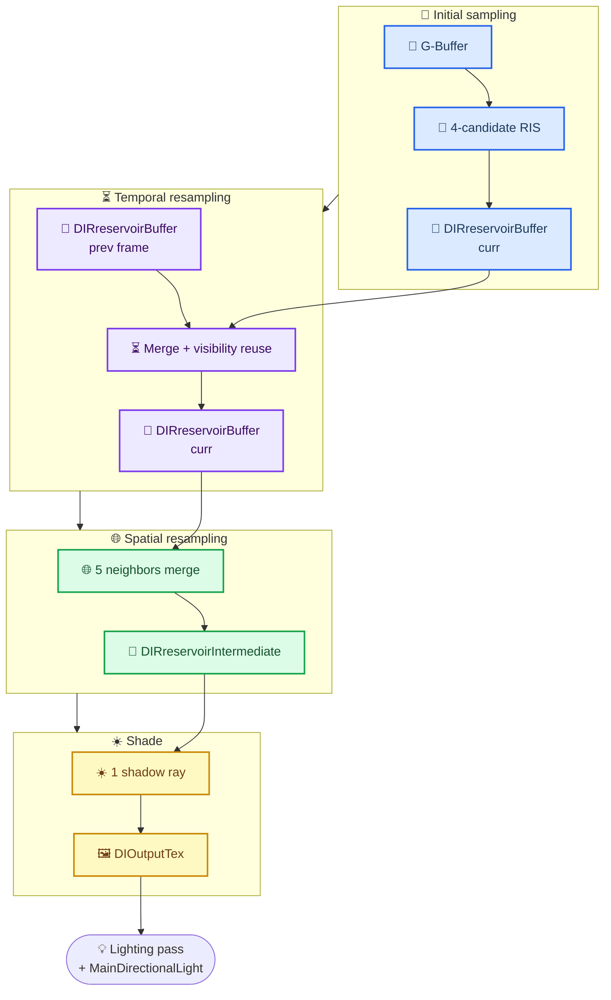

# TortureRed — ReSTIR DI (Direct Illumination) Implementation Plan

_Built from source analysis — June 2026_

---

## 📋 Table of contents

- [Overview](#-overview)
- [Architecture overview](#-architecture-overview)
- [Data structures](#-data-structures)
- [Core helper functions](#-core-helper-functions)
- [Pipeline passes](#-pipeline-passes)
- [Integration](#-integration)
  - [Two-tier indirect/direct toggle system](#two-tier-indirectdirect-toggle-system)
  - [Frame rendering order](#frame-rendering-order)
- [Key design decisions and tradeoffs](#-key-design-decisions-and-tradeoffs)
- [References](#-references)

---

## 📋 Overview

**Goal**: Extend TortureRed's ReSTIR framework to handle multi-local-light **direct illumination** using spatiotemporal reservoir resampling — implemented natively in the same style as `RestirGI_Temporal.hlsl`, with no RTXDI library dependency.

**Current state**: TortureRed already has:
- `GetLocalLightDirectLightingRIS()` in [`CommonTracing.hlsl`](../Sources/Shaders/CommonTracing.hlsl) — single-frame RIS (M candidates → 1 shadow ray), zero temporal memory
- `GetDirectLightingHybrid()` — selects between uniform/importance/brute-force modes
- `RIS_TargetPDF()` — unshadowed BSDF-weighted target PDF evaluation for light candidates (reusable as-is)
- `SampleSingleLight()` — uniform or LUT-weighted single-light stochastic selection (reusable as-is)
- `updateReservoir()`, `mergeReservoirs()`, `mergeReservoirsWithWeight()`, `capReservoirHistory()` in [`Common.hlsl`](../Sources/Shaders/Common.hlsl) — weighted reservoir sampling primitives
- `Reservoir` struct in [`SharedTypes.h`](../Sources/Shared/SharedTypes.h) — GI reservoir (hit positions), pattern to follow for DI
- Light buffer infrastructure (max 256 lights, LUT-based O(1) selection)
- Bindless resource binding pattern (`BindlessIndices`, `ResourceDescriptorHeap`, `g_Frame`, `g_Lights`)

**Target**: Wrap direct lighting from local lights under a user-facing **Enable ReSTIR DI** toggle. When enabled, the four-pass ReSTIR DI pipeline runs before the lighting pass and writes `DIOutputTex`; when disabled, the existing `GetLocalLightDirectLightingRIS()` fallback in `Lighting.hlsl` handles local lights unchanged. Complemented by the existing **Enable ReSTIR GI** toggle (`enableRasterIndirectGI`) which drives the SHaRC + diffuse/specular indirect lighting pipeline with no fallback.

The two options are independent — users can enable either, both, or neither.

**Design philosophy**: Follow the exact same pattern as the non-RTXDI ReSTIR GI variant (`RestirGI_Temporal.hlsl` + `RestirGI_Spatial.hlsl` + `RestirGI_Resolve.hlsl`). Same bindless binding, same `[numthreads(8,8,1)]` dispatches, same `FrameConstants` CBV + `BindlessIndices` CBV + `LightsBuffer` SRV layout. Wrapped under a `FrameConstants.enableRestirDI` flag matching the existing `enableRasterIndirectGI` toggle pattern.

---

## 🏗 Architecture overview



### Reservoir data flow

| Pass | Input (SRV) | Output (UAV) | Key Operation |
|---|---|---|---|
| Initial Sampling | LightsBuffer + GBuffer | `DIRreservoirBuffer[curr]` | 4-candidate RIS → `updateReservoir()` |
| Temporal | `DIRreservoirBuffer[prev]` + `DIRreservoirBuffer[curr]` | `DIRreservoirBuffer[curr]` | Reproject + `mergeReservoirs()` |
| Spatial | `DIRreservoirBuffer[curr]` | `DIRreservoirIntermediate` | 5 neighbors + `mergeReservoirs()` |
| Shade | `DIRreservoirIntermediate` + GBuffer | `DIOutputTex` | 1 shadow ray → final radiance |

---

## 📦 Data structures

### DIRreservoir — per-pixel DI reservoir

New struct in [`SharedTypes.h`](../Sources/Shared/SharedTypes.h). Follows the existing `Reservoir` pattern — byte-aligned, written as UAV / read as SRV in structured buffers. Mirrors the GI reservoir layout but stores light-domain data instead of hit-point data:

```hlsl
struct DIRreservoir {
    float w_sum;        // Running sum of RIS weights Σwᵢ
    float W;            // Normalized unbiased weight W = w_sum / (M · p̂_selected)
    float M;            // Effective sample count (history length)
    float targetPdf;    // Target PDF p̂(x*) of the currently selected sample
    uint  selectedLightIndex;  // Index into LightsBuffer of the winning light (bits[0-15]), 
                                // bits[16-23]: packed visibility age, bit 31: valid flag
    uint  _pad0;
    uint  _pad1;
    uint  _pad2;
};
// Total: 32 bytes (8 floats + 4 uints equivalent = 8 × 4)
```

**Comparison with GI `Reservoir`:**

| | `Reservoir` (GI) | `DIRreservoir` (DI) |
|---|---|---|
| **Sample domain** | World-space hit point | Light index |
| **Sample data** | `hitPos`, `hitNormal`, `radiance` | `selectedLightIndex` + visibility |
| **RIS fields** | `w_sum`, `W`, `M` | `w_sum`, `W`, `M`, `targetPdf` |
| **History tracking** | `historyAge` (extendable to DI) | `selectedLightIndex` bit-packing for age |

### DILightSample — sampled light candidate (shader-local, not in buffer)

Defined in shader code (not shared types — transient per-candidate):

```hlsl
struct DILightSample {
    uint   lightIndex;       // Index into LightsBuffer
    float  sourcePdf;        // Probability of selecting this light
    float  targetPdf;        // Unshadowed BSDF-weighted contribution (RIS_TargetPDF result)
    float3 L;                // Normalized direction to light
    float  NdotL;
    float  attenuation;
    float  spotEffect;
    float3 radianceAtPoint;  // Light color × intensity (pre-visibility)
};
```

### Ping-pong buffer layout

```
DIRreservoirBuffer[0]       → StructuredBuffer<DIRreservoir>  [W×H]   (32 bytes × W×H)
DIRreservoirBuffer[1]       → StructuredBuffer<DIRreservoir>  [W×H]   (ping-pong)
DIRreservoirIntermediate    → StructuredBuffer<DIRreservoir>  [W×H]
DIOutputTex                 → RWTexture2D<float4>             [W×H]   (RGB radiance, A=weight)
```

---

## 🔬 Core helper functions

These functions reuse the existing `RIS_TargetPDF()`, `SampleSingleLight()`, and reservoir helpers from `Common.hlsl`, adding DI-specific wrappers.

### `SampleDIRreservoirCandidate()`

Calls `SampleSingleLight()` to pick a light candidate using the current frame's sampling mode (uniform, LUT-importance, or brute-force), then evaluates `RIS_TargetPDF()` to compute the unshadowed BSDF-weighted target PDF at the surface point. Also pre-computes the light direction `L`, `NdotL`, attenuation, spot effect, and point radiance. Returns a filled `DILightSample`.

### `TraceDIRShadowRay()`

Traces a single inline shadow ray with `RAY_FLAG_ACCEPT_FIRST_HIT_AND_END_SEARCH`, applying alpha-mask processing. Returns 1.0 (visible) or 0.0 (occluded).

### `EvaluateDIReservoirWinner()`

For the selected light index stored in a reservoir's `selectedLightIndex`, reconstructs the light direction, attenuation, and spot parameters. Traces one shadow ray for visibility. If visible, evaluates the BSDF (diffuse + optionally specular) and multiplies by the light's color, intensity, attenuation, spot effect, and `NdotL`. Returns the full radiance contribution.

### `PackDIRreservoirAge()` / `GetDIRreservoirAge()`

Pack an 8-bit visibility age into the upper bits of `selectedLightIndex` (bits [16–23], with bit 31 as the validity flag). `GetDIRreservoirAge()` extracts the age back out. Mirrors the lobe-bit encoding pattern used by the existing `Reservoir.historyAge` field.

---

## 🎬 Pipeline passes

### Pass 1: initial sampling

**Shader**: `RestirDI_InitialSampling.hlsl` (new)  
**Thread group**: `[numthreads(8,8,1)]`  
**Dispatch**: `ceil(W/8) × ceil(H/8)`  
**Bindings**:

| Register | Resource | Type |
|---|---|---|
| `b0` | `FrameConstants` | CBV |
| `b1` | `BindlessIndices` | CBV |
| `t0,space2` | `LightsBuffer` | SRV `StructuredBuffer<LightConstants>` |
| `OutputIdx0` | `DIRreservoirBuffer[curr]` | UAV `RWStructuredBuffer<DIRreservoir>` |
| `OutputIdx1` | `DIRreservoirDebugHeatmap` | UAV `RWTexture2D<float4>` (conditional) |
| GBuffer (via FrameConstants) | Depth, Albedo, Normal, Material | SRV |

**What it does**:

Per pixel, reconstructs the primary surface point from the G-Buffer. Generates `NUM_CANDIDATES` (= 4) light samples via RIS (importantly, *without* tracing any shadow rays), computing the target PDF (BSDF-weighted) and source PDF for each. Accumulates a weighted reservoir sum to select one winning light index. Caps the reservoir history length to `RESTIR_DI_INITIAL_MAX_M` (= 4) and normalizes the unbiased weight `W`. Writes the result into `DIRreservoirBuffer[current]`. Pixels with no valid surface write a zeroed reservoir.

**Key Constants**:

| Constant | Value | Notes |
|---|---|---|
| `NUM_CANDIDATES` | 4 | RIS candidates per pixel |
| `RESTIR_DI_INITIAL_MAX_M` | 4.0 | Matches candidate count |
| Thread group | 8×8 | Standard TortureRed pattern |

---

### Pass 2: temporal resampling

**Shader**: `RestirDI_Temporal.hlsl` (new)  
**Thread group**: `[numthreads(8,8,1)]`  
**Dispatch**: `ceil(W/8) × ceil(H/8)`  
**Bindings**:

| Register | Resource | Type |
|---|---|---|
| `b0` | `FrameConstants` | CBV |
| `b1` | `BindlessIndices` | CBV |
| `t0,space2` | `LightsBuffer` | SRV |
| `InputIdx0` | `DIRreservoirBuffer[prev]` | SRV `StructuredBuffer<DIRreservoir>` |
| `OutputIdx0` | `DIRreservoirBuffer[curr]` | UAV `RWStructuredBuffer<DIRreservoir>` |
| `OutputIdx1` | `DIRreservoirDebugHeatmap` | UAV (conditional) |

**What it does**:

Loads the current-frame reservoir (produced by pass 1) and the per-pixel surface point. For each pixel with a valid reservoir, reprojects the surface position into the previous frame's clip space to find the corresponding previous-frame pixel. Validates the reprojection with depth and normal thresholds (`RESTIR_DI_DEPTH_THRESHOLD` = 0.1 relative, `RESTIR_DI_NORMAL_THRESHOLD` = 0.85 cosine). On a geometry match, reads the previous reservoir and recomputes its target PDF at the current surface; merges the temporal neighbor into the current reservoir via weighted reservoir sampling. Caps history to `RESTIR_DI_TEMPORAL_MAX_HISTORY_LENGTH` (= 20) and enforces a maximum age limit (`RESTIR_DI_TEMPORAL_MAX_AGE` = 30 frames) to expire stale visibility. No Jacobian is needed for light-domain reservoirs. Writes updated reservoirs to `DIRreservoirBuffer[current]`.

**Key Constants**:

| Constant | Value | Notes |
|---|---|---|
| `RESTIR_DI_TEMPORAL_MAX_HISTORY_LENGTH` | 20.0 | Effective sample cap |
| `RESTIR_DI_TEMPORAL_MAX_AGE` | 30 frames | Visibility expiry |
| `RESTIR_DI_DEPTH_THRESHOLD` | 0.1 | Relative depth |
| `RESTIR_DI_NORMAL_THRESHOLD` | 0.85 | Cosine similarity |

---

### Pass 3: spatial resampling

**Shader**: `RestirDI_Spatial.hlsl` (new)  
**Thread group**: `[numthreads(8,8,1)]`  
**Dispatch**: `ceil(W/8) × ceil(H/8)`  
**Bindings**:

| Register | Resource | Type |
|---|---|---|
| `b0` | `FrameConstants` | CBV |
| `b1` | `BindlessIndices` | CBV |
| `t0,space2` | `LightsBuffer` | SRV |
| `InputIdx0` | `DIRreservoirBuffer[curr]` | SRV `StructuredBuffer<DIRreservoir>` |
| `OutputIdx0` | `DIRreservoirIntermediate` | UAV `RWStructuredBuffer<DIRreservoir>` |
| `OutputIdx1` | `DIRreservoirDebugHeatmap` | UAV (conditional) |

**What it does**:

Loads the center pixel's reservoir and seeds the merged result with it. Samples `NUM_NEIGHBORS` (= 5) random neighbors within a `NEIGHBOR_RADIUS` (= 16 px) window. For each neighbor, validates geometry compatibility with the same depth/normal thresholds. On match, recomputes the neighbor's selected light target PDF at the center surface (shifted target PDF) and merges the neighbor reservoir into the accumulator via weighted reservoir sampling, clamping the reuse weight at `RESTIR_DI_SPATIAL_REUSE_WEIGHT_CLAMP` (= 64.0) to prevent fireflies. Caps history to `RESTIR_DI_SPATIAL_MAX_HISTORY_LENGTH` (= 40) and normalizes `W`. Writes the final merged reservoir to `DIRreservoirIntermediate`.

**Key Constants**:

| Constant | Value |
|---|---|
| `NUM_NEIGHBORS` | 5 |
| `NEIGHBOR_RADIUS` | 16 px |
| `RESTIR_DI_SPATIAL_MAX_HISTORY_LENGTH` | 40.0 |
| `RESTIR_DI_SPATIAL_REUSE_WEIGHT_CLAMP` | 64.0 |
| `RESTIR_DI_SPATIAL_MAX_AGE` | 30 |

---

### Pass 4: shade (resolve)

**Shader**: `RestirDI_Shade.hlsl` (new)  
**Thread group**: `[numthreads(8,8,1)]`  
**Dispatch**: `ceil(W/8) × ceil(H/8)`  
**Bindings**:

| Register | Resource | Type |
|---|---|---|
| `b0` | `FrameConstants` | CBV |
| `b1` | `BindlessIndices` | CBV |
| `t0,space2` | `LightsBuffer` | SRV |
| `InputIdx0` | `DIRreservoirIntermediate` | SRV `StructuredBuffer<DIRreservoir>` |
| `OutputIdx0` | `DIOutputTex` | UAV `RWTexture2D<float4>` |

**What it does**:

Reads the final reservoir from `DIRreservoirIntermediate`. If the reservoir is empty or invalid, writes zero. Otherwise reconstructs the surface point, evaluates the selected light via one shadow ray (inline ray tracing to determine visibility), computes the BSDF radiance contribution, and multiplies by the unbiased RIS weight `W`. Writes weighted radiance to `.rgb` and `W` to `.a` of `DIOutputTex`.

**Output Format**:

| Channel | Content |
|---|---|
| `.rgb` | Direct lighting radiance × RIS weight `W` |
| `.a` | Unbiased weight `W` (for compositing with main directional) |

---

## 🔗 Integration

### Two-tier indirect/direct toggle system

The raster renderer exposes two independent options to the user:

| Option | FrameConstants flag | Controls | Fallback |
|---|---|---|---|
| **Enable ReSTIR GI** | `enableRasterIndirectGI` | Indirect lighting (SHaRC + diffuse/specular ReSTIR) | *None* — when off, indirect lighting is simply absent |
| **Enable ReSTIR DI** | `enableRestirDI` | Direct lighting from local lights (ReSTIR DI pipeline) | Current raster path: `GetLocalLightDirectLightingRIS()` inline in `Lighting.hlsl` |

When `enableRestirDI = 0`, the Lighting.hlsl shader uses the existing `GetLocalLightDirectLightingRIS()` call (4-candidate single-frame RIS) for local lights — the code path that already ships. When `enableRestirDI = 1`, the ReSTIR DI pipeline runs before the lighting pass and writes `DIOutputTex`, which the lighting shader composites.

The two options are fully independent: ReSTIR GI can run with or without ReSTIR DI, and vice versa.

### New FrameConstants flags

```hlsl
// Add to FrameConstants in SharedTypes.h (alongside existing enableRasterIndirectGI):
uint enableRestirDI;              // 1 = ReSTIR DI active (direct lighting option)
uint restirDIInitialCandidates;   // 8 default
uint restirDITemporalMaxM;        // 20 default
uint restirDIMaxAge;              // 30 default
```

`enableRasterIndirectGI` already exists — no change needed.

### Reservoir enum for debug

```hlsl
// Add to existing debug mode enum (alongside RESTIR_RESERVOIR_DEBUG_*):
#define RESTIR_DI_DEBUG_OFF            0u
#define RESTIR_DI_DEBUG_LIGHT_INDEX    1u
#define RESTIR_DI_DEBUG_M_COUNT        2u
#define RESTIR_DI_DEBUG_WEIGHT         3u
#define RESTIR_DI_DEBUG_VISIBILITY_AGE 4u
```

### New BindlessIndices slots

The existing `BindlessIndices` struct has 6 slots (3 inputs, 3 outputs). The DI passes reuse the same binding scheme:

| Pass | InputIdx0 | OutputIdx0 | OutputIdx1 |
|---|---|---|---|
| Initial sampling | (unused) | `DIRreservoirBuffer[curr]` | `DIRreservoirDebugHeatmap` |
| Temporal | `DIRreservoirBuffer[prev]` | `DIRreservoirBuffer[curr]` | `DIRreservoirDebugHeatmap` |
| Spatial | `DIRreservoirBuffer[curr]` | `DIRreservoirIntermediate` | `DIRreservoirDebugHeatmap` |
| Shade | `DIRreservoirIntermediate` | `DIOutputTex` | (unused) |

### Frame rendering order

```mermaid
flowchart TB
    accTitle: Frame Rendering Order with ReSTIR DI and ReSTIR GI Options
    accDescr: Full raster per-frame pass sequence showing two independent toggle branches — ReSTIR DI for direct lighting (with fallback) and ReSTIR GI for indirect lighting (no fallback)

    depth[📏 Depth pre-pass] --> gbuffer[🎨 G-Buffer pass]

    gbuffer --> di_decision{🔧 enableRestirDI?}

    subgraph restir_di ["🎯 ReSTIR DI — direct lighting option"]
        di_init[🎯 Initial sampling]
        di_temp[⏳ Temporal resampling]
        di_spatial[🌐 Spatial resampling]
        di_shade[☀️ Shade → DIOutputTex]
        di_init --> di_temp --> di_spatial --> di_shade
        di_ping[🔄 Ping-pong index]
        di_shade --> di_ping
    end

    di_decision -->|Yes| di_init
    di_decision -->|No| gi_decision{🔧 enableRasterIndirectGI?}
    di_ping --> gi_decision

    subgraph restir_gi ["💡 ReSTIR GI — indirect lighting option"]
        sharc_u[🧊 SHaRC update]
        sharc_r[🧊 SHaRC resolve]
        diff_t[⏳ Diffuse temporal]
        spec_t[⏳ Specular temporal]
        diff_s[🌐 Diffuse spatial]
        spec_s[🌐 Specular spatial]
        nrd[🧹 NRD RELAX]
        sres[☀️ Split resolve]
        sharc_u --> sharc_r --> diff_t --> spec_t --> diff_s --> spec_s --> nrd
        nrd --> sres
        sres --> ir_out[🖼️ RasterIndirectLightingTex]
    end

    gi_decision -->|Yes| sharc_u
    gi_decision -->|No| lighting
    ir_out --> lighting

    lighting[☀️ Lighting pass<br/>MainDirectionalLight + DIOutputTex.applied<br/>or GetLocalLightDirectLightingRIS fallback] --> taa[🔄 TAA]
    taa --> trans[👻 Transparency pass]
    trans --> present([📤 Present])

    classDef di_c fill:#ede9fe,stroke:#7c3aed,stroke-width:2px,color:#3b0764
    classDef gi_c fill:#fce7f3,stroke:#db2777,stroke-width:2px,color:#831843
    classDef standard_c fill:#dbeafe,stroke:#2563eb,stroke-width:2px,color:#1e3a5f
    classDef decision_c fill:#fef9c3,stroke:#ca8a04,stroke-width:2px,color:#713f12
    classDef output_c fill:#dcfce7,stroke:#16a34a,stroke-width:2px,color:#14532d

    class di_init,di_temp,di_spatial,di_shade,di_ping di_c
    class sharc_u,sharc_r,diff_t,spec_t,diff_s,spec_s,nrd,sres,ir_out gi_c
    class depth,gbuffer,lighting,taa,trans standard_c
    class di_decision,gi_decision decision_c
    class present output_c
```



---

## ⚠️ Key design decisions and tradeoffs

### 1. No Jacobian for light-domain reservoirs

**Decision**: Light-domain reuse does not need Jacobian correction (unlike GI hit-point reuse).

**Rationale**: Jacobian corrects for solid-angle change when the same world-space point is viewed from two different primary positions. For lights, the sample is a *light index* — the light's properties (position, color, intensity) are the same regardless of which pixel selected it. The only geometric validation needed is whether the two surfaces (current + reprojected/neighbor) are the same world-space surface (depth + normal match).

**Proof**: The target PDF `p̂(l) = luminance(BSDF × NdotL × L_color × atten)` is recomputed at the *current* surface for the *previous* light. If the surfaces match, the BSDF and NdotL are approximately equal, and the light's contribution is the same. No solid-angle Jacobian applies.

### 2. No packed visibility reuse (initial implementation)

**Decision**: Phase 1 traces a fresh shadow ray in the Shade pass every frame. Visibility reuse (skipping shadow rays when age ≤ threshold) is deferred.

**Rationale**: The primary benefit of ReSTIR DI is reducing the *light candidate count* from N (all lights) to 1 (RIS winner). Even without visibility reuse, this is already 4–200× fewer shadow rays. Adding visibility reuse adds complexity that can be layered on after basic correctness is validated.

### 3. Main directional light exclusion

**Decision**: Main directional light (index 0) remains exact and deterministic — ReSTIR DI only handles local lights (indices 1+). Identical to existing `GetDirectLightingHybrid()` pattern.

### 4. Indirect continuation: deferred

**Decision**: Phase 1 only replaces primary-surface local light direct lighting. GI passes continue using `GetDirectLightingHybrid()` for secondary surface direct lighting.

**Rationale**: Secondary surfaces seen through indirect bounces are often off-screen — `DIOutputTex` lookup via world-to-screen projection would miss. The DI reservoir is a per-pixel resource and doesn't naturally cover arbitrary world-space positions without a separate spatial structure (like SHaRC for GI).

### 5. Full internal resolution

**Decision**: Reservoirs at `W×H` (internal resolution), same as GI reservoirs.

### 6. No `DIRreservoir` in `Reservoir` — separate struct

**Decision**: Use a separate `DIRreservoir` struct, not extend the existing `Reservoir` for GI.

**Rationale**: The GI reservoir stores hit-point data (`hitPos`, `hitNormal`, `radiance`). The DI reservoir stores light-index data (`selectedLightIndex`). Combining them into one struct would waste memory and complicate SPIR-V layout alignment. The split-lobe GI design already uses separate diffuse/specular reservoirs — a third DI reservoir follows the same pattern.

---

## 🔗 References

- TortureRed native ReSTIR GI implementation: [`RestirGI_Temporal.hlsl`](../Sources/Shaders/RestirGI_Temporal.hlsl), [`RestirGI_Spatial.hlsl`](../Sources/Shaders/RestirGI_Spatial.hlsl)[^1]
- Reservoir helpers: [`Common.hlsl`](../Sources/Shaders/Common.hlsl) (`updateReservoir`, `mergeReservoirs`, `mergeReservoirsWithWeight`, `capReservoirHistory`)
- Current RIS single-frame implementation: [`CommonTracing.hlsl:615-740`](../Sources/Shaders/CommonTracing.hlsl) (`GetLocalLightDirectLightingRIS`, `RIS_TargetPDF`, `SampleSingleLight`)
- Split pipeline temporal pattern (coding style reference): [`RestirGI_Diffuse_Temporal.hlsl`](../Sources/Shaders/RestirGI_Diffuse_Temporal.hlsl)
- Reservoir struct: [`SharedTypes.h`](../Sources/Shared/SharedTypes.h) (existing `Reservoir`, pattern for `DIRreservoir`)
- Bindless binding conventions: [`Renderer.cpp`](../Sources/Renderer.cpp) (existing ReSTIR PSO creation and dispatch)

[^1]: Bitterli, B., et al. "Spatiotemporal reservoir resampling for real-time ray tracing with dynamic direct lighting." _ACM Transactions on Graphics (SIGGRAPH 2020)_. https://research.nvidia.com/publication/2020-07_spatiotemporal-reservoir-resampling-real-time-ray-tracing-dynamic-direct