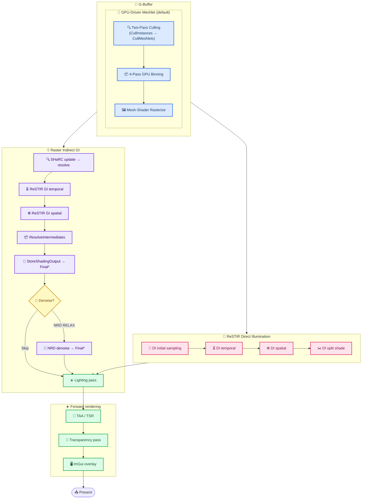
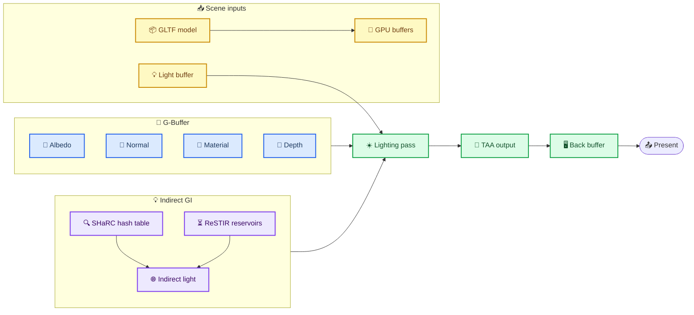

# TortureRed Raster Rendering Pipeline

_Chain-of-passes reference for the non-path-tracer (`!usePathTracingFrame`) rendering path — initialization through final frame presentation_

---

## 📋 Table of contents

- [Initialization](#-initialization)
- [Per-frame pipeline](#-per-frame-pipeline)
- [Key data flow](#-key-data-flow)
- [Frame finalization](#-frame-finalization)
- [References](#-references)

---

## 🚀 Initialization

### Platform and window

- SDL video subsystem initialized
- OS window created (1920×1080, centered)
- HWND extracted and passed to the renderer

### Renderer bootstrap

- D3D12 device, command queue, command allocator, and command list created
- Swap chain (double/triple-buffered, `R8G8B8A8_UNORM`) created
- Root signature, descriptor heaps (CBV/SRV/UAV, sampler, RTV, DSV) set up
- Fence and frame synchronization primitives initialized

### Light setup

- Light constant buffer allocated
- Light LUT (importance sampling) buffer allocated
- Scene lights loaded (or fallback default directional light created)
- Lights uploaded to GPU

### Scene and model loading

- Scene descriptor JSON parsed (camera, lights, model path, environment)
- GLTF model loaded: meshes, materials, textures, animation data
- Textures uploaded to GPU via upload heap and copy queue
- Ray-tracing acceleration structures built (used for indirect GI ray queries even in raster path)

### ImGui initialization

- Dear ImGui context created with D3D12 + SDL2 backends
- Dedicated shader-visible descriptor heap allocated for ImGui font texture

### Raster indirect GI setup

- SHaRC (Spatial Hash Radiance Cache) buffers allocated (~160 MB): hash entries, accumulation buffer, resolved buffer
- Split diffuse/specular ReSTIR reservoir buffers (double-buffered, per-pixel)
- Intermediate reservoir buffers and diffuse candidate buffer allocated
- NRD integration initialized with RELAX denoiser[^1]
- NRD guide/signal textures: motion vectors, normal-roughness, viewZ, noisy/denoised diffuse and specular, validation
- Indirect lighting output texture (`R16G16B16A16_FLOAT`) created
- All compute PSOs compiled

### Resolution and TAA resources

- Internal render resolution derived from output resolution and upsampling factor
- G-Buffer created at internal resolution (albedo, normal, material, depth)
- TAA history textures, reprojected history, closest-velocity, and output textures created
- TAA compute PSOs (reproject and resolve) compiled

---

## 🔄 Per-frame pipeline



### Depth pre-pass

> 📌 **Optional** — toggled via `m_EnableDepthPrePass`. Only used in the **non-meshlet** (traditional) geometry path. The meshlet pipeline writes depth as part of its single-pass rasterize; no separate pre-pass is needed.

### Meshlet GPU-driven geometry path

> 📌 **Enabled by default** — toggled via `m_UseMeshlet`. When meshlet data is available (`Model::IsMeshletReady()`), the traditional G-Buffer/depth-pre-pass are replaced entirely by the GPU-driven meshlet pipeline. All geometry writes to the same 4 G-Buffer targets (albedo, normal, material, depth) so downstream passes (ReSTIR DI/GI, lighting, TAA) are agnostic.

#### Meshlet generation

Performed once at model-load time in `Model.cpp` using [meshoptimizer](https://github.com/zeux/meshoptimizer)[^2]:

- Each mesh is decomposed into meshlets (`meshopt_buildMeshlets`) — up to 64 vertices and 124 triangles each.
- Per-meshlet cone/axis culling data (`meshopt_computeMeshletBounds`).
- Per-meshlet position bounds (`LocalCenter` / `LocalExtents`) packed into `MeshletBounds`.
- Vertex positions, triangle indices, and primitive vertices streamed into bindless `ByteAddressBuffer` descriptors for mesh-shader access (`GetVertexAttributes`, `GetPrimitiveIndex`).

#### Two-pass occlusion culling (GPUCulling)

> 📌 **Optional** — toggled via `m_EnableTwoPassCulling`. When off, a single frustum-only cull pass runs instead.

A hierarchical two-stage compute pipeline (`CullInstancesCS` → `CullMeshletsCS`) with two occlusion-tested phases:

| Phase | Instance set | HZB source | Meshlets tested | Rasterize |
|-------|--------------|------------|-----------------|-----------|
| Phase 1 | All instances | Previous frame's HZB | All meshlets of visible instances | Clear GBuffer |
| Phase 2 | Phase-1 occluded instances only | Fresh HZB (from Phase 1 depth) | All meshlets of now-visible instances | Preserve GBuffer (compound atop Phase 1) |

Each stage projects the AABB (FrustumCullData, shared with HZBCull in one projection) and tests against a mip-selected 4-tap footprint on the Hierarchical Z-Buffer. Surviving meshlets are written to `VisibleMeshlets[]` for the binning/rasterize stage.

HZB generation uses AMD FidelityFX SPD[^3]: mip 0 is min-reduced from the depth buffer via 2×2 gather; mips 1..N are SPD-downsampled.

#### Binning

4-pass GPU sort (`PrepareArgsCS` → `ClassifyMeshletsCS` → `AllocateBinRangesCS` → `WriteBinsCS`) that distributes visible meshlets into `NUM_RASTER_BINS` (2) bins for indirect `DispatchMesh`.

#### Mesh shader rasterize

Per-bin `ExecuteIndirect` via `DispatchMesh`: one mesh shader threadgroup per meshlet (`MSMain`) writes the visibility buffer token (`VisToken`, see `docs/task001-visbuffer.md`) to `SV_Target3` alongside G-Buffer albedo/normal/material in the first three render targets, and writes depth to the shared depth-stencil view.

### Traditional G-Buffer pass (non-meshlet)

- Depth buffer cleared to 1.0
- Opaque geometry rendered with depth-only PSO
- Writes depth only; no color output
- Reduces overdraw in the subsequent G-Buffer pass by priming the depth buffer

### G-Buffer pass
- **Pre-pass enabled:** render opaque geometry with G-Buffer PSO (depth-test equals, depth-write off)
- **Pre-pass disabled:** render opaque and masked geometry with G-BufferWrite PSO (depth-test less, depth-write on)
- **Only opaque (`AlphaMode::Opaque`) and masked (`AlphaMode::Mask`) geometry is rendered** — transparent/blended objects are explicitly excluded from the G-Buffer (see [transparency pass](#transparency-pass))
- Masked geometry uses `discard` in the pixel shader when the sampled alpha is below `alphaCutoff` (`material.alphaMode == 1` check in [Gbuffer.hlsl](../Sources/Shaders/Gbuffer.hlsl))

Outputs (all at internal resolution):

| G-Buffer | Format              | Contents                       |
|----------|---------------------|--------------------------------|
| Albedo   | `R8G8B8A8_UNORM`    | Base color and alpha           |
| Normal   | `R10G10B10A2_UNORM` | World-space normal + roughness |
| Material | `R8G8B8A8_UNORM`    | Metallic + specular + flags    |
| Depth    | `D32_FLOAT`         | Non-linear depth               |

### Raster indirect GI

> 📌 **Conditional** — only dispatched when `enableRasterIndirectGI` is set.

#### SHaRC update

- Compute pass dispatched at 5× downscale of internal resolution
- Each thread traces secondary rays from a G-Buffer surface point
- Deposits radiance samples into a spatial hash table
- Rotating pixel pattern ensures full coverage over multiple frames

#### SHaRC resolve

- Compute pass over all hash entries
- EMA-blends accumulated radiance into the resolved buffer
- Clears accumulation buffer for the next frame

#### Diffuse temporal reuse

- Per-pixel compute dispatch (RTDGI-style temporal resampling)
- Reads previous-frame diffuse reservoirs and current-frame geometry
- Traces new candidate rays, performs temporal resampling
- Writes current diffuse reservoirs and diffuse candidate buffer

#### Specular temporal reuse

- Per-pixel compute dispatch (RTR-style temporal resampling)
- Reads previous-frame specular reservoirs and the diffuse candidate buffer
- Leverages the diffuse candidate for rough surfaces (Kajiya roughness-reuse strategy)
- Writes current specular reservoirs

#### Diffuse spatial reuse

- Per-pixel compute dispatch
- Reads current diffuse reservoirs
- Samples neighboring pixels for spatial resampling
- Writes diffuse intermediate reservoirs

#### Specular spatial reuse

- Per-pixel compute dispatch
- Reads current specular reservoirs
- Samples neighboring pixels for spatial resampling
- Writes specular intermediate reservoirs

#### NRD RELAX denoising path

> 📌 **Default path** — used when `enableNrdRelax` is set and debug modes are off.

- **Prepare guides:** packs motion vectors, normal-roughness, and linear viewZ into NRD-compatible textures
- **Pack signals:** extracts noisy radiance and hit distance from intermediate reservoirs
- **NRD RELAX denoise:** NVIDIA Real-Time Denoisers RELAX pass (diffuse and specular)[^1]
- **NRD composite:** blends denoised diffuse and specular into the indirect lighting output texture; optionally overlays validation debug

#### Split resolve path

> 📌 **Fallback** — used when NRD is disabled or unavailable.

- Single compute pass
- Reads diffuse and specular intermediate reservoirs directly
- Resolves and composites them into the indirect lighting output texture without denoising

#### FullScreenDebug — unified debug pipeline

> 📌 **Replaces Lighting.hlsl entirely** when any debug mode is active.  
> Outputs raw debug data to screen — no BRDF, no shadow rays, no NRD material factors.  
> All debug data is written directly to `FullScreenDebugTex` (`R16G16B16A16_FLOAT`) by the debug-producing shaders.
> `RestirDebugHeatmap` (`R16_FLOAT`) remains PT-only (`DispatchRays`).

##### Architecture

```
┌───────────────────────────────────────────────────────────────┐
│               Debug-Producing Shaders                         │
│  (have debug-mode checks, write debug-specific data)          │
│  → all write FullScreenDebugTex (R16G16B16A16) directly       │
│                                                               │
│  SHaRC_Debug.hlsl ────────→ OutputIdx0                        │
│  DiffuseTemporal.hlsl ────→ OutputIdx2                        │
│  SpecularTemporal.hlsl ───→ OutputIdx1                        │
│  DI_Temporal.hlsl ────────→ OutputIdx1                        │
│  DI_Spatial.hlsl ─────────→ OutputIdx1                        │
└──────────────────────────────┬────────────────────────────────┘
                               │
                               ▼
┌───────────────────────────────────────────────────────────────┐
│           FullScreenDebug.hlsl (pixel shader)                  │
│  Reads FullScreenDebugTex (InputIdx0) → screen                 │
│  Sky pixel rejection via depth check                           │
│  Reinhard tonemapping (when TAA is off)                        │
└───────────────────────────────────────────────────────────────┘
```

##### Debug-producing shaders

These shaders contain `if (debugMode != OFF)` branches and write debug-specific data.
They write `float4` directly to `FullScreenDebugTex` (R16G16B16A16). No intermediate formats, no combine pass.

| Debug Mode | Shader | Pipeline | Output Slot | Data |
|---|---|---|---|---|
| **SHaRC voxel** (sharcDebug=1) | [`SHaRC_Debug.hlsl`](../Sources/Shaders/SHaRC_Debug.hlsl) | GI | OutputIdx0 | RGB voxel color |
| **SHaRC bounce** (sharcDebug=2) | [`SHaRC_Debug.hlsl`](../Sources/Shaders/SHaRC_Debug.hlsl) | GI | OutputIdx0 | Bounce heatmap (blue/green/red) |
| **GI heatmap** (modes 5-10) | [`RestirGI_Diffuse_Temporal.hlsl`](../Sources/Shaders/RestirGI_Diffuse_Temporal.hlsl) | GI | OutputIdx2 | `selectedPDF` (grayscale) |
| 〃 | [`RestirGI_Specular_Temporal.hlsl`](../Sources/Shaders/RestirGI_Specular_Temporal.hlsl) | GI | OutputIdx1 | `selectedPDF` (grayscale) |
| **DI debug** | [`RestirDI_Temporal.hlsl`](../Sources/Shaders/RestirDI_Temporal.hlsl) | DI | OutputIdx1 | M count or W weight (grayscale) |
| 〃 | [`RestirDI_Spatial.hlsl`](../Sources/Shaders/RestirDI_Spatial.hlsl) | DI | OutputIdx1 | M count or W weight (grayscale) |

##### PT-only — not available in raster

GI field debug modes 1-4 (`POSITION`, `NORMAL`, `RADIANCE`, `WEIGHTSUM`) are handled
by [`RestirGI_ReservoirDebug.hlsl`](../Sources/Shaders/RestirGI_ReservoirDebug.hlsl) →
`PathTracerOutput` — `DispatchRays` only. The raster pipeline has no equivalent.

### Lighting pass

Fullscreen triangle dispatch.

- G-Buffer targets transitioned to pixel-shader-readable state
- Indirect lighting texture (if enabled) transitioned to pixel-shader-readable state
- Model geometry buffers bound (material buffer, draw nodes, index/vertex buffers for shadow ray queries)

Rendering target:

| Condition  | Target                           | Format              | Tonemapping       |
|------------|----------------------------------|---------------------|-------------------|
| TAA active | Internal HDR texture             | `R16G16B16A16_FLOAT`| None (linear HDR) |
| TAA off    | Output back buffer               | `R8G8B8A8_UNORM`    | Exposure applied  |

Per-pixel computation:

- G-Buffer decode (albedo, normal, roughness, metallic)
- Direct lighting from the primary directional light with shadow mapping
- Local light sampling (uniform, importance-sampled via LUT, or brute-force all)
- Indirect GI blending from `RasterIndirectLightingTex` (if enabled)
- PBR BRDF evaluation (Cook-Torrance microfacet model)

### TAA / temporal super-resolution

> 📌 **Conditional** — only dispatched when AA mode is `TAAU`.

#### Motion vector generation

- Compute pass over internal resolution
- Reads depth buffer and current/previous view-projection matrices
- Outputs per-pixel motion vectors to `NrdMotionVectorsTex` (`R16G16_FLOAT`)

#### TAA reproject

- Compute pass at output resolution
- Reads previous-frame TAA history, motion vectors, and depth
- Reprojects history into current frame
- Outputs reprojected color and closest-velocity texture

#### TAA resolve

- Compute pass at output resolution
- Reads current-frame HDR input, reprojected history, and closest velocity
- Blends with adaptive history weighting based on velocity disocclusion
- Writes TAA history for next frame and final resolved output

#### Copy to back buffer

- TAA output texture (output resolution) copied to the swap-chain back buffer via `CopyTextureRegion`

### Transparency pass

Forward rasterization pass for `AlphaMode::Blend` geometry. Runs **after TAA** so transparent surfaces composite on top of the fully resolved, upscaled opaque frame.

- Reads: G-Buffer depth (read-only DSV), resolved opaque color already in the RTV
- Writes: alpha-blended color into the active RTV

| AA mode | RTV | DSV | Viewport |
|---------|-----|-----|----------|
| TAA on  | `RasterHdrOutputTex` (internal res, HDR) | G-Buffer depth (internal res) | Internal resolution |
| TAA off | Back buffer (output res, LDR) | G-Buffer depth (output res — internal == output when TAA is off) | Output resolution |

Depth write is disabled; depth test is enabled (read-only) so transparent geometry is correctly occluded by opaque surfaces without corrupting the depth buffer.

### ImGui overlay

- Back buffer rebound as render target (no depth stencil, to avoid internal-res depth clipping)
- Viewport set to output resolution
- Dear ImGui frame prepared and rendered
- Debug UI panels: background color, depth pre-pass toggle, shadow map debug, raster indirect GI toggles (enable, NRD RELAX, NRD validation), SHaRC debug mode, tracing options (avoid caustics, indirect specular, reservoir lobe check, roughness threshold), reservoir debug field selector, anti-aliasing mode and TAA upsampling factor, light editor (intensity, color, direction/position, wireframe sphere overlay), exposure control, FPS counter

---

## 📊 Key data flow



---

## 🏁 Frame finalization

- Command list closed and executed
- Swap chain presented
- GPU fence signaled; CPU waits for completion
- Frame index advanced; descriptor heap ring-buffer advanced
- Deferred resolution changes applied at start of next frame (if pending)

---

## 🔗 References

[^1]: NVIDIA. "NVIDIA Real-Time Denoisers (NRD)." https://github.com/NVIDIA-RTX/NRD

- **SHaRC:** Boksansky, J., et al. "Spatiotemporal reservoir resampling with lighting hash caching for real-time ray tracing." _High-Performance Graphics_, 2024. https://intro-to-restir.cwyman.org/
- **ReSTIR:** Bitterli, B., et al. "Spatiotemporal reservoir resampling for real-time ray tracing with dynamic direct lighting." _ACM Transactions on Graphics (SIGGRAPH 2020)_. https://research.nvidia.com/publication/2020-07_spatiotemporal-reservoir-resampling-real-time-ray-tracing-dynamic-direct
- **D3D12:** Microsoft. "Direct3D 12 Programming Guide." https://learn.microsoft.com/en-us/windows/win32/direct3d12/directx-12-programming-guide
[^2]: meshoptimizer. "Mesh optimization library." https://github.com/zeux/meshoptimizer
[^3]: AMD. "FidelityFX Single Pass Downsampler." https://github.com/GPUOpen-Effects/FidelityFX-SPD
