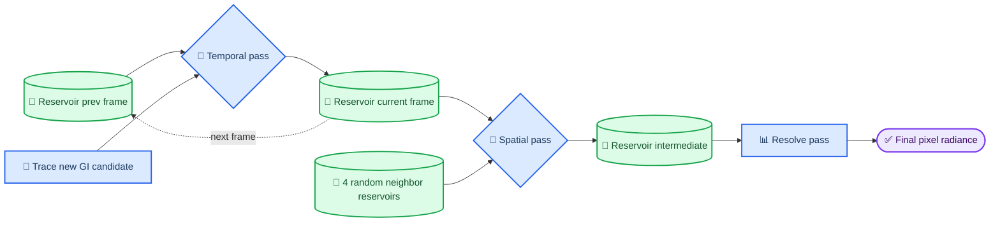

# ReSTIR GI in TortureRed: Path-Traced Indirect Lighting

_Algorithm walkthrough for `RestirGI_Temporal.hlsl`, `RestirGI_Spatial.hlsl`, and `RestirGI_Resolve.hlsl` — grounded in the vanilla ReSTIR theory from Wyman et al.'s SIGGRAPH 2023 course, "A Gentle Introduction to ReSTIR: Path Reuse in Real-Time"[^1]_

---

## 📋 Overview

TortureRed's path tracer (`Sources/Rendering/PathTracing.cpp`) computes indirect (multi-bounce) lighting with a three-pass **Reservoir-based Spatiotemporal Importance Resampling (ReSTIR)** pipeline, one reservoir per pixel:

| Pass | File | Role |
|---|---|---|
| Temporal | `Sources/Shaders/RestirGI_Temporal.hlsl` | Trace one new candidate GI path per pixel, then resample it against the previous frame's reservoir at the same surface |
| Spatial | `Sources/Shaders/RestirGI_Spatial.hlsl` | Resample the temporal reservoir against 4 random neighboring pixels' reservoirs |
| Resolve | `Sources/Shaders/RestirGI_Resolve.hlsl` | Shade the pixel using the winning reservoir sample and its unbiased weight `W` |

This is TortureRed's own from-scratch implementation of the algorithm popularized by ReSTIR GI[^3] — it is **not** a wrapper around NVIDIA's RTXDI library (`Externals/rtxdi-library/`), which the codebase also integrates separately as `RestirGI_RTXDI_*.hlsl` for comparison. Everything in this document refers to the manual implementation.

Before reading the per-pass sections, read [Resampled importance sampling foundations](#-resampled-importance-sampling-foundations) below — every symbol used later (`p̂`, `pdf`, `w`, `m`, `W`) is defined there first, matching the terminology of the reference paper[^1]. If you only care about the temporal pass, that section is sufficient; the spatial pass additionally needs [Reusing between domains](#-reusing-between-domains-shift-mappings-jacobians-and-the-generalized-balance-heuristic), which covers shift mappings, Jacobian determinants, and the generalized balance heuristic.

---

## 📚 Resampled importance sampling foundations

ReSTIR is repeated application of **Resampled Importance Sampling (RIS)**[^1]. Before looking at any TortureRed code, it helps to fix the five symbols the rest of this document reuses constantly.

### The problem RIS solves

A path tracer estimates an integral `I` (here, the incident radiance at a shading point) with the standard Monte Carlo estimator:

```text
⟨I⟩ = f(X) / p(X)
```

`f` is the true integrand (radiance carried by a sampled path), and `p` is the probability density used to draw `X`. The estimator is noisy whenever `p` doesn't track `f` well. RIS lets us **pick a better-distributed sample from several candidates**, even when the resulting sample's true PDF can never be evaluated in closed form.

### The five symbols

| Symbol | Name | Meaning |
|---|---|---|
| `p̂(x)` ("p-hat") | **Target function** | An *unnormalized* stand-in for `f`, cheap enough to evaluate per-candidate. Loosely called "target PDF" in code comments, but it is **not** normalized to integrate to 1[^1]. |
| `p(x)` | **Source PDF** | The density used to *generate* a candidate. Known for a freshly-traced candidate (e.g. a BSDF sampling PDF); unknown/intractable once a sample has already passed through resampling. |
| `w_i` | **Resampling weight** | `w_i = m_i(x_i) · p̂(x_i) · W_{x_i}`. Candidates are chosen from the stream proportionally to `w_i`. |
| `m_i(x)` | **MIS (resampling) weight** | Corrects for candidates coming from different distributions/domains, so the union of their supports can be combined without bias. The **generalized balance heuristic** is `m_i(x) = c_i·p̂_i(x) / Σ_j c_j·p̂_j(x)`[^4], where `c_i` is a *confidence* (how many "effective samples" that candidate already represents). |
| `W_X` | **Unbiased contribution weight** | Replaces the unknowable `1/p(X)`. By construction, `𝔼[W_X \| X] = 1/p(X)`[^1]. Once a sample `Y` is chosen from `M` candidates, `W_Y = (1/p̂(Y)) · Σ w_i`. |

#### Where does `W_{x_i}` come from?

`W_{x_i}` in the `w_i = m_i(x_i)·p̂(x_i)·W_{x_i}` formula is **not** the reservoir's final output weight `W_Y` — it is the unbiased contribution weight of one *individual candidate* `x_i`, evaluated **before** that candidate has even been through resampling. Per Definition 3.0.1 of the reference paper[^1], `W_{x_i}` is any random variable satisfying:

```text
𝔼[f(x_i) · W_{x_i}] = ∫ f(x) dx        (i.e. 𝔼[W_{x_i} | x_i] = 1/p(x_i))
```

In other words, `W_{x_i}` is *whatever number, once multiplied by `f(x_i)`, gives an unbiased estimate* — exactly what `1/p(x_i)` would give in classic Monte Carlo, but usable even when `p(x_i)` itself can never be written down. There are exactly two ways a candidate arrives at TortureRed's resampling steps, and each has a different, simple rule for computing `W_{x_i}`:

1. **Fresh candidate with a known source PDF** — e.g. the brand-new GI bounce direction traced in the temporal pass. Its PDF `p(x_i)` is exactly the BSDF-importance-sampling PDF returned by the sampler, so:

   ```text
   W_{x_i} = 1 / p(x_i)
   ```

   This is Algorithm 1's stated rule: *"If `x_i` has a known PDF `p(x_i)`, use `W_{x_i} = 1/p(x_i)`."*[^1] In `RestirGI_Temporal.hlsl`, this is `firstBouncePDF` — the code folds `p̂ · W_{x_i}` into a single division, `risWeight = targetPDF / firstBouncePDF`, rather than computing `W_{x_i}` as a standalone value.

2. **Candidate that is itself the output of an earlier resampling step** — e.g. last frame's reservoir sample (temporal merge) or a neighbor pixel's reservoir sample (spatial merge). Its true PDF is intractable — that is the entire reason RIS exists — but it doesn't need to be: the *previous* resampling step already computed a valid `W` for it via its own `finalize()` call (`W = w_sum / (M·p̂(Y))`, Equation 3.2[^1]). That stored value **is** a legitimate `W_{x_i}` for this candidate, by the same recursive argument Section 3.5 of the paper makes for "inputs with unknown PDFs"[^1]: any RIS output already comes with a ready-made unbiased contribution weight, so chaining another round of resampling on top of it costs nothing extra to set up.

   ```text
   W_{x_i} = previousReservoir.W        // literally the stored .W field
   ```

   This is exactly why TortureRed's merge weight formula reads `w = p̂_shifted(Y_i) · neighborRes.W · neighborRes.M` — `neighborRes.W` **is** `W_{x_i}` for that candidate, carried forward unchanged from whichever earlier pass (or previous frame) last called `finalize()` on it; `neighborRes.M` supplies the accompanying confidence `c_i`.

The takeaway: `W_{x_i}` is never computed from scratch inside the temporal/spatial merge code — it is either `1/pdf` for a truly new sample, or simply *read out* of the candidate's own reservoir, because that reservoir already carries its own valid `W` from the moment it was finalized.

The final unbiased estimate for any resampled sample `Y` is simply:

```text
⟨I⟩ = f(Y) · W_Y
```

which is the "resolve" step every ReSTIR pass eventually performs (see [Pass 3](#-pass-3--resolve-the-unbiased-estimator)).

### Weighted reservoir sampling (WRS)

RIS needs `M` candidates in flight simultaneously. **Weighted Reservoir Sampling**[^1] turns this into a streaming, O(1)-memory algorithm — perfect for a GPU compute pass that can only see one candidate/neighbor at a time.

```text
class Reservoir
    Y ← ∅          // winning sample: (hitPos, hitNormal, radiance)
    w_sum ← 0      // running sum of resampling weights
    M ← 0          // confidence (effective sample count / history length)
    W ← 0          // unbiased contribution weight of Y

function update(X_i, w_i, c_i):
    w_sum ← w_sum + w_i
    M ← M + c_i
    if rand() < w_i / w_sum:
        Y ← X_i                     // reservoir "wins" the new candidate

function finalize(reservoir, p̂):
    if reservoir.Y ≠ ∅:
        reservoir.W ← reservoir.w_sum / (reservoir.M · p̂(reservoir.Y))
```

`update()` is called once per candidate (a freshly-traced path) and once per *merge* with another reservoir (temporal history, or a spatial neighbor). Chaining calls to `update()` across passes — temporal, then spatial — is exactly what makes ReSTIR "spatiotemporal": each merge is one more RIS resampling step over an ever-growing implicit candidate pool, at O(1) cost per pixel per frame[^1].

This maps directly onto TortureRed's shared reservoir helpers in `Sources/Shaders/Common.hlsl` and the `Reservoir` struct in `Sources/Shared/SharedTypes.h`:

| Paper symbol | TortureRed field/function |
|---|---|
| `Y` (hitPos, hitNormal, radiance) | `Reservoir.hitPos`, `Reservoir.hitNormal`, `Reservoir.radiance` |
| `w_sum` | `Reservoir.w_sum` |
| `M` (confidence) | `Reservoir.M` |
| `W` | `Reservoir.W` |
| `update(X_i, w_i, c_i=1)` | `updateReservoir(...)` |
| merging two reservoirs | `mergeReservoirs(...)` / `mergeReservoirsWithWeight(...)` |
| `finalize` | the `res.W = res.w_sum / (res.M * selectedTargetPdf)` line at the end of each pass |

---

## 🔀 Reusing between domains: shift mappings, Jacobians, and the generalized balance heuristic

Everything in [The five symbols](#the-five-symbols) assumed every candidate lived in the *same* domain `Ω` — literally, the same pixel's path space. That's true for the temporal merge (the previous frame's sample is reprojected back onto the *same surface point*, so no domain change happens), but it is **not** true for spatial reuse: a neighboring pixel's reservoir sample was generated by tracing rays from a *different* primary hit point. Section 5 of the reference paper[^1] extends RIS to handle exactly this case — this section works through that extension in detail, since it underlies everything the [spatial pass](#-pass-2--spatial-reuse) does.

### Shift mappings — what "domain" even means here

A **domain** `Ω_i` is one candidate's own path space — concretely, in TortureRed, "the set of GI paths traceable from pixel `i`'s primary hit point." A **shift mapping** `T` moves a sample from one domain to another, `y = T(x)`, `T : Ω_i → Ω_j`. Formally (Definition 5.1.1[^1]), a shift mapping must be:

- **Deterministic** — same input always shifts to the same output.
- **Bijective on its domain of definition** — a path shifts to at most one path in the target domain, and an inverse `T⁻¹` must exist for any path that *did* shift successfully.
- **Partial** — not every path needs to be shiftable; a shift may fail (e.g. an occluded reconnection), in which case it must return "undefined," never quietly falling back to some other path.

The specific shift mapping relevant here is the **reconnection shift**[^1] (Equation 5.1), which keeps a path's far vertices untouched and only replaces the vertices nearest the camera:

```text
T_{i→j}([x_{i,0}, x_{i,1}, x2, x3, ...]) = [x_{j,0}, x_{j,1}, x2, x3, ...]
```

Reading this against TortureRed's reservoir: `x_{i,1}` is the *primary hit point* (pixel `i`'s surface — what this doc calls `surface.worldPos`), and `x2` is the *GI hit point* stored in the reservoir (`Reservoir.hitPos`). The spatial pass's domain shift is precisely this reconnection: it keeps the neighbor's GI hit point `x2` fixed and swaps in the center pixel's own primary surface as the new near vertex — `T_{neighbor→center}(x2) = x2`, just re-anchored to a different `x1`. This is why the code never modifies `neighborRes.hitPos`/`hitNormal`/`radiance` when merging it — the shift mapping's job here is *bookkeeping about which vertex changed*, not tracing new geometry.

The **canonical/initial candidate** (freshly traced by the path tracer in the temporal pass) uses the trivial **identity shift**, `T_i(x) = x`, with Jacobian `|T_i'(x)| = 1` — it's already in the target domain by construction, so nothing needs shifting.

### Jacobian determinants — why domain-crossing needs a correction factor at all

Shifting a random variable through a function changes its density — the same intuition as the 1-D change-of-variables rule in calculus. The **PDF transformation rule** (Equation 5.2[^1]) makes this precise: if `Y = T(X)`, then

```text
p_Y(Y) = p_X(X) / |T'(X)|
```

`|T'(X)|`, the **Jacobian determinant**, is the local volume-scaling factor of the mapping `T` at `X`. Since `W_X` is built to satisfy `𝔼[W_X | X] = 1/p_X(X)` (see [the `W_{x_i}` explanation](#where-does-w_x_i-come-from)), the same rule transforms unbiased contribution weights the opposite way (the **UCW transformation rule**, Equation 5.3[^1]):

```text
W_Y = W_X · |T'(X)|
```

**Why the spatial pass needs one, concretely:** the neighbor's GI hit point `x2` was originally sampled/weighted as seen from the neighbor's primary vertex `y1`. Reusing it as if it were sampled from the center pixel's primary vertex `x1` implicitly changes the *solid angle* that `x2` subtends — the same physical point can look like a large target (nearby, facing you) from one vertex and a tiny sliver (far away, grazing angle) from another. If this rescaling weren't corrected for, pixels near a small/bright light source seen at a steep angle from one pixel, but head-on from a neighboring pixel, would silently double- or under-count that light's contribution once resampling started mixing pixels together — an actual bias, not just a quality issue.

For a reconnection shift under the common solid-angle parameterization, this scaling factor has a closed form (Equation 6.15[^1]):

```text
|J| = |∂ω_y| = |cosθ_y| / dist(x1, x2)²
      |∂ω_x|   |cosθ_x| / dist(y1, x2)²
```

where `θ_x`/`θ_y` are the angles between the reconnection direction and `x2`'s surface normal, as measured from `x1` and `y1` respectively. This is *exactly* `ComputeJacobian` in `Sources/Shaders/CommonTracing.hlsl:93` — `x1` is `primaryPos` (center pixel), `y1` is `neighborPrimaryPos`, `x2` is `sampleHitPos`:

```hlsl
float ComputeJacobian(float3 primaryPos, float3 neighborPrimaryPos, float3 sampleHitPos, float3 sampleHitNormal) {
    float3 diffP = sampleHitPos - primaryPos;             // x2 - x1
    float cosP = ...; float distSqP = ...;                 // cosθ_x, dist(x1,x2)²
    float3 diffQ = sampleHitPos - neighborPrimaryPos;      // x2 - y1
    float cosQ = ...; float distSqQ = ...;                 // cosθ_y, dist(y1,x2)²
    return (cosP * distSqQ) / (cosQ * distSqP);            // |cosθ_x/dist(x1,x2)²| / |cosθ_y/dist(y1,x2)²|, inverted form of Eq. 6.15
}
```

(the numerator/denominator are inverted relative to the paper's literal Eq. 6.15 because the paper's `|∂ω_y/∂ω_x|` measures the shift *from* `x` (neighbor) *to* `y` (center), while the code computes the ratio needed to weight the neighbor's sample *as seen from the center* — same quantity, reciprocal convention). This is why the code clamps it to `[0.1, 10]`: near-degenerate geometry (a reused point almost edge-on from one of the two vertices) makes `cos ≈ 0` and the ratio blow up, producing fireflies — the same failure mode the paper illustrates in Figure 6.1[^1] for glossy surfaces, where a reconnected direction can land in a near-zero-BSDF region.

### The generalized balance heuristic — MIS when you can't compute PDFs

MIS normally combines multiple sampling strategies using the **balance heuristic**, `m_i(y) = p_{Y_i}(y) / Σ_j p_{Y_j}(y)` (Equation 5.7[^1]) — but this needs to know the actual PDF `p_{Y_i}` of every strategy at the combined point `y`, which is intractable the moment any strategy involves resampling (exactly the situation ReSTIR is always in).

The fix (Section 5.3[^1]) is to substitute `p̂` for the unknowable `p` everywhere, using the same PDF transformation rule from above, run in reverse — this defines **`p̂` from `i`** (the paper's `pHatFrom`, Equation 5.9[^1]):

```text
p̂_{←i}(y) = { p̂_i(T_i⁻¹(y)) · |T_i⁻¹'(y)|   if y is in the image of T_i
            { 0                              otherwise (shift undefined / candidate can't reach y)
```

In words: to find out "how much would candidate `i`'s own target function have valued this point `y`, had `y` been generated by shifting from candidate `i`'s domain instead," shift `y` *back* into `Ω_i`, evaluate `i`'s own target function there, and correct for the density change with the inverse shift's Jacobian. Substituting this into the balance heuristic gives the **generalized balance heuristic** (Equation 5.10[^1]), and folding in ReSTIR's confidence weights `c_i` (Equation 5.11[^1]):

```text
m_i(y) = c_i · p̂_{←i}(y)  /  Σ_j c_j · p̂_{←j}(y)
```

which by construction satisfies the MIS partition-of-unity requirement `Σ_i m_i(y) = 1` for every `y`[^1] — no point in the combined domain is over- or under-counted across all `M` candidates put together.

**Why TortureRed never computes `m_i` as a standalone value.** Naively, computing every `m_i(y)` requires the *full* denominator `Σ_j c_j · p̂_{←j}(y)` — evaluating every other candidate's `pHatFrom` too, which the paper notes costs `O(M²)` total `p̂` evaluations for `M` candidates (a cost flagged explicitly as the reason to look at lighter-weight alternatives in later sections[^1]). Weighted Reservoir Sampling sidesteps this by construction: the running `w_sum` accumulator *is* the running denominator `Σ_j c_j · p̂_{←j}(y)` (each `update()` call adds exactly one `c_j · p̂_{←j}(y)` term to it), so the accept probability `w_i / w_sum` used inside `updateReservoir`/`mergeReservoirs` is *already* `m_i(Y)` evaluated for whichever sample is being considered right now — computed incrementally in `O(1)` per merge, `O(M)` total, without ever revisiting a previous candidate's `p̂`. This is why the [WRS pseudocode](#weighted-reservoir-sampling-wrs) never has an explicit "compute `m_i`" line: streaming reservoir merges *are* the generalized balance heuristic, evaluated lazily.

### Putting it together: the spatial pass in these terms

| Paper concept | TortureRed code |
|---|---|
| Shift mapping `T_{neighbor→center}` (reconnection shift, Eq. 5.1) | Implicit: `neighborRes.hitPos/hitNormal/radiance` reused unmodified; only the near vertex (`centerSurface` vs. the neighbor's own surface) changes |
| Jacobian `\|T'(x)\|` (reconnection-shift form, Eq. 6.15) | `ComputeJacobian(centerSurface.worldPos, neighborSurface.worldPos, neighborRes.hitPos, neighborRes.hitNormal)`, clamped to `[0.1, 10]` — cf. RTXDI's validated `RTXDI_CalculateJacobian` (`Externals/rtxdi-library/Include/Rtxdi/Utils/Math.hlsli`) |
| `pHatFrom(neighbor, y)` (Eq. 5.9) | `GetTargetPDF(centerSurface, neighborRes.hitPos, neighborRes.radiance) * jacobian` → `shiftedTargetPDF` |
| Generalized balance heuristic `m_i(y)` (Eq. 5.10/5.11) | Never materialized as a number — it's the implicit accept probability `w_i/w_sum` inside `mergeReservoirs` |
| Confidence `c_i` | `neighborRes.M` |

With this in hand, the [Pass 2 explanation](#-pass-2--spatial-reuse) below can be read as a direct instantiation of Algorithm 4/5 of the reference paper[^1], rather than an isolated formula. If any of the Jacobian/shift math here looks suspicious for a specific scene, [cross-check it against RTXDI's validated implementation](#cross-checking-the-reconnection-shift-against-this-codebases-rtxdi-reference) before assuming the paper's equations are wrong — the manual code is the more likely place for a divergence.

---

## ⚙️ Pipeline architecture

_The three ReSTIR GI passes run back-to-back each frame, with a full reservoir ping-pong across frames for temporal reuse._



The dispatch order lives in `Sources/Rendering/PathTracing.cpp` (search for `m_RestirTemporalPSO` / `m_RestirSpatialPSO` / `m_RestirResolvePSO`): Temporal writes `ReservoirBuffer[current]`, reading history from `ReservoirBuffer[previous]`; Spatial reads `ReservoirBuffer[current]` and writes `ReservoirIntermediate`; Resolve reads `ReservoirIntermediate` only. Each pass is a `[numthreads(8,8,1)]` compute shader dispatched at full internal resolution, with a `UAV` barrier between passes since each depends on the previous pass's full-screen output.

### Why temporal precedes spatial

Pass order is not arbitrary. Section 4.2 of the reference paper states the recommended per-frame order explicitly[^1]:

> "One natural order of these steps, per frame, is initial candidate generation followed by temporal reuse, followed by spatial reuse, followed by integration with the selected sample."

TortureRed's dispatch order — `RestirGI_Temporal.hlsl` → `RestirGI_Spatial.hlsl` → `RestirGI_Resolve.hlsl` — matches this exactly. The same section gives the concrete reason to prefer temporal-before-spatial over the reverse: temporal reuse alone already "feed[s] forward through time indefinitely, continually improving the sampling distribution," and *"if temporal reuse is followed by spatial reuse, samples from prior frames can also spread spatially, leading to very rapid spread of good samples."*[^1] Doing it the other way — spatial reuse first, then temporal — would only let neighbors mix in each other's single, unrefined, this-frame-only candidate before any of them has benefited from history; the compounding effect (temporal accumulation *then* spatial propagation of that accumulated quality, every frame) is lost.

Neither order is disallowed by the underlying math — RIS/WRS merges are valid RIS resampling steps regardless of order, as long as each merge uses correct resampling and MIS weights (Section 5.2–5.3, Algorithm 4/5[^1]). The paper's preference for temporal-then-spatial is about **convergence speed**, not correctness.

> 📌 **Do not confuse this with implementation/validation order.** Tip 4.3 and the advice in Section 9[^1] recommend *building and debugging* spatial reuse before temporal reuse ("spatial reuse is easier to debug; temporal reuse gives better quality... without scene changes between samples, [spatial reuse] is much easier to validate"), because temporal reuse needs motion vectors and cross-frame visibility. That is a recommendation about the order you *write and test* the two passes, not about the order they *execute* at runtime — the runtime order is temporal-then-spatial either way.

### Does the spatial result feed back as next frame's history?

**What the paper says:** the gentle-introduction paper does not discuss this specific buffering choice, and its own conceptual description in Section 4.2 actually implies the opposite: *"if temporal reuse is followed by spatial reuse, samples from prior frames can also spread spatially"*[^1] reads as describing a design where the spatially-diffused result **is** what persists and feeds the next frame's temporal reuse — the classical single-reservoir-loop architecture from the original ReSTIR paper[^2]. The paper does, however, flag the downstream risk of that architecture in passing: Section 9's advice on RTXDI options singles out **"boiling suppression"** as a feature you should defer using until basics work[^1] — "boiling" is the community name for the runaway feedback artifact caused by exactly this kind of loop, where an outlier sample gets spatially spread to several neighbors, and then each of those neighbors' own temporal histories picks it up and re-spreads it further in later frames, amplifying rather than diffusing bright outliers. Confidence/history-length capping (Section 4.4[^1], `M`-capping, already used in both passes here) is the paper's primary tool for bounding this kind of correlation; keeping the spatial output out of the temporal feedback loop entirely — as TortureRed does — is a stronger, more conservative version of the same idea, at the cost of the "very rapid spread" convergence benefit described above.

---

## 🔄 Pass 1 — temporal reuse

`RestirGI_Temporal.hlsl` does two things per pixel: it generates **one brand-new canonical GI candidate** by path tracing, then **merges it with last frame's reservoir** at the reprojected surface.

### Pseudocode

```text
function GenerateInitialCandidate(surface):
    (dir, throughput, pdf) ← SampleIndirectRay(surface)     // p(x): cosine or GGX BSDF pdf
    (hitPos, hitNormal, L_in) ← TraceBounces(surface, dir, throughput, maxBounces=3)
                                                              // L_in: incident radiance folded back
                                                              // via NEE-RIS direct lighting at every hit
    p̂ ← TargetFunction(surface, hitPos, L_in)                // p̂(x) = luminance(BSDF(surface→hitPos) · NdotL · L_in)
    w ← p̂ / pdf                                              // m_i = 1 (single canonical candidate, M=1)
    reservoir.update(Y=(hitPos, hitNormal, L_in), w, c=1)

function TemporalReuse(reservoir, surface):
    prev ← ReprojectPreviousFrameReservoir(surface)          // via clip-space motion, no explicit Jacobian
    if prev.M > 0:
        p̂_shifted ← TargetFunction(surface, prev.hitPos, prev.radiance)
                                                              // re-evaluate prev sample's target fn at the
                                                              // CURRENT surface — this is "p̂_←prev(y)"
        w ← p̂_shifted · prev.W · prev.M                      // generalized balance-heuristic resampling weight
        reservoir.update(prev.Y, w, c=prev.M)                 // == mergeReservoirs(reservoir, prev, p̂_shifted, rnd)
    reservoir.M ← min(reservoir.M, 30)                        // history-length (confidence) cap
    reservoir.finalize(p̂ = TargetFunction(surface, reservoir.Y))
```

### Explanation

- **`p̂` (target function):** `TargetFunction(surface, hitPos, radiance)` stands in for the full path contribution `f_s(x)·G(x)·V(x)·L_e(x)` from Equation 4.4 of the reference paper[^1]. TortureRed evaluates it as `luminance(BSDF(N,V,L) · NdotL · L_in)` — the visibility term `V` is dropped for performance, mirroring Talbot et al.'s original simplification[^1], and `L_e` is replaced by `L_in`, the radiance already gathered from the continuation path (so no separate geometry/distance term is needed — it is baked into `L_in`).
- **`pdf` (source PDF):** only known for the *initial candidate*, where it is the BSDF importance-sampling PDF returned by `SampleIndirectRay`. Once a sample comes from a reservoir (previous frame or a neighbor), its true PDF is intractable — that's exactly the case Section 3.5 of the paper addresses[^1], and why the algorithm carries `W` around instead of `1/p`.
- **`weight` (resampling weight `w`):** for the initial candidate, `w = p̂/pdf` is the classic one-sample RIS weight (`m_i · p̂ · W_{x_i}` with `m_i = 1`, `W_{x_i} = 1/pdf`). For the temporal merge, `w = p̂_shifted · prev.W · prev.M` is the *generalized balance heuristic* resampling weight (Equation 3.10/4.7[^1]): since `prev.W · prev.M ≈ 1/p̂_prev(prev.Y)` scaled by confidence, multiplying by `p̂_shifted` (the same sample's target function re-evaluated **at the current surface**) reproduces `c_prev · p̂_←prev(y)`, the numerator of the balance heuristic.
- **`MIS weight`:** never appears as an explicit multiply in the code — it is implicit in the mechanics of `updateReservoir`/`mergeReservoirs`. Because `w_sum` accumulates `Σ_j c_j · p̂_←j(Y)` and each candidate is accepted with probability `w_i/w_sum`, the WRS accept/reject step *is* the generalized balance heuristic in disguise: `Pr[accept i] = w_i/w_sum = m_i(Y)` at the moment `Y` is finalized.
- **`W` (unbiased contribution weight, final normalization):** `res.W = res.w_sum / (res.M · p̂(res.Y))`. This is the reservoir's `finalize()` step, re-evaluating `p̂` for the *winning* sample only once, after all merges. `M` acts as the confidence cap (Section 4.4[^1]) — capped to 30 here to bound correlation/lag from very long history.

### Code

The initial candidate trace and NEE-RIS accumulation is `hasIndirectHit` / `SampleIndirectRay` / `GetDirectLightingRIS` in `RestirGI_Temporal.hlsl` (lines 56–128); the RIS update call is:

```hlsl
float targetPDF = GetTargetPDF(surface, indirectHitPos, L_in);
float risWeight = (firstBouncePDF > 0.0f) ? (targetPDF / firstBouncePDF) : 0.0f;
if (updateReservoir(res, indirectHitPos, indirectHitNormal, L_in, risWeight, next_float(rng))) {
    selectedTargetPdf = targetPDF;
}
```

The temporal merge, using clip-space motion vectors to fetch `prevReservoirs[prevIndex]`, is:

```hlsl
float currentTargetPDF = GetTargetPDF(surface, prevRes.hitPos, prevRes.radiance);
if (mergeReservoirs(res, prevRes, currentTargetPDF, next_float(rng))) {
    selectedTargetPdf = currentTargetPDF;
}
if (res.M > 30.0f) { res.w_sum *= (30.0f / res.M); res.M = 30.0f; }
```

`GetTargetPDF` lives in `Sources/Shaders/CommonTracing.hlsl:73`; `updateReservoir`/`mergeReservoirs` live in `Sources/Shaders/Common.hlsl:32`.

> ⚠️ **Note:** The Jacobian correction for temporal reprojection (needed because the reprojected pixel is a slightly different surface than the one that generated `prevRes`) is present in the file but commented out (`ComputeJacobian(surface.worldPos, prevWorldPos, ...)`). See [Known biases and simplifications](#-known-biases-and-simplifications).

---

## 📍 Pass 2 — spatial reuse

`RestirGI_Spatial.hlsl` seeds a fresh reservoir from the pixel's own temporal reservoir, then merges in up to 4 random neighbors within a 20-pixel radius, each with a **Jacobian-corrected** target function because a spatial neighbor's sample lives in a genuinely different domain (a different pixel's primary hit point).

### Pseudocode

```text
function SpatialReuse(temporalRes, centerSurface):
    spatialRes ← EmptyReservoir()
    spatialRes.update(temporalRes.Y, w = p̂(centerSurface, temporalRes.Y), c = temporalRes.M)
                                                              // seed with own temporal sample first

    for i in 1..4:
        neighborPixel ← RandomPixelWithinRadius(currentPixel, 20)
        neighborSurface ← ReconstructPrimarySurface(neighborPixel)
        if SurfacesAreCompatible(centerSurface, neighborSurface):   // normal + position heuristic
            J ← Jacobian(centerSurface.worldPos, neighborSurface.worldPos,
                          neighborRes.hitPos, neighborRes.hitNormal)     // solid-angle ratio, Eq. 6.15
            p̂_shifted ← TargetFunction(centerSurface, neighborRes.hitPos, neighborRes.radiance) · J
                                                              // "p̂_←neighbor(y)" — pHatFrom, Algorithm 5
            w ← p̂_shifted · neighborRes.W · neighborRes.M
            spatialRes.update(neighborRes.Y, w, c = neighborRes.M)

    spatialRes.M ← min(spatialRes.M, 60)
    spatialRes.finalize(p̂ = TargetFunction(centerSurface, spatialRes.Y))
```

### Explanation

> 📖 For the full derivation of shift mappings, the Jacobian, and the generalized balance heuristic used below, see [Reusing between domains](#-reusing-between-domains-shift-mappings-jacobians-and-the-generalized-balance-heuristic).

- **Domain shift and the Jacobian:** a neighbor pixel's reservoir sample lives at hit point `y1` (the neighbor's primary surface), while the current pixel wants to reuse it as if it had been traced from `x1` (the center surface) — an *identity shift on the GI hit point*, `T([x1, x2, ...]) = [y1, x2, ...]`, exactly the reconnection-style shift used by ReSTIR GI[^1][^3]. The Jacobian determinant of this shift is the ratio of solid angles subtended by the reused hit point `x2` as seen from `x1` vs. `y1`:

  ```text
  |J| = (cosθ_x2_at_x1 / dist(x1,x2)²) / (cosθ_x2_at_y1 / dist(y1,x2)²)
  ```

  which is Equation 6.15 of the reference paper (their `θ_y`/`θ_x` and squared distances)[^1]. This directly matches `ComputeJacobian` in the code (`CommonTracing.hlsl:93`).
- **`p̂` with a domain shift (`pHatFrom`):** re-evaluating a foreign-domain sample's target function at the local domain and multiplying by its shift Jacobian is exactly Algorithm 5 ("`pHatFrom`") of the reference paper[^1]: `p̂_←j(y) = p̂_j(T_j⁻¹(y)) · |T_j⁻¹′(y)|`. In code this is `GetTargetPDF(centerSurface, neighborRes.hitPos, neighborRes.radiance) * jacobian`.
- **`weight`, `MIS weight`, `W`:** identical mechanics to the temporal pass — `w = p̂_shifted · neighborRes.W · neighborRes.M` is the generalized balance heuristic's resampling weight *between domains* (Algorithm 4[^1]), and `finalize()` re-evaluates `p̂` for the final winner once, producing `spatialRes.W`. The `0.5f` random value used to seed the reservoir with the temporal sample first is not a bug: for the very first item pushed into an empty reservoir, `w_sum` becomes exactly that item's weight, so `rand() < w_i/w_sum` is true for *any* `rand()` in `[0, 1)` — the sample is always accepted, per the WRS definition.
- The consistency check (`dot(normal) > 0.95`, `distance < 0.5`) is a cheap heuristic to reject neighbors whose surface is too different for the reused sample to remain plausible — it does **not** use the reservoir's stored sample to pick which neighbors to visit (picking neighbors is done via a purely random 2D offset), which the paper explicitly calls out as a requirement to avoid bias (Tip 4.1[^1]).

### Code

```hlsl
float jacobian = ComputeJacobian(centerSurface.worldPos, neighborSurface.worldPos, neighborRes.hitPos, neighborRes.hitNormal);
jacobian = clamp(jacobian, 0.1f, 10.0f);
float currentTargetPDF = GetTargetPDF(centerSurface, neighborRes.hitPos, neighborRes.radiance);
float shiftedTargetPDF = currentTargetPDF * jacobian;
if (shiftedTargetPDF > 0) {
    if (mergeReservoirs(spatialRes, neighborRes, shiftedTargetPDF, next_float(rng))) {
        selectedTargetPdf = currentTargetPDF;
        ...
    }
}
```

(`RestirGI_Spatial.hlsl:70-87`). The Jacobian is clamped to `[0.1, 10]` to bound outlier contributions from near-degenerate geometry — a common, explicitly-recommended practical safeguard against fireflies when combining resampling weights with a shift Jacobian.

---

## 📊 Pass 3 — resolve (the unbiased estimator)

`RestirGI_Resolve.hlsl` performs the final Monte Carlo estimate, `⟨I⟩ = f(Y) · W_Y`, using the spatial pass's winning sample and its `W`.

### Pseudocode

```text
function ResolvePixel(surface, reservoir):
    L_direct ← DirectLightingRIS(surface)                    // separate NEE-RIS estimator, not GI reservoir

    L_indirect ← 0
    if reservoir.W > 0:
        L ← normalize(reservoir.Y.hitPos - surface.worldPos)  // reconnect to CURRENT surface, x1 re-evaluated
        NdotL ← max(0, dot(surface.normal, L))
        if NdotL > 0:
            (diffuse, specular) ← EvaluateBSDF(surface, L)
            L_indirect ← (diffuse + specular) · NdotL · reservoir.Y.radiance · reservoir.W
                                                              // ⟨I⟩ = f(Y) · W_Y

    return L_direct + clamp(L_indirect, 0, fireflyClamp)
```

### Explanation

- This is the direct application of the unbiased estimator `⟨I⟩ = f(X)·W_X` from Equation 3.4 / 2.8 of the reference paper[^1]. The BSDF and `NdotL` are re-evaluated **at the current pixel's surface** every frame (not cached from whichever pass first traced the sample) — this correctly re-does the "reconnect to `x1`" half of the identity/reconnection shift described in Section 6.3[^1].
- `reservoir.Y.radiance` (the code's `res.radiance`) plays the role of `L_e`/`L_in` — the radiance arriving *at* the hit point, already fully resolved by the temporal pass's path trace. It is **not** re-traced or re-verified during spatial reuse or resolve.
- Because `W` already folds in `1/p̂(Y)` and the accumulated `Σw_i`, no further division by a PDF is needed — this is precisely why RIS-derived samples are useful even though their true PDF can never be written down in closed form[^1].
- Fireflies are clamped (`min(indirectRadiance, 10.0f)`) purely as a practical variance-control measure; it introduces a small, deliberate amount of bias in exchange for stability, independent of the ReSTIR math itself.

### Code

```hlsl
if (res.W > 0) {
    float3 L_res = normalize(res.hitPos - worldPos);
    float NdotL_res = max(0.0f, dot(N, L_res));
    if (NdotL_res > 0) {
        float3 diffuse, specular;
        EvaluateBSDF(N, V, L_res, albedo, metallic, roughness, diffuse, specular);
        float3 evalContrib = (diffuse + specular) * NdotL_res;
        float3 indirectRadiance = evalContrib * res.radiance * res.W;
        accumulatedColor += min(indirectRadiance, 10.0f);
    }
}
```

(`RestirGI_Resolve.hlsl:54-72`).

---

## 🔍 Symbol reference: paper ↔ code

| Paper symbol | Paper meaning | TortureRed code |
|---|---|---|
| `p̂(x)` | Target function (unnormalized proxy for `f`) | `GetTargetPDF(surface, samplePos, sampleRadiance)` — named `targetPDF` in-code, despite not being a true PDF |
| `p(x)` | Source PDF of a freshly-generated candidate | `firstBouncePDF` (the only place a true PDF is known) |
| `W_X` | Unbiased contribution weight | `Reservoir.W` |
| `w_i` | Resampling weight | `risWeight` (initial candidate) / `shiftedTargetPDF * neighbourRes.W * neighbourRes.M` (merges), computed inside `mergeReservoirs` |
| `m_i(x)` (generalized balance heuristic) | Resampling MIS weight | Implicit in the accept probability `rnd·w_sum ≤ w_i` inside `updateReservoir`/`mergeReservoirsWithWeight` |
| `c_i` (confidence) | Effective sample count | `Reservoir.M` |
| `T(x)`, shift mapping | Maps a sample from one pixel's domain to another's | Identity shift on the GI hit point (`reservoir.hitPos` reused as-is); only the connecting vertex `x1` is re-evaluated at resolve time |
| `\|T'(x)\|`, Jacobian determinant | Solid-angle scaling factor of the shift | `ComputeJacobian(...)` |
| `⟨I⟩ = f(Y)·W_Y` | Final unbiased estimator | `evalContrib * res.radiance * res.W` in `RestirGI_Resolve.hlsl` |

---

## ⚠️ Known biases and simplifications

TortureRed's implementation follows the paper's own recommended starting point ("use `p̂ = f`, include visibility, validate before optimizing"[^1]) only partially — like the original ReSTIR GI paper it is based on[^3], it takes a few pragmatic shortcuts that introduce small, bounded bias in exchange for performance. Where relevant, each item below is cross-checked against this codebase's own RTXDI backend (see [Cross-checking the reconnection shift against this codebase's RTXDI reference](#cross-checking-the-reconnection-shift-against-this-codebases-rtxdi-reference) for the detailed comparison) — treat that comparison, not just the manual code's comments, as the source of truth for what's a deliberate simplification vs. a likely bug in this experimental implementation.

- **No visibility term in `p̂`.** `GetTargetPDF` omits `V(x)`, matching Talbot et al.'s original simplification[^1] rather than the paper's default recommendation of including visibility.
- **No shadow/occlusion re-check on reuse.** Both the temporal reprojection and the spatial neighbor merge reuse `radiance` (the precomputed `L_in`) unmodified, without re-tracing a visibility ray from the *new* connecting vertex `x1` to the reused hit point. The reference paper explicitly names this exact shortcut when discussing ReSTIR GI[^1][^3]: it "assumes [outgoing radiance] is unchanged along the reconnected direction... only true for a very limited set of materials like Lambertian diffuse," and "cannot generate faithful results if [the reused vertex] is specular." A commented-out `CheckVisibility(...)` call in `RestirGI_Spatial.hlsl` marks where this correction would go. This one is *not* unique to the manual code — this codebase's RTXDI bridge (`RtxdiBridge.hlsli`) hardcodes its own visibility hooks to `true` too, so RTXDI's ray-traced bias-correction mode degrades to the same simplification here.
- **Temporal Jacobian disabled.** The reprojection-Jacobian correction for temporal reuse is implemented but commented out in `RestirGI_Temporal.hlsl`, alongside an extreme-Jacobian rejection check matching RTXDI's `RAB_ValidateGISampleWithJacobian`. This is not optional: RTXDI's own `RTXDI_GITemporalResampling` (`Externals/rtxdi-library/Include/Rtxdi/GI/TemporalResampling.hlsli`) always applies this same Jacobian during temporal reuse, confirming it's required for correctness whenever the reprojected surface differs from the surface that produced the historical sample — which is effectively always, since even a static camera has floating-point/subpixel reprojection drift.
- **Possible sign bug in `ComputeJacobian`'s cosine term.** TortureRed's `abs(dot(sampleHitNormal, ...))` differs from RTXDI's `saturate(dot(SampleNormal, ...))` — the paper's own cosine convention (and RTXDI's validated code) clamps a negative (back-facing) cosine to `0`, not to its absolute value. See the [cross-check section](#cross-checking-the-reconnection-shift-against-this-codebases-rtxdi-reference) for why this matters and the one-line fix.
- **History-length (confidence) capping.** `M` is capped at 30 after temporal merge and 60 after spatial merge — this is the paper's confidence-capping technique (Section 4.4[^1]) for bounding temporal correlation/lag, not a source of bias by itself, but a variance/bias tradeoff knob.
- **Fixed candidate counts.** The temporal pass generates exactly one canonical candidate per pixel per frame (`M=1` before merges); the spatial pass always tries exactly 4 neighbors. The paper notes this can be freely tuned once correctness is established (Tip 5.2[^1]).

---

## 🔗 References

[^1]: Wyman, C., Kettunen, M., Lin, D., Bitterli, B., Yuksel, C., Jarosz, W., Kozlowski, P., DeFrancesco, G. (2023). "A Gentle Introduction to ReSTIR: Path Reuse in Real-Time." _SIGGRAPH 2023 Courses_. https://doi.org/10.1145/3587423.3595511 (companion site: https://intro-to-restir.cwyman.org)

[^2]: Bitterli, B., Wyman, C., Pharr, M., Shirley, P., Lefohn, A., Jarosz, W. (2020). "Spatiotemporal Reservoir Resampling for Real-Time Ray Tracing with Dynamic Direct Lighting." _ACM Transactions on Graphics (SIGGRAPH 2020)_. https://doi.org/10.1145/3386569.3392481

[^3]: Ouyang, Y., Liu, S., Kettunen, M., Pharr, M., Pantaleoni, J. (2021). "ReSTIR GI: Path Resampling for Real-Time Path Tracing." _Computer Graphics Forum (EGSR 2021)_. https://research.nvidia.com/publication/2021-06_restir-gi-path-resampling-real-time-path-tracing

[^4]: Lin, D., Kettunen, M., Bitterli, B., Pantaleoni, J., Yuksel, C., Wyman, C. (2022). "Generalized Resampled Importance Sampling: Foundations of ReSTIR." _ACM Transactions on Graphics (SIGGRAPH 2022)_. https://research.nvidia.com/publication/2022-07_generalized-resampled-importance-sampling-foundations-restir

[^5]: Talbot, J. F., Cline, D., Egbert, P. K. (2005). "Importance Resampling for Global Illumination." _Eurographics Symposium on Rendering (EGSR 2005)_. https://diglib.eg.org/handle/10.2312/EGWR.EGSR05.139-146
