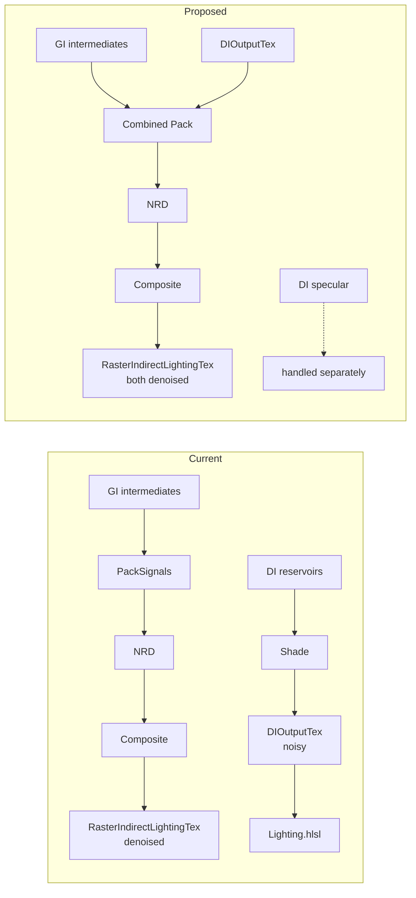

# TortureRed — ReSTIR GI & NRD Pass Integration

_Built from source analysis — June 2026_

---

## Overview

TortureRed's split diffuse/specular ReSTIR GI pipeline optionally routes through an NRD Relax pass for denoising before final composite. When NRD is disabled, a direct resolve pass writes indirect lighting instead. The ReSTIR DI pipeline currently bypasses NRD entirely, outputting raw radiance straight to the lighting pass.

This document describes:

1. The ReSTIR GI pipeline structure with NRD as an optional denoising pass
2. How ReSTIR DI connects to the final lighting composite
3. Whether both pipelines can share the same NRD pass

---

## Key Source Files

| File | Role |
|---|---|
| [`Renderer.cpp`](../Sources/Renderer.cpp) — `DenoiseRasterIndirectGI()` | Host-side scheduling: decides NRD vs direct resolve |
| [`NrdPrepareGuides.hlsl`](../Sources/Shaders/NrdPrepareGuides.hlsl) | Pre-pass: extracts motion vectors, normals, depth for NRD |
| [`NrdPackRasterIndirect.hlsl`](../Sources/Shaders/NrdPackRasterIndirect.hlsl) | Converts GI reservoir intermediates into NRD-compatible noisy signals |
| [`NrdCompositeIndirect.hlsl`](../Sources/Shaders/NrdCompositeIndirect.hlsl) | Unpacks NRD output back into `RasterIndirectLightingTex` |
| [`RestirGI_Split_Resolve.hlsl`](../Sources/Shaders/RestirGI_Split_Resolve.hlsl) | Fallback: direct resolve when NRD is off or debug mode active |
| [`RestirDI_Shade.hlsl`](../Sources/Shaders/RestirDI_Shade.hlsl) | Final DI resolve — writes `DIOutputTex` |
| [`Lighting.hlsl`](../Sources/Shaders/Lighting.hlsl) | Composites all lighting terms for final frame |

---

## ReSTIR GI Pipeline (Split Diffuse/Specular)

### Passes

| Order | Pass | Shader | Output |
|---|---|---|---|
| 1 | Diffuse Temporal | `RestirGI_Diffuse_Temporal.hlsl` | `DiffuseReservoirBuffer[curr]`, `DiffuseCandidateBuffer` |
| 2 | Specular Temporal | `RestirGI_Specular_Temporal.hlsl` | `SpecularReservoirBuffer[curr]` (reads `DiffuseCandidateBuffer` for rough-surface reuse) |
| 3 | Diffuse Spatial | `RestirGI_Diffuse_Spatial.hlsl` | `DiffuseReservoirIntermediate` |
| 4 | Specular Spatial | `RestirGI_Specular_Spatial.hlsl` | `SpecularReservoirIntermediate` |
| 5a | **NRD Denoise** | PrepareGuides → PackSignals → NRD Relax → Composite | `RasterIndirectLightingTex` (denoised) |
| 5b | **Direct Resolve** (fallback) | `RestirGI_Split_Resolve.hlsl` | `RasterIndirectLightingTex` (noisy, from intermediates directly) |

### Branching logic (pass 5)

The decision between NRD and direct resolve happens in [`Renderer.cpp`](../Sources/Renderer.cpp) `DispatchRasterIndirectGI()`:

- **NRD path active** when: `enableNrdRelax=1`, no reservoir debug mode, no SHaRC debug
- **Direct resolve** otherwise

When the NRD path runs, it consists of four sub-passes:

1. **PrepareGuides** — extracts motion vectors (screen-space reprojection from `viewProjPrevious`), NRD-packed normal+roughness, and view-space Z from the G-Buffer
2. **PackSignals** — reads `DiffuseReservoirIntermediate` and `SpecularReservoirIntermediate`, evaluates each reservoir with its lobe-specific BRDF, normalizes by NRD material factors, and packs radiance + hit-distance into NRD's compressed texture format
3. **NRD Relax** — black-box spatiotemporal denoiser (diffuse and specular channels, configured with max history lengths, blur radii, etc.)
4. **Composite** — unpacks denoised output, restores BRDF material factors, writes to `RasterIndirectLightingTex`

### NRD restart logic

The host tracks `m_NrdWasActiveLastFrame`. If NRD was inactive on the previous frame (e.g., the user toggled indirect GI off then back on), the accumulation mode is set to `RESTART`, clearing NRD's internal history to avoid stale-data assertions.

### Textures involved in the NRD path

| Texture | Format | Produced by | Consumed by |
|---|---|---|---|
| `NrdMotionVectorsTex` | `R16G16_FLOAT` | PrepareGuides | NRD Relax |
| `NrdNormalRoughnessTex` | `R10G10B10A2_UNORM` | PrepareGuides | NRD Relax |
| `NrdViewZTex` | `R32_FLOAT` | PrepareGuides | NRD Relax |
| `NrdNoisyDiffuseTex` | `R16G16B16A16_FLOAT` | PackSignals (from diffuse reservoirs) | NRD Relax |
| `NrdNoisySpecularTex` | `R16G16B16A16_FLOAT` | PackSignals (from specular reservoirs) | NRD Relax |
| `NrdDenoisedDiffuseTex` | `R16G16B16A16_FLOAT` | NRD Relax | Composite |
| `NrdDenoisedSpecularTex` | `R16G16B16A16_FLOAT` | NRD Relax | Composite |
| `NrdValidationTex` | `R16G16B16A16_FLOAT` | NRD Relax (optional) | Composite (bypasses unpack) |
| `RasterIndirectLightingTex` | `R16G16B16A16_FLOAT` | Composite (or SplitResolve) | `Lighting.hlsl` |

### Key normalization contract

The PackSignals pass divides the evaluated BRDF radiance by NRD material factors before packing. The Composite pass reverses this by multiplying the denoised output by the same factors. This ensures NRD operates on a BRDF-independent signal space.

---

## ReSTIR DI Pipeline

### Passes

| Order | Pass | Shader | Output |
|---|---|---|---|
| 1 | Initial Sampling | `RestirDI_InitialSampling.hlsl` | `DIReservoirBuffer[curr]` (4-candidate RIS, no shadow rays) |
| 2 | Temporal Resampling | `RestirDI_Temporal.hlsl` | `DIReservoirBuffer[curr]` (merged with `[prev]`) |
| 3 | Spatial Resampling | `RestirDI_Spatial.hlsl` | `DIReservoirIntermediate` |
| 4 | Shade | `RestirDI_Shade.hlsl` | `DIOutputTex` (1 shadow ray + BSDF, weighted by RIS W) |

### DI output characteristics

`DIOutputTex` is `R16G16B16A16_FLOAT`. RGB stores full BSDF-weighted radiance (diffuse + specular combined, multiplied by the unbiased RIS weight `W`). Alpha stores `W`. No denoising is applied — the output is single-sample noise.

### DI consumption

In [`Lighting.hlsl`](../Sources/Shaders/Lighting.hlsl), `DIOutputTex` is sampled and added directly to the total direct lighting term alongside the main directional light (which has its own ray-traced shadow). The indirect GI term comes from `RasterIndirectLightingTex`.

---

## Structural Differences Between GI and DI Outputs

| Aspect | GI (post-spatial intermediates) | DI (post-shade output) |
|---|---|---|
| **Signal domain** | Hit-point radiance with continuous ray distance | Light radiance with binary shadow visibility |
| **Hit distance** | `firstBounceHitT` — ray length to the indirect bounce | Not tracked — shadow ray is visible/occluded, no continuous distance |
| **BRDF representation** | Evaluated per-lobe in PackSignals, normalized by NRD material factors | Full `(diff+spec) × BSDF` pre-multiplied, no normalization |
| **Sample type** | Scene hit point (`hitPos`, `hitNormal`) | Light index into `LightsBuffer` |
| **Denoising** | Via NRD Relax (temporal + spatial) | None — raw single-frame output |

---

## Feasibility: Sharing the NRD Pass

### Core idea

Merge DI's diffuse contribution into the existing NRD diffuse channel before the NRD pass runs. NRD treats the diffuse channel as a single signal — it has no awareness that the radiance originates from two different reservoir pipelines. The merged signal gets denoised in one dispatch, and the composite pass works unchanged.

### Pipeline change (conceptual)

**Current**: GI passes through NRD and reaches `Lighting.hlsl` denoised. DI reaches `Lighting.hlsl` raw — no denoising at all.

**Proposed**: DI's diffuse contribution merges into the same NRD diffuse channel before denoising. One NRD dispatch handles both. DI specular is handled separately (kept raw, or merged into NRD's specular channel as a second phase).

### Why it works

1. **Same domain**: Both pipelines run at internal resolution on the same G-Buffer surfaces — pixel correspondence is exact.
2. **Same normalization**: Both signals can be divided by NRD material factors before NRD, making them directly additive.
3. **NRD agnosticism**: The denoiser only sees a 2D radiance + hit-distance map with motion/normal guides. Signal origin is irrelevant.

### Challenges

| Challenge | Severity | Mitigation |
|---|---|---|
| DI has no hit distance | Medium | Store light distance per pixel (world-space distance for point/spot; sentinel for directional); use luminance-weighted average for the combined hit distance |
| DI combines diffuse + specular | Medium | Use a roughness heuristic to split: blend DI toward the diffuse channel for rough surfaces, toward specular for smooth surfaces |
| Disocclusion for DI | Low | NRD primarily uses motion vectors and depth for disocclusion; hit distance is a secondary signal |
| DI W-weight already baked in | Low | Both use unbiased RIS; DI's `W` is already multiplied into `DIOutputTex.rgb` |

### Implementation outline

1. Add `lightDistance` to `DIRreservoir` — the spatial resampling passes must carry this field through merges.
2. During DI shade, compute and store world-space distance to the selected light. Use a sentinel value for directional lights.
3. Create a combined pack shader that reads both GI reservoir intermediates and `DIOutputTex`, applies the roughness heuristic to split DI into diffuse/specular portions, normalizes both by NRD material factors, computes a luminance-weighted average hit distance, and packs the combined signal.
4. In `Lighting.hlsl`, when NRD is active, skip the raw DI addition since `RasterIndirectLightingTex` now contains both. When NRD is off, add DI normally.

### Feasibility summary

| Factor | Assessment |
|---|---|
| **Technical feasibility** | High — NRD naturally handles combined signals in its diffuse channel |
| **Effort** | ~250 lines across 5 files: `SharedTypes.h`, `RestirDI_Shade.hlsl`, new combined pack shader, `Renderer.cpp`, `Lighting.hlsl` |
| **Quality gain** | DI gains 12-frame temporal accumulation instead of raw noise |
| **Performance** | Net savings — avoids a separate NRD instance; existing pass does double duty |
| **Risk** | DI hit distance is synthetic; disocclusion may be slightly less precise for DI-dominated pixels |