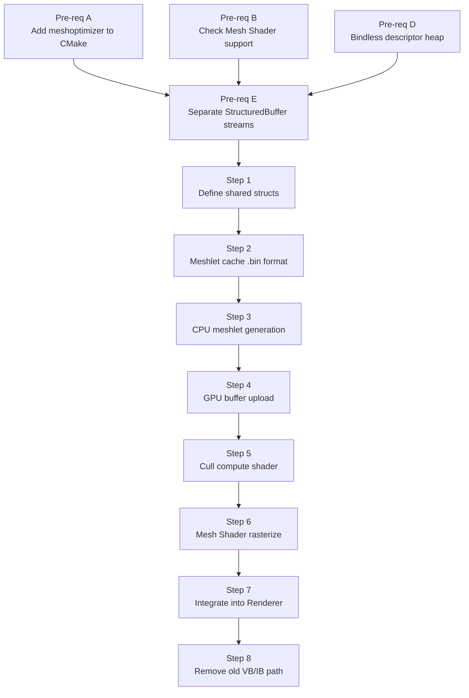

# TortureRed — Meshlet Implementation Plan

_Planning document for replacing the unified vertex/index buffer rasterization pipeline with a meshlet-based GPU-driven renderer — July 2026_

---

## 🎯 Goals & Constraints

| Goal | Detail |
|---|---|
| **Meshlet generation** | Use [meshoptimizer](https://github.com/zeux/meshoptimizer) |
| **Two-phase load strategy** | Phase 1 (mesh optimization) always runs on first load; Phase 2 (meshlet generation + per-meshlet optimization) runs once and is cached to a `.bin` file; subsequent loads skip both phases and read the bin directly |
| **No dual-phase occlusion culling** | Single-phase frustum cull only — no HZB, no previous-frame reprojection |
| **Replace unified buffers** | `m_GlobalVertexBuffer` + `m_GlobalIndexBuffer` + `IndirectDrawCommand` are replaced by meshlet-aware GPU buffers and a Mesh Shader pipeline |

---

## 📐 Current Architecture (Baseline)

Before any changes, TortureRed's geometry pipeline works as follows:

```
CPU (Model::LoadGLTFModel)
  └─ cgltf parses GLTF
  └─ All primitives merged into:
       m_GlobalVertices[]   → GPUBuffer (StructuredBuffer<GLTFVertex>)
       m_GlobalIndices[]    → GPUBuffer (index buffer R32_UINT)
  └─ Per-primitive DrawNodeData { world, vertexOffset, indexOffset, materialID }
       → GPUBuffer (StructuredBuffer<DrawNodeData>)
  └─ IndirectDrawCommand[] (D3D12_DRAW_INDEXED_ARGUMENTS)
       → GPUBuffer (ExecuteIndirect source)

GPU (VSMain in Forward.hlsl / Gbuffer.hlsl)
  DrawNodeData drawData = DrawNodeBuffer[instanceID];
  GLTFVertex v = GlobalVertexBuffer[drawData.vertexOffset + vertexID];
  → transform → output to rasterizer
```

**Key structures to replace or extend:**

| Current | Role | Fate |
|---|---|---|
| `GLTFVertex { float3 pos, float3 normal, float2 uv }` | Interleaved vertex | **Replace** with packed streams |
| `m_GlobalVertexBuffer` | Unified vertex pool | **Replace** with per-mesh `StructuredBuffer` streams |
| `m_GlobalIndexBuffer` | Unified index pool | **Replace** with meshlet triangle table |
| `IndirectDrawCommand` | `DrawIndexedInstanced` args | **Replace** with `DispatchMesh` args |
| `DrawNodeData { world, vertexOffset, indexOffset, materialID }` | Per-draw metadata | **Extend** with meshlet buffer offsets |

---

## ⚠️ Pre-Requisites Before Meshlet Work

These are foundational changes that must land **before** the meshlet pipeline can be built. They are not optional — the meshlet system depends on them.

### Pre-req A — Add meshoptimizer to the Build

**Why**: meshoptimizer is not yet in `CMakeLists.txt`. It must be added before any CPU-side meshlet generation code can compile.

**What to do**:
1. Add `FetchContent_Declare` for meshoptimizer in `CMakeLists.txt`
2. Link `meshoptimizer` to the `TortureRed` target
3. Add `#include <meshoptimizer.h>` to `pch.h` or `Model.cpp`

```cmake
FetchContent_Declare(
    meshoptimizer
    GIT_REPOSITORY https://github.com/zeux/meshoptimizer.git
    GIT_TAG v1.2
    SOURCE_DIR ${CMAKE_SOURCE_DIR}/ThirdParty/meshoptimizer
)
FetchContent_MakeAvailable(meshoptimizer)
# then: target_link_libraries(TortureRed ... meshoptimizer)
```

---

### Pre-req B — Verify Mesh Shader Support (Optional but Preferred)

**Why**: The preferred rasterization path uses `DispatchMesh` (Mesh Shader pipeline), which requires `D3D12_FEATURE_D3D12_OPTIONS7` with `MeshShaderTier >= D3D12_MESH_SHADER_TIER_1`. However, **Mesh Shaders are not strictly required** to use meshlet data — the GBuffer pass can still be driven by a traditional VS+PS draw where the vertex shader manually indexes into the meshlet `StructuredBuffer`s using `SV_VertexID` and `SV_InstanceID`. This fallback path is simpler to implement first and can be replaced with `DispatchMesh` later.

**Two possible paths**:

| Path | API | Requirement | Notes |
|---|---|---|---|
| **Traditional VS+PS** (fallback) | `DrawInstanced` / `ExecuteIndirect` | None beyond SM 6.8 | VS manually fetches vertex from `StructuredBuffer<MeshletVertex>` using `SV_VertexID`; no amplification or mesh shader needed |
| **Mesh Shader** (preferred) | `DispatchMesh` / `ExecuteIndirect` | `MeshShaderTier >= TIER_1` | Full GPU-driven; one thread group per meshlet; enables future amplification shader culling |

**What to do**:
1. In `Renderer::Initialize()`, query `D3D12_FEATURE_D3D12_OPTIONS7`
2. Store `m_MeshShaderSupported` bool
3. Gate `DispatchMesh` PSO creation behind this flag; fall back to VS+PS PSO if unsupported
4. Ensure `CMakeLists.txt` targets Agility SDK 1.613+ (already present at 1.618.5 ✓)

---

### Pre-req D — Bindless Descriptor Heap (Already Partially Done ✅)

**Current state** (from `GraphicsHelper.cpp` + `GraphicsTypes.cpp`):
- A **4096-entry shader-visible `CBV_SRV_UAV` heap** already exists (`GraphicsHelper::s_Context.srvHeap`)
- `CreateStructuredBuffer()` **already allocates a `srvIndex`** into that heap for every buffer it creates — all `GPUBuffer` objects already have a valid bindless slot
- The root signature already exposes the heap as an unbounded descriptor table at `rootParameters[3]` (`t0 space0`, 4096 entries) — this is the same table used for textures
- `ResourceDescriptorHeap[index]` is already used in shaders (e.g. `RestirGI_ResolveIntermediates.hlsl`)

**What is NOT done yet**: Buffers are currently bound via fixed root parameter slots (`t3 space1` for indices, `t4 space1` for vertices) rather than through the bindless heap. The meshlet pipeline needs to look up buffers by index stored in `MeshData`.

**What to do** (minimal work — infrastructure is ready):
1. ✅ Heap exists — no new heap needed
2. ✅ `srvIndex` is already assigned by `CreateStructuredBuffer` — no change needed to buffer creation
3. Store the `srvIndex` values into `MeshData` fields at upload time (see Step 1 / Step 4)
4. In the meshlet shaders, use `ResourceDescriptorHeap[meshData.PositionsIndex]` — same pattern already used in ReSTIR shaders

> **Note**: The only real work here is populating `MeshData` with the correct `srvIndex` values and writing the shader-side lookups. The heap and SRV allocation infrastructure requires **zero changes**.

---

### Pre-req E — Unified Per-Stream Buffers with Element Offsets

**Proposed approach — Unified Buffers (mirrors existing `m_GlobalVertexBuffer` pattern)**

Instead of one `StructuredBuffer<T>` per mesh per stream (which would consume many descriptor heap slots and fragment memory), use **one global buffer per stream type** across all meshes — exactly how `m_GlobalVertexBuffer` already works today. Each mesh stores an **element offset** into the global stream, not a separate buffer index.

**Why this is better for TortureRed**:
- The existing `m_GlobalVertexBuffer` + `globalVertexOffset` pattern already proves this works
- `CreateStructuredBuffer` creates one SRV per buffer — 7 streams × N meshes would exhaust the 4096-slot heap quickly; 7 global buffers uses only 7 slots total
- `D3D12_BUFFER_SRV.FirstElement` / `NumElements` in the SRV descriptor supports sub-range views if needed, but a single full-range SRV + per-mesh element offset in `MeshData` is simpler
- No per-mesh heap slot management needed

**Global buffers to create** (one per stream, all meshes concatenated):

| Buffer | Type | Existing analog |
|---|---|---|
| `m_GlobalPositions` | `StructuredBuffer<float3>` | replaces `m_GlobalVertexBuffer` positions |
| `m_GlobalNormals` | `StructuredBuffer<uint>` (RGB10A2_SNORM) | new |
| `m_GlobalUVs` | `StructuredBuffer<uint>` (RG16_FLOAT) | new |
| `m_GlobalMeshlets` | `StructuredBuffer<Meshlet>` | new |
| `m_GlobalMeshletVertices` | `StructuredBuffer<uint>` | new |
| `m_GlobalMeshletTriangles` | `StructuredBuffer<MeshletTriangle>` | new |
| `m_GlobalMeshletBounds` | `StructuredBuffer<MeshletBounds>` | new |

**`MeshData` stores element offsets, not heap indices**:
```cpp
struct MeshData {
    uint PositionOffset;        // Element offset into m_GlobalPositions[]
    uint NormalOffset;          // Element offset into m_GlobalNormals[]
    uint UVOffset;              // Element offset into m_GlobalUVs[]
    uint MeshletOffset;         // Element offset into m_GlobalMeshlets[]
    uint MeshletVertexOffset;   // Element offset into m_GlobalMeshletVertices[]
    uint MeshletTriangleOffset; // Element offset into m_GlobalMeshletTriangles[]
    uint MeshletBoundsOffset;   // Element offset into m_GlobalMeshletBounds[]
    uint MeshletCount;
    uint MaterialIndex;
    uint _pad0;
    uint _pad1;
    uint _pad2;
};
```

**In shaders**, the 7 global buffers are bound once (fixed root slots or 7 bindless indices stored in a small constant buffer) and indexed with `offset + localIndex`:
```hlsl
// Bound once per frame, not per mesh:
StructuredBuffer<float3>         GlobalPositions  : register(t*, space1);
StructuredBuffer<uint>           GlobalNormals    : register(t*, space1);
// ... etc.

// Per-mesh access:
float3 pos = GlobalPositions[meshData.PositionOffset + localVertexIndex];
```

**What to do**:
1. In `Model.cpp`, during `CreateGLTFResources()`, split `GLTFVertex` into separate stream arrays and append each primitive's data to the global stream vectors
2. Track per-primitive element offsets (same as `globalVertexOffset` today) and store them in `MeshData`
3. After all models are loaded, upload the 7 global stream buffers via `CreateStructuredBuffer` — each gets one `srvIndex` automatically
4. Bind the 7 global buffers once in the root signature (or store their 7 `srvIndex` values in a small per-frame constant) — no per-mesh heap management needed

---

## 🗺️ Implementation Steps

The steps below assume all Pre-reqs (A–E) are complete.

---

### Step 1 — Define Shared CPU/GPU Structs

**File**: `Sources/Shared/SharedTypes.h`

Add the following new structs (CPU/GPU shared via `#ifdef __cplusplus`):

```cpp
// Maximum meshlet sizes (compile-time constants)
static const uint MESHLET_MAX_VERTICES  = 64;
static const uint MESHLET_MAX_TRIANGLES = 124;

struct Meshlet {
    uint VertexOffset;      // Offset into MeshletVertexBuffer (uint32 indices)
    uint TriangleOffset;    // Offset into MeshletTriangleBuffer (packed triangles)
    uint VertexCount;       // Number of unique vertices (max 64)
    uint TriangleCount;     // Number of triangles (max 124)
};

struct MeshletTriangle {
    uint V0 : 10;
    uint V1 : 10;
    uint V2 : 10;
    uint    : 2;  // padding
};

struct MeshletBounds {
    float3 LocalCenter;
    float3 LocalExtents;
};

// Replaces DrawNodeData for the meshlet path
// Each *Offset field is an element offset into the corresponding global StructuredBuffer<T>
// (same pattern as existing globalVertexOffset / globalIndexOffset)
struct MeshData {
    uint PositionOffset;        // Element offset into GlobalPositions[]  (float3)
    uint NormalOffset;          // Element offset into GlobalNormals[]    (uint, RGB10A2_SNORM)
    uint UVOffset;              // Element offset into GlobalUVs[]        (uint, RG16_FLOAT)
    uint MeshletOffset;         // Element offset into GlobalMeshlets[]   (Meshlet)
    uint MeshletVertexOffset;   // Element offset into GlobalMeshletVertices[] (uint)
    uint MeshletTriangleOffset; // Element offset into GlobalMeshletTriangles[] (MeshletTriangle)
    uint MeshletBoundsOffset;   // Element offset into GlobalMeshletBounds[]   (MeshletBounds)
    uint MeshletCount;
    uint MaterialIndex;
    uint _pad0;
    uint _pad1;
    uint _pad2;
};

struct InstanceData {
    float4x4 LocalToWorld;
    uint MeshDataIndex;         // Index into global MeshData[] buffer
    uint _pad0;
    uint _pad1;
    uint _pad2;
};

// Culling token — the unit of work through the cull pipeline
struct MeshletCandidate {
    uint InstanceID;    // Index into InstanceData[]
    uint MeshletIndex;  // Per-mesh meshlet index
};
```

---

### Step 2 — Meshlet Cache File Format (`.bin`)

**File**: New `Sources/MeshletCache.h` + `Sources/MeshletCache.cpp`

Define a simple binary cache format so Phase 2 results are persisted:

```
[Header]
  magic:        uint32  = 0x4D534854  ('MSHT')
  version:      uint32  = 1
  meshletCount: uint32
  vertexCount:  uint32  (total unique vertices across all meshlets)
  triangleCount:uint32  (total triangles across all meshlets)
  boundsCount:  uint32

[Meshlet[]]          sizeof(Meshlet) * meshletCount
[uint32[]]           meshlet vertex indirection table
[MeshletTriangle[]]  packed triangle table
[MeshletBounds[]]    AABB per meshlet
[float3[]]           positions stream
[uint[]]             packed normals stream (RGB10A2_SNORM)
[uint[]]             packed UVs stream (RG16_FLOAT)
```

**Cache path convention**: `<gltf_path_without_extension>_<primitive_index>.meshlet.bin`

**Load logic** (in `Model::LoadGLTFModel`):
```
for each primitive:
    if .meshlet.bin exists AND is newer than .gltf:
        load from bin  ← fast path
    else:
        Phase 1: meshopt_optimizeVertexCache / Overdraw / Fetch
        Phase 2: meshopt_buildMeshlets + meshopt_optimizeMeshlet + compute AABB
        write .meshlet.bin
```

---

### Step 3 — CPU Meshlet Generation (`Model.cpp`)

**File**: `Sources/Model.cpp` — new function `BuildMeshlets(GLTFPrimitive&)`

```cpp
void Model::BuildMeshlets(GLTFPrimitive& prim)
{
    // --- Phase 1: Mesh Optimization (always runs, even when loading from bin) ---
    // (Actually Phase 1 runs before bin check; if bin exists, skip Phase 2 only)

    // Phase 1a: Vertex cache
    meshopt_optimizeVertexCache(indices, indices, indexCount, vertexCount);

    // Phase 1b: Overdraw
    meshopt_optimizeOverdraw(indices, indices, indexCount,
                             positions, vertexCount, sizeof(float3), 1.05f);

    // Phase 1c: Vertex fetch
    meshopt_optimizeVertexFetchRemap(&remap[0], indices, indexCount, vertexCount);
    // ... apply remap to all streams ...

    // --- Phase 2: Meshlet Generation ---
    size_t maxMeshlets = meshopt_buildMeshletsBound(indexCount,
                             MESHLET_MAX_VERTICES, MESHLET_MAX_TRIANGLES);

    meshopt_buildMeshlets(meshlets, meshletVertices, meshletTriangles,
                          indices, indexCount,
                          positions, vertexCount, sizeof(float3),
                          MESHLET_MAX_VERTICES, MESHLET_MAX_TRIANGLES,
                          0 /* cone weight = 0 */);

    for (auto& m : meshlets) {
        // Per-meshlet local vertex order optimization
        meshopt_optimizeMeshlet(&meshletVertices[m.vertex_offset],
                                &meshletTriangles[m.triangle_offset],
                                m.triangle_count, m.vertex_count);

        // Compute AABB bounds
        // ... min/max over all vertices referenced by this meshlet ...
    }

    // Pack triangle indices into MeshletTriangle bitfield (10-10-10)
    // Pack normals into RGB10A2_SNORM
    // Pack UVs into RG16_FLOAT
    // Write .meshlet.bin
}
```

---

### Step 4 — GPU Buffer Upload

**File**: `Sources/Model.cpp` — extend `CreateGLTFResources()`

Use **7 global `StructuredBuffer<T>` buffers** (one per stream type), all meshes concatenated — same pattern as the existing `m_GlobalVertexBuffer`:

| Global Buffer | Type | `MeshData` offset field |
|---|---|---|
| `m_GlobalPositions` | `StructuredBuffer<float3>` | `MeshData.PositionOffset` |
| `m_GlobalNormals` | `StructuredBuffer<uint>` (RGB10A2_SNORM) | `MeshData.NormalOffset` |
| `m_GlobalUVs` | `StructuredBuffer<uint>` (RG16_FLOAT) | `MeshData.UVOffset` |
| `m_GlobalMeshlets` | `StructuredBuffer<Meshlet>` | `MeshData.MeshletOffset` |
| `m_GlobalMeshletVertices` | `StructuredBuffer<uint>` | `MeshData.MeshletVertexOffset` |
| `m_GlobalMeshletTriangles` | `StructuredBuffer<MeshletTriangle>` | `MeshData.MeshletTriangleOffset` |
| `m_GlobalMeshletBounds` | `StructuredBuffer<MeshletBounds>` | `MeshData.MeshletBoundsOffset` |

**Build loop** (in `CreateGLTFResources`):
```cpp
for each primitive:
    meshData.PositionOffset        = (uint)m_AllPositions.size();
    meshData.NormalOffset          = (uint)m_AllNormals.size();
    meshData.UVOffset              = (uint)m_AllUVs.size();
    meshData.MeshletOffset         = (uint)m_AllMeshlets.size();
    meshData.MeshletVertexOffset   = (uint)m_AllMeshletVertices.size();
    meshData.MeshletTriangleOffset = (uint)m_AllMeshletTriangles.size();
    meshData.MeshletBoundsOffset   = (uint)m_AllMeshletBounds.size();
    meshData.MeshletCount          = (uint)prim.meshlets.size();
    // ... append prim data to all global vectors ...
```

**After all primitives**, upload each global vector once:
```cpp
CreateStructuredBuffer(m_GlobalPositions,         sizeof(float3),          allPositions.size(), ...);
CreateStructuredBuffer(m_GlobalNormals,           sizeof(uint),            allNormals.size(),   ...);
CreateStructuredBuffer(m_GlobalUVs,               sizeof(uint),            allUVs.size(),       ...);
CreateStructuredBuffer(m_GlobalMeshlets,          sizeof(Meshlet),         allMeshlets.size(),  ...);
CreateStructuredBuffer(m_GlobalMeshletVertices,   sizeof(uint),            allVtxIndir.size(),  ...);
CreateStructuredBuffer(m_GlobalMeshletTriangles,  sizeof(MeshletTriangle), allTris.size(),      ...);
CreateStructuredBuffer(m_GlobalMeshletBounds,     sizeof(MeshletBounds),   allBounds.size(),    ...);
```

Each call to `CreateStructuredBuffer` automatically assigns a `srvIndex` into the existing 4096-slot bindless heap — **no heap management code needed**. The 7 `srvIndex` values are stored in a small `MeshletStreamIndices` constant and bound once per frame.

Upload `MeshData[]` and `InstanceData[]` as structured buffers accessible from the GPU.

> **Why unified buffers over per-mesh buffers**: 7 total SRV slots vs. 7 × N_meshes slots. Avoids exhausting the 4096-entry heap. Matches the existing `m_GlobalVertexBuffer` + `globalVertexOffset` pattern already proven in the codebase. Simpler CPU-side management — one upload call per stream type.

---

### Step 5 — GPU Culling Compute Shader

**File**: New `Sources/Shaders/MeshletCull.hlsl`

Single-phase frustum cull only (no HZB, no two-phase):

```hlsl
// [numthreads(64,1,1)]
// Dispatched over all instances × meshlets

// 1. Load InstanceData + MeshData
// 2. Load MeshletBounds (local AABB)
// 3. FrustumCull(bounds, instance.LocalToWorld, FrameCB.viewProj)
// 4. If visible → append to VisibleMeshlets[] via InterlockedAdd
```

**Buffers**:
- `VisibleMeshlets` — `RWStructuredBuffer<MeshletCandidate>`, max 1M entries
- `VisibleMeshletsCounter` — `RWBuffer<uint>`

Dispatched indirectly after building args from instance/meshlet counts.

---

### Step 6 — Mesh Shader Rasterization

**File**: New `Sources/Shaders/MeshletRasterize.hlsl`

```hlsl
// Global streams — bound once per frame via fixed root slots (7 total SRV slots)
StructuredBuffer<float3>          GlobalPositions         : register(t*, space1);
StructuredBuffer<uint>            GlobalNormals           : register(t*, space1);
StructuredBuffer<uint>            GlobalUVs               : register(t*, space1);
StructuredBuffer<Meshlet>         GlobalMeshlets          : register(t*, space1);
StructuredBuffer<uint>            GlobalMeshletVertices   : register(t*, space1);
StructuredBuffer<MeshletTriangle> GlobalMeshletTriangles  : register(t*, space1);
StructuredBuffer<MeshletBounds>   GlobalMeshletBounds     : register(t*, space1);

// Mesh Shader [numthreads(32,1,1)]
// One thread group = one meshlet

// 1. Load MeshletCandidate from VisibleMeshlets[groupID]
// 2. Load MeshData from GlobalMeshData[candidate.InstanceID → meshDataIndex]
// 3. Meshlet m = GlobalMeshlets[meshData.MeshletOffset + candidate.MeshletIndex];
// 4. SetMeshOutputCounts(m.VertexCount, m.TriangleCount)
// 5. Output vertices:
//    uint localVtxIdx = GlobalMeshletVertices[meshData.MeshletVertexOffset + m.VertexOffset + threadIdx];
//    float3 pos = GlobalPositions[meshData.PositionOffset + localVtxIdx];  → transform to clip space
// 6. Output primitives:
//    MeshletTriangle tri = GlobalMeshletTriangles[meshData.MeshletTriangleOffset + m.TriangleOffset + triIdx];
//    pass CandidateIndex as per-primitive attribute

// Pixel Shader
// Write packed visibility token: PackVisBuffer(candidateIndex, primitiveID)
// OR: write directly to GBuffer (normal/UV loaded from GlobalNormals/GlobalUVs via barycentrics)
```

**PSO configuration**:
- Amplification Shader: none (skip for simplicity)
- Mesh Shader: `ms_6_8`
- Pixel Shader: `ps_6_8`
- Render Target: existing GBuffer targets (albedo, normal, material) OR visibility buffer `R32_UINT`
- Depth: existing depth buffer, reverse-Z

---

### Step 7 — Integrate into Renderer

**File**: `Sources/Renderer.cpp`

Add new methods:
- `CreateMeshletResources()` — allocate `VisibleMeshlets`, `VisibleMeshletsCounter`, indirect args buffers
- `CreateMeshletPipelines()` — compile and create Mesh Shader PSO
- `DispatchMeshletCull(Model*, FrameConstants&)` — run `MeshletCull.hlsl`
- `DispatchMeshletRasterize()` — `ExecuteIndirect` with `DispatchMesh` signature

**Frame loop integration** (replaces current `ExecuteIndirect` draw):
```
BeginFrame()
  → DispatchMeshletCull()       // CS: frustum cull → VisibleMeshlets
  → BuildDispatchMeshArgs()     // CS: write DispatchMesh indirect args
  → DispatchMeshletRasterize()  // MS+PS: rasterize → GBuffer or VisBuffer
  → [existing lighting passes unchanged]
EndFrame()
```

---

### Step 8 — Remove Old Vertex/Index Buffer Path

Once the meshlet path is verified working:

1. Remove `m_GlobalVertexBuffer`, `m_GlobalIndexBuffer` from `Model`
2. Remove `m_OpaqueCommandBuffer`, `m_TransparentCommandBuffer`
3. Remove `IndirectDrawCommand` struct
4. Remove `DrawNodeData.vertexOffset` / `indexOffset` fields (or keep for RT BLAS — see note below)
5. Remove `GLTFVertex` struct (or keep as a transient CPU-only type during load)
6. Remove old `m_CommandSignature` (DrawIndexedInstanced) from `Renderer`

> ⚠️ **Ray Tracing BLAS**: `BuildAccelerationStructures()` currently uses `GLTFPrimitive::vertices` and `GLTFPrimitive::indices` directly to build BLASes. These CPU-side arrays must be preserved (or the BLAS build must be updated to use the new GPU buffer layout) before removing the old data.

---

## 📦 New Files Summary

| File | Purpose |
|---|---|
| `Sources/MeshletCache.h` | `.meshlet.bin` format definition and read/write API |
| `Sources/MeshletCache.cpp` | Cache serialization / deserialization |
| `Sources/Shaders/MeshletCull.hlsl` | Compute shader: frustum cull → VisibleMeshlets |
| `Sources/Shaders/MeshletRasterize.hlsl` | Mesh Shader + Pixel Shader: rasterize meshlets |
| `Sources/Shaders/MeshletCommon.hlsli` | Shared structs and pack/unpack helpers (HLSL) |

---

## 🔧 Modified Files Summary

| File | Change |
|---|---|
| `CMakeLists.txt` | Add meshoptimizer FetchContent + link |
| `Sources/Shared/SharedTypes.h` | Add `Meshlet`, `MeshletTriangle`, `MeshletBounds`, `MeshData`, `InstanceData`, `MeshletCandidate` |
| `Sources/Model.h` | Add meshlet fields to `GLTFPrimitive`; add `BuildMeshlets()` |
| `Sources/Model.cpp` | Add Phase 1+2 generation, bin cache load/save, GPU buffer upload |
| `Sources/Renderer.h` | Add meshlet resource/PSO members |
| `Sources/Renderer.cpp` | Add meshlet resource creation, cull dispatch, rasterize dispatch |
| `Sources/Shaders/Common.hlsl` | Add `MeshData`, `InstanceData`, `MeshletCandidate` HLSL definitions |

---

## 🔢 Implementation Order



---

## 🚧 Known Risks & Notes

| Risk | Mitigation |
|---|---|
| **BLAS compatibility** | Keep `GLTFPrimitive::vertices` / `indices` alive until RT BLAS build is updated to use the new GPU buffers |
| **Alpha-masked geometry** | Mesh Shader PS needs UV output for alpha discard; add `UV` as a per-vertex output for the alpha-masked PSO permutation |
| **Tangent space** | Current `GLTFVertex` has no tangent. Normal mapping in the new pipeline requires tangents — either generate them with meshoptimizer or add a tangent stream during load |
| **Animation / skinning** | Skinned meshes need a separate skinned-position stream; defer animated mesh support to a follow-up task |
| **No occlusion culling** | Frustum-only culling will over-draw compared to D3D12_Research's HZB approach; acceptable for initial implementation |
| **Bin invalidation** | The `.meshlet.bin` cache must be invalidated when `MESHLET_MAX_VERTICES` / `MESHLET_MAX_TRIANGLES` constants change; embed them in the bin header |
