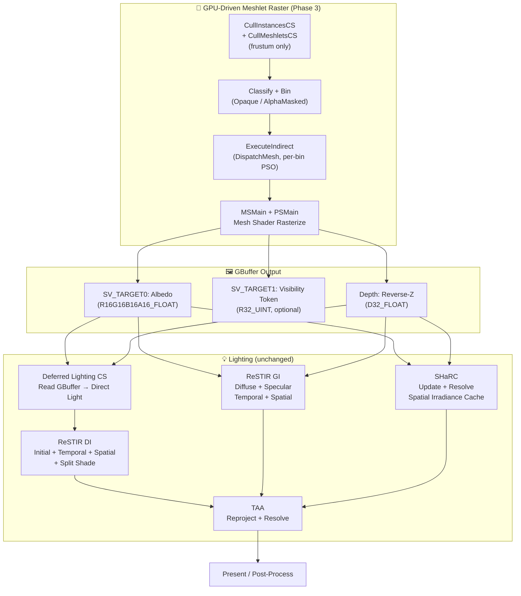
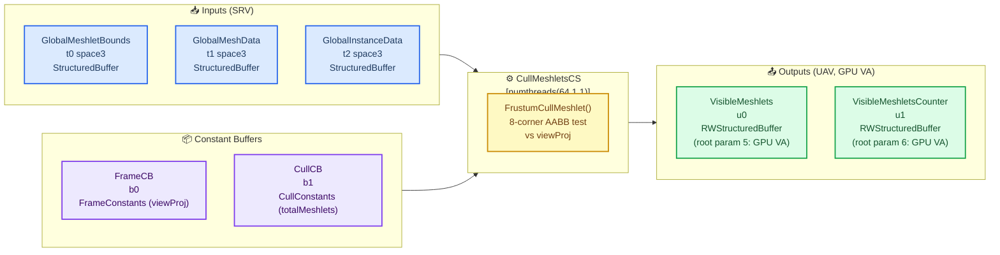
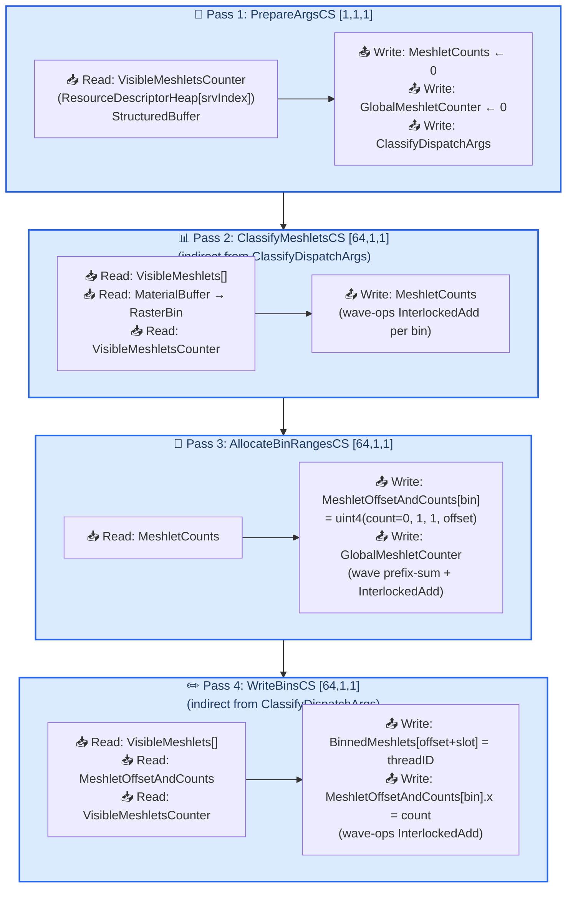
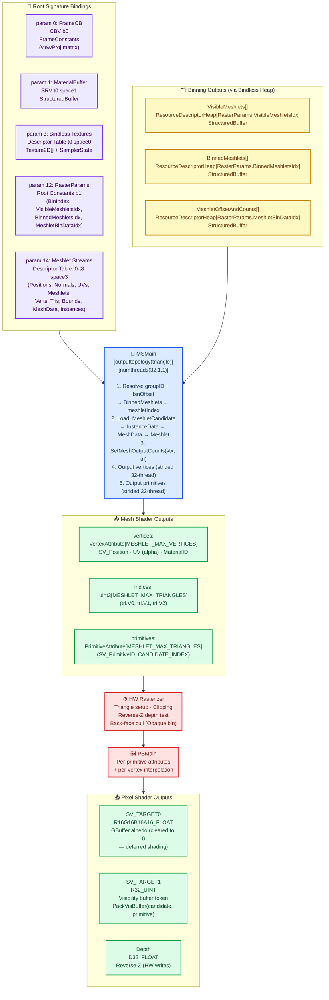

# TortureRed — Mesh Shader Meshlet Rendering Plan

_Plan for replacing the VS+PS meshlet rasterization with a full GPU-driven Mesh Shader pipeline, and wiring it into the existing RT lighting pipeline — July 2026_

> **Parent documents**:
> - [plan000-meshlet.md](plan000-meshlet.md) — Phase 1: core meshlet pipeline (structs, generation, culling, VS+PS rasterization)
> - [plan001-meshletdebug.md](plan001-meshletdebug.md) — Phase 2: visibility buffer debug view

---

## 🎯 Phase 3 Goals

| Goal | Detail |
|---|---|
| **Replace VS+PS with Mesh Shader** | Migrate from `DrawInstanced` + vertex/index fetching to `DispatchMesh` with one thread group per meshlet |
| **GPU-driven binning** | Sort visible meshlets by PSO permutation (Opaque / AlphaMasked) and build indirect `DispatchMesh` arguments — no CPU per-draw work |
| **Mesh Shader PSO creation** | Permutation PSOs for Opaque, AlphaMasked, DepthOnly, with/without debug |
| **Command signature** | `D3D12_INDIRECT_ARGUMENT_TYPE_DISPATCH_MESH` signature for `ExecuteIndirect` |
| **Wire into RT lighting pipeline** | Mesh shader rasterization produces GBuffer → consumed by existing lighting + RT (ReSTIR DI/GI, SHaRC) passes unchanged |

**Core reference**: `d:\D3D12_Research\Resources\Shaders\MeshletRasterize.hlsl` (MSMain + PSMain), `d:\D3D12_Research\Source\Renderer\Techniques\MeshletRasterizer.cpp` (CullAndRasterize)

---

## 📐 Current Phase 1 Architecture (What We Have)

After Phase 1, TortureRed rasterizes meshlets via traditional VS+PS:

```
CPU: Build draw args (one DrawInstanced per visible meshlet)
  → ExecuteIndirect (DrawIndexedInstanced)
GPU VS (VSMain, MeshletRasterize.hlsl):
  SV_InstanceID → VisibleMeshlets[index] → MeshletCandidate
  → InstanceData → MeshData → Meshlet → global streams
  → transform vertex → output PSInput
GPU PS (PSMain):
  MaterialConstants → textures → lighting → SV_Target0
```

**What changes in Phase 3**:

```
CPU: NO per-draw work. Just ExecuteIndirect per bin.
GPU MS (MSMain, [numthreads(32,1,1)]):
  SV_GroupID → BinnedMeshlets[index] → MeshletCandidate
  → InstanceData → MeshData → Meshlet → global streams
  → SetMeshOutputCounts → output vertices + primitives
GPU PS (PSMain):
  CandidateIndex + PrimitiveID as per-primitive attributes
  → write GBuffer + optional visibility buffer
```

---

## 📋 Phase 3 Steps

### Step 1 — Verify / Add Mesh Shader Feature Check

**File**: `Sources/Renderer.cpp` (Initialize)

Phase 1 Pre-req B already mentioned a `m_MeshShaderSupported` flag. Phase 3 makes this **mandatory** for the mesh shader path. If HW doesn't support Mesh Shaders, retain the VS+PS fallback from Phase 1.

```cpp
// In Renderer::Initialize():
D3D12_FEATURE_DATA_D3D12_OPTIONS7 options7 = {};
device->CheckFeatureSupport(D3D12_FEATURE_D3D12_OPTIONS7, &options7, sizeof(options7));
m_MeshShaderSupported = options7.MeshShaderTier >= D3D12_MESH_SHADER_TIER_1;

// Use case:
if (m_MeshShaderSupported)
    CreateMeshShaderPipeline();    // Phase 3
else
    CreateVSPSPipeline();          // Phase 1 fallback
```

TortureRed already targets Agility SDK 1.618.5+, which supports Mesh Shaders on compatible hardware.

---

### Step 2 — Define PSO Permutations and Pipeline Bin Enum

**File**: `Sources/Renderer.h` or `Sources/Shared/SharedTypes.h`

Define a bin enumeration matching D3D12_Research's approach. For TortureRed's single-phase culling (no two-phase occlusion), there are only 2 bins:

```cpp
enum class PipelineBin : uint32_t
{
    Opaque      = 0,    // Standard opaque: back-face cull, no alpha test
    AlphaMasked = 1,    // Alpha-tested: no cull, discard in PS

    Count       = 2     // Number of bins
};
```

The `MaterialConstants` struct needs a `RasterBin` field (default `0` = Opaque):

```cpp
struct MaterialConstants {
    // ... existing fields ...
    uint RasterBin;     // PipelineBin::Opaque or PipelineBin::AlphaMasked
    // ... rest ...
};
```

**PSO array** (in `Renderer.h`):

```cpp
// Indexed by PipelineBin, permuted by debug mode
static constexpr uint32_t NUM_MESHLET_RASTER_BINS = (uint32_t)PipelineBin::Count;

// Main raster PSOs (one per bin)
Microsoft::WRL::ComPtr<ID3D12PipelineState> m_MeshletRasterPSO[NUM_MESHLET_RASTER_BINS];

// Debug-mode PSOs (write R32_UINT visibility buffer + color)
Microsoft::WRL::ComPtr<ID3D12PipelineState> m_MeshletRasterDebugPSO[NUM_MESHLET_RASTER_BINS];

// Depth-only PSOs (for shadow/prepass)
Microsoft::WRL::ComPtr<ID3D12PipelineState> m_MeshletDepthOnlyPSO[NUM_MESHLET_RASTER_BINS];
```

---

### Step 3 — Create Mesh Shader Raster PSOs

**File**: `Sources/Renderer.cpp` — new method `CreateMeshShaderPipeline()`

Follow D3D12_Research's pattern (`d:\D3D12_Research\Source\Renderer\Techniques\MeshletRasterizer.cpp` lines ~80-135).

**Visibility Buffer (GBuffer) raster PSOs**:

```cpp
void Renderer::CreateMeshShaderPipeline()
{
    // Base raster defines
    ShaderDefine rasterDefines;
    rasterDefines["ALPHA_MASK"] = "0";
    rasterDefines["DEPTH_ONLY"] = "0";

    // --- Visibility Buffer PSOs ---
    {
        CD3DX12_PIPELINE_MESH_STATE_STREAM psoDesc;
        psoDesc.pRootSignature = m_RootSignature.Get();
        psoDesc.PrimitiveTopologyType = D3D12_PRIMITIVE_TOPOLOGY_TYPE_TRIANGLE;
        psoDesc.DSVFormat = DXGI_FORMAT_D32_FLOAT;           // reverse-Z
        psoDesc.NumRenderTargets = 2;
        psoDesc.RTVFormats[0] = DXGI_FORMAT_R16G16B16A16_FLOAT;  // GBuffer albedo
        psoDesc.RTVFormats[1] = DXGI_FORMAT_R32_UINT;            // visibility buffer
        psoDesc.SampleDesc.Count = 1;
        psoDesc.RasterizerState = CD3DX12_RASTERIZER_DESC(D3D12_DEFAULT);
        psoDesc.RasterizerState.CullMode = D3D12_CULL_MODE_BACK;
        psoDesc.RasterizerState.FrontCounterClockwise = TRUE;     // GLTF winding
        psoDesc.DepthStencilState = CD3DX12_DEPTH_STENCIL_DESC(D3D12_DEFAULT);
        psoDesc.DepthStencilState.DepthEnable = TRUE;
        psoDesc.DepthStencilState.DepthFunc = D3D12_COMPARISON_FUNC_GREATER;  // reverse-Z
        psoDesc.DepthStencilState.DepthWriteMask = D3D12_DEPTH_WRITE_MASK_ALL;
        psoDesc.BlendState = CD3DX12_BLEND_DESC(D3D12_DEFAULT);

        // PSO 0: Opaque
        psoDesc.MS = CompileShader("Shaders/MeshletRasterizeMS.hlsl", "MSMain", "ms_6_8", rasterDefines);
        psoDesc.PS = CompileShader("Shaders/MeshletRasterizeMS.hlsl", "PSMain", "ps_6_8", rasterDefines);
        m_Device->CreatePipelineState(&psoDesc, IID_PPV_ARGS(&m_MeshletRasterPSO[(int)PipelineBin::Opaque]));

        // PSO 1: AlphaMasked (no back-face cull, alpha discard)
        ShaderDefine alphaDefines = rasterDefines;
        alphaDefines["ALPHA_MASK"] = "1";
        psoDesc.RasterizerState.CullMode = D3D12_CULL_MODE_NONE;
        psoDesc.MS = CompileShader("Shaders/MeshletRasterizeMS.hlsl", "MSMain", "ms_6_8", alphaDefines);
        psoDesc.PS = CompileShader("Shaders/MeshletRasterizeMS.hlsl", "PSMain", "ps_6_8", alphaDefines);
        m_Device->CreatePipelineState(&psoDesc, IID_PPV_ARGS(&m_MeshletRasterPSO[(int)PipelineBin::AlphaMasked]));
    }

    // --- Depth-only PSOs (similar, no PS / no RTVs) ---
    // ...
}
```

**Key D3D12 Pipeline State Stream differences from VS+PS**:

| VS+PS (Phase 1) | Mesh Shader (Phase 3) |
|---|---|
| `D3D12_GRAPHICS_PIPELINE_STATE_DESC` | `D3DX12_MESH_SHADER_PIPELINE_STATE_DESC` |
| `VS` bytecode + `PS` bytecode | `MS` bytecode + `PS` bytecode (AS optional) |
| `IA` topology from `D3D12_PRIMITIVE_TOPOLOGY` | `PrimitiveTopologyType` set on PSO |
| `DrawInstanced` / `DrawIndexedInstanced` | `DispatchMesh` / `ExecuteIndirect(DispatchMesh)` |
| `SV_VertexID` / `SV_InstanceID` | `SV_GroupID` / `SV_GroupThreadID` |

---

### Step 4 — Write Mesh Shader (MSMain)

**File**: New `Sources/Shaders/MeshletRasterizeMS.hlsl` (ported from current `MeshletRasterize.hlsl`)

This replaces the current VS (`VSMain`) with a Mesh Shader entry point. The PS (`PSMain`) remains largely identical — it just receives `CandidateIndex` / `PrimitiveID` from the mesh shader's per-primitive attributes instead of from `SV_InstanceID` / `SV_PrimitiveID`.

Reference implementation: `d:\D3D12_Research\Resources\Shaders\MeshletRasterize.hlsl` lines 60-130.

```hlsl
#include "MeshletCommon.hlsli"
#include "VisibilityBuffer.hlsli"
#include "PBR.hlsl"

#ifndef ALPHA_MASK
#define ALPHA_MASK 0
#endif

#ifndef DEPTH_ONLY
#define DEPTH_ONLY 0
#endif

#ifndef ENABLE_DEBUG_DATA
#define ENABLE_DEBUG_DATA 0
#endif

#define NUM_MESHLET_THREADS 32

// --- Bindless resources (same as current MeshletRasterize.hlsl) ---
StructuredBuffer<float3>          GlobalPositions         : register(t0, space3);
StructuredBuffer<uint>            GlobalNormals           : register(t1, space3);
StructuredBuffer<uint>            GlobalUVs               : register(t2, space3);
StructuredBuffer<Meshlet>         GlobalMeshlets          : register(t3, space3);
StructuredBuffer<uint>            GlobalMeshletVertices   : register(t4, space3);
StructuredBuffer<MeshletTriangle> GlobalMeshletTriangles  : register(t5, space3);
StructuredBuffer<MeshData>        GlobalMeshData          : register(t6, space3);
StructuredBuffer<InstanceData>    GlobalInstanceData      : register(t7, space3);
StructuredBuffer<MeshletCandidate> VisibleMeshlets        : register(t8, space3);
// ... material/texture/light buffers ...

// --- Raster params (per-bin dispatch) ---
struct RasterParams
{
    uint BinIndex;
    StructuredBuffer<MeshletCandidate> VisibleMeshlets;
    StructuredBuffer<uint>             BinnedMeshlets;
    StructuredBuffer<uint4>            MeshletBinData;
};
ConstantBuffer<RasterParams> RasterCB : register(b1);

// --- Mesh Shader per-primitive output ---
struct PrimitiveAttribute
{
    uint PrimitiveID     : SV_PrimitiveID;
    uint CandidateIndex  : CANDIDATE_INDEX;
};

// --- Mesh Shader per-vertex output ---
struct VertexAttribute
{
    float4 Position : SV_Position;
    float3 WorldPos : WORLD_POS;
    float3 Normal   : NORMAL;
    float2 UV       : TEXCOORD;
    nointerpolation uint MaterialID  : MATERIAL_ID;
#if ALPHA_MASK
    float2 UV_Alpha : TEXCOORD1;
#endif
};

// --- Mesh Shader Entry Point ---
[outputtopology("triangle")]
[numthreads(NUM_MESHLET_THREADS, 1, 1)]
void MSMain(
    in uint groupThreadID : SV_GroupIndex,
    in uint groupID       : SV_GroupID,
    out vertices VertexAttribute verts[MESHLET_MAX_VERTICES],
    out indices uint3 triangles[MESHLET_MAX_TRIANGLES],
    out primitives PrimitiveAttribute primitives[MESHLET_MAX_TRIANGLES])
{
    // 1. Resolve meshlet index from binning indirection
    uint meshletIndex = groupID;
    meshletIndex += RasterCB.MeshletBinData[RasterCB.BinIndex].w;   // bin offset
    meshletIndex  = RasterCB.BinnedMeshlets[meshletIndex];           // indirection

    // 2. Load candidate → instance → mesh data → meshlet header
    MeshletCandidate cand = RasterCB.VisibleMeshlets[meshletIndex];
    InstanceData inst     = GlobalInstanceData[cand.InstanceID];
    MeshData md           = GlobalMeshData[inst.MeshDataIndex];
    Meshlet m             = GlobalMeshlets[md.MeshletOffset + cand.MeshletIndex];

    // 3. Set output counts
    SetMeshOutputCounts(m.VertexCount, m.TriangleCount);

    // 4. Output vertices (32 threads, strided loop over up to 64 vertices)
    for (uint i = groupThreadID; i < m.VertexCount; i += NUM_MESHLET_THREADS)
    {
        uint globalVtxIdx = GlobalMeshletVertices[md.MeshletVertexOffset + m.VertexOffset + i];
        float3 localPos   = GlobalPositions[md.PositionOffset + globalVtxIdx];
        float3 localNrm   = UnpackNormalRGB10A2(GlobalNormals, md.NormalOffset, globalVtxIdx);
        float2 uv         = UnpackUVRG16(GlobalUVs, md.UVOffset, globalVtxIdx);

        float3 worldPos   = mul(float4(localPos, 1.0), inst.LocalToWorld).xyz;
        float4 clipPos    = mul(float4(worldPos, 1.0), FrameCB.viewProj);

        VertexAttribute v;
        v.Position     = clipPos;
        v.WorldPos     = worldPos;
        v.Normal       = normalize(mul(localNrm, (float3x3)inst.LocalToWorld));
        v.UV           = uv;
        v.MaterialID   = md.MaterialIndex;
        verts[i] = v;
    }

    // 5. Output primitives (32 threads, strided loop over up to 124 triangles)
    for (uint i = groupThreadID; i < m.TriangleCount; i += NUM_MESHLET_THREADS)
    {
        MeshletTriangle tri = GlobalMeshletTriangles[md.MeshletTriangleOffset + m.TriangleOffset + i];
        triangles[i] = uint3(tri.V0, tri.V1, tri.V2);

        PrimitiveAttribute pri;
        pri.PrimitiveID    = i;            // triangle index within meshlet
        pri.CandidateIndex = meshletIndex; // index into VisibleMeshlets[]
        primitives[i] = pri;
    }
}

// --- Pixel Shader (largely unchanged from Phase 1 PSMain) ---
struct PSInput
{
    float4 position      : SV_POSITION;
    float3 worldPos      : WORLD_POS;
    float3 normal        : NORMAL;
    float2 texCoord      : TEXCOORD;
    nointerpolation uint materialID  : MATERIAL_ID;
    nointerpolation uint candidateIndex : CANDIDATE_INDEX;
    nointerpolation uint primitiveID    : SV_PrimitiveID;
};

struct PSOutput
{
    float4 color     : SV_TARGET0;    // GBuffer albedo or final color
    uint   visBuffer : SV_TARGET1;    // visibility token
};

PSOutput PSMain(PSInput input)
{
    // ... same material lookup, texture sampling, lighting as Phase 1 ...

    PSOutput output;
    output.color = float4(finalColor, 1.0);

    // Write visibility buffer token (for debug view — plan001)
    output.visBuffer = PackVisBuffer(input.candidateIndex, input.primitiveID);

    return output;
}
```

**Key differences from Phase 1 VS+PS**:

| Aspect | Phase 1 (VS+PS) | Phase 3 (MS+PS) |
|---|---|---|
| Entry point | `VSMain(uint instanceID : SV_InstanceID, uint vertexID : SV_VertexID)` | `MSMain(uint groupThreadID : SV_GroupIndex, uint groupID : SV_GroupID)` |
| Vertex output | Vertex-by-vertex, one invocation per vertex | 32 threads process up to 64 vertices in strided loop |
| Triangle output | IA assembles from index buffer | Mesh shader explicitly outputs `uint3` indices array |
| CandidateIndex source | `SV_InstanceID` (one draw per meshlet) | Binning indirection: `BinnedMeshlets[groupID + binOffset]` |
| PrimitiveID source | `SV_PrimitiveID` (HW rasterizer) | Explicit `pri.CandidateIndex = meshletIndex` per-primitive attribute |
| Group count | One `DrawInstanced` per meshlet (N indirect draws) | One `DispatchMesh` per meshlet (N thread groups, single indirect dispatch) |

---

### Step 5 — Create Meshlet Binning Shaders

**File**: New `Sources/Shaders/MeshletBinning.hlsl`

TortureRed has single-phase culling (no Phase1/Phase2), so binning is simpler than D3D12_Research. However, the algorithm structure is the same 4-pass GPU sort:

Reference: `d:\D3D12_Research\Resources\Shaders\MeshletBinning.hlsl` (all four compute passes)

**Four sub-passes**:

| Sub-pass | Shader | Description |
|---|---|---|
| Prepare Args | `PrepareArgsCS` | Zero bin counts, build indirect dispatch args (`ClassifyMeshletsCS` grid size) |
| Count Meshlets | `ClassifyMeshletsCS` | For each visible meshlet, lookup `material.RasterBin` and increment that bin's counter (wave-ops optimized) |
| Compute Offsets | `AllocateBinRangesCS` | Prefix-sum bin counts → base offset per bin in indirection list |
| Write Bins | `WriteBinsCS` | For each meshlet, write its index into the sorted indirection list at its bin's offset |

**Buffers needed**:

| Buffer | Type | Size |
|---|---|---|
| `MeshletCounts` | `RWStructuredBuffer<uint>` | `NUM_RASTER_BINS` (2) |
| `MeshletOffsetAndCounts` | `RWStructuredBuffer<uint4>` | `NUM_RASTER_BINS` (2), each element = `(count, 1, 1, offset)` |
| `BinnedMeshlets` | `RWStructuredBuffer<uint>` | `MAX_VISIBLE_MESHLETS` (e.g. 1M) |
| `GlobalMeshletCounter` | `RWStructuredBuffer<uint>` | 1 |
| `ClassifyDispatchArgs` | `RWStructuredBuffer<D3D12_DISPATCH_ARGUMENTS>` | 1 (indirect dispatch for Classify/Write passes) |

**Bin assignment** (simplified for TortureRed's single-phase):

```hlsl
uint GetBin(uint meshletIndex)
{
    MeshletCandidate candidate = VisibleMeshlets[meshletIndex];
    InstanceData instance = GetInstance(candidate.InstanceID);
    MaterialConstants material = MaterialBuffer[GlobalMeshData[instance.MeshDataIndex].MaterialIndex];
    // AlphaMode::Mask → PipelineBin::AlphaMasked, else Opaque
    return material.RasterBin;  // 0 = Opaque, 1 = AlphaMasked
}
```

---

### Step 6 — Create Indirect Dispatch Command Signature

**File**: `Sources/Renderer.cpp` — `CreateMeshletResources()`

Create a `D3D12_COMMAND_SIGNATURE` that accepts `DispatchMesh` arguments:

```cpp
D3D12_INDIRECT_ARGUMENT_DESC argDesc = {};
argDesc.Type = D3D12_INDIRECT_ARGUMENT_TYPE_DISPATCH_MESH;

D3D12_COMMAND_SIGNATURE_DESC sigDesc = {};
sigDesc.ByteStride   = sizeof(D3D12_DISPATCH_MESH_ARGUMENTS);  // 3 uint
sigDesc.NumArgumentDescs = 1;
sigDesc.pArgumentDescs   = &argDesc;
sigDesc.NodeMask = 0;

m_Device->CreateCommandSignature(&sigDesc, m_RootSignature.Get(),
    IID_PPV_ARGS(&m_DispatchMeshSignature));
```

The `D3D12_DISPATCH_MESH_ARGUMENTS` struct:

```cpp
struct D3D12_DISPATCH_MESH_ARGUMENTS {
    uint ThreadGroupCountX;
    uint ThreadGroupCountY;
    uint ThreadGroupCountZ;
};
```

One `DispatchMesh` thread group = one meshlet, so `ThreadGroupCountX = visibleMeshletCount`, `Y=1`, `Z=1`.

The `MeshletOffsetAndCounts` buffer stores per-bin `uint4(count, 1, 1, offset)` — this IS the indirect argument. Since `count` is in `.x`, `offset` is in `.w`, and they're packed into a `uint4`, passing `(byteOffset = sizeof(uint4) * binIndex)` to `ExecuteIndirect` gives exactly `(count, 1, 1, *padding*)` — matching `D3D12_DISPATCH_MESH_ARGUMENTS` layout.

---

### Step 7 — GPU Culling Modification (Add Binning Phase)

**File**: `Sources/Shaders/MeshletCull.hlsl` + `Sources/Renderer.cpp`

After culling outputs `VisibleMeshlets[]` + `VisibleMeshletsCounter`, insert the binning passes before rasterization.

**Updated frame loop** (in `Renderer::Render()`):

```
ClearCounters
  → CullInstances (CS: frustum cull → CandidateMeshlets)
  → BuildMeshletCullArgs (CS: indirect dispatch for meshlet cull)
  → CullMeshlets (CS: per-meshlet cull → VisibleMeshlets)
  → ─── new binning phase ───
  → PrepareClassifyArgs (CS: zero bin counts, build classify dispatch args)
  → ClassifyMeshlets (CS: count meshlets per bin, wave-ops)
  → AllocateBinRanges (CS: prefix-sum → per-bin offset)
  → WriteBins (CS: write sorted indirection list)
  → ─── binning complete ───
  → Rasterize (MS+PS: ExecuteIndirect per bin with DispatchMesh)
  → [existing lighting passes unchanged]
```

**CPU-side rasterization loop** (in `Renderer.cpp`):

```cpp
// After binning, rasterize per bin:
for (uint32_t binIndex = 0; binIndex < NUM_MESHLET_RASTER_BINS; ++binIndex)
{
    // Set PSO for this bin
    m_CommandList->SetPipelineState(m_MeshletRasterPSO[binIndex].Get());

    // Bind per-bin raster params (binIndex, vis meshlets, binned meshlets, bin data)
    RasterParams params;
    params.BinIndex        = binIndex;
    params.VisibleMeshlets = m_VisibleMeshlets->GetGPUAddress();
    params.BinnedMeshlets  = m_BinnedMeshlets->GetGPUAddress();
    params.MeshletBinData  = m_MeshletOffsetAndCounts->GetGPUAddress();
    // ... bind to root constant slot ...

    // ExecuteIndirect with DispatchMesh signature
    // Offset = sizeof(uint4) * binIndex to read the correct bin's (count,1,1,offset)
    m_CommandList->ExecuteIndirect(
        m_DispatchMeshSignature.Get(),
        1,                                                  // maxCommandCount
        m_MeshletOffsetAndCounts->GetResource(),
        sizeof(uint4) * binIndex                            // argumentOffset into buffer
    );
}
```

> **Note**: D3D12_Research uses a render graph with `RGPassFlag::Raster` — TortureRed can use a simpler direct dispatch since it doesn't have a render graph abstraction. The key pattern is the same: loop over bins, swap PSO, `ExecuteIndirect` per bin.

---

### Step 8 — Wiring into the RT Lighting Pipeline

**Context**: TortureRed's existing pipeline uses:
- **GBuffer pass** → writes albedo, normal, material, depth
- **Lighting compute pass** → reads GBuffer, writes color
- **RT passes** (ReSTIR DI, ReSTIR GI, SHaRC) → trace rays against TLAS/BLAS, use GBuffer for surface info
- **TAA** → temporal accumulation

The mesh shader rasterization **replaces only the GBuffer pass**. Everything downstream stays the same.

#### 8a. GBuffer Output Compatibility

The mesh shader raster PSO outputs to the **same GBuffer render targets** the existing pipeline expects:

| RTV Index | Format | Content |
|---|---|---|
| `SV_TARGET0` | `R16G16B16A16_FLOAT` | Albedo (RGB) + alpha |
| `SV_TARGET1` | `R32_UINT` | Visibility buffer token |

The depth buffer is still reverse-Z `D32_FLOAT`, written by HW rasterizer.

The existing GBuffer textures (`m_GBufferAlbedo`, `m_GBufferNormal`, etc.) remain unchanged — they're just written by a different PSO now.

#### 8b. BLAS Construction Update

The Phase 1 plan notes that `BuildAccelerationStructures()` reads `GLTFPrimitive::vertices` and `GLTFPrimitive::indices` directly for BLAS geometry descs. After Phase 3, the vertex/index buffers on the GPU have been replaced by per-stream `StructuredBuffer`s.

**Options for BLAS**:

| Option | Description | Recommendation |
|---|---|---|
| **Keep CPU-side copies** | Retain `prim->vertices` / `prim->indices` as CPU-side arrays used only for BLAS build. The GPU uses the new meshlet buffers. | Simplest — zero change to BLAS code |
| **Copy GPU buffers back** | After upload, read back the global stream buffers into CPU arrays for BLAS. | Wasteful — not recommended |
| **GPU-side BLAS build** | Use `BuildRaytracingAccelerationStructure` with buffer addresses pointing into the `StructuredBuffer` resources. May need alignment adjustments. | Future optimization |

**Recommendation**: Keep CPU-side copies for BLAS (Option 1). The meshlet path only replaces GPU-side vertex/index access. The BLAS build reads from `GLTFPrimitive::vertices` / `indices` CPU arrays which still exist in `Model`. No change needed.

#### 8c. Lighting Pipeline Integration Diagram



**What changes**: Only the top "GPU-Driven Meshlet Raster" box. Everything from GBuffer output downward is untouched — the same texture names and formats, the same compute shaders, the same root signature bindings.

#### 8d. RT Pass Resource Compatibility

The RT passes (ReSTIR DI/GI, SHaRC, Path Tracer) use:

| Resource | Phase 1 Source | Phase 3 Source | Compatible? |
|---|---|---|---|
| `m_GBufferAlbedo` | VS+PS writes `SV_Target0` | MS+PS writes `SV_Target0` | ✅ Same format |
| `m_GBufferNormal` | VS+PS writes `SV_Target1` (if separate) | Mesh shader outputs normal via `NORMAL` semantic or separate target | ✅ Output must match |
| `m_GBufferDepth` | HW rasterizer depth | HW rasterizer depth | ✅ Same |
| `m_TLAS` / `m_BlasPool` | BLAS from `GLTFPrimitive::vertices/indices` | Same BLAS | ✅ Unchanged (CPU copies retained) |
| `m_LightsBuffer` | Bound in root signature | Same bindings | ✅ Unchanged |
| `MaterialBuffer` | `t0, space1` | Same | ✅ Unchanged |
| `ReservoirBuffer` | Per-pixel GPU buffer | Same | ✅ Unchanged |

**No RT pass shaders need to be modified.** They trace rays against the same TLAS/BLAS and sample from the same GBuffer textures.

---

## 📦 New Files Summary

| File | Purpose | Source Reference |
|---|---|---|
| `Sources/Shaders/MeshletRasterizeMS.hlsl` | Mesh Shader (`MSMain`) + Pixel Shader (`PSMain`) | `d:\D3D12_Research\Resources\Shaders\MeshletRasterize.hlsl` |
| `Sources/Shaders/MeshletBinning.hlsl` | 4-pass GPU sort: Classify, Allocate, Write bins | `d:\D3D12_Research\Resources\Shaders\MeshletBinning.hlsl` |

## 🔧 Modified Files Summary

| File | Change |
|---|---|
| `Sources/Renderer.h` | Add `m_MeshShaderSupported`, `m_MeshletRasterPSO[]`, `m_MeshletDepthOnlyPSO[]`, `m_DispatchMeshSignature`, binning buffer members |
| `Sources/Renderer.cpp` | Add `CreateMeshShaderPipeline()`, `CreateBinningResources()`, binning + per-bin raster dispatch in frame loop |
| `Sources/Shaders/MeshletCull.hlsl` | (No change required — culling is identical, only rasterization changes) |
| `Sources/Shaders/Common.hlsl` or `MeshletCommon.hlsli` | Add `PipelineBin` enum or constants |
| `Sources/Shared/SharedTypes.h` | Add `RasterBin` field to `MaterialConstants` (or equivalent) |
| `CMakeLists.txt` | Ensure `MeshletRasterizeMS.hlsl` + `MeshletBinning.hlsl` are compiled |

**Not modified**: All RT pass shaders (ReSTIR DI/GI, SHaRC, PathTracer), lighting compute shaders, TAA, NRD, ImGui — none of these change.

---

## 🔢 Implementation Order

1. **Step 1** — Verify Mesh Shader feature support
2. **Step 2** — Define `PipelineBin` enum and PSO arrays
3. **Step 3** — Create mesh shader raster PSOs
4. **Step 4** — Write `MSMain` in `MeshletRasterizeMS.hlsl`
5. **Step 5** — Write binning shaders `MeshletBinning.hlsl`
6. **Step 6** — Create `DispatchMesh` command signature
7. **Step 7** — Integrate binning into cull pipeline
8. **Step 8** — Wire into lighting; verify RT pass compatibility

---

## 🔁 Meshlet Renderer Pipeline Overview

How data flows from upload through cull → bin → raster → GBuffer on the GPU:

```mermaid
flowchart LR
    subgraph upload["📤 Upload (CPU→GPU, once)"]
        pos["GlobalPositions\nStructuredBuffer<float3>"]
        nrm["GlobalNormals\nStructuredBuffer<uint>"]
        uv["GlobalUVs\nStructuredBuffer<uint>"]
        meshlets["GlobalMeshlets\nStructuredBuffer<Meshlet>"]
        meshletVerts["GlobalMeshletVertices\nStructuredBuffer<uint>"]
        meshletTris["GlobalMeshletTriangles\nStructuredBuffer<Triangle>"]
        meshData["GlobalMeshData\nStructuredBuffer<MeshData>"]
        instances["GlobalInstanceData\nStructuredBuffer<InstanceData>"]
    end

    subgraph cull["🔍 Cull (Compute CS)"]
        cullCS["CullInstancesCS\n+ CullMeshletsCS\nFrustum test per instance → per meshlet"]
        visible["VisibleMeshlets[]\nStructuredBuffer<MeshletCandidate>"]
        cullCS --> visible
    end

    subgraph bin["🗂️ Bin (Compute CS, 4 passes)"]
        prepare["PrepareArgsCS\nZero bin counters"]
        classify["ClassifyMeshletsCS\nCount meshlets per bin\n(Opaque vs AlphaMasked)"]
        allocate["AllocateBinRangesCS\nPrefix-sum → per-bin offsets"]
        write["WriteBinsCS\nWrite sorted indirection list"]
        prepare --> classify --> allocate --> write
    end

    subgraph raster["🖌️ Raster (MS+PS, DispatchMesh)"]
        ms["MSMain\n[numthreads(32,1,1)]\noutputtopology(triangle)\nSV_GroupID → bin indirection\n→ Meshlet → MeshData → InstanceData\n→ SetMeshOutputCounts\n→ output vertices + primitives"]
        hw["HW Rasterizer\nTriangle setup + clipping\nDepth test (reverse-Z)"]
        ps["PSMain\nSV_TARGET0: GBuffer Albedo\nSV_TARGET1: Visibility Token\nDepth: HW writes D32_FLOAT"]
        ms --> hw --> ps
    end

    upload --> cullCS
    visible --> classify
    visible --> write
    write --> |"BinnedMeshlets[]\n(sorted indirection)"| ms
    allocate --> |"MeshletOffsetAndCounts[]\nper-bin (count,1,1,offset)"| ms
```



**Key data dependencies**:

| Stage | Reads | Writes |
|---|---|---|
| **Cull** | `GlobalInstanceData`, per-instance bounds via `GlobalMeshData` → meshlet bounds | `VisibleMeshlets[]`, `VisibleMeshletsCounter` |
| **Bin: Prepare** | `VisibleMeshletsCounter` | `MeshletCounts` (zeroed), `ClassifyDispatchArgs` |
| **Bin: Classify** | `VisibleMeshlets[]`, `MaterialBuffer` → `RasterBin` | `MeshletCounts` (per-bin counts) |
| **Bin: Allocate** | `MeshletCounts` | `MeshletOffsetAndCounts` (prefix-sum offsets) |
| **Bin: Write** | `VisibleMeshlets[]`, `MaterialBuffer`, `MeshletOffsetAndCounts` | `BinnedMeshlets[]` (sorted indices) |
| **Raster MS** | `BinnedMeshlets[]`, `MeshletOffsetAndCounts`, `VisibleMeshlets[]`, `GlobalInstanceData`, `GlobalMeshData`, `GlobalMeshlets`, `GlobalMeshletVertices`, `GlobalMeshletTriangles`, `GlobalPositions`, `GlobalNormals`, `GlobalUVs` | Vertices + primitives → HW rasterizer |
| **Raster PS** | Per-primitive attributes (`CandidateIndex`, `PrimitiveID`), `MaterialBuffer`, textures | `SV_TARGET0` (GBuffer), `SV_TARGET1` (vis token), depth |

---

## 🚧 Known Risks & Notes

| Risk | Mitigation |
|---|---|
| **No Amplification Shader** | TortureRed skips amplification shader (like D3D12_Research's default path). One thread group = one meshlet. Sufficient for current scene complexity. Can add AS later for GPU-driven LOD or culling expansion. |
| **Mesh Shader thread count** | `NUM_MESHLET_THREADS = 32`. A single wave processes up to 64 vertices and 124 triangles via strided loop. D3D12_Research uses the same 32-thread group size. |
| **`SV_PrimitiveID` in Mesh Shader** | The mesh shader explicitly outputs per-primitive attributes including a custom `CandidateIndex`. The PS can still use `SV_PrimitiveID` to get the triangle index within the meshlet. No semantic conflict. |
| **Binning perf for few meshlets** | With only ~hundreds of visible meshlets, the 4-pass GPU sort is overkill. But it's necessary when scaling to 100K+ meshlets. The cost is fixed overhead (4 small dispatches). Acceptable. |
| **BLAS stale after meshlet conversion** | BLAS is built from CPU-side `vertices`/`indices` arrays. After meshlet generation, the original vertex data is unchanged — only the GPU-side layout changes. BLAS remains valid. ✅ |
| **Depth-only pass** | The `DEPTH_ONLY` permutation skips pixel shader and RTVs entirely. Used for shadow maps or Z-prepass. Mesh shader still runs (outputs vertices only, no PS). |
| **Root signature compatibility** | The mesh shader reads the same global stream `StructuredBuffer`s as the current VS+PS. The root signature does not change — only the PSO's shader bytecode changes. ✅ |
| **Two-phase occlusion culling not needed** | TortureRed uses single-phase frustum-only culling per the Phase 1 goals. The binning and rasterization are identical regardless — just fewer `VisibleMeshlets` to process. |

---

## 🔀 Detailed I/O Diagrams per Pipeline Stage

### 📥 Cull Stage — Compute Shader Input/Output

The cull stage runs `CullMeshletsCS` over all meshlets and produces the visible meshlet list.



**Cull stage buffer bindings**:

| Binding | Resource | Type | Access | Descriptor |
|---|---|---|---|---|
| `t0, space3` | `GlobalMeshletBounds` | `StructuredBuffer<MeshletBounds>` | SRV (read) | Root descriptor table |
| `t1, space3` | `GlobalMeshData` | `StructuredBuffer<MeshData>` | SRV (read) | Root descriptor table |
| `t2, space3` | `GlobalInstanceData` | `StructuredBuffer<InstanceData>` | SRV (read) | Root descriptor table |
| `b0` | `FrameConstants` | Constant buffer | CBV | Root CBV (param 0) |
| `b1` | `CullConstants` | Constant buffer | CBV | Root CBV (param 1) |
| `u0` | `VisibleMeshlets` | `RWStructuredBuffer<MeshletCandidate>` | UAV (write) | Root UAV (param 5, GPU VA) |
| `u1` | `VisibleMeshletsCounter` | `RWStructuredBuffer<uint>` | UAV (write) | Root UAV (param 6, GPU VA) |

---

### 🗂️ Binning Stage — 4-Pass GPU Sort I/O

The binning stage classifies visible meshlets by `RasterBin` (Opaque=0, AlphaMasked=1) and builds a sorted indirection list.



**`BinningParams` passed via root constants (param 12, b1) per pass**:

| Pass | Fields Set |
|---|---|
| **Prepare** | `NumBins`, `VisibleMeshletsCounterIdx`, `RWMeshletCountsIdx`, `RWGlobalMeshletCounterIdx`, `RWDispatchArgumentsIdx` |
| **Classify** | `NumBins`, `VisibleMeshletsIdx`, `VisibleMeshletsCounterIdx`, `RWMeshletCountsIdx` |
| **Allocate** | `NumBins`, `MeshletCountsIdx`, `RWMeshletOffsetAndCountsIdx`, `RWGlobalMeshletCounterIdx` |
| **Write** | `NumBins`, `VisibleMeshletsIdx`, `VisibleMeshletsCounterIdx`, `RWMeshletOffsetAndCountsIdx`, `RWBinnedMeshletsIdx` |

**Binning buffer summary**:

| Buffer | Size | Access per pass |
|---|---|---|
| `VisibleMeshlets[]` | `MAX_VISIBLE_MESHLETS × MeshletCandidate` | Pass 2 (SRV), Pass 4 (SRV) |
| `VisibleMeshletsCounter` | 1 × uint | Pass 1 (SRV), Pass 2 (SRV), Pass 4 (SRV) |
| `MeshletCounts[]` | `NUM_RASTER_BINS × uint` | Pass 1 (UAV zero), Pass 2 (UAV write), Pass 3 (SRV read) |
| `MeshletOffsetAndCounts[]` | `NUM_RASTER_BINS × uint4` | Pass 3 (UAV write), Pass 4 (UAV read+write) |
| `BinnedMeshlets[]` | `MAX_VISIBLE_MESHLETS × uint` | Pass 4 (UAV write) |
| `GlobalMeshletCounter` | 1 × uint | Pass 1 (UAV zero), Pass 3 (UAV read+write) |
| `ClassifyDispatchArgs` | 1 × `DispatchArgs` | Pass 1 (UAV write), Pass 2+4 (INDIRECT_ARGUMENT) |

---

### 🖌️ Mesh Shader Raster Stage — Input/Output (MS+PS)

This is the core mesh shader rasterization. Each `DispatchMesh` thread group processes one meshlet.



**Mesh shader MSMain data flow — step by step**:

```
SV_GroupID (0..N-1, one per meshlet in this bin)
    │
    ▼
RasterParams.BinIndex → MeshletOffsetAndCounts[binIndex].w = binOffset
    │
    ▼
BinnedMeshlets[binOffset + SV_GroupID] → meshletIndex
    │
    ▼
VisibleMeshlets[meshletIndex] → MeshletCandidate { InstanceID, MeshletIndex }
    │
    ├── GlobalInstanceData[cand.InstanceID] → InstanceData { LocalToWorld, MeshDataIndex }
    │
    └── GlobalMeshData[inst.MeshDataIndex] → MeshData { PositionOffset, NormalOffset, UVOffset,
          MeshletOffset, MeshletVertexOffset, MeshletTriangleOffset, MaterialIndex, MeshletCount }
            │
            ▼
        GlobalMeshlets[MeshData.MeshletOffset + cand.MeshletIndex] → Meshlet { VertexOffset,
          TriangleOffset, VertexCount, TriangleCount }
            │
            ├── For each vertex i (strided, 32 threads):
            │     GlobalMeshletVertices[MeshData.MeshletVertexOffset + Meshlet.VertexOffset + i] → globalVtxIdx
            │     GlobalPositions[MeshData.PositionOffset + globalVtxIdx] → localPos
            │     → mul(localPos, inst.LocalToWorld) → mul(worldPos, FrameCB.viewProj) → clipPos
            │     → output VertexAttribute { SV_Position = clipPos }
            │
            └── For each triangle i (strided, 32 threads):
                  GlobalMeshletTriangles[MeshData.MeshletTriangleOffset + Meshlet.TriangleOffset + i] → tri
                  → output uint3(tri.V0, tri.V1, tri.V2)
                  → output PrimitiveAttribute { PrimitiveID = i, CandidateIndex = meshletIndex }
```

**Pixel shader PSMain data flow**:

```
Per-primitive: PrimitiveAttribute { PrimitiveID, CandidateIndex }
Per-vertex (interpolated): VertexAttribute { SV_Position, [UV, MaterialID for AlphaMasked] }
    │
    ▼
[ALPHA_MASK] MaterialBuffer[vertexData.MaterialID] → baseColorFactor + alphaCutoff
    → sample texture → if alpha < cutoff → discard
    │
    ▼
SV_TARGET0 = float4(0,0,0,0)       ← deferred shading (lighting pass reads visibility buffer)
SV_TARGET1 = PackVisBuffer(CandidateIndex, PrimitiveID)  ← visibility token for debug/resolve
Depth      = HW rasterizer writes reverse-Z D32_FLOAT
```

---

## 🐛 Known Bug — `VisibleMeshletsCounter` Invalid SRV Index

### Symptom

In `DispatchMeshletBinning()`, the binning shader `PrepareArgsCS` calls `GetNumMeshlets()` which reads `ResourceDescriptorHeap[VisibleMeshletsCounterIdx]`. The descriptor index passed was `-1` (0xFFFFFFFF), causing an invalid descriptor read and `numMeshlets` returning garbage.

### Root Cause

`m_VisibleMeshletsCounter` is created via `CreateBuffer(..., false, true)` — `createSRV=false, createUAV=true`. This means only a UAV descriptor is created; `srvIndex` retains its default `GPUBuffer` value of `-1`.

Three of the four binning passes pass `m_VisibleMeshletsCounter.srvIndex` (`= -1`) as `BinningParams.VisibleMeshletsCounterIdx`:

| Pass | Passes `VisibleMeshletsCounterIdx`? | Used in shader? |
|---|---|---|
| PrepareArgsCS | Yes | `GetNumMeshlets()` reads it |
| ClassifyMeshletsCS | Yes | `GetNumMeshlets()` reads it |
| AllocateBinRangesCS | **No** | Not set in params |
| WriteBinsCS | Yes | `GetNumMeshlets()` reads it |

### Fix

Added a structured buffer SRV creation right after the `CreateBuffer` call in `Renderer::CreateMeshletResources()`:

```cpp
// Create a structured SRV for the counter so the binning passes
// (MeshletBinning.hlsl) can read it via ResourceDescriptorHeap[].
if (m_VisibleMeshletsCounter.srvIndex < 0)
    m_VisibleMeshletsCounter.srvIndex = (int)GraphicsHelper::AllocateSRV();

D3D12_SHADER_RESOURCE_VIEW_DESC srvDesc = {};
srvDesc.Format = DXGI_FORMAT_UNKNOWN;
srvDesc.ViewDimension = D3D12_SRV_DIMENSION_BUFFER;
srvDesc.Shader4ComponentMapping = D3D12_DEFAULT_SHADER_4_COMPONENT_MAPPING;
srvDesc.Buffer.FirstElement = 0;
srvDesc.Buffer.NumElements = 1;
srvDesc.Buffer.StructureByteStride = sizeof(uint32_t);
srvDesc.Buffer.Flags = D3D12_BUFFER_SRV_FLAG_NONE;

m_Device->CreateShaderResourceView(
    m_VisibleMeshletsCounter.resource.Get(), &srvDesc, srvHandle);
```

> ⚠️ **Important**: `CreateBuffer` creates raw SRVs (`D3D12_BUFFER_SRV_FLAG_RAW`). The binning shader uses `StructuredBuffer<uint>`, which requires `StructureByteStride=4` and `D3D12_BUFFER_SRV_FLAG_NONE`. A manually-created structured SRV is required.

### Affected Files

- `Sources/Renderer.cpp` — `CreateMeshletResources()` (line ~2926)