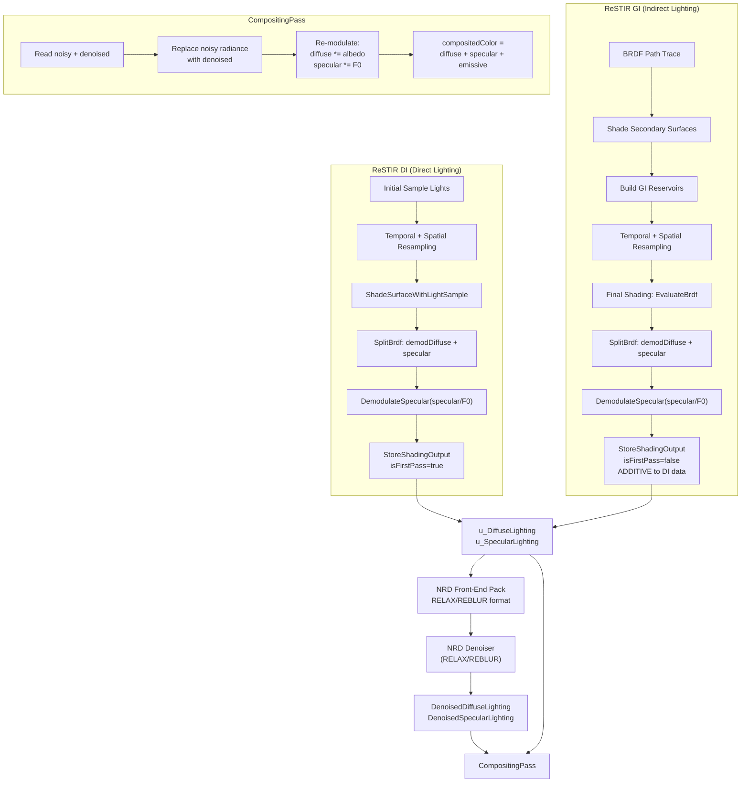
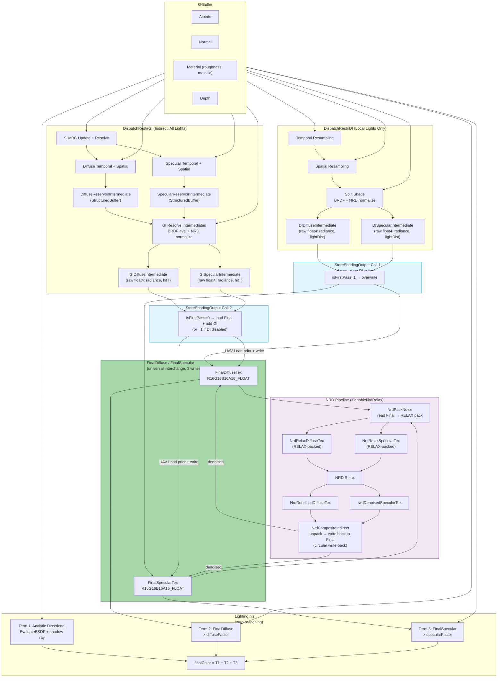
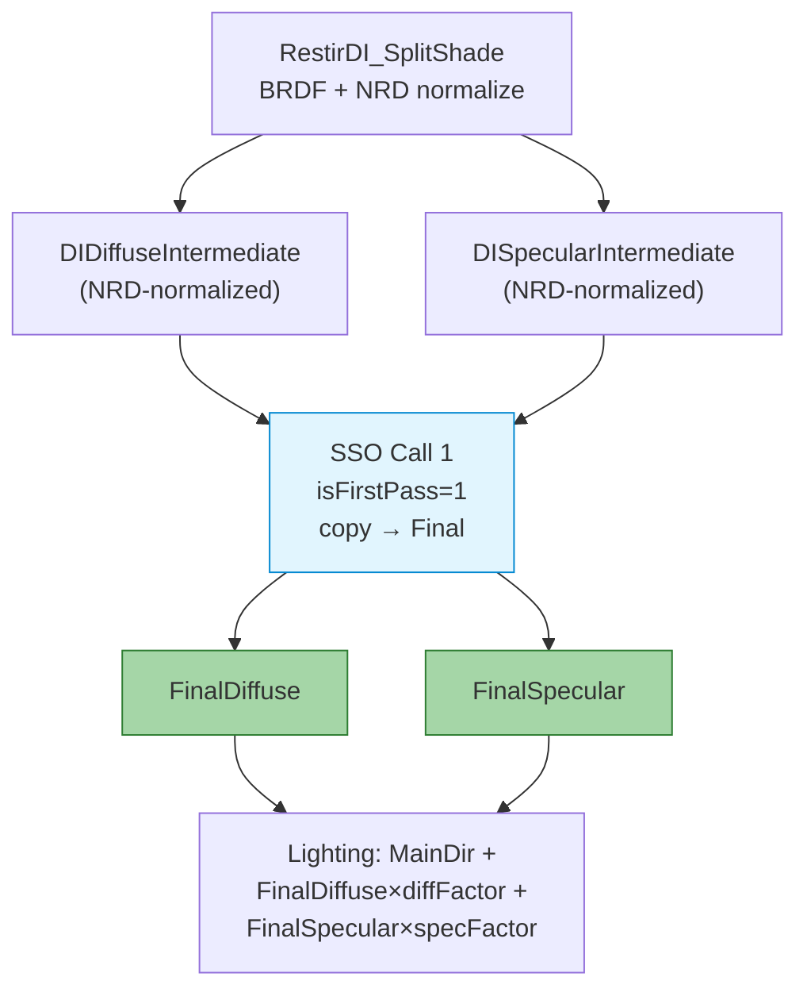
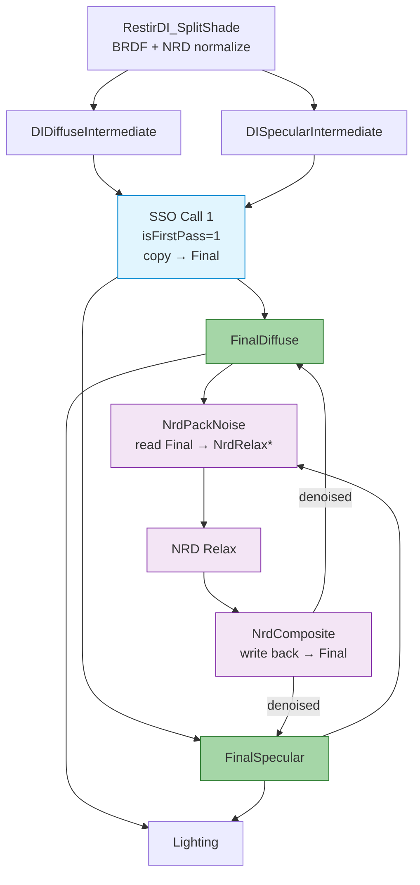
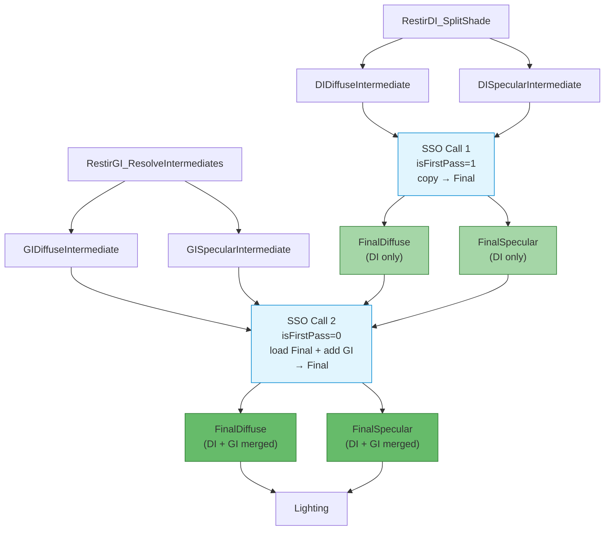
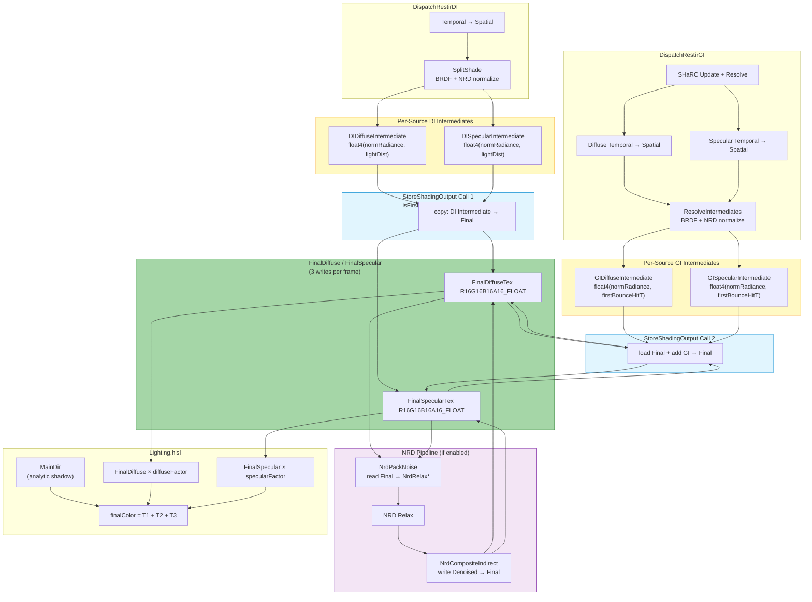
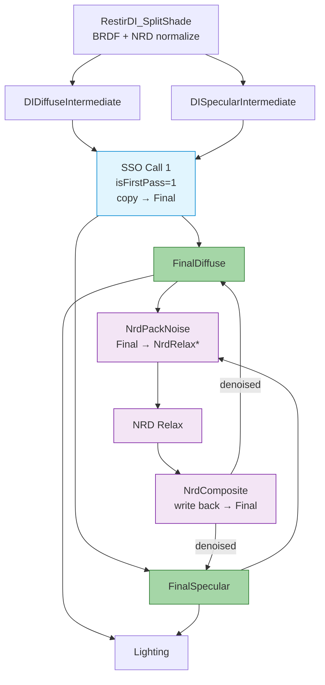
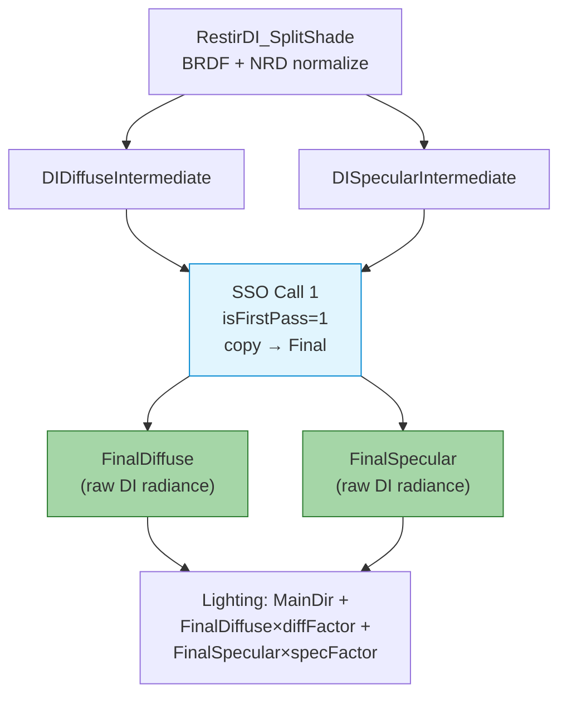

# RTXDI ReSTIR — Diffuse/Specular Split, NRD Feed, and Final Compositing

## 1. Overview: Render Pipeline Order

The high-level frame rendering order in the RTXDI FullSample is:

```
GBuffer → PrepareLights → PresampleLights
    → RenderDirectLighting   (ReSTIR DI)
    → RenderIndirectLighting (BRDF Path Trace / ReSTIR GI)
    → Denoiser (NRD: RELAX or REBLUR)
    → CompositingPass
    → AA / Post-process
```

Key insight: **ReSTIR DI runs first, indirect lighting runs second**, and they both write into the **same** `DiffuseLighting` / `SpecularLighting` textures — with the second pass blending **additively** into the first.

---

## 2. The `SplitBrdf` Structure

Defined in [`ShadingHelpers.hlsli`](d:/RTXDI/Samples/FullSample/Shaders/LightingPasses/ShadingHelpers.hlsli):

```hlsl
struct SplitBrdf
{
    float  demodulatedDiffuse;   // Lambert NdotL (no albedo)
    float3 specular;             // GGX * NdotL * Fresnel
};
```

The BRDF evaluation function used by both ReSTIR DI and GI is:

- **`EvaluateBrdf(surface, samplePosition)`** — computes L from surface-to-sample direction, returns a `SplitBrdf` with the diffuse and specular components separated.

---

## 3. Reservoir Structures

RTXDI uses separate reservoir types for direct and indirect lighting. Both follow the weighted reservoir sampling (WRS) model from the ReSTIR paper: new samples are streamed in, combined from neighbors, and finalized with a normalization step.

### 3.1 `RTXDI_DIReservoir` — Direct Lighting Reservoir

Defined in [`DI/Reservoir.hlsli`](d:/RTXDI/Libraries/Rtxdi/Include/Rtxdi/DI/Reservoir.hlsli):

```hlsl
struct RTXDI_DIReservoir
{
    uint   lightData;          // Light index (bits 0..30) + validity bit (31)
    uint   uvData;             // Sample UV (16.16 fixed point on the light source)
    float  weightSum;          // RIS weight sum (streaming) → inv PDF (after finalize)
    float  targetPdf;          // Target PDF of the selected sample
    float  M;                  // Number of samples considered (can be fractional for pairwise MIS)
    uint   packedVisibility;   // Per-channel visibility packed into 6+6+6 bits
    int2   spatialDistance;    // Screen-distance from visibility origin (minus motion)
    uint   age;                // Frames since visibility was generated
    float  canonicalWeight;    // For pairwise MIS computations
};
```

**Key fields explained:**

| Field | Role |
|-------|------|
| `lightData` | Encodes which light was picked (lower 31 bits) and whether the reservoir is valid (bit 31). `RTXDI_IsValidDIReservoir()` simply checks `lightData != 0`. |
| `uvData` | Where on the light source the sample landed. Recovered as `float2(sampleUV)` via `RTXDI_GetDIReservoirSampleUV()`. |
| `weightSum` | During streaming/resampling: the running RIS weight sum Σ w_i. After `RTXDI_FinalizeResampling()`: the inverse PDF `1/(p̂·M)`, used as `RTXDI_GetDIReservoirInvPdf()` during shading. |
| `targetPdf` | The target function value p̂(x) for the selected sample. |
| `M` | Total number of candidates considered (integer for basic RIS, float for pairwise MIS). |
| `packedVisibility` | Three 6-bit channels encoding RGB visibility (each 0–63 → 0.0–1.0). Stored for reuse across frames to reduce shadow rays. |
| `spatialDistance` | Pixel offset from where visibility was evaluated. Used with `age` and `maxDistance` to decide if visibility reuse is valid. |
| `age` | How many frames old the visibility data is. Together with `maxAge`, controls visibility reuse lifetime. |

**Packed form** (`RTXDI_PackedDIReservoir`, 24 bytes):
```hlsl
struct RTXDI_PackedDIReservoir
{
    uint32_t lightData;
    uint32_t uvData;
    uint32_t mVisibility;     // Packed: M (14 bits) + 3×6-bit visibility
    uint32_t distanceAge;     // Packed: spatialDistance + age
    float    targetPdf;
    float    weight;
};
```

**Core operations:**
- `RTXDI_StreamSample()` — Algorithm 3: stream a raw light sample into the reservoir via WRS
- `RTXDI_CombineDIReservoirs()` — Algorithm 4: merge another reservoir's stream (used for spatial/temporal reuse after applying Jacobian)
- `RTXDI_FinalizeResampling()` — Equation 6: normalize weight sum to produce the final inv PDF
- `RTXDI_GetDIReservoirVisibility()` — Try to reuse cached visibility from a prior frame

### 3.2 `RTXDI_GIReservoir` — Indirect Lighting Reservoir

Defined in [`GI/Reservoir.hlsli`](d:/RTXDI/Libraries/Rtxdi/Include/Rtxdi/GI/Reservoir.hlsli):

```hlsl
struct RTXDI_GIReservoir
{
    float3 position;    // World-space position of the secondary (2nd bounce) surface
    float3 normal;      // Shading normal at the secondary surface
    float3 radiance;    // Incoming radiance from the secondary surface
    float  weightSum;   // RIS weight sum (streaming) → inv PDF (after finalize)
    uint   M;           // Number of samples considered
    uint   age;         // Number of frames the sample has survived
};
```

**Key differences from DI reservoir:**

| Aspect | `RTXDI_DIReservoir` | `RTXDI_GIReservoir` |
|--------|---------------------|----------------------|
| **What is sampled** | Light source identity (index + UV) | Secondary surface (world position + normal) |
| **Sample payload** | `lightData` + `uvData` | `position` + `normal` + `radiance` |
| **Target function** | p̂(light) → `targetPdf` | Not stored separately; derived from target PDF of the secondary surface |
| **Visibility reuse** | Yes — `packedVisibility` + `spatialDistance` + `age` | No — GI does not cache visibility |
| **Pairwise MIS** | Yes — `canonicalWeight` | No |
| **Creation** | `RTXDI_StreamSample()` | `RTXDI_MakeGIReservoir(pos, normal, radiance, pdf)` |
| **Combining** | `RTXDI_CombineDIReservoirs()` | `RTXDI_CombineGIReservoirs()` |
| **Normalization** | `RTXDI_FinalizeResampling()` | `RTXDI_FinalizeGIResampling()` |
| **Validation** | `lightData != 0` | `M != 0` |

**Packed form** (`RTXDI_PackedGIReservoir`, 32 bytes):
```hlsl
struct RTXDI_PackedGIReservoir
{
    float3   position;
    uint32_t packed_miscData_age_M;  // misc flags (16b) + age (8b) + M (8b)
    uint32_t packed_radiance;        // LogLUV encoded
    float    weight;
    uint32_t packed_normal;          // Octahedral snorm2x16
    float    unused;
};
```

**Core operations:**
- `RTXDI_MakeGIReservoir(pos, normal, radiance, pdf)` — Create from a raw secondary-surface hit
- `RTXDI_CombineGIReservoirs()` — Merge another GI reservoir's stream (spatial/temporal reuse)
- `RTXDI_FinalizeGIResampling()` — Normalize the weight sum
- `RTXDI_IsValidGIReservoir()` — Check `M != 0`

### 3.3 Reservoir Lifecycle

Both reservoir types follow the same RIS lifecycle:

```
 1. INITIAL SAMPLE     ──►  MakeReservoir / StreamSample
                             weightSum = 1/pdf, M = 1

 2. STREAMING / MERGE   ──►  CombineReservoirs (temporal, spatial)
                             M += neighbor.M
                             weightSum accumulates risWeights

 3. FINALIZE            ──►  FinalizeResampling
                             weightSum becomes invPdf = (Σw · num) / (p̂ · denom)

 4. SHADE               ──►  Read invPdf from weightSum
                             Compute radiance = reservoir.radiance * weightSum (GI)
                             or scale by invPdf / solidAnglePdf (DI)
```

The `weightSum` field is **overloaded**: during steps 1–2 it stores the running RIS weight sum, and after step 3 it becomes the inverse PDF used for shading.

---

## 4. ReSTIR DI — Direct Lighting

### 4.1 Shading Path

For each pixel, ReSTIR DI:

1. Load a `RTXDI_DIReservoir` (result of initial sampling + temporal + spatial resampling)
2. Call `ShadeSurfaceWithLightSample()` → which internally calls `EvaluateBrdf()`:

```hlsl
SplitBrdf brdf = EvaluateBrdf(surface, lightSample.position);
diffuse  = brdf.demodulatedDiffuse * lightSample.radiance;   // demodulated diffuse radiance
specular = brdf.specular * lightSample.radiance;             // full specular radiance
```

3. **Demodulate specular** — divide by `specularF0`:

```hlsl
specular = DemodulateSpecular(surface.material.specularF0, specular);
// DemodulateSpecular(x, y) = y / max(0.01, x)
```

This is the "material demodulation" required by NRD: specular is stored as radiance/`specularF0` so NRD works on pure radiance.

4. Call `StoreShadingOutput()` with `isFirstPass = true`.

### 4.2 Key Files

| Shader | Purpose |
|--------|---------|
| `DI/GenerateInitialSamples.hlsl` | Initial light sampling |
| `DI/TemporalResampling.hlsl` | Temporal reuse |
| `DI/SpatialResampling.hlsl` | Spatial reuse |
| `DI/FusedResampling.hlsl` | Fused spatiotemporal + shading |
| `DI/ShadeSamples.hlsl` | Separate final shading pass |
| [`ShadingHelpers.hlsli`](d:/RTXDI/Samples/FullSample/Shaders/LightingPasses/ShadingHelpers.hlsli) | `ShadeSurfaceWithLightSample()`, `EvaluateBrdf()`, `StoreShadingOutput()` |

---

## 5. ReSTIR GI — Indirect Lighting (Global Illumination)

### 5.1 Pipeline

1. **BRDF Path Tracing** (`BrdfRayTracing.hlsl`) — trace one BRDF ray per pixel from G-buffer surfaces
2. **Shade Secondary Surfaces** (`ShadeSecondarySurfaces.hlsl`) — shade the hit points, optionally apply ReSTIR DI to them, and build initial GI reservoirs
3. **Temporal Resampling** (`GI/TemporalResampling.hlsl`) — reuse GI reservoirs across frames
4. **Spatial Resampling** (`GI/SpatialResampling.hlsl`) — reuse GI reservoirs spatially
5. **Final Shading** (`GI/FinalShading.hlsl`) — evaluate the final BRDF and output

### 5.2 Final Shading — Diffuse / Specular Split

In [`GI/FinalShading.hlsl`](d:/RTXDI/Samples/FullSample/Shaders/LightingPasses/GI/FinalShading.hlsl):

```hlsl
const RTXDI_GIReservoir reservoir = RTXDI_LoadGIReservoir(...);

float3 diffuse  = 0;
float3 specular = 0;

if (RTXDI_IsValidGIReservoir(reservoir))
{
    float3 radiance = reservoir.radiance * reservoir.weightSum;  // weighted radiance

    // Optional final visibility trace
    radiance *= visibility;

    // Evaluate BRDF toward the GI sample position
    const SplitBrdf brdf = EvaluateBrdf(primarySurface, reservoir.position);

    if (enableFinalMIS)
    {
        // MIS blend between ReSTIR result and initial sample
        // for rough surfaces, prefer ReSTIR; for shiny surfaces, prefer initial sample
        diffuse  = brdf.demodulatedDiffuse * radiance * finalWeight
                 + brdf0.demodulatedDiffuse * initialRadiance * initialWeight;
        specular = brdf.specular * radiance * finalWeight
                 + brdf0.specular * initialRadiance * initialWeight;
    }
    else
    {
        diffuse  = brdf.demodulatedDiffuse * radiance;
        specular = brdf.specular * radiance;
    }

    // Demodulate specular
    specular = DemodulateSpecular(primarySurface.material.specularF0, specular);
}

// isFirstPass=false → additive blend with prior data (ReSTIR DI)
StoreShadingOutput(GlobalIndex, pixelPosition,
    viewDepth, roughness, diffuse, specular, lightDistance=0, isFirstPass=false, isLastPass=true);
```

**Key point**: `isFirstPass=false` means GI output is **added** to whatever ReSTIR DI already wrote. This is how direct + indirect lighting are combined **before** denoising.

### 5.3 MIS (Multiple Importance Sampling) Detail

ReSTIR GI uses a clever MIS scheme:
- `kMISRoughness = 0.3` — threshold roughness
- A "roughened" surface version forces roughness ≥ 0.3
- `GetMISWeight()` compares rough BRDF vs true BRDF → prefers initial sample on shiny surfaces, ReSTIR result on rough surfaces
- This avoids ReSTIR's poor specular performance on low-roughness surfaces

---

## 6. `StoreShadingOutput` — Multi-Pass Blend & NRD Packing

This is the **central function** that handles both multi-pass additive blending and NRD front-end packing. Defined in [`ShadingHelpers.hlsli`](d:/RTXDI/Samples/FullSample/Shaders/LightingPasses/ShadingHelpers.hlsli).

```hlsl
void StoreShadingOutput(..., float lightDistance, bool isFirstPass, bool isLastPass)
{
    // If not first pass, additively blend with prior data
    if (!isFirstPass) {
        float4 priorDiffuse = u_DiffuseLighting[pos];
        float4 priorSpecular = u_SpecularLighting[pos];

        // hitT selection: use prior hitT if this lobe is less luminous
        if (luminance(diffuse)  > luminance(priorDiffuse.rgb)  || lightDistance==0)  diffuseHitT  = priorDiffuse.w;
        if (luminance(specular) > luminance(priorSpecular.rgb) || lightDistance==0)  specularHitT = priorSpecular.w;

        diffuse  += priorDiffuse.rgb;   // additive blend
        specular += priorSpecular.rgb;
    }

    // Checkerboard handling when denoiser is off ...

    // NRD front-end packing (only on last pass)
    if (denoiserMode == RELAX) {
        u_DiffuseLighting[pos]  = RELAX_FrontEnd_PackRadianceAndHitDist(diffuse,  diffuseHitT,  sanitize);
        u_SpecularLighting[pos] = RELAX_FrontEnd_PackRadianceAndHitDist(specular, specularHitT, sanitize);
    } else { // REBLUR
        u_DiffuseLighting[pos]  = REBLUR_FrontEnd_PackRadianceAndNormHitDist(diffuse,  diffNormDist,  sanitize);
        u_SpecularLighting[pos] = REBLUR_FrontEnd_PackRadianceAndNormHitDist(specular, specNormDist,  sanitize);
    }
}
```

### hitT Selection Strategy

The hitT selection is crucial for NRD:
- Uses the hit distance from the **more luminous** lobe
- When GI follows DI (isFirstPass=false), GI's lightDistance=0, so DI's hitT is preserved
- This means NRD gets hit distances from direct lighting for both lobes, which is generally better quality


---

## 7. NRD (RELAX / REBLUR) Integration

### 7.1 Texture Mapping

The NrdIntegration maps RTXDI textures to NRD resources ([`NrdIntegration.cpp`](d:/RTXDI/Samples/FullSample/Source/RenderPasses/DenoisingPasses/NrdIntegration.cpp)):

| NRD Resource | RTXDI Texture | Contents |
|-------------|---------------|----------|
| `IN_DIFF_RADIANCE_HITDIST` | `DiffuseLighting` | Packed diffuse radiance + hitT |
| `IN_SPEC_RADIANCE_HITDIST` | `SpecularLighting` | Packed specular radiance + hitT |
| `IN_NORMAL_ROUGHNESS` | `NormalRoughness` | World normal + roughness |
| `IN_VIEWZ` | `Depth` | Linear view-space depth |
| `IN_MV` | `MotionVectors` | Motion vectors |
| `IN_DIFF_CONFIDENCE` | `DiffuseConfidence` | Gradient-based confidence |
| `IN_SPEC_CONFIDENCE` | `SpecularConfidence` | Gradient-based confidence |
| `OUT_DIFF_RADIANCE_HITDIST` | `DenoisedDiffuseLighting` | Denoised output |
| `OUT_SPEC_RADIANCE_HITDIST` | `DenoisedSpecularLighting` | Denoised output |

### 7.2 RELAX Pipeline (GPU-side)

From [`Relax.cpp`](d:/RTXDI/External/NRD/Source/Relax.cpp):
```
CLASSIFY_TILES → HITDIST_RECONSTRUCTION → PREPASS → TEMPORAL_ACCUMULATION
    → HISTORY_FIX → HISTORY_CLAMPING → COPY → ANTI_FIREFLY → ATROUS → SPLIT_SCREEN
```

### 7.3 Checkerboard Mode

When checkerboard rendering is active:
- Noisy inputs (`DiffuseLighting`/`SpecularLighting`) are packed at half horizontal resolution
- NRD's checkerboard mode clips the viewport to the active field
- The compositing pass expands back: `illuminationPos.x /= 2`

---

## 8. CompositingPass — Final Merge

In [`CompositingPass.hlsl`](d:/RTXDI/Samples/FullSample/Shaders/CompositingPass.hlsl):

```hlsl
// 1. Read G-buffer materials
float3 diffuseAlbedo = ...;
float3 specularF0    = ...;

// 2. Read noisy (pre-denoise) illumination
float4 diffuse_illum  = t_Diffuse[pos];   // demodulated diffuse radiance
float4 specular_illum = t_Specular[pos];  // demodulated specular radiance

// 3. If denoising: read denoised output and replace noisy radiance
if (denoiserMode != OFF) {
    float4 denoised_diffuse  = t_DenoisedDiffuse[pos];
    float4 denoised_specular = t_DenoisedSpecular[pos];

    // REBLUR unpacking ...
    diffuse_illum.rgb  = denoised_diffuse.rgb;
    specular_illum.rgb = denoised_specular.rgb;
}

// 4. Re-modulate (apply material)
diffuse_illum.rgb  *= diffuseAlbedo;
specular_illum.rgb *= max(0.01, specularF0);

// 5. Final composite
compositedColor = diffuse_illum.rgb + specular_illum.rgb + emissive.rgb;
```

This is the **material remodulation** step — the reverse of the demodulation done before NRD.

---

## 9. Complete Data Flow Diagram



---

## 10. Summary: Key Design Decisions

| Aspect | Design |
|--------|--------|
| **Diffuse/Specular split** | **Always split** at the primary hit. `SplitBrdf` with `demodulatedDiffuse` (Lambert) and `specular` (GGX×Fresnel×NdotL). |
| **Material demodulation** | Diffuse is stored as Lambert radiance (without albedo). Specular is stored as `radiance / specularF0`. Materials are re-applied in compositing. |
| **Multi-pass blending** | DI runs first (isFirstPass=true). GI runs second (isFirstPass=false), **additively** blending into the same textures. |
| **hitT selection** | The more luminous lobe's hitT is preserved. GI contributes zero hitT so DI's hitT is used. |
| **NRD feed** | Two separate NRD input channels: `IN_DIFF_RADIANCE_HITDIST` and `IN_SPEC_RADIANCE_HITDIST`. Packed via `RELAX_FrontEnd_PackRadianceAndHitDist` or `REBLUR_FrontEnd_PackRadianceAndNormHitDist`. |
| **NRD output** | Two separate NRD output channels. The compositing pass replaces noisy radiance with denoised radiance, then re-modulates. |
| **Confidence** | Gradient-based confidence from ReSTIR DI luminance gradients, fed as `IN_DIFF_CONFIDENCE` / `IN_SPEC_CONFIDENCE`. |
| **Checkerboard** | Input textures packed at half-width; NRD handles checkerboard internally; compositing expands back to full width. |

---

## 11. TortureRed Implementation — ReSTIR DI/GI Diffuse-Specular Pipeline

This section documents the **actual implemented** ReSTIR DI + GI diffuse/specular split in TortureRed, including the StoreShadingOutput two-call merge pattern and the unified `FinalDiffuse`/`FinalSpecular` interchange pair.

### 11.1 Render Pipeline Order

From [`Application::Render()`](d:/TortureRed/Sources/Application.cpp):

```
1. Depth Pre-Pass
2. G-Buffer Pass (albedo, normal, material, depth)
3. DispatchRestirDI           ← ReSTIR DI (local lights) + StoreShadingOutput Call 1 → FinalDiffuse/FinalSpecular + NRD trigger (if GI disabled)
4. DispatchRestirGI           ← ReSTIR GI + SHaRC + GI Resolve Intermediates + StoreShadingOutput Call 2 → FinalDiffuse/FinalSpecular + NRD trigger
5. Lighting Pass              ← fullscreen triangle: analytic dir light + FinalDiffuse×diffFactor + FinalSpecular×specFactor (zero branching)
6. TAA (if enabled)
7. Transparency Pass
```

**DI runs first, GI runs second.** This allows the two-call StoreShadingOutput merge: DI writes the base, GI additively blends on top.

**NRD denoising trigger logic:**

| Condition | Who triggers NRD | NRD reads from |
|-----------|-----------------|----------------|
| Both DI + GI enabled | `DispatchRestirGI` calls `NRDDenoise()` after GI StoreShadingOutput Call 2 | `FinalDiffuse`/`FinalSpecular` (DI+GI merged) |
| GI only | `DispatchRestirGI` calls `NRDDenoise()`, GI overwrites Final (isFirstPass=true) | `FinalDiffuse`/`FinalSpecular` (GI only) |
| DI only | `DispatchRestirDI` calls `NRDDenoise()` after DI StoreShadingOutput Call 1 | `FinalDiffuse`/`FinalSpecular` (DI only) |
| Neither | NRD not run | `FinalDiffuse`/`FinalSpecular` may contain stale data — Lighting handles this |

**SSO always runs** when its source pass is active (regardless of NRD state). This eliminates all legacy fallback paths (`DIOutputTex`, `RasterIndirectLightingTex`).

### 11.2 Light Source Breakdown

| Source | Handled by | Goes through |
|--------|-----------|-------------|
| **Main directional light** (index 0) | `Lighting.hlsl` — analytic `EvaluateBSDF(N, V, L)` with ray-traced shadow ray | Nothing — stays in lighting pass **only** |
| **Local lights** (index 1+) | `RestirDI_SplitShade.hlsl` — ReSTIR DI → diffuse/specular intermediates → StoreShadingOutput | Full ReSTIR + NRD pipeline |
| **Indirect (all lights)** | `RestirGI_Diffuse_*` / `RestirGI_Specular_*` — already split diffuse/specular → GI Resolve Intermediates → StoreShadingOutput | Full ReSTIR + NRD pipeline |

### 11.3 Implemented Shaders and Their Roles

#### DI Pipeline

| Shader | File | Role |
|--------|------|------|
| **DI Temporal** | [`RestirDI_Temporal.hlsl`](d:/TortureRed/Sources/Shaders/RestirDI_Temporal.hlsl) | Combined initial sample + temporal resampling → `DIReservoirBuffer[curr]` |
| **DI Spatial** | [`RestirDI_Spatial.hlsl`](d:/TortureRed/Sources/Shaders/RestirDI_Spatial.hlsl) | Spatial resampling → `DIReservoirIntermediate` |
| **DI Split Shade** | [`RestirDI_SplitShade.hlsl`](d:/TortureRed/Sources/Shaders/RestirDI_SplitShade.hlsl) | Per-lobe BSDF × radiance ÷ `NRD_MaterialFactors`, writes raw `float4(radiance, lightDist)` to `DIDiffuseIntermediate` + `DISpecularIntermediate` |

#### GI Pipeline

| Shader | File | Role |
|--------|------|------|
| **SHaRC Update** | [`SHaRC_Update.hlsl`](d:/TortureRed/Sources/Shaders/SHaRC_Update.hlsl) | 5×5 downsampled secondary ray trace → hash table accumulation |
| **SHaRC Resolve** | [`SHaRC_Resolve.hlsl`](d:/TortureRed/Sources/Shaders/SHaRC_Resolve.hlsl) | EMA blend accumulation → resolved radiance cache |
| **Diffuse Temporal** | [`RestirGI_Diffuse_Temporal.hlsl`](d:/TortureRed/Sources/Shaders/RestirGI_Diffuse_Temporal.hlsl) | Temporal ReSTIR + SHaRC query + BSDF |
| **Diffuse Spatial** | [`RestirGI_Diffuse_Spatial.hlsl`](d:/TortureRed/Sources/Shaders/RestirGI_Diffuse_Spatial.hlsl) | 3×3 spatial reuse → `DiffuseReservoirIntermediate` |
| **Specular Temporal** | [`RestirGI_Specular_Temporal.hlsl`](d:/TortureRed/Sources/Shaders/RestirGI_Specular_Temporal.hlsl) | Temporal ReSTIR for specular lobe |
| **Specular Spatial** | [`RestirGI_Specular_Spatial.hlsl`](d:/TortureRed/Sources/Shaders/RestirGI_Specular_Spatial.hlsl) | 3×3 spatial reuse → `SpecularReservoirIntermediate` |
| **GI Resolve Intermediates** | [`RestirGI_ResolveIntermediates.hlsl`](d:/TortureRed/Sources/Shaders/RestirGI_ResolveIntermediates.hlsl) | Resolve `StructuredBuffer<Reservoir>` → raw `float4(radiance, firstBounceHitT)` formatting `GIDiffuseIntermediate` + `GISpecularIntermediate`. Always dispatched when GI active. |

#### NRD Pipeline

| Shader | File | Role |
|--------|------|------|
| **Prepare Guides** | [`NrdPrepareGuides.hlsl`](d:/TortureRed/Sources/Shaders/NrdPrepareGuides.hlsl) | Motion vectors, normal+roughness, viewZ |
| **StoreShadingOutput** | [`NrdStoreShadingOutput.hlsl`](d:/TortureRed/Sources/Shaders/NrdStoreShadingOutput.hlsl) | Generic 2-input/2-output bridge shader. Called twice: after DI (isFirstPass=true, overwrite) and after GI (isFirstPass=(DI was NOT enabled), load+add). Always dispatched when source is active (independent of NRD). Bridges per-source intermediates → `FinalDiffuseTex` / `FinalSpecularTex`. |
| **Pack Noise** | [`NrdPackNoise.hlsl`](d:/TortureRed/Sources/Shaders/NrdPackNoise.hlsl) | Reads raw `float4(radiance, hitT)` from `FinalDiffuse`/`FinalSpecular` → RELAX front-end format `NrdRelaxDiffuseTex` / `NrdRelaxSpecularTex` |
| **NRD Relax** | NRD SDK | Denoise `IN_DIFF_RADIANCE_HITDIST` + `IN_SPEC_RADIANCE_HITDIST` (reads `NrdRelax*` RELAX-packed textures) |
| **Composite Indirect** | [`NrdCompositeIndirect.hlsl`](d:/TortureRed/Sources/Shaders/NrdCompositeIndirect.hlsl) | Unpack NRD denoised output → write back to `FinalDiffuseTex` + `FinalSpecularTex` (circular write-back) |

#### Removed (Legacy)

| Shader | Reason |
|--------|--------|
| `RestirDI_Shade.hlsl` | Legacy combined DI shade → `DIOutputTex`. Replaced by SplitShade + SSO → Final. |
| `RestirGI_Split_Resolve.hlsl` | Legacy combined GI resolve → `RasterIndirectLightingTex`. Replaced by ResolveIntermediates + SSO → Final. |
| `NrdMergeSignals.hlsl` | Legacy cross-cutting DI+GI merge. Replaced by SSO bridge. |
| `NrdPackRasterIndirect.hlsl` | Legacy GI-only NRD pack. Replaced by ResolveIntermediates + SSO + NrdPackNoise. |

### 11.4 Key Design: Two-Call StoreShadingOutput Bridge

[`NrdStoreShadingOutput.hlsl`](d:/TortureRed/Sources/Shaders/NrdStoreShadingOutput.hlsl) is a **source-agnostic** 2-input/2-output shader. Each caller (DI, GI) provides its own Diffuse+Specular intermediate pair. The shader has zero knowledge of which system is calling it.

```hlsl
// NrdStoreShadingOutput.hlsl — Generic bridge shader
//
// Per-call inputs  (Texture2D<float4>, raw radiance + hitT):
//   InputIdx0 = SourceDiffuseIntermediate
//   InputIdx1 = SourceSpecularIntermediate
//
// Per-call outputs (RWTexture2D<float4>):
//   OutputIdx0 = FinalDiffuseTex          ← universal interchange
//   OutputIdx1 = FinalSpecularTex         ← universal interchange
//
// cbuffer StoreShadingOutputCB (b2):
//   isFirstPass — 1 = overwrite, 0 = load + additive blend

[numthreads(8, 8, 1)]
void main(uint3 DTid : SV_DispatchThreadID)
{
    // ... sky pixel early-out ...

    float4 srcDiffuse  = SourceDiffuseIntermediate.Load(screenPos);
    float4 srcSpecular = SourceSpecularIntermediate.Load(screenPos);

    if (isFirstPass)
    {
        // Overwrite: this source (DI or GI-only) sets the base
        FinalDiffuseTex[screenPos]  = srcDiffuse;
        FinalSpecularTex[screenPos] = srcSpecular;
    }
    else
    {
        // Additive blend: load prior (DI contribution in Final) + add this source (GI)
        float4 priorDiffuse  = FinalDiffuseTex[screenPos];   // UAV Load — DI base from Call 1
        float4 priorSpecular = FinalSpecularTex[screenPos];

        float3 outDiffuse  = priorDiffuse.rgb  + srcDiffuse.rgb;
        float3 outSpecular = priorSpecular.rgb + srcSpecular.rgb;

        // hitT: use the brighter contributor's hitT
        float dHitT = priorDiffuse.a, sHitT = priorSpecular.a;
        if (Luminance(srcDiffuse.rgb)  > Luminance(priorDiffuse.rgb))  dHitT = srcDiffuse.a;
        if (Luminance(srcSpecular.rgb) > Luminance(priorSpecular.rgb)) sHitT = srcSpecular.a;

        FinalDiffuseTex[screenPos]  = float4(outDiffuse,  dHitT);
        FinalSpecularTex[screenPos] = float4(outSpecular, sHitT);
    }
}
```

**Dispatch flow from [`Renderer.cpp`](d:/TortureRed/Sources/Renderer.cpp):**

| Call | Dispatched from | Gate | `isFirstPass` | Input pair | Output → |
|------|----------------|------|:---:|---|---|
| **Call 1** | `DispatchRestirDI` | `enableRestirDI != 0` (always when DI active) | `1` | `DIDiffuseIntermediate` + `DISpecularIntermediate` | `FinalDiffuseTex` + `FinalSpecularTex` (overwrite) |
| **Call 2** | `DispatchRestirGI` | `enableRasterIndirectGI != 0` (always when GI active) | `0` if DI ran, `1` if DI was off | `GIDiffuseIntermediate` + `GISpecularIntermediate` | `FinalDiffuseTex` + `FinalSpecularTex` (load+add or overwrite) |

**UAV barrier** between Call 1 and Call 2 on `FinalDiffuseTex` / `FinalSpecularTex` is required (DI writes, GI reads+modifies).

**`isFirstPass` for Call 2 is set at dispatch time** by the C++ side: `const UINT isFirstPass = (frame.enableRestirDI != 0u) ? 0u : 1u;`. When DI is disabled, Final may contain stale previous-frame data, so GI must overwrite (isFirstPass=1).

### 11.5 GI Intermediate Resolve

[`RestirGI_ResolveIntermediates.hlsl`](d:/TortureRed/Sources/Shaders/RestirGI_ResolveIntermediates.hlsl) converts GI reservoir `StructuredBuffer`s into the same uniform `float4(radiance, hitT)` format as DI intermediates. This is what makes the generic StoreShadingOutput shader possible.

It extracts the G-buffer reconstruction + `EvaluateBSDF()` + `NRD_MaterialFactors()` normalization:

```hlsl
// Inputs:  DiffuseReservoirIntermediate   (StructuredBuffer<Reservoir>)
//          SpecularReservoirIntermediate  (StructuredBuffer<Reservoir>)
// Outputs: GIDiffuseIntermediate   (RWTexture2D<float4>: radiance, firstBounceHitT)
//          GISpecularIntermediate  (RWTexture2D<float4>: radiance, firstBounceHitT)

[numthreads(8, 8, 1)]
void main(uint3 DTid : SV_DispatchThreadID)
{
    // 1. Reconstruct surface from G-buffer (albedo, normal, material, depth)
    // 2. Compute NRD_MaterialFactors(diffuseFactor, specularFactor)
    // 3. For diffuse reservoir:
    //      if (rDiffuse.W > 0 && rDiffuse.firstBounceHitT > 0)
    //        EvaluateBSDF(..., diffuseBRDF, specularBRDF)
    //        giDiffuse = diffuseBRDF * rDiffuse.radiance * (rDiffuse.W * NdotL) / diffuseFactor
    //        giDiffuseHitT = rDiffuse.firstBounceHitT
    // 4. Same for specular reservoir
    // 5. Write GIDiffuseIntermediate = float4(giDiffuse, giDiffuseHitT)
    //         GISpecularIntermediate = float4(giSpecular, giSpecularHitT)
}
```

**Always dispatched when GI is active** — regardless of NRD state. SSO always needs the intermediates to bridge to `Final*`. The legacy `SplitResolve` path has been removed.

### 11.6 NRD Pack — Final → RELAX Format

[`NrdPackNoise.hlsl`](d:/TortureRed/Sources/Shaders/NrdPackNoise.hlsl) is the only shader that knows about the NRD RELAX packing format. It reads the merged raw `float4(radiance, hitT)` from `FinalDiffuse`/`FinalSpecular` and packs into `RELAX_FrontEnd_PackRadianceAndHitDist`:

```hlsl
// Reads:  FinalDiffuseTex   (raw float4: radiance, hitT)
//         FinalSpecularTex  (raw float4: radiance, hitT)
// Writes: NrdRelaxDiffuseTex   (RELAX_FrontEnd_PackRadianceAndHitDist)
//         NrdRelaxSpecularTex  (RELAX_FrontEnd_PackRadianceAndHitDist)

[numthreads(8, 8, 1)]
void main(uint3 DTid : SV_DispatchThreadID)
{
    float4 nDiff = FinalDiffuseTex.Load(screenPos);
    float4 nSpec = FinalSpecularTex.Load(screenPos);
    bool hasHit = (nDiff.a > 0.0f);
    NrdRelaxDiffuseTex[screenPos]  = RELAX_FrontEnd_PackRadianceAndHitDist(nDiff.rgb, nDiff.a, hasHit);
    NrdRelaxSpecularTex[screenPos] = RELAX_FrontEnd_PackRadianceAndHitDist(nSpec.rgb, nSpec.a, hasHit);
}
```

**No `NrdNoise*` intermediary.** `Final*` serves as both the merge target (written by SSO) and the NRD source (read by NrdPackNoise). This cleanly separates concerns: StoreShadingOutput is NRD-format-agnostic.

### 11.7 NRD Pipeline Dispatch Flow

From [`Renderer::NRDDenoise()`](d:/TortureRed/Sources/Renderer.cpp):

```
NRDDenoise():
  1. NrdPrepareGuides → NrdMotionVectorsTex, NrdNormalRoughnessTex, NrdViewZTex
  2. NrdPackNoise      → NrdRelaxDiffuseTex, NrdRelaxSpecularTex       (read Final* → RELAX)
  3. NRD Relax         → NrdDenoisedDiffuseTex, NrdDenoisedSpecularTex   (RELAX denoising)
  4. NrdComposite      → FinalDiffuseTex, FinalSpecularTex              (circular write-back)
```

**Circular write-back**: `Final*` is consumed by NrdPackNoise in step 2, then overwritten with denoised radiance by NrdComposite in step 4. By the time Lighting reads `Final*`, it always contains the correct signal — denoised if NRD ran, raw if it didn't.

### 11.8 Full Pipeline Dispatch Flow (Annotated)

```
Application::Render():
  1. Depth Pre-Pass
  2. G-Buffer Pass

  3. DispatchRestirDI:
     a. DI Temporal → Spatial → DIReservoirIntermediate
     b. DI SplitShade → DIDiffuseIntermediate + DISpecularIntermediate
     c. [always, if enableRestirDI] StoreShadingOutput Call 1 (isFirstPass=1)
          read:  DIDiffuseIntermediate, DISpecularIntermediate
          write: FinalDiffuseTex, FinalSpecularTex   ← overwrite DI base

  ── UAV barrier: FinalDiffuseTex, FinalSpecularTex ──

  4. DispatchRestirGI (if enabled):
     a. SHaRC update + resolve
     b. Diffuse temporal → spatial → DiffuseReservoirIntermediate
     c. Specular temporal → spatial → SpecularReservoirIntermediate
     d. [always] GI Resolve Intermediates → GIDiffuseIntermediate + GISpecularIntermediate
     e. [always] StoreShadingOutput Call 2 (isFirstPass=0 if DI ran)
          read:  GIDiffuseIntermediate, GISpecularIntermediate
          read:  FinalDiffuseTex, FinalSpecularTex  (UAV Load — DI contribution)
          write: FinalDiffuseTex, FinalSpecularTex  ← additive blend or overwrite
     f. [if NRD enabled] NRDDenoise():
        i.   NrdPrepareGuides
        ii.  NrdPackNoise: read Final → write NrdRelaxDiffuseTex + NrdRelaxSpecularTex
        iii. NRD Relax → NrdDenoisedDiffuseTex + NrdDenoisedSpecularTex
        iv.  NrdCompositeIndirect → FinalDiffuseTex + FinalSpecularTex  (denoised, write #3)

  ── UAV barrier (or transition to SRV): FinalDiffuseTex, FinalSpecularTex ──

  5. Lighting Pass:
     MainDir + FinalDiffuse × diffuseFactor + FinalSpecular × specularFactor

  6. TAA
  7. Transparency
```

### 11.9 When DI/GI/Both/Neither Are Active

| Condition | Call 1 (from DI) | Call 2 (from GI) | `FinalDiffuse`/`FinalSpecular` writes |
|-----------|:---:|:---:|:---|
| Both DI + GI | `isFirstPass=1`, overwrites DI base | `isFirstPass=0`, loads DI + adds GI | 1(DI)→2(merged) → optionally 3(denoised by NRD) |
| DI only | `isFirstPass=1`, overwrites | Skipped (GI disabled) | 1(DI) → optionally 3(denoised by NRD) |
| GI only | Skipped (DI disabled) | `isFirstPass=1`, overwrites GI | 2(GI) → optionally 3(denoised by NRD) |
| Neither | Skipped | Skipped | Stale — Lighting only uses ambient |

### 11.10 Lighting Pass — Three-Term Final Composite

[`Lighting.hlsl`](d:/TortureRed/Sources/Shaders/Lighting.hlsl) composes the final lit color from three independent additive terms. **Lighting always reads `FinalDiffuseTex` / `FinalSpecularTex` — zero branching on NRD or DI/GI state.**

| Term | Source | Computation |
|------|--------|-------------|
| **mainDirTerm** | Sun/directional (index 0) | `EvaluateBSDF(N, V, L_main) * lightColor * intensity * NdotL * shadowFactor` — ray-traced shadow ray, no ReSTIR, no NRD |
| **diffuseTerm** | DI local lights + GI indirect, unified through `FinalDiffuseTex` | `FinalDiffuseTex.rgb * diffuseFactor` from `NRD_MaterialFactors()` |
| **specularTerm** | DI local lights + GI indirect, unified through `FinalSpecularTex` | `FinalSpecularTex.rgb * specularFactor` from `NRD_MaterialFactors()` |

`FinalDiffuse`/`FinalSpecular` contain **NRD-normalized radiance** — the same per-source passes (DI SplitShade, GI ResolveIntermediates) have already divided by `diffuseFactor`/`specularFactor`. Lighting re-modulates to recover the final lit color. This works identically whether the content is raw or denoised.

```hlsl
// Term 1: Main directional (analytic, ray-traced shadows)
EvaluateBSDF(N, V, L_main, albedo, metallic, roughness, diff_main, spec_main);
finalColor += (diff_main + spec_main) * mainLight.color * mainLight.intensity * NdotL * shadowFactor;

// Term 2+3: Unified DI+GI (raw or denoised, via FinalDiffuse/FinalSpecular)
if (FrameCB.enableRestirDI || FrameCB.enableRasterIndirectGI)
{
    Texture2D<float4> finalDiffuseTex  = ResourceDescriptorHeap[g_Indices.InputIdx0];
    Texture2D<float4> finalSpecularTex = ResourceDescriptorHeap[g_Indices.InputIdx1];

    float3 indirectDiffuse  = finalDiffuseTex.SampleLevel(g_LinearSampler, input.texCoord, 0).rgb;
    float3 indirectSpecular = finalSpecularTex.SampleLevel(g_LinearSampler, input.texCoord, 0).rgb;

    NRD_MaterialFactors(N, V, albedo, F0, roughness, diffuseFactor, specularFactor);
    finalColor += indirectDiffuse  * diffuseFactor;
    finalColor += indirectSpecular * specularFactor;
}
```

**No more branching** on `nrdActive`, `diMergedIntoNrd`, `DIOutputTex`, or `RasterIndirectLightingTex`. The pipeline ensures `Final*` always contains the correct signal regardless of configuration.

### 11.11 Complete TortureRed Data Flow Diagram



### 11.12 Textures Summary

#### Active Textures

| Texture | Format | Written by | Read by |
|---------|--------|-----------|---------|
| `DIReservoirBuffer[2]` | `StructuredBuffer<DIRreservoir>` | DI Temporal (swap) | DI Spatial |
| `DIReservoirIntermediate` | `StructuredBuffer<DIRreservoir>` | DI Spatial | DI Split Shade |
| `DIDiffuseIntermediate` | `R16G16B16A16_FLOAT` raw | DI Split Shade | StoreShadingOutput Call 1 |
| `DISpecularIntermediate` | `R16G16B16A16_FLOAT` raw | DI Split Shade | StoreShadingOutput Call 1 |
| `DiffuseReservoirBuffer[2]` | `StructuredBuffer<Reservoir>` | Diffuse Temporal (swap) | Diffuse Spatial |
| `SpecularReservoirBuffer[2]` | `StructuredBuffer<Reservoir>` | Specular Temporal/Resolve | Specular Spatial |
| `DiffuseReservoirIntermediate` | `StructuredBuffer<Reservoir>` | Diffuse Spatial | GI Resolve Intermediates |
| `SpecularReservoirIntermediate` | `StructuredBuffer<Reservoir>` | Specular Spatial | GI Resolve Intermediates |
| `GIDiffuseIntermediate` | `R16G16B16A16_FLOAT` raw | GI Resolve Intermediates | StoreShadingOutput Call 2 |
| `GISpecularIntermediate` | `R16G16B16A16_FLOAT` raw | GI Resolve Intermediates | StoreShadingOutput Call 2 |
| **`FinalDiffuseTex`** | `R16G16B16A16_FLOAT` raw | SSO Call 1+2, NrdComposite | NrdPackNoise, Lighting.hlsl |
| **`FinalSpecularTex`** | `R16G16B16A16_FLOAT` raw | SSO Call 1+2, NrdComposite | NrdPackNoise, Lighting.hlsl |
| `NrdRelaxDiffuseTex` | `R16G16B16A16_FLOAT` RELAX | NrdPackNoise | NRD Relax |
| `NrdRelaxSpecularTex` | `R16G16B16A16_FLOAT` RELAX | NrdPackNoise | NRD Relax |
| `NrdMotionVectorsTex` | `R16G16_FLOAT` | NrdPrepareGuides | NRD Relax |
| `NrdNormalRoughnessTex` | `R10G10B10A2_UNORM` | NrdPrepareGuides | NRD Relax |
| `NrdViewZTex` | `R32_FLOAT` | NrdPrepareGuides | NRD Relax |
| `NrdDenoisedDiffuseTex` | `R16G16B16A16_FLOAT` | NRD Relax | NrdCompositeIndirect |
| `NrdDenoisedSpecularTex` | `R16G16B16A16_FLOAT` | NRD Relax | NrdCompositeIndirect |

**`FinalDiffuseTex` / `FinalSpecularTex`** are the universal interchange pair — written by three passes (SSO×2 + NrdComposite) and read by two (NrdPackNoise + Lighting). No separate `NrdNoise*`, `NrdUnpacked*`, `DIOutputTex`, or `RasterIndirectLightingTex` textures.

#### Removed Textures

| Texture | Reason |
|---------|--------|
| `NrdNoiseDiffuseTex` | Replaced by NrdPackNoise reading `FinalDiffuseTex` directly |
| `NrdNoiseSpecularTex` | Replaced by NrdPackNoise reading `FinalSpecularTex` directly |
| `NrdUnpackedDiffuseTex` | Replaced by NrdComposite writing back to `FinalDiffuseTex` |
| `NrdUnpackedSpecularTex` | Replaced by NrdComposite writing back to `FinalSpecularTex` |
| `DIOutputTex` | Legacy DI shade path — replaced by SplitShade + SSO → Final |
| `RasterIndirectLightingTex` | Legacy GI resolve path — replaced by ResolveIntermediates + SSO → Final |
| `NrdNoisyDiffuseTex` | Legacy RELAX-packed merge output |
| `NrdNoisySpecularTex` | Legacy RELAX-packed merge output |

### 11.13 Key Differences from RTXDI

| Aspect | RTXDI FullSample | TortureRed |
|--------|-----------------|-----------|
| **StoreShadingOutput** | Single in-shader function, called per pass (DI then GI) | **Dedicated compute shader** dispatched twice, source-agnostic 2-input/2-output bridge to `FinalDiffuse`/`FinalSpecular` |
| **Noise output format** | RELAX/REBLUR-packed directly in StoreShadingOutput | **Raw float4** → `FinalDiffuse`/`FinalSpecular` → separate `NrdPackNoise` step converts to RELAX |
| **NRD output** | Uses separate `NrdUnpacked*` textures for denoised result | **Circular write-back** to `Final*` (NrdComposite overwrites Final with denoised radiance) |
| **DI sample payload** | Light index + UV (`RTXDI_DIReservoir`) | Light index + hit position (custom `DIRreservoir`) |
| **DI sampling** | `RTXDI_StreamSample` / `RTXDI_CombineDIReservoirs` (RIS) | Custom RIS implementation |
| **DI visibility** | Reused across frames (`packedVisibility`, `age`) | Fresh shadow ray per frame |
| **GI radiance source** | Second-bounce surface (path traced) | SHaRC radiance cache (probe-based interpolation) |
| **GI reservoir type** | `RTXDI_GIReservoir` (position + normal + radiance) | Custom `Reservoir` struct (hitPos + radiance + W + firstBounceHitT) |
| **GI → intermediate resolve** | BRDF eval in StoreShadingOutput function | **Separate `RestirGI_ResolveIntermediates` pass** before StoreShadingOutput |
| **NRD format** | RELAX or REBLUR (selectable) | RELAX only |
| **Confidence inputs** | Gradient-based `DiffuseConfidence` / `SpecularConfidence` | Not used |
| **Checkerboard** | Half-width interleaved rendering | Not implemented |
| **PSR** | Primary Surface Replacement for mirrors | Not implemented |
| **MIS (GI)** | Roughened BRDF MIS for low-roughness surfaces | Not implemented |
| **Main directional** | Sampled via ReSTIR DI with all other lights | Excluded from ReSTIR, shaded analytically |
| **Lighting branching** | `nrdActive`, `diMergedIntoNrd` checks | **Zero branching** — always reads `FinalDiffuse`/`FinalSpecular` |

---

## 12. ✅ Implemented: Per-Pass BRDF + StoreShadingOutput Bridge → FinalDiffuse/FinalSpecular

> **Status**: The plan described below has been fully implemented. See Section 11 for the current architecture documentation.

### 12.1 Motivation (Original Plan)

The current architecture has per-source intermediates (`DIDiffuse*`, `DISpecular*`, `GIDiffuse*`, `GISpecular*`) feeding into SSO → `NrdNoise*` → NRD → `NrdUnpacked*`. The `NrdNoise*` and `NrdUnpacked*` intermediate textures exist solely to carry data between SSO and NRD — they duplicate what `Final*` could hold directly.

**Core insight**: SSO already merges DI+GI into a single pair. If SSO writes to `FinalDiffuse`/`FinalSpecular` instead of `NrdNoise*`, and NrdPackNoise reads from `Final*` directly, both `NrdNoise*` and `NrdUnpacked*` become unnecessary. The `Final*` pair serves as the single interchange point for the entire pipeline.

BRDF evaluation + NRD normalization **stays in each respective pass** — unchanged from the current code:

| Pass | BRDF | NRD normalize | Output |
|------|:---:|:---:|--------|
| `RestirDI_SplitShade` | ✅ EvaluateBSDF both lobes | ✅ / diffuseFactor, / specularFactor | `DIDiffuseIntermediate` + `DISpecularIntermediate` |
| `RestirGI_ResolveIntermediates` | ✅ EvaluateBSDF per-lobe | ✅ / diffuseFactor, / specularFactor | `GIDiffuseIntermediate` + `GISpecularIntermediate` |

Both already produce `float4(normalizedRadiance, hitT)` in NRD-compatible space. SSO simply bridges per-source intermediates → `Final*`.

### 12.2 Core Architecture — Three Cases

```
                      ┌──────────────────────────────────────────────────┐
                      │  ALWAYS: per-source passes → intermediates       │
                      │  ALWAYS: SSO bridges intermediates → Final       │
                      │  NRD on:  NrdPack reads Final, writes back Final │
                      │  LIGHTING: always reads Final (zero branching)   │
                      └──────────────────────────────────────────────────┘
```

#### Case 1: RestirDI without NRD

```
  RestirDI_SplitShade → DIDiffuseIntermediate + DISpecularIntermediate
                       ── UAV barrier ──
  StoreShadingOutput Call 1 (isFirstPass=1)
    read:  DIDiffuseIntermediate, DISpecularIntermediate
    write: FinalDiffuse, FinalSpecular  (overwrite)
                       ── UAV barrier: FinalDiffuse, FinalSpecular ──
  Lighting: MainDir + FinalDiffuse × diffuseFactor + FinalSpecular × specularFactor
```



#### Case 2: RestirDI with NRD

```
  RestirDI_SplitShade → DIDiffuseIntermediate + DISpecularIntermediate
                       ── UAV barrier ──
  StoreShadingOutput Call 1 (isFirstPass=1)
    read:  DIDiffuseIntermediate, DISpecularIntermediate
    write: FinalDiffuse, FinalSpecular  (overwrite)
                       ── UAV barrier: FinalDiffuse, FinalSpecular ──
  NrdPackNoise:    read Final → write NrdRelax*
  NRD Relax:       NrdRelax* → NrdDenoised*
  NrdComposite:    read NrdDenoised* → write FinalDiffuse, FinalSpecular  (circular write-back)
                       ── UAV barrier: FinalDiffuse, FinalSpecular ──
  Lighting: same composition, Final now holds denoised radiance
```



#### Case 3: RestirDI + RestirGI without NRD

```
  RestirDI_SplitShade → DIDiffuseIntermediate + DISpecularIntermediate
                       ── UAV barrier ──
  StoreShadingOutput Call 1 (isFirstPass=1)
    read:  DIDiffuseIntermediate, DISpecularIntermediate
    write: FinalDiffuse, FinalSpecular  (overwrite DI)
                       ── UAV barrier: FinalDiffuse, FinalSpecular ──

  RestirGI_ResolveIntermediates → GIDiffuseIntermediate + GISpecularIntermediate
                       ── UAV barrier ──
  StoreShadingOutput Call 2 (isFirstPass=0, DI ran)
    read:  GIDiffuseIntermediate, GISpecularIntermediate  (SRV)
    read:  FinalDiffuse, FinalSpecular  (UAV Load — DI contribution)
    write: FinalDiffuse, FinalSpecular  (DI + GI additive blend)
                       ── UAV barrier: FinalDiffuse, FinalSpecular ──
  Lighting: MainDir + FinalDiffuse × diffuseFactor + FinalSpecular × specularFactor
```



### 12.3 Full Pipeline Diagram (DI + GI + NRD)



### 12.4 StoreShadingOutput — Pure Merge/Copy Bridge

SSO is the **single bridge** from per-source intermediates to `Final*`. It has no knowledge of which source (DI or GI) it's handling — it sees two `Texture2D<float4>` inputs and two `RWTexture2D<float4>` outputs. BRDF evaluation and NRD normalization happen in the source-specific passes upstream.

#### 12.4.1 Shader Logic (unchanged from current)

```hlsl
// NrdStoreShadingOutput.hlsl — bridge: per-source intermediate → Final
//
// Same logic as current, but writes to Final instead of NrdNoise.
//
// Inputs  (Texture2D<float4>, raw NRD-normalized radiance + hitT):
//   InputIdx0 = SourceDiffuseIntermediate
//   InputIdx1 = SourceSpecularIntermediate
//
// Outputs (RWTexture2D<float4>):
//   OutputIdx0 = FinalDiffuseTex
//   OutputIdx1 = FinalSpecularTex
//
// cbuffer b2: isFirstPass  1=overwrite, 0=load+add

[numthreads(8, 8, 1)]
void main(uint3 DTid : SV_DispatchThreadID)
{
    // sky pixel early-out...
    float4 srcDiffuse  = srcDiffuseTex.Load(pos);
    float4 srcSpecular = srcSpecularTex.Load(pos);

    if (isFirstPass)
    {
        // Overwrite: this source (DI or GI-only) sets the base
        FinalDiffuseTex[pos]  = srcDiffuse;
        FinalSpecularTex[pos] = srcSpecular;
    }
    else
    {
        // Additive blend: load prior (DI contribution in Final) + add this source (GI)
        float4 priorDiff  = FinalDiffuseTex[pos];   // UAV Load — DI contribution
        float4 priorSpec  = FinalSpecularTex[pos];  // UAV Load — DI contribution

        float3 outDiffuse  = priorDiff.rgb  + srcDiffuse.rgb;
        float3 outSpecular = priorSpec.rgb + srcSpecular.rgb;

        // hitT selection: keep brighter contributor's
        float hitT_Diff, hitT_Spec;
        if (Luminance(srcDiffuse.rgb)  > Luminance(priorDiff.rgb))  hitT_Diff  = srcDiffuse.a;
        else                                                        hitT_Diff  = priorDiff.a;
        if (Luminance(srcSpecular.rgb) > Luminance(priorSpec.rgb))  hitT_Spec  = srcSpecular.a;
        else                                                        hitT_Spec  = priorSpec.a;

        FinalDiffuseTex[pos]  = float4(outDiffuse,  hitT_Diff);
        FinalSpecularTex[pos] = float4(outSpecular, hitT_Spec);
    }
}
```

#### 12.4.2 Per-Call Bindings

| Binding | Call 1 (DI) | Call 2 (GI) |
|---------|-------------|-------------|
| `InputIdx0` | `DIDiffuseIntermediate.srvIndex` | `GIDiffuseIntermediate.srvIndex` |
| `InputIdx1` | `DISpecularIntermediate.srvIndex` | `GISpecularIntermediate.srvIndex` |
| `OutputIdx0` | `FinalDiffuseTex.uavIndex` | `FinalDiffuseTex.uavIndex` (UAV RMW) |
| `OutputIdx1` | `FinalSpecularTex.uavIndex` | `FinalSpecularTex.uavIndex` (UAV RMW) |
| `isFirstPass` | `1` (always overwrite — DI is first) | `0` if DI ran else `1` |

#### 12.4.3 Dispatch Conditions

| SSO Call | Current (NRD-only) | New (always) |
|----------|-------------------|--------------|
| Call 1 (DI) | `enableNrdRelax != 0` (NRD active) | `enableRestirDI != 0` (DI active, regardless of NRD) |
| Call 2 (GI) | `useNrd` (NRD active) | `enableRasterIndirectGI != 0` (GI active, regardless of NRD) |

SSO becomes the **universal finalizer** — always runs after each source, even without NRD. This replaces both the NRD merge path AND the `DIOutputTex`/`RasterIndirectLightingTex` fallback paths.

### 12.5 NRD Pipeline — Reads/Writes Final

#### 12.5.1 NrdPackNoise — Reads Final Directly

```hlsl
// NrdPackNoise.hlsl — Final → RELAX conversion
//
// Reads:  FinalDiffuseTex   (float4: radiance, hitT)
//         FinalSpecularTex  (float4: radiance, hitT)
// Writes: NrdRelaxDiffuseTex   (RELAX_FrontEnd_PackRadianceAndHitDist)
//         NrdRelaxSpecularTex  (RELAX_FrontEnd_PackRadianceAndHitDist)

float4 nDiff = FinalDiffuseTex.Load(pos);
float4 nSpec = FinalSpecularTex.Load(pos);
bool hasHit = (depth != 0.0f && nDiff.a > 0.0f);
NrdRelaxDiffuseTex[pos]  = RELAX_FrontEnd_PackRadianceAndHitDist(nDiff.rgb, nDiff.a, hasHit);
NrdRelaxSpecularTex[pos] = RELAX_FrontEnd_PackRadianceAndHitDist(nSpec.rgb, nSpec.a, hasHit);
```

**No `NrdNoise*` needed.** `Final*` serves as both the merge target (written by SSO) and the NRD source (read by NrdPackNoise). NrdPackNoise is the last reader of raw `Final*` before NRD processes it.

#### 12.5.2 NRD Relax (unchanged)

NRD SDK: `NrdRelax*` → `NrdDenoised*`.

#### 12.5.3 NrdComposite — Writes Back to Final

```hlsl
// NrdCompositeIndirect.hlsl — denoised → Final (circular write-back)
//
// Reads:  NrdDenoisedDiffuseTex, NrdDenoisedSpecularTex
// Writes: FinalDiffuseTex, FinalSpecularTex

FinalDiffuseTex[pos]  = NrdDenoisedDiffuseTex.Load(pos);
FinalSpecularTex[pos] = NrdDenoisedSpecularTex.Load(pos);
```

By now SSO has already consumed the raw `Final*` content (for NrdPackNoise). We can safely overwrite with denoised radiance.

**No `NrdUnpacked*` needed.** The circular write-back to `Final*` means Lighting always reads the same textures regardless of whether NRD ran.

### 12.6 Lighting — Zero Branching

```hlsl
// Lighting.hlsl — always: MainDir + FinalDiffuse × diffuseFactor + FinalSpecular × specularFactor
//
// FinalDiffuseTex / FinalSpecularTex contain:
//   with NRD:    denoised NRD-normalized radiance
//   without NRD: raw NRD-normalized radiance
// Both are in the same normalized space — Lighting doesn't need to know which.

float3 F0 = lerp(0.04, albedo, metallic);
float3 diffuseFactor, specularFactor;
NRD_MaterialFactors(N, V, albedo, F0, roughness, diffuseFactor, specularFactor);

float3 radianceDiff  = FinalDiffuseTex.Sample(g_LinearSampler, uv).rgb;
float3 radianceSpec  = FinalSpecularTex.Sample(g_LinearSampler, uv).rgb;

finalColor += MainDirTerm;
finalColor += radianceDiff  * diffuseFactor;   // FinalDiffuse already / diffuseFactor in DI/GI passes
finalColor += radianceSpec  * specularFactor;  // FinalSpecular already / specularFactor in DI/GI passes
```

No `nrdActive`, `diMergedIntoNrd`, `DIOutputTex`, or `RasterIndirectLightingTex` branches. One code path for all configurations.

### 12.7 Three Writes to Final Per Frame

| Write # | Pass | Operation | `Final` content |
|:---:|------|-----------|-----------------|
| 1 | SSO Call 1 (DI) | Overwrite | DI radiance (NRD-normalized) |
| 2 | SSO Call 2 (GI) | Load prior + add | DI + GI merged (NRD-normalized) |
| 3 | NrdComposite | Overwrite | Denoised radiance (NRD enabled only) |

UAV barriers between each write guarantee correct read-back. Write #2 reads write #1 via UAV Load. Write #3 overwrites after write #2 was consumed by NrdPackNoise.

### 12.8 When DI/GI/Both/Neither Are Active

| Condition | SSO Call 1 | SSO Call 2 | Final writes | Lighting reads |
|-----------|:---|:---|:---|------|
| DI + GI + NRD | `isFirstPass=1`, overwrites DI | `isFirstPass=0`, adds GI | 1(DI)→2(merged)→3(denoised) | Denoised merged |
| DI + GI, no NRD | `isFirstPass=1`, overwrites DI | `isFirstPass=0`, adds GI | 1(DI)→2(merged) | Raw merged |
| DI only + NRD | `isFirstPass=1`, overwrites DI | Skipped | 1(DI)→3(denoised) | Denoised DI |
| DI only, no NRD | `isFirstPass=1`, overwrites DI | Skipped | 1(DI) | Raw DI |
| GI only + NRD | Skipped | `isFirstPass=1`, overwrites GI | 2(GI)→3(denoised) | Denoised GI |
| GI only, no NRD | Skipped | `isFirstPass=1`, overwrites GI | 2(GI) | Raw GI |
| Neither | Skipped | Skipped | — | Ambient only |

### 12.9 DI-Only Flows (Detailed)

#### 12.9.1 DI-Only with NRD Enabled



#### 12.9.2 DI-Only without NRD



**With or without NRD, the pipeline is identical from Lighting's perspective.** Lighting always reads `FinalDiffuse`/`FinalSpecular`. The only difference is whether NRD ran between SSO and Lighting.

### 12.10 Textures Eliminated vs Kept

| Texture | Status | Reason |
|---------|--------|--------|
| `DIOutputTex` | ❌ Removed | SSO → Final replaces legacy DI shade path |
| `NrdNoiseDiffuseTex` | ❌ Removed | NrdPackNoise reads Final directly |
| `NrdNoiseSpecularTex` | ❌ Removed | NrdPackNoise reads Final directly |
| `NrdUnpackedDiffuseTex` | ❌ Removed | NrdComposite writes back to Final |
| `NrdUnpackedSpecularTex` | ❌ Removed | NrdComposite writes back to Final |
| `NrdNoisyDiffuseTex` | ❌ Removed | Legacy RELAX-packed merge output |
| `NrdNoisySpecularTex` | ❌ Removed | Legacy RELAX-packed merge output |
| `RasterIndirectLightingTex` | ❌ Removed | SSO → Final replaces legacy GI resolve path |
| `DIDiffuseIntermediate` | ✅ Kept | DI SplitShade output |
| `DISpecularIntermediate` | ✅ Kept | DI SplitShade output |
| `GIDiffuseIntermediate` | ✅ Kept | GI ResolveIntermediates output |
| `GISpecularIntermediate` | ✅ Kept | GI ResolveIntermediates output |
| `NrdRelaxDiffuseTex` | ✅ Kept | NRD RELAX requires separate packed format |
| `NrdRelaxSpecularTex` | ✅ Kept | NRD RELAX requires separate packed format |
| `NrdDenoisedDiffuseTex` | ✅ Kept | NRD output before composite |
| `NrdDenoisedSpecularTex` | ✅ Kept | NRD output before composite |
| `FinalDiffuseTex` | ⭐ NEW | Universal interchange: SSO ×2 + NrdComposite write; NrdPackNoise + Lighting read |
| `FinalSpecularTex` | ⭐ NEW | Universal interchange |

**Net**: 8 removed, 2 added. **6 fewer textures.**

### 12.11 Shaders Removed

| Shader | Reason |
|--------|--------|
| `RestirDI_Shade.hlsl` | Legacy combined DI shade — replaced by SplitShade + SSO → Final |
| `NrdMergeSignals.hlsl` | Legacy cross-cutting merge — replaced by SSO |
| `NrdPackRasterIndirect.hlsl` | Legacy GI-only pack — replaced by ResolveIntermediates + SSO → Final |
| `RestirGI_Split_Resolve.hlsl` | Legacy combined GI resolve — replaced by ResolveIntermediates + SSO → Final |

### 12.12 PSO Changes

| PSO | Status | Reason |
|-----|--------|--------|
| `m_RestirDIShadePSO` | ❌ Removed | Replaced by SplitShade + SSO |
| `m_NrdMergeSignalsPSO` | ❌ Removed | Replaced by SSO |
| `m_SplitResolvePSO` | ❌ Removed | Replaced by ResolveIntermediates + SSO |
| `m_NrdStoreShadingOutputPSO` | ✏️ Modified | Output: `NrdNoise*` → `FinalDiffuse`/`FinalSpecular`. Dispatch condition: NRD-active → always when source active |
| `m_NrdPackNoisePSO` | ✏️ Modified | Input: `NrdNoise*` → `FinalDiffuse`/`FinalSpecular` |
| `m_NrdCompositePSO` | ✏️ Modified | Output: `NrdUnpacked*` → `FinalDiffuse`/`FinalSpecular` |

### 12.13 Dispatch Flow

```
Application::Render():
  1. Depth Pre-Pass
  2. G-Buffer Pass

  3. DispatchRestirDI:
     a. Temporal → Spatial → DIReservoirIntermediate
     b. SplitShade → DIDiffuseIntermediate + DISpecularIntermediate
        (BRDF + NRD normalize, unchanged from current)
     c. ── UAV barrier: DIDiffuseIntermediate, DISpecularIntermediate ──
     d. [always, if enableRestirDI] StoreShadingOutput Call 1:
          InputIdx0  = DIDiffuseIntermediate.srvIndex
          InputIdx1  = DISpecularIntermediate.srvIndex
          OutputIdx0 = FinalDiffuseTex.uavIndex
          OutputIdx1 = FinalSpecularTex.uavIndex
          isFirstPass = 1  (overwrite DI → Final)
     e. ── UAV barrier: FinalDiffuseTex, FinalSpecularTex ──
     f. [if NRD enabled && GI disabled] NRDDenoise()

  4. DispatchRestirGI (if enabled):
     a. SHaRC update + resolve
     b. Diffuse temporal → spatial → DiffuseReservoirIntermediate
     c. Specular temporal → spatial → SpecularReservoirIntermediate
     d. [always] ResolveIntermediates → GIDiffuseIntermediate + GISpecularIntermediate
        (BRDF + NRD normalize, now dispatches regardless of NRD)
     e. ── UAV barrier: GIDiffuseIntermediate, GISpecularIntermediate ──
     f. [always] StoreShadingOutput Call 2:
          InputIdx0  = GIDiffuseIntermediate.srvIndex
          InputIdx1  = GISpecularIntermediate.srvIndex
          OutputIdx0 = FinalDiffuseTex.uavIndex  (UAV, read-modify-write)
          OutputIdx1 = FinalSpecularTex.uavIndex  (UAV, read-modify-write)
          isFirstPass = (enableRestirDI == 0)  (1 if DI disabled, 0 if additive)
     g. ── UAV barrier: FinalDiffuseTex, FinalSpecularTex ──
     h. [if NRD enabled] NRDDenoise():
        i.   NrdPrepareGuides
        ii.  NrdPackNoise: read Final → write NrdRelaxDiffuseTex/SpecularTex
        iii. ── UAV barrier: NrdRelax* ──
        iv.  NRD Relax → NrdDenoisedDiffuseTex/SpecularTex
        v.   NrdCompositeIndirect → FinalDiffuseTex/SpecularTex  (denoised, write #3)
        vi.  ── UAV barrier: FinalDiffuseTex, FinalSpecularTex ──

  5. Lighting Pass:
     MainDir + FinalDiffuse × diffuseFactor + FinalSpecular × specularFactor

  6. TAA
  7. Transparency
```

### 12.14 GI ResolveIntermediates — Now Runs Always

Currently `RestirGI_ResolveIntermediates` is only dispatched when NRD is active (`useNrd` gate). In the new design it runs **whenever GI is active**, because SSO always needs the intermediates to bridge to `Final*`. The legacy `SplitResolve` path (which reads reservoirs directly and writes to `RasterIndirectLightingTex`) is removed.

**Dispatch change in `DispatchRestirGI`**:

```cpp
// OLD: gated by useNrd
if (useNrd && m_GIResolveIntermediatesPSO) { ... }

// NEW: always when GI is active
if (m_GIResolveIntermediatesPSO) { ... }
```

This is safe because `RestirGI_ResolveIntermediates.hlsl` already does the same BRDF + NRD normalization work as `SplitResolve`, just outputting per-lobe intermediates instead of a combined texture.

### 12.15 NRD Trigger Locations (unchanged)

| Condition | NRD called from |
|-----------|----------------|
| DI only + NRD | End of `DispatchRestirDI` (`enableNrdRelax && !enableRasterIndirectGI`) |
| DI + GI + NRD | End of `DispatchRestirGI` (internal `useNrd` gate) |
| GI only + NRD | End of `DispatchRestirGI` (internal `useNrd` gate) |

### 12.16 Benefits

| Aspect | Current | Target |
|--------|---------|--------|
| **Lighting.hlsl branching** | `nrdActive`, `diMergedIntoNrd`, 3 paths | **0 branches** — always reads `Final*` |
| **NRD noise textures** | 2 (`NrdNoiseDiffuse`, `NrdNoiseSpecular`) | **0** — NrdPackNoise reads Final |
| **NRD unpack textures** | 2 (`NrdUnpackedDiffuse`, `NrdUnpackedSpecular`) | **0** — NrdComposite writes back to Final |
| **Legacy output textures** | 2 (`DIOutputTex`, `RasterIndirectLightingTex`) | **0** |
| **Total textures** | 14 + 2 DI-specific = 16 | 12 (4 intermediates + 2 Final + 6 NRD) |
| **Full-screen dispatches** | SplitShade + SSO1 + ResolveIntermediates + SSO2 + SplitResolve fallback (5) | SplitShade + SSO1 + ResolveIntermediates + SSO2 (4, always same set) |
| **BRDF location** | DI SplitShade (✅) + GI ResolveIntermediates (✅, NRD only) | Same — now GI ResolveIntermediates always runs |
| **SSO complexity** | ~90 lines (copy + additive blend) | ~90 lines (unchanged logic, different output targets) |
| **Shaders removed** | — | **4** (DI Shade, NrdMergeSignals, NrdPackRasterIndirect, GI SplitResolve) |

### 12.17 Implementation Steps

| Step | Description | Effort | Risk |
|------|-------------|--------|------|
| **1** | Allocate `FinalDiffuseTex` + `FinalSpecularTex` (`R16G16B16A16_FLOAT`) | Small | Low |
| **2** | Modify `NrdStoreShadingOutput.hlsl` — output to `Final*` instead of `NrdNoise*` | Small | Low — same UAV binding pattern, different indices |
| **3** | Wire SSO Call 1 in `DispatchRestirDI` — always dispatches when DI active, binds `Final*` as output. Remove `enableNrdRelax` gate. | Small | Low |
| **4** | Wire SSO Call 2 in `DispatchRestirGI` — always dispatches when GI active, binds `Final*` as RMW output. Remove `useNrd` gate. | Small | Low |
| **5** | Un-gate `RestirGI_ResolveIntermediates` — dispatch regardless of NRD state | Small | Low — same shader, same inputs/outputs |
| **6** | Modify `NrdPackNoise.hlsl` — read `Final*` instead of `NrdNoise*` | Small | Low — same format, different SRV binding |
| **7** | Modify `NrdCompositeIndirect.hlsl` — write to `Final*` instead of `NrdUnpacked*` | Small | Low |
| **8** | Simplify `Lighting.hlsl` — remove all branching, always read `Final*` | Small | Low — massive code deletion |
| **9** | Update UAV barrier ordering in `Renderer.cpp` to match §12.13 dispatch flow | Medium | Medium — careful ordering |
| **10** | Remove `DIOutputTex`, `NrdNoise*`, `NrdUnpacked*`, `NrdNoisy*`, `RasterIndirectLightingTex` allocations | Small | Low |
| **11** | Remove `RestirDI_Shade.hlsl`, `NrdMergeSignals.hlsl`, `NrdPackRasterIndirect.hlsl`, `RestirGI_Split_Resolve.hlsl` + PSOs | Small | Low |
| **12** | Validate all combinations: DI-only, GI-only, DI+GI, with/without NRD | Medium | — |
