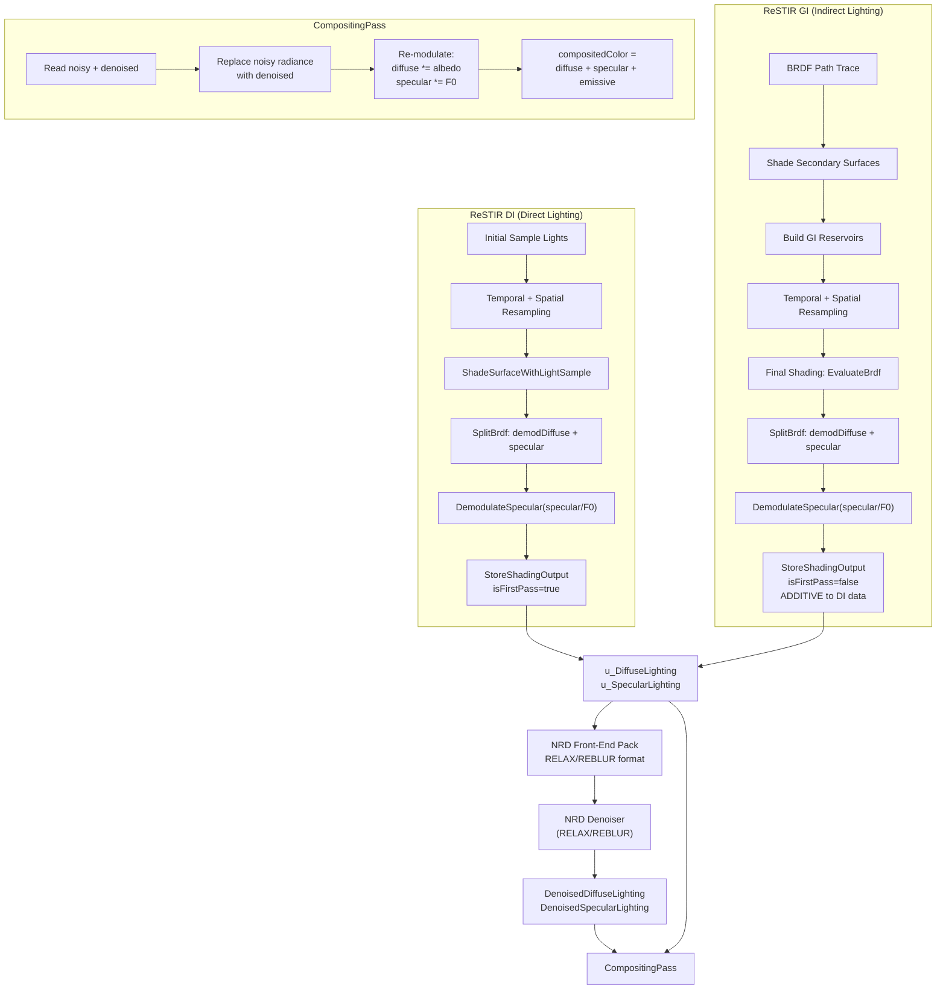
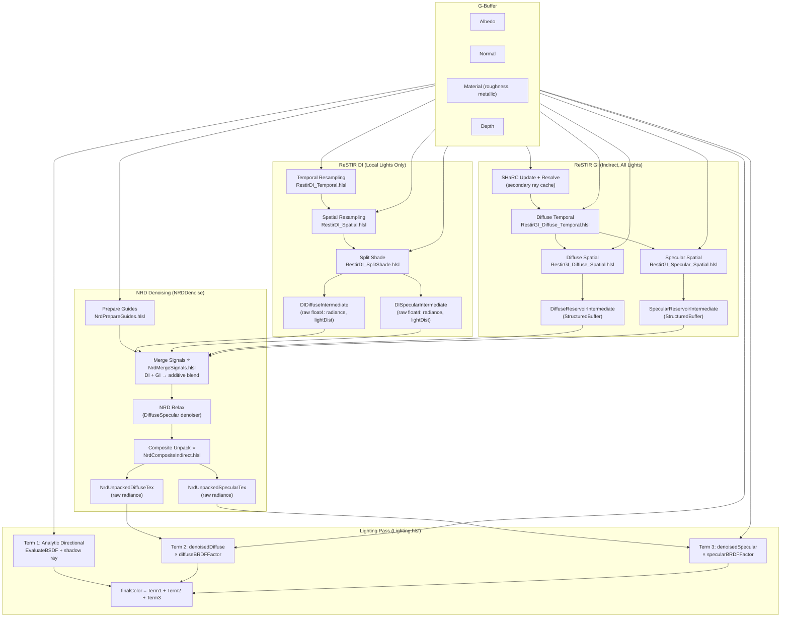

# RTXDI ReSTIR — Diffuse/Specular Split, NRD Feed, and Final Compositing

## 1. Overview: Render Pipeline Order

The high-level frame rendering order in the RTXDI FullSample is:

```
GBuffer → PrepareLights → PresampleLights
    → RenderDirectLighting   (ReSTIR DI)
    → RenderIndirectLighting (BRDF Path Trace / ReSTIR GI)
    → Denoiser (NRD: RELAX or REBLUR)
    → CompositingPass
    → AA / Post-process
```

Key insight: **ReSTIR DI runs first, indirect lighting runs second**, and they both write into the **same** `DiffuseLighting` / `SpecularLighting` textures — with the second pass blending **additively** into the first.

---

## 2. The `SplitBrdf` Structure

Defined in [`ShadingHelpers.hlsli`](d:/RTXDI/Samples/FullSample/Shaders/LightingPasses/ShadingHelpers.hlsli):

```hlsl
struct SplitBrdf
{
    float  demodulatedDiffuse;   // Lambert NdotL (no albedo)
    float3 specular;             // GGX * NdotL * Fresnel
};
```

The BRDF evaluation function used by both ReSTIR DI and GI is:

- **`EvaluateBrdf(surface, samplePosition)`** — computes L from surface-to-sample direction, returns a `SplitBrdf` with the diffuse and specular components separated.

---

## 3. Reservoir Structures

RTXDI uses separate reservoir types for direct and indirect lighting. Both follow the weighted reservoir sampling (WRS) model from the ReSTIR paper: new samples are streamed in, combined from neighbors, and finalized with a normalization step.

### 3.1 `RTXDI_DIReservoir` — Direct Lighting Reservoir

Defined in [`DI/Reservoir.hlsli`](d:/RTXDI/Libraries/Rtxdi/Include/Rtxdi/DI/Reservoir.hlsli):

```hlsl
struct RTXDI_DIReservoir
{
    uint   lightData;          // Light index (bits 0..30) + validity bit (31)
    uint   uvData;             // Sample UV (16.16 fixed point on the light source)
    float  weightSum;          // RIS weight sum (streaming) → inv PDF (after finalize)
    float  targetPdf;          // Target PDF of the selected sample
    float  M;                  // Number of samples considered (can be fractional for pairwise MIS)
    uint   packedVisibility;   // Per-channel visibility packed into 6+6+6 bits
    int2   spatialDistance;    // Screen-distance from visibility origin (minus motion)
    uint   age;                // Frames since visibility was generated
    float  canonicalWeight;    // For pairwise MIS computations
};
```

**Key fields explained:**

| Field | Role |
|-------|------|
| `lightData` | Encodes which light was picked (lower 31 bits) and whether the reservoir is valid (bit 31). `RTXDI_IsValidDIReservoir()` simply checks `lightData != 0`. |
| `uvData` | Where on the light source the sample landed. Recovered as `float2(sampleUV)` via `RTXDI_GetDIReservoirSampleUV()`. |
| `weightSum` | During streaming/resampling: the running RIS weight sum Σ w_i. After `RTXDI_FinalizeResampling()`: the inverse PDF `1/(p̂·M)`, used as `RTXDI_GetDIReservoirInvPdf()` during shading. |
| `targetPdf` | The target function value p̂(x) for the selected sample. |
| `M` | Total number of candidates considered (integer for basic RIS, float for pairwise MIS). |
| `packedVisibility` | Three 6-bit channels encoding RGB visibility (each 0–63 → 0.0–1.0). Stored for reuse across frames to reduce shadow rays. |
| `spatialDistance` | Pixel offset from where visibility was evaluated. Used with `age` and `maxDistance` to decide if visibility reuse is valid. |
| `age` | How many frames old the visibility data is. Together with `maxAge`, controls visibility reuse lifetime. |

**Packed form** (`RTXDI_PackedDIReservoir`, 24 bytes):
```hlsl
struct RTXDI_PackedDIReservoir
{
    uint32_t lightData;
    uint32_t uvData;
    uint32_t mVisibility;     // Packed: M (14 bits) + 3×6-bit visibility
    uint32_t distanceAge;     // Packed: spatialDistance + age
    float    targetPdf;
    float    weight;
};
```

**Core operations:**
- `RTXDI_StreamSample()` — Algorithm 3: stream a raw light sample into the reservoir via WRS
- `RTXDI_CombineDIReservoirs()` — Algorithm 4: merge another reservoir's stream (used for spatial/temporal reuse after applying Jacobian)
- `RTXDI_FinalizeResampling()` — Equation 6: normalize weight sum to produce the final inv PDF
- `RTXDI_GetDIReservoirVisibility()` — Try to reuse cached visibility from a prior frame

### 3.2 `RTXDI_GIReservoir` — Indirect Lighting Reservoir

Defined in [`GI/Reservoir.hlsli`](d:/RTXDI/Libraries/Rtxdi/Include/Rtxdi/GI/Reservoir.hlsli):

```hlsl
struct RTXDI_GIReservoir
{
    float3 position;    // World-space position of the secondary (2nd bounce) surface
    float3 normal;      // Shading normal at the secondary surface
    float3 radiance;    // Incoming radiance from the secondary surface
    float  weightSum;   // RIS weight sum (streaming) → inv PDF (after finalize)
    uint   M;           // Number of samples considered
    uint   age;         // Number of frames the sample has survived
};
```

**Key differences from DI reservoir:**

| Aspect | `RTXDI_DIReservoir` | `RTXDI_GIReservoir` |
|--------|---------------------|----------------------|
| **What is sampled** | Light source identity (index + UV) | Secondary surface (world position + normal) |
| **Sample payload** | `lightData` + `uvData` | `position` + `normal` + `radiance` |
| **Target function** | p̂(light) → `targetPdf` | Not stored separately; derived from target PDF of the secondary surface |
| **Visibility reuse** | Yes — `packedVisibility` + `spatialDistance` + `age` | No — GI does not cache visibility |
| **Pairwise MIS** | Yes — `canonicalWeight` | No |
| **Creation** | `RTXDI_StreamSample()` | `RTXDI_MakeGIReservoir(pos, normal, radiance, pdf)` |
| **Combining** | `RTXDI_CombineDIReservoirs()` | `RTXDI_CombineGIReservoirs()` |
| **Normalization** | `RTXDI_FinalizeResampling()` | `RTXDI_FinalizeGIResampling()` |
| **Validation** | `lightData != 0` | `M != 0` |

**Packed form** (`RTXDI_PackedGIReservoir`, 32 bytes):
```hlsl
struct RTXDI_PackedGIReservoir
{
    float3   position;
    uint32_t packed_miscData_age_M;  // misc flags (16b) + age (8b) + M (8b)
    uint32_t packed_radiance;        // LogLUV encoded
    float    weight;
    uint32_t packed_normal;          // Octahedral snorm2x16
    float    unused;
};
```

**Core operations:**
- `RTXDI_MakeGIReservoir(pos, normal, radiance, pdf)` — Create from a raw secondary-surface hit
- `RTXDI_CombineGIReservoirs()` — Merge another GI reservoir's stream (spatial/temporal reuse)
- `RTXDI_FinalizeGIResampling()` — Normalize the weight sum
- `RTXDI_IsValidGIReservoir()` — Check `M != 0`

### 3.3 Reservoir Lifecycle

Both reservoir types follow the same RIS lifecycle:

```
 1. INITIAL SAMPLE     ──►  MakeReservoir / StreamSample
                             weightSum = 1/pdf, M = 1

 2. STREAMING / MERGE   ──►  CombineReservoirs (temporal, spatial)
                             M += neighbor.M
                             weightSum accumulates risWeights

 3. FINALIZE            ──►  FinalizeResampling
                             weightSum becomes invPdf = (Σw · num) / (p̂ · denom)

 4. SHADE               ──►  Read invPdf from weightSum
                             Compute radiance = reservoir.radiance * weightSum (GI)
                             or scale by invPdf / solidAnglePdf (DI)
```

The `weightSum` field is **overloaded**: during steps 1–2 it stores the running RIS weight sum, and after step 3 it becomes the inverse PDF used for shading.

---

## 4. ReSTIR DI — Direct Lighting

### 4.1 Shading Path

For each pixel, ReSTIR DI:

1. Load a `RTXDI_DIReservoir` (result of initial sampling + temporal + spatial resampling)
2. Call `ShadeSurfaceWithLightSample()` → which internally calls `EvaluateBrdf()`:

```hlsl
SplitBrdf brdf = EvaluateBrdf(surface, lightSample.position);
diffuse  = brdf.demodulatedDiffuse * lightSample.radiance;   // demodulated diffuse radiance
specular = brdf.specular * lightSample.radiance;             // full specular radiance
```

3. **Demodulate specular** — divide by `specularF0`:

```hlsl
specular = DemodulateSpecular(surface.material.specularF0, specular);
// DemodulateSpecular(x, y) = y / max(0.01, x)
```

This is the "material demodulation" required by NRD: specular is stored as radiance/`specularF0` so NRD works on pure radiance.

4. Call `StoreShadingOutput()` with `isFirstPass = true`.

### 4.2 Key Files

| Shader | Purpose |
|--------|---------|
| `DI/GenerateInitialSamples.hlsl` | Initial light sampling |
| `DI/TemporalResampling.hlsl` | Temporal reuse |
| `DI/SpatialResampling.hlsl` | Spatial reuse |
| `DI/FusedResampling.hlsl` | Fused spatiotemporal + shading |
| `DI/ShadeSamples.hlsl` | Separate final shading pass |
| [`ShadingHelpers.hlsli`](d:/RTXDI/Samples/FullSample/Shaders/LightingPasses/ShadingHelpers.hlsli) | `ShadeSurfaceWithLightSample()`, `EvaluateBrdf()`, `StoreShadingOutput()` |

---

## 5. ReSTIR GI — Indirect Lighting (Global Illumination)

### 5.1 Pipeline

1. **BRDF Path Tracing** (`BrdfRayTracing.hlsl`) — trace one BRDF ray per pixel from G-buffer surfaces
2. **Shade Secondary Surfaces** (`ShadeSecondarySurfaces.hlsl`) — shade the hit points, optionally apply ReSTIR DI to them, and build initial GI reservoirs
3. **Temporal Resampling** (`GI/TemporalResampling.hlsl`) — reuse GI reservoirs across frames
4. **Spatial Resampling** (`GI/SpatialResampling.hlsl`) — reuse GI reservoirs spatially
5. **Final Shading** (`GI/FinalShading.hlsl`) — evaluate the final BRDF and output

### 5.2 Final Shading — Diffuse / Specular Split

In [`GI/FinalShading.hlsl`](d:/RTXDI/Samples/FullSample/Shaders/LightingPasses/GI/FinalShading.hlsl):

```hlsl
const RTXDI_GIReservoir reservoir = RTXDI_LoadGIReservoir(...);

float3 diffuse  = 0;
float3 specular = 0;

if (RTXDI_IsValidGIReservoir(reservoir))
{
    float3 radiance = reservoir.radiance * reservoir.weightSum;  // weighted radiance

    // Optional final visibility trace
    radiance *= visibility;

    // Evaluate BRDF toward the GI sample position
    const SplitBrdf brdf = EvaluateBrdf(primarySurface, reservoir.position);

    if (enableFinalMIS)
    {
        // MIS blend between ReSTIR result and initial sample
        // for rough surfaces, prefer ReSTIR; for shiny surfaces, prefer initial sample
        diffuse  = brdf.demodulatedDiffuse * radiance * finalWeight
                 + brdf0.demodulatedDiffuse * initialRadiance * initialWeight;
        specular = brdf.specular * radiance * finalWeight
                 + brdf0.specular * initialRadiance * initialWeight;
    }
    else
    {
        diffuse  = brdf.demodulatedDiffuse * radiance;
        specular = brdf.specular * radiance;
    }

    // Demodulate specular
    specular = DemodulateSpecular(primarySurface.material.specularF0, specular);
}

// isFirstPass=false → additive blend with prior data (ReSTIR DI)
StoreShadingOutput(GlobalIndex, pixelPosition,
    viewDepth, roughness, diffuse, specular, lightDistance=0, isFirstPass=false, isLastPass=true);
```

**Key point**: `isFirstPass=false` means GI output is **added** to whatever ReSTIR DI already wrote. This is how direct + indirect lighting are combined **before** denoising.

### 5.3 MIS (Multiple Importance Sampling) Detail

ReSTIR GI uses a clever MIS scheme:
- `kMISRoughness = 0.3` — threshold roughness
- A "roughened" surface version forces roughness ≥ 0.3
- `GetMISWeight()` compares rough BRDF vs true BRDF → prefers initial sample on shiny surfaces, ReSTIR result on rough surfaces
- This avoids ReSTIR's poor specular performance on low-roughness surfaces

---

## 6. `StoreShadingOutput` — Multi-Pass Blend & NRD Packing

This is the **central function** that handles both multi-pass additive blending and NRD front-end packing. Defined in [`ShadingHelpers.hlsli`](d:/RTXDI/Samples/FullSample/Shaders/LightingPasses/ShadingHelpers.hlsli).

```hlsl
void StoreShadingOutput(..., float lightDistance, bool isFirstPass, bool isLastPass)
{
    // If not first pass, additively blend with prior data
    if (!isFirstPass) {
        float4 priorDiffuse = u_DiffuseLighting[pos];
        float4 priorSpecular = u_SpecularLighting[pos];

        // hitT selection: use prior hitT if this lobe is less luminous
        if (luminance(diffuse)  > luminance(priorDiffuse.rgb)  || lightDistance==0)  diffuseHitT  = priorDiffuse.w;
        if (luminance(specular) > luminance(priorSpecular.rgb) || lightDistance==0)  specularHitT = priorSpecular.w;

        diffuse  += priorDiffuse.rgb;   // additive blend
        specular += priorSpecular.rgb;
    }

    // Checkerboard handling when denoiser is off ...

    // NRD front-end packing (only on last pass)
    if (denoiserMode == RELAX) {
        u_DiffuseLighting[pos]  = RELAX_FrontEnd_PackRadianceAndHitDist(diffuse,  diffuseHitT,  sanitize);
        u_SpecularLighting[pos] = RELAX_FrontEnd_PackRadianceAndHitDist(specular, specularHitT, sanitize);
    } else { // REBLUR
        u_DiffuseLighting[pos]  = REBLUR_FrontEnd_PackRadianceAndNormHitDist(diffuse,  diffNormDist,  sanitize);
        u_SpecularLighting[pos] = REBLUR_FrontEnd_PackRadianceAndNormHitDist(specular, specNormDist,  sanitize);
    }
}
```

### hitT Selection Strategy

The hitT selection is crucial for NRD:
- Uses the hit distance from the **more luminous** lobe
- When GI follows DI (isFirstPass=false), GI's lightDistance=0, so DI's hitT is preserved
- This means NRD gets hit distances from direct lighting for both lobes, which is generally better quality


---

## 7. NRD (RELAX / REBLUR) Integration

### 7.1 Texture Mapping

The NrdIntegration maps RTXDI textures to NRD resources ([`NrdIntegration.cpp`](d:/RTXDI/Samples/FullSample/Source/RenderPasses/DenoisingPasses/NrdIntegration.cpp)):

| NRD Resource | RTXDI Texture | Contents |
|-------------|---------------|----------|
| `IN_DIFF_RADIANCE_HITDIST` | `DiffuseLighting` | Packed diffuse radiance + hitT |
| `IN_SPEC_RADIANCE_HITDIST` | `SpecularLighting` | Packed specular radiance + hitT |
| `IN_NORMAL_ROUGHNESS` | `NormalRoughness` | World normal + roughness |
| `IN_VIEWZ` | `Depth` | Linear view-space depth |
| `IN_MV` | `MotionVectors` | Motion vectors |
| `IN_DIFF_CONFIDENCE` | `DiffuseConfidence` | Gradient-based confidence |
| `IN_SPEC_CONFIDENCE` | `SpecularConfidence` | Gradient-based confidence |
| `OUT_DIFF_RADIANCE_HITDIST` | `DenoisedDiffuseLighting` | Denoised output |
| `OUT_SPEC_RADIANCE_HITDIST` | `DenoisedSpecularLighting` | Denoised output |

### 7.2 RELAX Pipeline (GPU-side)

From [`Relax.cpp`](d:/RTXDI/External/NRD/Source/Relax.cpp):
```
CLASSIFY_TILES → HITDIST_RECONSTRUCTION → PREPASS → TEMPORAL_ACCUMULATION
    → HISTORY_FIX → HISTORY_CLAMPING → COPY → ANTI_FIREFLY → ATROUS → SPLIT_SCREEN
```

### 7.3 Checkerboard Mode

When checkerboard rendering is active:
- Noisy inputs (`DiffuseLighting`/`SpecularLighting`) are packed at half horizontal resolution
- NRD's checkerboard mode clips the viewport to the active field
- The compositing pass expands back: `illuminationPos.x /= 2`

---

## 8. CompositingPass — Final Merge

In [`CompositingPass.hlsl`](d:/RTXDI/Samples/FullSample/Shaders/CompositingPass.hlsl):

```hlsl
// 1. Read G-buffer materials
float3 diffuseAlbedo = ...;
float3 specularF0    = ...;

// 2. Read noisy (pre-denoise) illumination
float4 diffuse_illum  = t_Diffuse[pos];   // demodulated diffuse radiance
float4 specular_illum = t_Specular[pos];  // demodulated specular radiance

// 3. If denoising: read denoised output and replace noisy radiance
if (denoiserMode != OFF) {
    float4 denoised_diffuse  = t_DenoisedDiffuse[pos];
    float4 denoised_specular = t_DenoisedSpecular[pos];

    // REBLUR unpacking ...
    diffuse_illum.rgb  = denoised_diffuse.rgb;
    specular_illum.rgb = denoised_specular.rgb;
}

// 4. Re-modulate (apply material)
diffuse_illum.rgb  *= diffuseAlbedo;
specular_illum.rgb *= max(0.01, specularF0);

// 5. Final composite
compositedColor = diffuse_illum.rgb + specular_illum.rgb + emissive.rgb;
```

This is the **material remodulation** step — the reverse of the demodulation done before NRD.

---

## 9. Complete Data Flow Diagram



---

## 10. Summary: Key Design Decisions

| Aspect | Design |
|--------|--------|
| **Diffuse/Specular split** | **Always split** at the primary hit. `SplitBrdf` with `demodulatedDiffuse` (Lambert) and `specular` (GGX×Fresnel×NdotL). |
| **Material demodulation** | Diffuse is stored as Lambert radiance (without albedo). Specular is stored as `radiance / specularF0`. Materials are re-applied in compositing. |
| **Multi-pass blending** | DI runs first (isFirstPass=true). GI runs second (isFirstPass=false), **additively** blending into the same textures. |
| **hitT selection** | The more luminous lobe's hitT is preserved. GI contributes zero hitT so DI's hitT is used. |
| **NRD feed** | Two separate NRD input channels: `IN_DIFF_RADIANCE_HITDIST` and `IN_SPEC_RADIANCE_HITDIST`. Packed via `RELAX_FrontEnd_PackRadianceAndHitDist` or `REBLUR_FrontEnd_PackRadianceAndNormHitDist`. |
| **NRD output** | Two separate NRD output channels. The compositing pass replaces noisy radiance with denoised radiance, then re-modulates. |
| **Confidence** | Gradient-based confidence from ReSTIR DI luminance gradients, fed as `IN_DIFF_CONFIDENCE` / `IN_SPEC_CONFIDENCE`. |
| **Checkerboard** | Input textures packed at half-width; NRD handles checkerboard internally; compositing expands back to full width. |

---

## 11. TortureRed Implementation — ReSTIR DI/GI Diffuse-Specular Pipeline

This section documents the **actual implemented** ReSTIR DI + GI diffuse/specular split in TortureRed, as built following the RTXDI pattern described in sections 2–10.

### 11.1 Render Pipeline Order

From [`Application::Render()`](d:/TortureRed/Sources/Application.cpp):

```
1. Depth Pre-Pass
2. G-Buffer Pass (albedo, normal, material, depth)
3. DispatchRestirGI           ← ReSTIR GI + SHaRC + NRD trigger
4. DispatchRestirDI           ← ReSTIR DI (local lights) + NRD trigger (if GI disabled)
5. Lighting Pass              ← fullscreen triangle: analytic dir light + denoised DI/GI
6. TAA (if enabled)
7. Transparency Pass
```

**NRD denoising trigger logic:**

| Condition | Who triggers NRD |
|-----------|-----------------|
| Both DI + GI enabled | `DispatchRestirGI` calls `NRDDenoise()` after GI resampling, using merge pass |
| GI only | `DispatchRestirGI` calls `NRDDenoise()`, using legacy `NrdPackSignals` |
| DI only | `DispatchRestirDI` calls `NRDDenoise()` after split shade, using merge pass (GI contributes zero) |
| Neither | NRD not run; GI resolves via `RestirGI_Split_Resolve` to `RasterIndirectLightingTex`; DI shaded to `DIOutputTex` |

### 11.2 Light Source Breakdown

| Source | Handled by | Goes through |
|--------|-----------|-------------|
| **Main directional light** (index 0) | `Lighting.hlsl` — analytic `EvaluateBSDF(N, V, L)` with ray-traced shadow ray | Nothing — stays in lighting pass **only** |
| **Local lights** (index 1+) | `RestirDI_SplitShade.hlsl` — ReSTIR DI → diffuse/specular intermediates → merge → NRD | Full ReSTIR + NRD pipeline |
| **Indirect (all lights)** | `RestirGI_Diffuse_*` / `RestirGI_Specular_*` — already split diffuse/specular → merge → NRD | Full ReSTIR + NRD pipeline |

### 11.3 Implemented Shaders and Their Roles

#### DI Pipeline

| Shader | File | Role |
|--------|------|------|
| **DI Temporal** | [`RestirDI_Temporal.hlsl`](d:/TortureRed/Sources/Shaders/RestirDI_Temporal.hlsl) | Combined initial sample + temporal resampling → `DIReservoirBuffer[curr]` |
| **DI Spatial** | [`RestirDI_Spatial.hlsl`](d:/TortureRed/Sources/Shaders/RestirDI_Spatial.hlsl) | Spatial resampling → `DIReservoirIntermediate` |
| **DI Shade** (legacy) | [`RestirDI_Shade.hlsl`](d:/TortureRed/Sources/Shaders/RestirDI_Shade.hlsl) | Combined BSDF × radiance → `DIOutputTex` (used when NRD off) |
| **DI Split Shade** ⭐ | [`RestirDI_SplitShade.hlsl`](d:/TortureRed/Sources/Shaders/RestirDI_SplitShade.hlsl) | Per-lobe BSDF × radiance ÷ `NRD_MaterialFactors`, writes `DIDiffuseIntermediate` + `DISpecularIntermediate` |

#### GI Pipeline

| Shader | File | Role |
|--------|------|------|
| **SHaRC Update** | [`SHaRC_Update.hlsl`](d:/TortureRed/Sources/Shaders/SHaRC_Update.hlsl) | 5×5 downsampled secondary ray trace → hash table accumulation |
| **SHaRC Resolve** | [`SHaRC_Resolve.hlsl`](d:/TortureRed/Sources/Shaders/SHaRC_Resolve.hlsl) | EMA blend accumulation → resolved radiance cache |
| **Diffuse Temporal** | [`RestirGI_Diffuse_Temporal.hlsl`](d:/TortureRed/Sources/Shaders/RestirGI_Diffuse_Temporal.hlsl) | Temporal ReSTIR + SHaRC query + BSDF (second-bounce DI from `DispatchRays`) |
| **Diffuse Spatial** | [`RestirGI_Diffuse_Spatial.hlsl`](d:/TortureRed/Sources/Shaders/RestirGI_Diffuse_Spatial.hlsl) | 3×3 spatial reuse → `DiffuseReservoirIntermediate` |
| **Specular Temporal** | [`RestirGI_Specular_Temporal.hlsl`](d:/TortureRed/Sources/Shaders/RestirGI_Specular_Temporal.hlsl) | Temporal ReSTIR for specular lobe |
| **Specular Spatial** | [`RestirGI_Specular_Spatial.hlsl`](d:/TortureRed/Sources/Shaders/RestirGI_Specular_Spatial.hlsl) | 3×3 spatial reuse → `SpecularReservoirIntermediate` |
| **Split Resolve** (no NRD) | [`RestirGI_Split_Resolve.hlsl`](d:/TortureRed/Sources/Shaders/RestirGI_Split_Resolve.hlsl) | Resolve diffuse+specular reservoirs → `RasterIndirectLightingTex` |

#### NRD Pipeline

| Shader | File | Role |
|--------|------|------|
| **Prepare Guides** | [`NrdPrepareGuides.hlsl`](d:/TortureRed/Sources/Shaders/NrdPrepareGuides.hlsl) | Motion vectors, normal+roughness, viewZ |
| **Merge Signals** ⭐ | [`NrdMergeSignals.hlsl`](d:/TortureRed/Sources/Shaders/NrdMergeSignals.hlsl) | DI intermediates (raw float4) + GI reservoirs (evaluated per-lobe) → additive blend → RELAX-packed `NrdNoisyDiffuseTex` / `NrdNoisySpecularTex` |
| **Pack Signals** (legacy) | [`NrdPackRasterIndirect.hlsl`](d:/TortureRed/Sources/Shaders/NrdPackRasterIndirect.hlsl) | GI-only: GI reservoirs → RELAX-packed (used when `enableRestirDI==0`) |
| **NRD Relax** | NRD SDK | Denoise `IN_DIFF_RADIANCE_HITDIST` + `IN_SPEC_RADIANCE_HITDIST` |
| **Composite** ⭐ | [`NrdCompositeIndirect.hlsl`](d:/TortureRed/Sources/Shaders/NrdCompositeIndirect.hlsl) | Unpack NRD output → two raw radiance textures: `NrdUnpackedDiffuseTex` + `NrdUnpackedSpecularTex` |

⭐ = new/modified compared to pre-RTXDI-pattern TortureRed.

### 11.4 Key Design: The Merge Pass

[`NrdMergeSignals.hlsl`](d:/TortureRed/Sources/Shaders/NrdMergeSignals.hlsl) is the `StoreShadingOutput` equivalent. It reads:

| Input | Bindless Slot | Format | Source |
|-------|--------------|--------|--------|
| `DIDiffuseIntermediate` | `InputIdx0` | `Texture2D<float4>` raw `(normalizedDiffuseRadiance, lightDistance)` | `RestirDI_SplitShade` |
| `DISpecularIntermediate` | `InputIdx1` | `Texture2D<float4>` raw `(normalizedSpecularRadiance, lightDistance)` | `RestirDI_SplitShade` |
| `DiffuseReservoirIntermediate` | `InputIdx2` | `StructuredBuffer<Reservoir>` | `RestirGI_Diffuse_Spatial` |
| `SpecularReservoirIntermediate` | `OutputIdx2` (repurposed) | `StructuredBuffer<Reservoir>` | `RestirGI_Specular_Spatial` |

**Additive merge logic:**

```hlsl
// Step 1: DI base radiance + hitT (isFirstPass = true)
diffuseRadiance  = DIDiffuseIntermediate[pixel].rgb;
specularRadiance = DISpecularIntermediate[pixel].rgb;
diffuseHitT      = DIDiffuseIntermediate[pixel].a;   // light distance
specularHitT     = DISpecularIntermediate[pixel].a;

// Step 2: GI additive blend (isFirstPass = false)
if (rDiffuse.W > 0 && rDiffuse.firstBounceHitT > 0) {
    giDiffuse = diffuseBRDF * reservoir.radiance * W / diffuseFactor;
    if (luminance(giDiffuse) > luminance(diffuseRadiance))
        diffuseHitT = rDiffuse.firstBounceHitT;   // GI's hitT if brighter
    diffuseRadiance += giDiffuse;
}
// Same pattern for specular...

// Step 3: Pack for NRD Relax
NrdNoisyDiffuseTex[pixel]  = RELAX_FrontEnd_PackRadianceAndHitDist(diffuseRadiance,  diffuseHitT,  true);
NrdNoisySpecularTex[pixel] = RELAX_FrontEnd_PackRadianceAndHitDist(specularRadiance, specularHitT, true);
```

**hitT selection**: The brighter lobe's hitT is used. GI's `firstBounceHitT` is the path-traced distance to the secondary surface — typically longer and more variable than DI's light distance. When GI is dimmer, DI's crisp light-distance hitT is preserved, giving NRD better spatial hints.

### 11.5 Lighting Pass — Three-Term Final Composite

[`Lighting.hlsl`](d:/TortureRed/Sources/Shaders/Lighting.hlsl) composes the final lit color from three independent additive terms:

| Term | Source | Computation |
|------|--------|-------------|
| **mainDirTerm** | Sun/directional (index 0) | `EvaluateBSDF(N, V, L_main) * lightColor * intensity * NdotL * shadowFactor` — ray-traced shadow ray, no ReSTIR, no NRD |
| **denoisedDiffuseTerm** | DI local lights + GI indirect, unified NRD diffuse | `NrdUnpackedDiffuseTex.rgb * diffuseBRDFFactor` from `NRD_MaterialFactors()` |
| **denoisedSpecularTerm** | DI local lights + GI indirect, unified NRD specular | `NrdUnpackedSpecularTex.rgb * specularBRDFFactor` from `NRD_MaterialFactors()` |

**Actual code pattern:**

```hlsl
// Term 1: Main directional (analytic, ray-traced shadows)
EvaluateBSDF(N, V, L_main, albedo, metallic, roughness, diff_main, spec_main);
totalDirectLighting = (diff_main + spec_main) * mainLight.color * mainLight.intensity * NdotL * shadowFactor;

// Term 2+3: Denoised ReSTIR (DI local lights + GI indirect)
if (nrdActive) {
    denoisedDiffuse  = NrdUnpackedDiffuseTex.SampleLevel(...).rgb;
    denoisedSpecular = NrdUnpackedSpecularTex.SampleLevel(...).rgb;
    NRD_MaterialFactors(N, V, albedo, F0, roughness, diffuseFactor, specularFactor);
    denoisedDiffuseTerm  = denoisedDiffuse  * diffuseFactor;
    denoisedSpecularTerm = denoisedSpecular * specularFactor;

    finalColor += denoisedDiffuseTerm + denoisedSpecularTerm;
}
```

**Two code paths in Lighting.hlsl:**

| Path | Condition | Input textures | Behavior |
|------|-----------|---------------|----------|
| Unified NRD | `enableNrdRelax && (enableRestirDI || enableRasterIndirectGI)` | `NrdUnpackedDiffuseTex` + `NrdUnpackedSpecularTex` | Raw radiance × material factors |
| Legacy | No NRD, or NRD off | `RasterIndirectLightingTex` (modulated) or `DIOutputTex` (raw DI) | Pre-modulated or raw add |

### 11.6 Complete TortureRed Data Flow Diagram



### 11.7 Textures Summary

| Texture | Format | Produced by | Consumed by |
|---------|--------|-------------|-------------|
| `DIReservoirBuffer[2]` | `StructuredBuffer<DIRreservoir>` | DI Temporal (swap) | DI Spatial |
| `DIReservoirIntermediate` | `StructuredBuffer<DIRreservoir>` | DI Spatial | DI Split Shade, DI Shade (legacy) |
| `DIDiffuseIntermediate` | `R16G16B16A16_FLOAT` | DI Split Shade | NrdMergeSignals |
| `DISpecularIntermediate` | `R16G16B16A16_FLOAT` | DI Split Shade | NrdMergeSignals |
| `DIOutputTex` | `R16G16B16A16_FLOAT` | DI Shade (legacy) | Lighting.hlsl (no-NRD path) |
| `DiffuseReservoirBuffer[2]` | `StructuredBuffer<Reservoir>` | Diffuse Temporal (swap) | Diffuse Spatial |
| `SpecularReservoirBuffer[2]` | `StructuredBuffer<Reservoir>` | Specular Temporal/Resolve | Specular Spatial |
| `DiffuseReservoirIntermediate` | `StructuredBuffer<Reservoir>` | Diffuse Spatial | NrdMergeSignals / Split Resolve |
| `SpecularReservoirIntermediate` | `StructuredBuffer<Reservoir>` | Specular Spatial | NrdMergeSignals / Split Resolve |
| `NrdMotionVectorsTex` | `R16G16_FLOAT` | NrdPrepareGuides | NRD Relax |
| `NrdNormalRoughnessTex` | `R10G10B10A2_UNORM` | NrdPrepareGuides | NRD Relax |
| `NrdViewZTex` | `R32_FLOAT` | NrdPrepareGuides | NRD Relax |
| `NrdNoisyDiffuseTex` | `R16G16B16A16_FLOAT` | NrdMergeSignals / NrdPackSignals | NRD Relax |
| `NrdNoisySpecularTex` | `R16G16B16A16_FLOAT` | NrdMergeSignals / NrdPackSignals | NRD Relax |
| `NrdDenoisedDiffuseTex` | `R16G16B16A16_FLOAT` | NRD Relax | NrdCompositeIndirect |
| `NrdDenoisedSpecularTex` | `R16G16B16A16_FLOAT` | NRD Relax | NrdCompositeIndirect |
| `NrdUnpackedDiffuseTex` | `R16G16B16A16_FLOAT` | NrdCompositeIndirect | Lighting.hlsl |
| `NrdUnpackedSpecularTex` | `R16G16B16A16_FLOAT` | NrdCompositeIndirect | Lighting.hlsl |
| `RasterIndirectLightingTex` | `R16G16B16A16_FLOAT` | Split Resolve (no-NRD) | Lighting.hlsl (legacy) |

### 11.8 Key Differences from RTXDI

| Aspect | RTXDI FullSample | TortureRed |
|--------|-----------------|-----------|
| **DI sample payload** | Light index + UV (`RTXDI_DIReservoir`) | Light index + hit position (custom `DIRreservoir`) |
| **DI sampling** | `RTXDI_StreamSample` / `RTXDI_CombineDIReservoirs` (RIS) | Custom RIS implementation |
| **DI visibility** | Reused across frames (`packedVisibility`, `age`) | Fresh shadow ray per frame (simpler, higher quality) |
| **GI radiance source** | Second-bounce surface (path traced) | SHaRC radiance cache (probe-based interpolation) |
| **GI reservoir type** | `RTXDI_GIReservoir` (position + normal + radiance) | Custom `Reservoir` struct (hitPos + radiance + W + firstBounceHitT) |
| **NRD format** | RELAX or REBLUR (selectable) | RELAX only |
| **Confidence inputs** | Gradient-based `DiffuseConfidence` / `SpecularConfidence` | Not used (RELAX operates without explicit confidence) |
| **Checkerboard** | Half-width interleaved rendering | Not implemented |
| **PSR** | Primary Surface Replacement for mirrors | Not implemented |
| **MIS (GI)** | Roughened BRDF MIS for low-roughness surfaces | Not implemented |
| **Main directional** | Sampled via ReSTIR DI with all other lights | Excluded from ReSTIR, shaded analytically |
