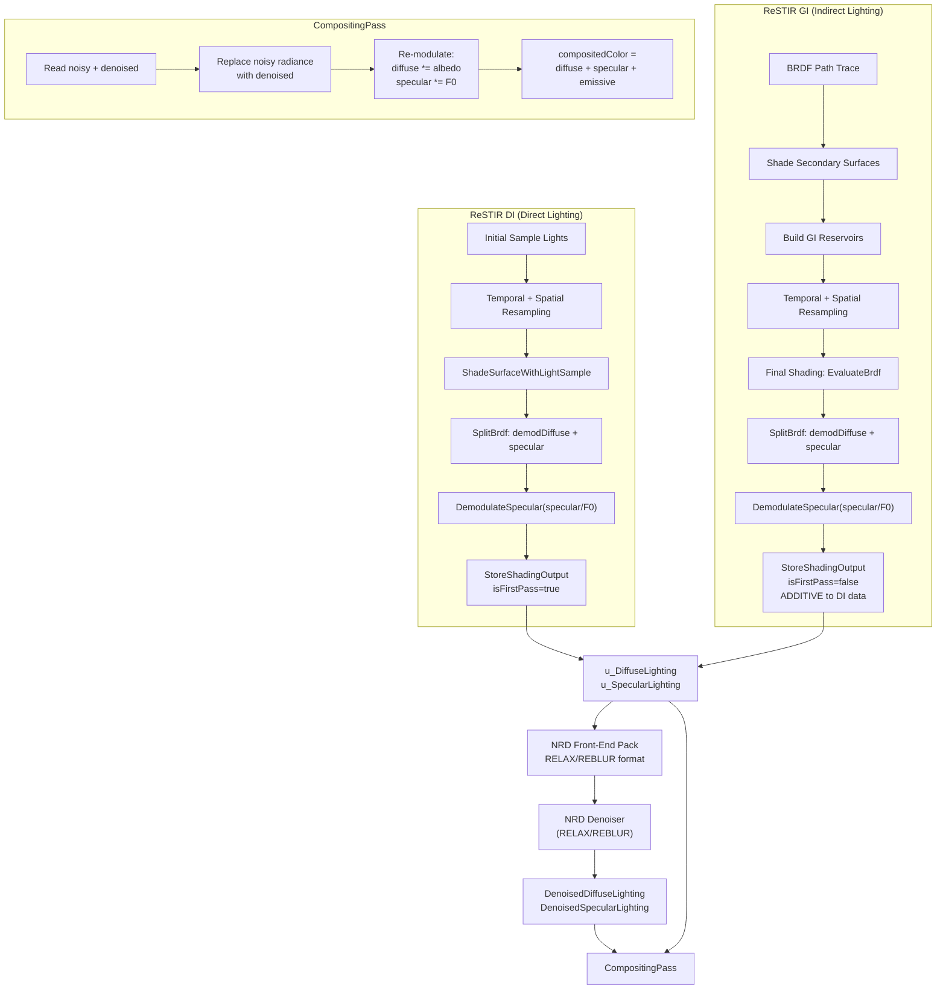

# RTXDI ReSTIR — Diffuse/Specular Split, NRD Feed, and Final Compositing

## 1. Overview: Render Pipeline Order

The high-level frame rendering order in the RTXDI FullSample is:

```
GBuffer → PrepareLights → PresampleLights
    → RenderDirectLighting   (ReSTIR DI)
    → RenderIndirectLighting (BRDF Path Trace / ReSTIR GI)
    → Denoiser (NRD: RELAX or REBLUR)
    → CompositingPass
    → AA / Post-process
```

Key insight: **ReSTIR DI runs first, indirect lighting runs second**, and they both write into the **same** `DiffuseLighting` / `SpecularLighting` textures — with the second pass blending **additively** into the first.

---

## 2. The `SplitBrdf` Structure

Defined in [`ShadingHelpers.hlsli`](d:/RTXDI/Samples/FullSample/Shaders/LightingPasses/ShadingHelpers.hlsli):

```hlsl
struct SplitBrdf
{
    float  demodulatedDiffuse;   // Lambert NdotL (no albedo)
    float3 specular;             // GGX * NdotL * Fresnel
};
```

The BRDF evaluation function used by both ReSTIR DI and GI is:

- **`EvaluateBrdf(surface, samplePosition)`** — computes L from surface-to-sample direction, returns a `SplitBrdf` with the diffuse and specular components separated.

---

## 3. Reservoir Structures

RTXDI uses separate reservoir types for direct and indirect lighting. Both follow the weighted reservoir sampling (WRS) model from the ReSTIR paper: new samples are streamed in, combined from neighbors, and finalized with a normalization step.

### 3.1 `RTXDI_DIReservoir` — Direct Lighting Reservoir

Defined in [`DI/Reservoir.hlsli`](d:/RTXDI/Libraries/Rtxdi/Include/Rtxdi/DI/Reservoir.hlsli):

```hlsl
struct RTXDI_DIReservoir
{
    uint   lightData;          // Light index (bits 0..30) + validity bit (31)
    uint   uvData;             // Sample UV (16.16 fixed point on the light source)
    float  weightSum;          // RIS weight sum (streaming) → inv PDF (after finalize)
    float  targetPdf;          // Target PDF of the selected sample
    float  M;                  // Number of samples considered (can be fractional for pairwise MIS)
    uint   packedVisibility;   // Per-channel visibility packed into 6+6+6 bits
    int2   spatialDistance;    // Screen-distance from visibility origin (minus motion)
    uint   age;                // Frames since visibility was generated
    float  canonicalWeight;    // For pairwise MIS computations
};
```

**Key fields explained:**

| Field | Role |
|-------|------|
| `lightData` | Encodes which light was picked (lower 31 bits) and whether the reservoir is valid (bit 31). `RTXDI_IsValidDIReservoir()` simply checks `lightData != 0`. |
| `uvData` | Where on the light source the sample landed. Recovered as `float2(sampleUV)` via `RTXDI_GetDIReservoirSampleUV()`. |
| `weightSum` | During streaming/resampling: the running RIS weight sum Σ w_i. After `RTXDI_FinalizeResampling()`: the inverse PDF `1/(p̂·M)`, used as `RTXDI_GetDIReservoirInvPdf()` during shading. |
| `targetPdf` | The target function value p̂(x) for the selected sample. |
| `M` | Total number of candidates considered (integer for basic RIS, float for pairwise MIS). |
| `packedVisibility` | Three 6-bit channels encoding RGB visibility (each 0–63 → 0.0–1.0). Stored for reuse across frames to reduce shadow rays. |
| `spatialDistance` | Pixel offset from where visibility was evaluated. Used with `age` and `maxDistance` to decide if visibility reuse is valid. |
| `age` | How many frames old the visibility data is. Together with `maxAge`, controls visibility reuse lifetime. |

**Packed form** (`RTXDI_PackedDIReservoir`, 24 bytes):
```hlsl
struct RTXDI_PackedDIReservoir
{
    uint32_t lightData;
    uint32_t uvData;
    uint32_t mVisibility;     // Packed: M (14 bits) + 3×6-bit visibility
    uint32_t distanceAge;     // Packed: spatialDistance + age
    float    targetPdf;
    float    weight;
};
```

**Core operations:**
- `RTXDI_StreamSample()` — Algorithm 3: stream a raw light sample into the reservoir via WRS
- `RTXDI_CombineDIReservoirs()` — Algorithm 4: merge another reservoir's stream (used for spatial/temporal reuse after applying Jacobian)
- `RTXDI_FinalizeResampling()` — Equation 6: normalize weight sum to produce the final inv PDF
- `RTXDI_GetDIReservoirVisibility()` — Try to reuse cached visibility from a prior frame

### 3.2 `RTXDI_GIReservoir` — Indirect Lighting Reservoir

Defined in [`GI/Reservoir.hlsli`](d:/RTXDI/Libraries/Rtxdi/Include/Rtxdi/GI/Reservoir.hlsli):

```hlsl
struct RTXDI_GIReservoir
{
    float3 position;    // World-space position of the secondary (2nd bounce) surface
    float3 normal;      // Shading normal at the secondary surface
    float3 radiance;    // Incoming radiance from the secondary surface
    float  weightSum;   // RIS weight sum (streaming) → inv PDF (after finalize)
    uint   M;           // Number of samples considered
    uint   age;         // Number of frames the sample has survived
};
```

**Key differences from DI reservoir:**

| Aspect | `RTXDI_DIReservoir` | `RTXDI_GIReservoir` |
|--------|---------------------|----------------------|
| **What is sampled** | Light source identity (index + UV) | Secondary surface (world position + normal) |
| **Sample payload** | `lightData` + `uvData` | `position` + `normal` + `radiance` |
| **Target function** | p̂(light) → `targetPdf` | Not stored separately; derived from target PDF of the secondary surface |
| **Visibility reuse** | Yes — `packedVisibility` + `spatialDistance` + `age` | No — GI does not cache visibility |
| **Pairwise MIS** | Yes — `canonicalWeight` | No |
| **Creation** | `RTXDI_StreamSample()` | `RTXDI_MakeGIReservoir(pos, normal, radiance, pdf)` |
| **Combining** | `RTXDI_CombineDIReservoirs()` | `RTXDI_CombineGIReservoirs()` |
| **Normalization** | `RTXDI_FinalizeResampling()` | `RTXDI_FinalizeGIResampling()` |
| **Validation** | `lightData != 0` | `M != 0` |

**Packed form** (`RTXDI_PackedGIReservoir`, 32 bytes):
```hlsl
struct RTXDI_PackedGIReservoir
{
    float3   position;
    uint32_t packed_miscData_age_M;  // misc flags (16b) + age (8b) + M (8b)
    uint32_t packed_radiance;        // LogLUV encoded
    float    weight;
    uint32_t packed_normal;          // Octahedral snorm2x16
    float    unused;
};
```

**Core operations:**
- `RTXDI_MakeGIReservoir(pos, normal, radiance, pdf)` — Create from a raw secondary-surface hit
- `RTXDI_CombineGIReservoirs()` — Merge another GI reservoir's stream (spatial/temporal reuse)
- `RTXDI_FinalizeGIResampling()` — Normalize the weight sum
- `RTXDI_IsValidGIReservoir()` — Check `M != 0`

### 3.3 Reservoir Lifecycle

Both reservoir types follow the same RIS lifecycle:

```
 1. INITIAL SAMPLE     ──►  MakeReservoir / StreamSample
                             weightSum = 1/pdf, M = 1

 2. STREAMING / MERGE   ──►  CombineReservoirs (temporal, spatial)
                             M += neighbor.M
                             weightSum accumulates risWeights

 3. FINALIZE            ──►  FinalizeResampling
                             weightSum becomes invPdf = (Σw · num) / (p̂ · denom)

 4. SHADE               ──►  Read invPdf from weightSum
                             Compute radiance = reservoir.radiance * weightSum (GI)
                             or scale by invPdf / solidAnglePdf (DI)
```

The `weightSum` field is **overloaded**: during steps 1–2 it stores the running RIS weight sum, and after step 3 it becomes the inverse PDF used for shading.

---

## 4. ReSTIR DI — Direct Lighting

### 4.1 Shading Path

For each pixel, ReSTIR DI:

1. Load a `RTXDI_DIReservoir` (result of initial sampling + temporal + spatial resampling)
2. Call `ShadeSurfaceWithLightSample()` → which internally calls `EvaluateBrdf()`:

```hlsl
SplitBrdf brdf = EvaluateBrdf(surface, lightSample.position);
diffuse  = brdf.demodulatedDiffuse * lightSample.radiance;   // demodulated diffuse radiance
specular = brdf.specular * lightSample.radiance;             // full specular radiance
```

3. **Demodulate specular** — divide by `specularF0`:

```hlsl
specular = DemodulateSpecular(surface.material.specularF0, specular);
// DemodulateSpecular(x, y) = y / max(0.01, x)
```

This is the "material demodulation" required by NRD: specular is stored as radiance/`specularF0` so NRD works on pure radiance.

4. Call `StoreShadingOutput()` with `isFirstPass = true`.

### 4.2 Key Files

| Shader | Purpose |
|--------|---------|
| `DI/GenerateInitialSamples.hlsl` | Initial light sampling |
| `DI/TemporalResampling.hlsl` | Temporal reuse |
| `DI/SpatialResampling.hlsl` | Spatial reuse |
| `DI/FusedResampling.hlsl` | Fused spatiotemporal + shading |
| `DI/ShadeSamples.hlsl` | Separate final shading pass |
| [`ShadingHelpers.hlsli`](d:/RTXDI/Samples/FullSample/Shaders/LightingPasses/ShadingHelpers.hlsli) | `ShadeSurfaceWithLightSample()`, `EvaluateBrdf()`, `StoreShadingOutput()` |

---

## 5. ReSTIR GI — Indirect Lighting (Global Illumination)

### 5.1 Pipeline

1. **BRDF Path Tracing** (`BrdfRayTracing.hlsl`) — trace one BRDF ray per pixel from G-buffer surfaces
2. **Shade Secondary Surfaces** (`ShadeSecondarySurfaces.hlsl`) — shade the hit points, optionally apply ReSTIR DI to them, and build initial GI reservoirs
3. **Temporal Resampling** (`GI/TemporalResampling.hlsl`) — reuse GI reservoirs across frames
4. **Spatial Resampling** (`GI/SpatialResampling.hlsl`) — reuse GI reservoirs spatially
5. **Final Shading** (`GI/FinalShading.hlsl`) — evaluate the final BRDF and output

### 5.2 Final Shading — Diffuse / Specular Split

In [`GI/FinalShading.hlsl`](d:/RTXDI/Samples/FullSample/Shaders/LightingPasses/GI/FinalShading.hlsl):

```hlsl
const RTXDI_GIReservoir reservoir = RTXDI_LoadGIReservoir(...);

float3 diffuse  = 0;
float3 specular = 0;

if (RTXDI_IsValidGIReservoir(reservoir))
{
    float3 radiance = reservoir.radiance * reservoir.weightSum;  // weighted radiance

    // Optional final visibility trace
    radiance *= visibility;

    // Evaluate BRDF toward the GI sample position
    const SplitBrdf brdf = EvaluateBrdf(primarySurface, reservoir.position);

    if (enableFinalMIS)
    {
        // MIS blend between ReSTIR result and initial sample
        // for rough surfaces, prefer ReSTIR; for shiny surfaces, prefer initial sample
        diffuse  = brdf.demodulatedDiffuse * radiance * finalWeight
                 + brdf0.demodulatedDiffuse * initialRadiance * initialWeight;
        specular = brdf.specular * radiance * finalWeight
                 + brdf0.specular * initialRadiance * initialWeight;
    }
    else
    {
        diffuse  = brdf.demodulatedDiffuse * radiance;
        specular = brdf.specular * radiance;
    }

    // Demodulate specular
    specular = DemodulateSpecular(primarySurface.material.specularF0, specular);
}

// isFirstPass=false → additive blend with prior data (ReSTIR DI)
StoreShadingOutput(GlobalIndex, pixelPosition,
    viewDepth, roughness, diffuse, specular, lightDistance=0, isFirstPass=false, isLastPass=true);
```

**Key point**: `isFirstPass=false` means GI output is **added** to whatever ReSTIR DI already wrote. This is how direct + indirect lighting are combined **before** denoising.

### 5.3 MIS (Multiple Importance Sampling) Detail

ReSTIR GI uses a clever MIS scheme:
- `kMISRoughness = 0.3` — threshold roughness
- A "roughened" surface version forces roughness ≥ 0.3
- `GetMISWeight()` compares rough BRDF vs true BRDF → prefers initial sample on shiny surfaces, ReSTIR result on rough surfaces
- This avoids ReSTIR's poor specular performance on low-roughness surfaces

---

## 6. `StoreShadingOutput` — Multi-Pass Blend & NRD Packing

This is the **central function** that handles both multi-pass additive blending and NRD front-end packing. Defined in [`ShadingHelpers.hlsli`](d:/RTXDI/Samples/FullSample/Shaders/LightingPasses/ShadingHelpers.hlsli).

```hlsl
void StoreShadingOutput(..., float lightDistance, bool isFirstPass, bool isLastPass)
{
    // If not first pass, additively blend with prior data
    if (!isFirstPass) {
        float4 priorDiffuse = u_DiffuseLighting[pos];
        float4 priorSpecular = u_SpecularLighting[pos];

        // hitT selection: use prior hitT if this lobe is less luminous
        if (luminance(diffuse)  > luminance(priorDiffuse.rgb)  || lightDistance==0)  diffuseHitT  = priorDiffuse.w;
        if (luminance(specular) > luminance(priorSpecular.rgb) || lightDistance==0)  specularHitT = priorSpecular.w;

        diffuse  += priorDiffuse.rgb;   // additive blend
        specular += priorSpecular.rgb;
    }

    // Checkerboard handling when denoiser is off ...

    // NRD front-end packing (only on last pass)
    if (denoiserMode == RELAX) {
        u_DiffuseLighting[pos]  = RELAX_FrontEnd_PackRadianceAndHitDist(diffuse,  diffuseHitT,  sanitize);
        u_SpecularLighting[pos] = RELAX_FrontEnd_PackRadianceAndHitDist(specular, specularHitT, sanitize);
    } else { // REBLUR
        u_DiffuseLighting[pos]  = REBLUR_FrontEnd_PackRadianceAndNormHitDist(diffuse,  diffNormDist,  sanitize);
        u_SpecularLighting[pos] = REBLUR_FrontEnd_PackRadianceAndNormHitDist(specular, specNormDist,  sanitize);
    }
}
```

### hitT Selection Strategy

The hitT selection is crucial for NRD:
- Uses the hit distance from the **more luminous** lobe
- When GI follows DI (isFirstPass=false), GI's lightDistance=0, so DI's hitT is preserved
- This means NRD gets hit distances from direct lighting for both lobes, which is generally better quality


---

## 7. NRD (RELAX / REBLUR) Integration

### 7.1 Texture Mapping

The NrdIntegration maps RTXDI textures to NRD resources ([`NrdIntegration.cpp`](d:/RTXDI/Samples/FullSample/Source/RenderPasses/DenoisingPasses/NrdIntegration.cpp)):

| NRD Resource | RTXDI Texture | Contents |
|-------------|---------------|----------|
| `IN_DIFF_RADIANCE_HITDIST` | `DiffuseLighting` | Packed diffuse radiance + hitT |
| `IN_SPEC_RADIANCE_HITDIST` | `SpecularLighting` | Packed specular radiance + hitT |
| `IN_NORMAL_ROUGHNESS` | `NormalRoughness` | World normal + roughness |
| `IN_VIEWZ` | `Depth` | Linear view-space depth |
| `IN_MV` | `MotionVectors` | Motion vectors |
| `IN_DIFF_CONFIDENCE` | `DiffuseConfidence` | Gradient-based confidence |
| `IN_SPEC_CONFIDENCE` | `SpecularConfidence` | Gradient-based confidence |
| `OUT_DIFF_RADIANCE_HITDIST` | `DenoisedDiffuseLighting` | Denoised output |
| `OUT_SPEC_RADIANCE_HITDIST` | `DenoisedSpecularLighting` | Denoised output |

### 7.2 RELAX Pipeline (GPU-side)

From [`Relax.cpp`](d:/RTXDI/External/NRD/Source/Relax.cpp):
```
CLASSIFY_TILES → HITDIST_RECONSTRUCTION → PREPASS → TEMPORAL_ACCUMULATION
    → HISTORY_FIX → HISTORY_CLAMPING → COPY → ANTI_FIREFLY → ATROUS → SPLIT_SCREEN
```

### 7.3 Checkerboard Mode

When checkerboard rendering is active:
- Noisy inputs (`DiffuseLighting`/`SpecularLighting`) are packed at half horizontal resolution
- NRD's checkerboard mode clips the viewport to the active field
- The compositing pass expands back: `illuminationPos.x /= 2`

---

## 8. CompositingPass — Final Merge

In [`CompositingPass.hlsl`](d:/RTXDI/Samples/FullSample/Shaders/CompositingPass.hlsl):

```hlsl
// 1. Read G-buffer materials
float3 diffuseAlbedo = ...;
float3 specularF0    = ...;

// 2. Read noisy (pre-denoise) illumination
float4 diffuse_illum  = t_Diffuse[pos];   // demodulated diffuse radiance
float4 specular_illum = t_Specular[pos];  // demodulated specular radiance

// 3. If denoising: read denoised output and replace noisy radiance
if (denoiserMode != OFF) {
    float4 denoised_diffuse  = t_DenoisedDiffuse[pos];
    float4 denoised_specular = t_DenoisedSpecular[pos];

    // REBLUR unpacking ...
    diffuse_illum.rgb  = denoised_diffuse.rgb;
    specular_illum.rgb = denoised_specular.rgb;
}

// 4. Re-modulate (apply material)
diffuse_illum.rgb  *= diffuseAlbedo;
specular_illum.rgb *= max(0.01, specularF0);

// 5. Final composite
compositedColor = diffuse_illum.rgb + specular_illum.rgb + emissive.rgb;
```

This is the **material remodulation** step — the reverse of the demodulation done before NRD.

---

## 9. Complete Data Flow Diagram



---

## 10. Summary: Key Design Decisions

| Aspect | Design |
|--------|--------|
| **Diffuse/Specular split** | **Always split** at the primary hit. `SplitBrdf` with `demodulatedDiffuse` (Lambert) and `specular` (GGX×Fresnel×NdotL). |
| **Material demodulation** | Diffuse is stored as Lambert radiance (without albedo). Specular is stored as `radiance / specularF0`. Materials are re-applied in compositing. |
| **Multi-pass blending** | DI runs first (isFirstPass=true). GI runs second (isFirstPass=false), **additively** blending into the same textures. |
| **hitT selection** | The more luminous lobe's hitT is preserved. GI contributes zero hitT so DI's hitT is used. |
| **NRD feed** | Two separate NRD input channels: `IN_DIFF_RADIANCE_HITDIST` and `IN_SPEC_RADIANCE_HITDIST`. Packed via `RELAX_FrontEnd_PackRadianceAndHitDist` or `REBLUR_FrontEnd_PackRadianceAndNormHitDist`. |
| **NRD output** | Two separate NRD output channels. The compositing pass replaces noisy radiance with denoised radiance, then re-modulates. |
| **Confidence** | Gradient-based confidence from ReSTIR DI luminance gradients, fed as `IN_DIFF_CONFIDENCE` / `IN_SPEC_CONFIDENCE`. |
| **Checkerboard** | Input textures packed at half-width; NRD handles checkerboard internally; compositing expands back to full width. |

---

## 11. Plan for TortureRed

This section outlines the concrete implementation plan for adopting RTXDI's diffuse/specular split + merged NRD feed pattern in TortureRed.

### 11.1 Current State vs Target State

**Light source breakdown:**

| Source | Current | Target |
|--------|---------|--------|
| **Main directional light** | Analytical + ReSTIR DI | **Analytical only** — computed in `Lighting.hlsl` via classic `ShadeSurface()`. Never goes through ReSTIR or NRD. |
| **Local lights (point/spot/etc.)** | ReSTIR DI (combined diffuse+specular) | ReSTIR DI split into **separate diffuse + specular** → merge → NRD |
| **Indirect (all lights)** | ReSTIR GI (already split diffuse+specular) | Unchanged — already split diffuse+specular → merge → NRD |

**Pipeline target state:**

| Aspect | Current TortureRed | Target |
|--------|-------------------|--------|
| **GI diffuse/specular** | Already split: `DiffuseReservoirIntermediate` + `SpecularReservoirIntermediate` | No structural change |
| **DI diffuse/specular** | Combined `(diff+spec) × BSDF` in `DIOutputTex.rgb` | **Split**: produce `DIDiffuseIntermediate` + `DISpecularIntermediate`, sampled from local lights only, BRDF-normalized |
| **Merge pass** | No merge — DI and GI write separate textures | **New `NrdMergeSignals`**: DI+GI diffuse → `NrdNoisyDiffuseTex`, DI+GI specular → `NrdNoisySpecularTex` |
| **NRD** | GI-only; 4 sub-passes | **Unified**: same pipeline, but noisy inputs now contain merged DI+GI |
| **NRD output** | `NrdCompositeIndirect` → single `RasterIndirectLightingTex` | `NrdCompositeIndirect` → **two** outputs: `NrdDenoisedDiffuseRadiance` + `NrdDenoisedSpecularRadiance` (raw radiance, not modulated) |
| **Lighting pass** | `mainLight + localLights + DIOutputTex` + `RasterIndirectLightingTex` | `mainLight * BSDF` + `denoisedDiffuse * diffuseBRDF` + `denoisedSpecular * specularBRDF` |

### 11.2 Step 1 — Split DI Diffuse/Specular (Local Lights Only)

**Goal**: Modify ReSTIR DI shading to output two textures instead of one. DI samples **local lights only** (point, spot, area lights) — the main directional/sun light is excluded from the ReSTIR DI light pool and will be shaded analytically in the lighting pass.

**Current** (`RestirDI_Shade.hlsl`):
```hlsl
// combined: (diffuseBSDF + specularBSDF) * radiance * W
DIOutputTex[pixel] = float4(combinedBSDF * radiance * W, W);
```

**Target** — create a new pass (`RestirDI_SplitResolve.hlsl`) or modify the shade pass to produce per-lobe, BRDF-normalized output:

```hlsl
// Sample local light only (main directional excluded from DI light list)
float3 L = normalize(lightPos - surface.worldPos);
float NdotL = max(0, dot(N, L));

// Per-lobe BRDF
float3 diffuseBRDF  = Lambert(N, L);                // (1/π) * NdotL  - purely diffuse
float3 specularBRDF = GGX(N, V, L, roughness, F0);  // GGX * Fresnel * NdotL

// NRD material factors for normalization (same as GI side)
float3 diffuseFactor, specularFactor;
NRD_MaterialFactors(N, V, albedo, F0, roughness, diffuseFactor, specularFactor);

// BRDF-normalized radiance = (BRDF * radiance * W) / materialFactor
// This gives NRD the "pure radiance" it expects
DIDiffuseIntermediate[pixel]  = float4(diffuseBRDF  * radiance * W / max(diffuseFactor,  1e-4), lightDistance);
DISpecularIntermediate[pixel] = float4(specularBRDF * radiance * W / max(specularFactor, 1e-4), lightDistance);
```

**Why exclude the main directional light from ReSTIR DI:**
- The sun/directional light is coherent, bright, and spatially uniform — ReSTIR provides no benefit over analytic shading
- Keeping it out of NRD avoids unnecessary denoiser blur on sharp directional shadows
- Local lights benefit from ReSTIR because they are numerous, spatially varying, and would be expensive to shade exhaustively

**Files to create/modify**:

| File | Action |
|------|--------|
| `RestirDI_Shade.hlsl` or `RestirDI_SplitResolve.hlsl` | New/modified — per-lobe shading with NRD normalization |
| `DIDiffuseIntermediate` | New texture (`R16G16B16A16_FLOAT`, interleaved or separate) |
| `DISpecularIntermediate` | New texture |
| `Renderer.cpp` | New dispatch call, texture allocation |

### 11.3 Step 2 — Merge Pass (StoreShading Equivalent)

**Goal**: Combine DI and GI diffuse/specular into shared NRD input textures before denoising. This mirrors RTXDI's `StoreShadingOutput()` with `isFirstPass=true` (DI) and `isFirstPass=false` (GI).

**New shader**: `NrdMergeSignals.hlsl`

```
// Input: DIDiffuseIntermediate, DISpecularIntermediate,
//        DiffuseReservoirIntermediate, SpecularReservoirIntermediate
// Output: NrdNoisyDiffuseTex, NrdNoisySpecularTex

// Step 1: Evaluate DI contribution (isFirstPass = true)
diffuseRadiance  = DIDiffuseIntermediate[pixel].rgb  // already BRDF-normalized
specularRadiance = DISpecularIntermediate[pixel].rgb
diffuseHitT      = lightDistanceFromDI               // world-space light distance
specularHitT     = lightDistanceFromDI

// Step 2: Additive blend GI contribution (isFirstPass = false)
if (hasValidGI) {
    // brighter lobe's hitT is preserved
    if (luminance(GI_diffuse) > luminance(DI_diffuse) || GI_hitT == 0)
        diffuseHitT = DI_diffuseHitT;  // keep DI's hitT
    diffuseRadiance += GI_diffuseRadiance;

    if (luminance(GI_specular) > luminance(DI_specular) || GI_hitT == 0)
        specularHitT = DI_specularHitT;
    specularRadiance += GI_specularRadiance;
}

// Step 3: Pack for NRD
NrdNoisyDiffuseTex[pixel]  = RELAX_FrontEnd_PackRadianceAndHitDist(diffuseRadiance,  diffuseHitT,  true);
NrdNoisySpecularTex[pixel] = RELAX_FrontEnd_PackRadianceAndHitDist(specularRadiance, specularHitT, true);
```

**Key design decisions from RTXDI to adopt**:

- **hitT selection**: Use the brighter lobe's hitT — DI's light distance provides meaningful spatial hints for NRD's reprojection and disocclusion.
- **Additive blend**: DI radiance + GI radiance. Already correct because both are BRDF-normalized (divided by the same `NRD_MaterialFactors`).
- **No MIS for DI+GI merge**: Unlike ReSTIR GI's internal MIS, there's no need to weight DI vs GI. Both contribute valid unbiased radiance; additive is correct.

**Pipeline flow change**:

```
BEFORE:
  Main Dir Light ──────────────────────────────────────────────────────→ Lighting.hlsl (analytical)
  DI:  Shade → DIOutputTex (combined) ─────────────────────────────────→ Lighting.hlsl (raw)
  GI:  Spatial → PackSignals → NRD → Composite → RasterIndirectTex ───→ Lighting.hlsl (modulated)

AFTER:
  Main Dir Light ──────────────────────────────────────────────────────→ Lighting.hlsl (analytical, Term 1)
  DI:  SplitResolve → DIDiffuse + DISpecular ─┐
                                              ├→ Merge → NRD → Composite → DenoisedDiffuse  ──→ Lighting.hlsl (Term 2)
  GI:  Spatial → DiffuseInter + SpecularInter ┘                       → DenoisedSpecular ──→ Lighting.hlsl (Term 3)
```

### 11.4 Step 3 — NRD Denoising (Unified)

**Goal**: NRD Relax denoises the merged (DI + GI) signal. No structural change to the NRD dispatch itself — it already handles diffuse + specular channels.

**Unchanged**: `NrdPrepareGuides` (motion vectors, normals, depth), `NRD Relax` dispatch itself.

**Replaced**: `NrdPackRasterIndirect.hlsl` → `NrdMergeSignals.hlsl` from Step 2 (already packs into NRD format, merging DI + GI).

**Modified — NRD Composite Pass** (`NrdCompositeIndirect.hlsl`):

Currently, the composite pass unpacks denoised radiance, multiplies by `NRD_MaterialFactors()`, and produces a single `RasterIndirectLightingTex`:
```hlsl
// Current: single output, modulated
indirectLighting = diffuseRadiance * diffuseFactor + specularRadiance * specularFactor;
```

Target: the composite pass should output **two separate textures** with **raw (un-modulated) denoised radiance**. The BRDF material factor multiplication moves to the lighting pass:

```hlsl
// Target: two outputs, RAW radiance (no material factor modulation here)
NrdDenoisedDiffuseTex[pixel]  = float4(RELAX_BackEnd_UnpackRadiance(diffuseIn),  0);
NrdDenoisedSpecularTex[pixel] = float4(RELAX_BackEnd_UnpackRadiance(specularIn), 0);
```

This keeps the composite pass simple (just unpacking), and gives the lighting pass full control over how to apply materials.

### 11.5 Step 4 — Lighting Pass Composite (Final Lit Pass)

**Goal**: `Lighting.hlsl` composes the final lit color from three additive sources:

```
finalColor = mainDirectionalTerm + denoisedDiffuseTerm + denoisedSpecularTerm
```

Where each term is:

| Term | Source | Computation |
|------|--------|-------------|
| **mainDirectionalTerm** | Sun/directional light (analytical) | Classic `ShadeSurface(light, surface) → diffuse + specular` — never goes through ReSTIR or NRD |
| **denoisedDiffuseTerm** | DI local lights + GI indirect, denoised diffuse channel | `denoisedDiffuseRadiance * diffuseBRDF_factor` where `diffuseBRDF_factor` comes from `NRD_MaterialFactors()` |
| **denoisedSpecularTerm** | DI local lights + GI indirect, denoised specular channel | `denoisedSpecularRadiance * specularBRDF_factor` where `specularBRDF_factor` comes from `NRD_MaterialFactors()` |

**Current** (`Lighting.hlsl`):
```hlsl
// Direct: main directional light + local lights + DIOutputTex (raw ReSTIR DI)
directLighting = mainLight + localLights + DIOutputTex.rgb;

// Indirect: from RasterIndirectLightingTex (GI only, pre-modulated)
indirectLighting = RasterIndirectLightingTex.rgb * aoFactor;

finalColor = directLighting + indirectLighting;
```

**Target**:
```hlsl
// G-buffer surface reconstruction
float3 N = ...; float3 V = ...; float3 albedo = ...;
float3 F0 = lerp(0.04, albedo, metallic); float roughness = ...;

// ---- Term 1: Main directional light (analytic, not ReSTIR, not NRD) ----
float3 mainDirDiffuse, mainDirSpecular;
ShadeSurface(mainDirLight, surface, mainDirDiffuse, mainDirSpecular);
float3 mainDirTerm = mainDirDiffuse + mainDirSpecular;

// ---- Term 2+3: Denoised ReSTIR (DI local lights + GI indirect) ----
float3 diffuseBRDFFactor, specularBRDFFactor;
NRD_MaterialFactors(N, V, albedo, F0, roughness, diffuseBRDFFactor, specularBRDFFactor);

// Read raw denoised radiance (not pre-modulated)
float3 denoisedDiffuse  = NrdDenoisedDiffuseTex[pixel].rgb;
float3 denoisedSpecular = NrdDenoisedSpecularTex[pixel].rgb;

// Apply material re-modulation here (not in NRD composite)
float3 denoisedDiffuseTerm  = denoisedDiffuse  * diffuseBRDFFactor;
float3 denoisedSpecularTerm = denoisedSpecular * specularBRDFFactor;

// ---- Final composite ----
float3 finalColor = mainDirTerm + denoisedDiffuseTerm + denoisedSpecularTerm;
```

**Why material modulation moves to the lighting pass:**

| Location | Pros | Cons |
|----------|------|------|
| NRD composite (current) | Single output texture, simpler lighting pass | No flexibility — can't mix denoised channels independently |
| Lighting pass (target) | Full control — three independent additive terms; main directional is separate from NRD | Lighting pass needs two extra texture reads |

The target approach matches RTXDI's `CompositingPass`: read denoised radiance, apply material factors, composite. It also cleanly separates concerns — NRD only cares about radiance, the lighting pass owns all BRDF/material logic.

### 11.6 Implementation Order

| Phase | Step | Effort | Risk |
|-------|------|--------|------|
| **A** | Split DI into diffuse/specular intermediates (`RestirDI_SplitResolve.hlsl`) | Medium | Low — isolated change, no pipeline disruption |
| **B** | Create merge pass (`NrdMergeSignals.hlsl`) combining DI + GI intermediates | Medium | Medium — replaces `NrdPackRasterIndirect.hlsl`, needs careful hitT logic |
| **C** | Wire merge pass into NRD pipeline (replace PackSignals) | Small | Low — drop-in replacement |
| **D** | Update `Lighting.hlsl` to remove separate DI read | Small | Low — DI is now in `RasterIndirectLightingTex` |
| **E** | Validation: A/B comparison with reference (no NRD path as baseline) | Medium | — |

### 11.7 Textures Summary (Post-Change)

| Texture | Format | Produced by | Consumed by |
|---------|--------|-------------|-------------|
| `DIDiffuseIntermediate` | `R16G16B16A16_FLOAT` | `RestirDI_SplitResolve` | `NrdMergeSignals` |
| `DISpecularIntermediate` | `R16G16B16A16_FLOAT` | `RestirDI_SplitResolve` | `NrdMergeSignals` |
| `DiffuseReservoirIntermediate` | (existing) | `RestirGI_Diffuse_Spatial` | `NrdMergeSignals` |
| `SpecularReservoirIntermediate` | (existing) | `RestirGI_Specular_Spatial` | `NrdMergeSignals` |
| `NrdNoisyDiffuseTex` | `R16G16B16A16_FLOAT` | `NrdMergeSignals` (was `NrdPackRasterIndirect`) | NRD Relax |
| `NrdNoisySpecularTex` | `R16G16B16A16_FLOAT` | `NrdMergeSignals` (was `NrdPackRasterIndirect`) | NRD Relax |
| `NrdDenoisedDiffuseTex` | `R16G16B16A16_FLOAT` | NRD Relax → `NrdCompositeIndirect` (unpack only) | `Lighting.hlsl` |
| `NrdDenoisedSpecularTex` | `R16G16B16A16_FLOAT` | NRD Relax → `NrdCompositeIndirect` (unpack only) | `Lighting.hlsl` |
| `RasterIndirectLightingTex` | removed / repurposed | — | — |
| `DIOutputTex` | removed / repurposed | — | — |
