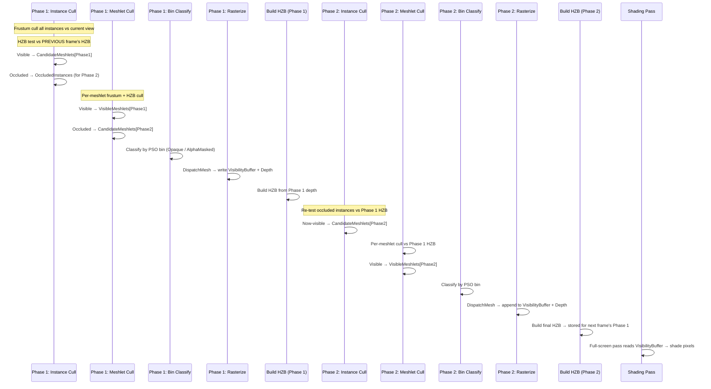

# D3D12_Research — Visibility Buffer Implementation Reference

_Source analysis of `Source/Renderer/Techniques/MeshletRasterizer.cpp` and `Resources/Shaders/` — July 2026_

---

## 📋 Overview

D3D12_Research implements a **GPU-driven Visibility Buffer** renderer built on top of a two-level meshlet hierarchy. The system is activated by selecting `RenderPath::Visibility` or `RenderPath::VisibilityDeferred` and replaces the traditional depth pre-pass + GBuffer rasterization with a single-pass visibility write followed by a deferred material evaluation step.

The visibility buffer stores a packed `uint32` per pixel encoding which meshlet candidate and which triangle within that meshlet covers the pixel. All material evaluation, attribute interpolation, and shading happen in a subsequent full-screen pass that reads this buffer.

### Render Path Variants

| `RenderPath` | Shading Strategy | Output |
|---|---|---|
| `Visibility` | Full shading in one full-screen pass (`VisibilityShading.hlsl`) | Color + Normals + Roughness render targets |
| `VisibilityDeferred` | Reconstruct GBuffer first (`VisibilityGBuffer.hlsl`), then deferred shade | Packed GBuffer → `DeferredShading.hlsl` |

Both paths share the identical culling and rasterization front-end. The difference is only in how the visibility buffer is consumed.

---

## 📦 Core Data Structures

### `MeshletCandidate` — the unit of work

Defined in both `VisibilityBuffer.hlsli` (HLSL) and mirrored in `MeshletRasterizer.cpp` (C++):

```hlsl
struct MeshletCandidate
{
    uint InstanceID;    // Index into the global InstanceData array
    uint MeshletIndex;  // Per-mesh meshlet index
};
```

This is the fundamental token passed through the entire culling pipeline. Every visible meshlet is represented as one `MeshletCandidate` entry in the `VisibleMeshlets` structured buffer.

### Visibility Buffer Pixel Encoding

The visibility buffer is a single `R32_UINT` texture. Each pixel stores:

```hlsl
// Pack: candidateIndex is 1-based (0 = invalid/sky)
uint PackVisBuffer(uint candidateIndex, uint primitiveID)
{
    return primitiveID | ((candidateIndex + 1) << 7);
}

// Unpack: returns false if pixel is sky/background
bool UnpackVisBuffer(uint data, out uint candidateIndex, out uint primitiveID)
{
    primitiveID    = data & 0x7F;          // bits [0..6]  → triangle index within meshlet (max 124)
    candidateIndex = data >> 7;
    candidateIndex -= 1;                   // undo 1-based offset
    return candidateIndex != 0xFFFFFFFF;   // 0 means invalid
}
```

| Bits | Field | Range |
|---|---|---|
| `[6:0]` | `primitiveID` — triangle index within meshlet | 0–127 (meshlets have max 124 triangles) |
| `[31:7]` | `candidateIndex + 1` — index into `VisibleMeshlets` buffer | 1-based; 0 = sky/invalid |

### Meshlet Data Layout (`ShaderInterop.h`)

```hlsl
struct Meshlet
{
    uint VertexOffset;      // Offset into MeshletVertexBuffer
    uint TriangleOffset;    // Offset into MeshletTriangleBuffer
    uint VertexCount;       // Number of unique vertices (max 64)
    uint TriangleCount;     // Number of triangles (max 124)

    struct Triangle {
        uint V0 : 10;
        uint V1 : 10;
        uint V2 : 10;
        uint    : 2;
    };

    struct Bounds {
        float3 LocalCenter;
        float3 LocalExtents;
    };
};
```

Constants: `MESHLET_MAX_TRIANGLES = 124`, `MESHLET_MAX_VERTICES = 64`.

### Buffer Capacities

| Buffer | Max Size | Element |
|---|---|---|
| `CandidateMeshlets` | 1,048,576 (1M) | `MeshletCandidate` (8 bytes) |
| `VisibleMeshlets` | 1,048,576 (1M) | `MeshletCandidate` (8 bytes) |
| `OccludedInstances` | 16,384 (16K) | `uint32` (instance ID) |

---

## 🏗️ Architecture: Two-Phase Occlusion Culling

The system implements the **"Two Phase Occlusion Culling"** algorithm from Sebastian Aaltonen (SIGGRAPH 2015). The core assumption is that objects visible last frame are likely visible this frame.



---

## 🔀 Pipeline Passes in Detail

### Counter Layout

Three structured buffers track progress through the pipeline:

| Buffer | Slot 0 | Slot 1 | Slot 2 |
|---|---|---|---|
| `CandidateMeshletsCounter` | Total processed | Phase 1 count | Phase 2 count |
| `VisibleMeshletsCounter` | Phase 1 visible | Phase 2 visible | — |
| `OccludedInstancesCounter` | Phase 2 instance count | — | — |

---

### Pass 0 — Clear Counters

**Shader**: `MeshletCull.hlsl` → `ClearCountersCS`, `[numthreads(1,1,1)]`

Zeroes all three counter buffers before each frame. Also clears the debug overdraw texture if enabled.

---

### Pass 1 — Instance Culling (`CullInstancesCS`)

**Shader**: `MeshletCull.hlsl` → `CullInstancesCS`, `[numthreads(64,1,1)]`

**Phase 1**: Dispatched over all `cView.NumInstances` instances.

**Phase 2**: Dispatched indirectly over `OccludedInstances` (built by Phase 1).

**Algorithm per instance**:

1. **Frustum cull** against current frame's `WorldToClip`
2. **Phase 1 only — HZB test against previous frame**:
   - Frustum cull against `WorldToClipPrev` (previous transforms)
   - If inside previous frustum: `HZBCull()` against previous HZB
   - If occluded → add to `OccludedInstances` list (for Phase 2 retry)
3. **Phase 2 only**: `HZBCull()` against Phase 1 HZB (current frame)
4. If visible and not occluded: enumerate all meshlets of the instance and append `MeshletCandidate` entries to `CandidateMeshlets`

Wave-ops (`InterlockedAdd_WaveOps`, `InterlockedAdd_Varying_WaveOps`) are used for efficient atomic counter updates.

---

### Pass 2 — Meshlet Culling (`CullMeshletsCS`)

**Shader**: `MeshletCull.hlsl` → `CullMeshletsCS`, `[numthreads(64,1,1)]`

Dispatched **indirectly** based on the candidate meshlet count from Pass 1.

**Algorithm per meshlet**:

1. Load `Meshlet::Bounds` (local AABB center + extents)
2. **Frustum cull** against current view
3. **Phase 1 only — HZB test against previous frame**:
   - If occluded → append to `CandidateMeshlets[Phase2]` for retry
4. **Phase 2 only**: `HZBCull()` against Phase 1 HZB
5. If visible: append to `VisibleMeshlets` at the appropriate phase offset

---

### Pass 3 — Meshlet Binning (Classify Shader Types)

**Shaders**: `MeshletBinning.hlsl` — four compute passes

Visible meshlets are output in an **unordered** list. To support multiple PSOs (Opaque vs. Alpha-Masked), they must be sorted into bins. This is a 4-step GPU sort:

| Sub-pass | Shader | Action |
|---|---|---|
| Prepare Args | `PrepareArgsCS` | Zero bin counts; build indirect dispatch args |
| Count Meshlets | `ClassifyMeshletsCS` | For each meshlet, increment its bin counter (wave-ops optimized) |
| Compute Bin Offsets | `AllocateBinRangesCS` | Prefix-sum bin counts → start offset per bin |
| Write Bins | `WriteBinsCS` | Write each meshlet's index into the sorted indirection list |

**Bin assignment** is based on `material.RasterBin`:

| `PipelineBin` | Condition | PSO |
|---|---|---|
| `Opaque` (0) | Standard opaque material | Back-face culled, no alpha test |
| `AlphaMasked` (1) | `material.RasterBin == 1` | No culling, alpha discard in PS |

The output is:
- `BinnedMeshlets` — indirection list of meshlet indices, sorted by bin
- `MeshletOffsetAndCounts` — per-bin `(count, 1, 1, offset)` used as indirect `DispatchMesh` arguments

---

### Pass 4 — Rasterize Visibility Buffer

**Shaders**: `MeshletRasterize.hlsl` — Mesh Shader (`MSMain`) + Pixel Shader (`PSMain`)

**PSO configuration**:
- Render target: `R32_UINT` (visibility buffer)
- Depth: reverse-Z (`COMPARISON_FUNC_GREATER`)
- Stencil: write `StencilBit::VisibilityBuffer` (bit 0) to all covered pixels
- Dispatched via `ExecuteIndirect` with `DispatchMesh` signature, one call per bin

**Mesh Shader (`MSMain`)** — `[numthreads(32,1,1)]`:

```hlsl
// Each group processes one meshlet
uint meshletIndex = groupID;
meshletIndex += MeshletBinData[BinIndex].w;   // bin offset
meshletIndex  = BinnedMeshlets[meshletIndex]; // indirection

MeshletCandidate candidate = VisibleMeshlets[meshletIndex];
// Load meshlet header, set output counts
SetMeshOutputCounts(meshlet.VertexCount, meshlet.TriangleCount);

// Output vertices: transform to clip space
for(uint i = groupThreadID; i < meshlet.VertexCount; i += 32)
    verts[i].Position = mul(float4(worldPos, 1), cView.WorldToClip);

// Output primitives: pass CandidateIndex as per-primitive attribute
for(uint i = groupThreadID; i < meshlet.TriangleCount; i += 32)
{
    triangles[i] = uint3(tri.V0, tri.V1, tri.V2);
    primitives[i].CandidateIndex = meshletIndex;
    primitives[i].PrimitiveID    = i;
}
```

**Pixel Shader (`PSMain`)**:

```hlsl
// Alpha-masked variant: sample diffuse texture and discard if below cutoff
#if ALPHA_MASK
    if(opacity < material.AlphaCutoff) discard;
#endif

// Write packed visibility token
visBufferPixel = PackVisBuffer(primitiveData.CandidateIndex, primitiveData.PrimitiveID);
```

The pixel shader writes **no material data** — only the 32-bit visibility token. All material work is deferred.

---

### Pass 5 — Build HZB

**Shaders**: `HZB.hlsl` — `HZBInitCS` + `HZBCreateCS`

Built after each rasterization phase. Uses **AMD FidelityFX SPD** (Single Pass Downsampler) to generate a full mip chain in a single dispatch.

- **Dimensions**: `NextPowerOfTwo(viewDim) / 2`, mip count = `floor(log2(max(w,h)))`
- **Format**: `R16_FLOAT` (stores minimum depth per texel)
- **Persistence**: exported to `m_pHZB` (persistent `Ref<Texture>`) for use in the next frame's Phase 1

---

### Pass 6 — Shading (Visibility Path)

**Shader**: `VisibilityShading.hlsl` — `ShadePS` (graphics) or `ShadeCS` (compute)

Full-screen triangle pass. Stencil test `EQUAL` to `StencilBit::VisibilityBuffer` skips sky pixels.

**Algorithm per pixel**:

1. `UnpackVisBuffer()` → `candidateIndex`, `primitiveID`
2. Look up `MeshletCandidate` → `InstanceData`
3. **`GetVertexAttributes()`** — reconstruct all vertex attributes via analytic barycentrics (see below)
4. **`EvaluateMaterial()`** — sample all material textures using analytic UV derivatives
5. Tiled light loop (`DoLight()`) using 2D light grid
6. DDGI irradiance lookup for indirect diffuse
7. Screen-space reflections
8. Volumetric fog composite
9. Output: Color + Normals (octahedral) + Roughness

---

### Pass 6 (Deferred Path) — Build GBuffer

**Shader**: `VisibilityGBuffer.hlsl` — `ShadePS`

Same unpack + attribute reconstruction as above, but outputs a packed GBuffer instead of final color:

| GBuffer Channel | Format | Contents |
|---|---|---|
| `data.x` | `RGBA8_UNORM` | BaseColor (RGB) + Specular (A) |
| `data.y` | `RG16_UNORM` | Roughness (R) + Metalness (G) |
| `data.z` | `RG16_SNORM` | Octahedral-packed Normal |
| `data.w` | `R9G9B9E5_SHAREDEXP` | Emissive |

Followed by `DeferredShading.hlsl` compute pass for lighting.

---

## 📐 Analytic Barycentric Derivatives

The key insight of the visibility buffer approach is that vertex attributes and their screen-space derivatives can be computed **analytically** from the three clip-space vertex positions, without hardware interpolation.

Defined in `VisibilityBuffer.hlsli`:

```hlsl
BaryDerivs ComputeBarycentrics(float2 pixelCS, float4 v0CS, float4 v1CS, float4 v2CS)
{
    // Perspective-correct barycentric coordinates
    float3 RcpW = rcp(float3(v0CS.w, v1CS.w, v2CS.w));

    // Edge equations in clip space
    float3 C_dx = pos201Y - pos120Y;
    float3 C_dy = pos120X - pos201X;
    float3 C    = C_dx * (pixelCS.x - pos120X) + C_dy * (pixelCS.y - pos120Y);

    float3 G = C * RcpW;
    float  H = dot(C, RcpW);

    result.Barycentrics = G / H;  // perspective-correct

    // Analytic screen-space derivatives (replaces ddx/ddy)
    result.DDX_Barycentrics = (G_dx * H - G * H_dx) * (1/H²) * (2 / viewportWidth);
    result.DDY_Barycentrics = (G_dy * H - G * H_dy) * (1/H²) * (-2 / viewportHeight);
}
```

These derivatives are used directly for `SampleGrad()` calls in `EvaluateMaterial()`, giving correct anisotropic texture filtering without relying on hardware `ddx`/`ddy` (which would be incorrect in a compute shader and unreliable at triangle edges in a pixel shader).

### `GetVertexAttributes()` — Full Attribute Reconstruction

```hlsl
VisBufferVertexAttribute GetVertexAttributes(float2 screenUV, InstanceData instance,
                                              uint meshletIndex, uint primitiveID)
{
    // 1. Load meshlet → triangle → 3 vertex indices
    Meshlet meshlet = mesh.DataBuffer.LoadStructure<Meshlet>(meshletIndex, ...);
    Meshlet::Triangle tri = mesh.DataBuffer.LoadStructure<Meshlet::Triangle>(primitiveID + ...);
    uint3 indices = { tri.V0, tri.V1, tri.V2 };

    // 2. Load raw vertex data + transform to world space
    Vertex vertices[3];
    float3 worldPos[3];
    for(uint i = 0; i < 3; ++i)
        worldPos[i] = mul(float4(vertices[i].Position, 1), instance.LocalToWorld).xyz;

    // 3. Project to clip space
    float4 clipPos[3] = { mul(worldPos[i], cView.WorldToClip) ... };

    // 4. Compute analytic barycentrics + derivatives
    BaryDerivs bary = ComputeBarycentrics(UVToClip(screenUV), clipPos[0], clipPos[1], clipPos[2]);

    // 5. Interpolate all attributes
    outVertex.UV       = BaryInterpolate(v[0].UV,       v[1].UV,       v[2].UV,       bary.Barycentrics);
    outVertex.Normal   = normalize(mul(BaryInterpolate(...normals...), instance.LocalToWorld));
    outVertex.Tangent  = BaryInterpolate(...tangents...);
    outVertex.Position = BaryInterpolate(worldPos[0], worldPos[1], worldPos[2], bary.Barycentrics);
    outVertex.DX       = BaryInterpolate(...UVs..., bary.DDX_Barycentrics);  // for SampleGrad
    outVertex.DY       = BaryInterpolate(...UVs..., bary.DDY_Barycentrics);
    outVertex.LinearDepth = BaryInterpolate(clipPos[0].w, clipPos[1].w, clipPos[2].w, bary.Barycentrics);
}
```

---

## 🔧 PSO Permutations

### Rasterization PSOs (`MeshletRasterize.hlsl`)

| PSO | `ALPHA_MASK` | `DEPTH_ONLY` | `ENABLE_DEBUG_DATA` | Cull Mode | RT |
|---|---|---|---|---|---|
| Opaque (Vis Buffer) | 0 | 0 | 0 | Back | R32_UINT + Depth |
| Opaque (Debug) | 0 | 0 | 1 | Back | R32_UINT + Depth |
| AlphaMasked (Vis Buffer) | 1 | 0 | 0 | None | R32_UINT + Depth |
| AlphaMasked (Debug) | 1 | 0 | 1 | None | R32_UINT + Depth |
| Opaque (Depth Only) | 0 | 1 | 0 | None | Depth only |
| AlphaMasked (Depth Only) | 1 | 1 | 0 | None | Depth only |

### Culling PSO Permutations (`MeshletCull.hlsl`)

| PSO | `OCCLUSION_FIRST_PASS` | `OCCLUSION_CULL` | Purpose |
|---|---|---|---|
| `CullInstances[0]` | 1 | 1 | Phase 1 instance cull with occlusion |
| `CullInstances[1]` | 0 | 1 | Phase 2 instance cull with occlusion |
| `CullInstancesNoOcclusion` | 1 | 0 | Single-phase, no occlusion culling |
| `CullMeshlets[0]` | 1 | 1 | Phase 1 meshlet cull |
| `CullMeshlets[1]` | 0 | 1 | Phase 2 meshlet cull |
| `CullMeshletsNoOcclusion` | 1 | 0 | Single-phase meshlet cull |

---

## 🌐 Work Graph Alternative

When `D3D12_FEATURE_WORK_GRAPHS` is supported and `Tweakables::gWorkGraph` is enabled, the entire instance culling + meshlet culling + binning pipeline is replaced by a **D3D12 Work Graph** (`MeshletCullWG.hlsl`).

The work graph is launched with a single CPU-side dispatch record pointing to either `CullInstancesCS` (Phase 1) or `KickPhase2NodesCS` (Phase 2) as the entry node. The graph internally fans out to meshlet culling and binning nodes without CPU involvement.

---

## 📊 Debug Modes

**Shader**: `VisibilityDebugView.hlsl` → `DebugRenderCS`, `[numthreads(8,8,1)]`

| Mode | Visualization |
|---|---|
| 1 | Random color per **instance** |
| 2 | Random color per **meshlet** |
| 3 | Random color per **triangle** (primitiveID) |
| 4 | Overdraw heatmap (Viridis colormap, scale 0–20 samples) |

All modes overlay a **wireframe** using barycentric edge detection: `saturate(Wireframe(barycentrics) + 0.8)`.

A GPU stats overlay (`PrintStatsCS`) prints per-phase counts for instances, candidate meshlets, occluded meshlets, and visible meshlets directly to screen via the shader debug text renderer.

---

## 📐 Full Frame Rendering Order (Visibility Path)

```
Clear Counters (UAV)
  → Phase 1:
      Cull Instances       (CandidateMeshlets[P1] + OccludedInstances)
      Build Meshlet Args   (indirect dispatch size)
      Cull Meshlets        (VisibleMeshlets[P1] + CandidateMeshlets[P2])
      Classify Shaders     (BinnedMeshlets + MeshletOffsetAndCounts)
      Rasterize            (VisibilityBuffer + Depth, CLEAR)
      Build HZB            (Depth → HZB[Phase1])
  → Phase 2:
      Build Instance Args  (from OccludedInstancesCounter)
      Cull Instances       (CandidateMeshlets[P2] re-test vs Phase1 HZB)
      Build Meshlet Args
      Cull Meshlets        (VisibleMeshlets[P2])
      Classify Shaders
      Rasterize            (append to VisibilityBuffer + Depth, NO CLEAR)
      Build HZB            (final Depth → HZB[persistent, used next frame])
  → Light Culling (2D tiled)
  → AO (SSAO or RTAO)
  → Visibility Shading:
      [Visibility path]    FullScreenTriangle → VisibilityShading.hlsl → Color + Normals + Roughness
      [VisDeferred path]   FullScreenTriangle → VisibilityGBuffer.hlsl → GBuffer
                           DeferredShading.hlsl → Color
  → Forward Clustered (transparent objects)
  → Sky
  → Post-processing (TAA, Bloom, Tonemap...)
```

---

## 🔑 Key Design Decisions

| Decision | Rationale |
|---|---|
| **Single `R32_UINT` visibility buffer** | Minimal bandwidth during rasterization; all material data fetched on-demand in shading pass |
| **Meshlet-based geometry** | Enables fine-grained per-meshlet culling; meshlet bounds are tighter than instance bounds |
| **Two-phase occlusion culling** | Accurate GPU occlusion without CPU readback; leverages temporal coherence |
| **Analytic barycentrics + derivatives** | Correct `SampleGrad` filtering in both PS and CS shading paths; avoids `ddx`/`ddy` artifacts at triangle edges |
| **Bin classification** | Allows multiple PSOs (opaque/alpha-masked) with a single indirect draw per bin; no CPU-side sorting |
| **Stencil tagging** | `StencilBit::VisibilityBuffer` marks geometry pixels; shading passes use `STENCIL_OP_EQUAL` to skip sky |
| **Persistent HZB** | Exported across frames via `graph.Export()`; Phase 1 reads previous frame's HZB for conservative occlusion |
| **Work Graph opt-in** | When hardware supports it, replaces the multi-pass compute culling with a single work graph launch |
