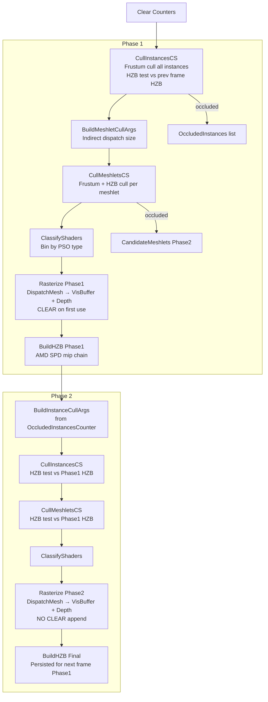

# D3D12_Research — Meshlet Implementation Reference

_Source analysis of `Source/Scene/SceneLoader.cpp`, `Source/Renderer/Techniques/MeshletRasterizer.cpp`, and `Resources/Shaders/` — July 2026_

---

## 📋 Overview

D3D12_Research uses **meshlets** as the fundamental unit of GPU-driven geometry. Every mesh in the scene is decomposed into meshlets at load time using the [meshoptimizer](https://github.com/zeux/meshoptimizer) library. At runtime, the GPU culls and rasterizes these meshlets entirely without CPU involvement, using D3D12 Mesh Shaders and indirect dispatch.

The meshlet system is the backbone of the Visibility Buffer renderer. It enables a two-level culling hierarchy (instance → meshlet) and allows fine-grained occlusion testing at sub-mesh granularity.

---

## 📦 Core Data Structures

### `Meshlet` — GPU/CPU shared (ShaderInterop.h)

```cpp
struct Meshlet
{
    uint VertexOffset;      // Byte offset into MeshletVertexBuffer (uint32 indices)
    uint TriangleOffset;    // Index into MeshletTriangleBuffer (packed triangles)
    uint VertexCount;       // Number of unique vertices in this meshlet (max 64)
    uint TriangleCount;     // Number of triangles in this meshlet (max 124)

    struct Triangle {
        uint V0 : 10;       // Local vertex index 0 (into MeshletVertexBuffer)
        uint V1 : 10;       // Local vertex index 1
        uint V2 : 10;       // Local vertex index 2
        uint    : 2;        // Padding
    };

    struct Bounds {
        float3 LocalCenter;   // AABB center in local space
        float3 LocalExtents;  // AABB half-extents in local space
    };
};
```

**Constants** (compile-time, shared between CPU and GPU):
```cpp
static const int MESHLET_MAX_TRIANGLES = 124;
static const int MESHLET_MAX_VERTICES  = 64;
```

### `MeshData` — GPU mesh descriptor (ShaderInterop.h)

```cpp
struct MeshData
{
    ByteBufferH DataBuffer;         // Single GPU buffer containing all mesh sub-streams
    uint PositionsOffset;           // Byte offset to float3 positions stream
    uint UVsOffset;                 // Byte offset to RG16_FLOAT packed UVs
    uint NormalsOffset;             // Byte offset to RGB10A2_SNORM packed normals+tangents
    uint ColorsOffset;              // Byte offset to RGBA8_UNORM vertex colors (~0u if absent)
    uint IndicesOffset;             // Byte offset to index buffer (R16 or R32)
    uint IndexByteSize;             // 2 or 4

    uint MeshletOffset;             // Byte offset to Meshlet[] array
    uint MeshletVertexOffset;       // Byte offset to uint32[] vertex indirection array
    uint MeshletTriangleOffset;     // Byte offset to Meshlet::Triangle[] array
    uint MeshletBoundsOffset;       // Byte offset to Meshlet::Bounds[] array
    uint MeshletCount;              // Total number of meshlets in this mesh
};
```

All sub-streams live in a **single contiguous GPU buffer** (`Mesh::pBuffer`). Offsets are stored as byte offsets into this buffer, accessed via `ByteAddressBuffer` on the GPU.

### `MeshletCandidate` — culling token (VisibilityBuffer.hlsli)

```hlsl
struct MeshletCandidate
{
    uint InstanceID;    // Index into cView.InstancesBuffer
    uint MeshletIndex;  // Per-mesh meshlet index (into MeshData.MeshletOffset)
};
```

This 8-byte struct is the unit of work passed through the entire culling pipeline.

### `Vertex` — GPU vertex layout (CommonBindings.hlsli)

```hlsl
struct Vertex
{
    float3 Position;    // RGB32_FLOAT (raw float3)
    float2 UV;          // Unpacked from RG16_FLOAT
    float3 Normal;      // Unpacked from RGB10A2_SNORM (x component)
    float4 Tangent;     // Unpacked from RGB10A2_SNORM (y component), w = handedness
    uint   Color;       // RGBA8_UNORM packed (0xFFFFFFFF if absent)
};
```

---

## 🏗️ Meshlet Generation (CPU — Load Time)

**File**: `Source/Scene/SceneLoader.cpp` → `BuildMeshData()`

### Step 1 — Mesh Optimization

Before meshlet generation, the raw index/vertex data is optimized with three meshoptimizer passes:

```cpp
// 1. Optimize vertex cache (post-transform cache efficiency)
meshopt_optimizeVertexCache(indices, indices, indexCount, vertexCount);

// 2. Optimize overdraw (reduce pixel shader invocations)
meshopt_optimizeOverdraw(indices, indices, indexCount, positions, vertexCount,
                         sizeof(Vector3), 1.05f);  // threshold = 5% overdraw tolerance

// 3. Optimize vertex fetch (pre-transform cache efficiency)
meshopt_optimizeVertexFetchRemap(&remap[0], indices, indexCount, vertexCount);
meshopt_remapIndexBuffer(indices, indices, indexCount, &remap[0]);
// ... remap all vertex streams ...
```

### Step 2 — Meshlet Generation

```cpp
const size_t maxVertices  = MESHLET_MAX_VERTICES;   // 64
const size_t maxTriangles = MESHLET_MAX_TRIANGLES;  // 124
const size_t maxMeshlets  = meshopt_buildMeshletsBound(indexCount, maxVertices, maxTriangles);

// Allocate temporary storage
Array<meshopt_Meshlet> meshlets(maxMeshlets);
Array<uint32>          meshletVertices(maxMeshlets * maxVertices);
Array<unsigned char>   meshletTriangles(maxMeshlets * maxTriangles * 3);

// Build meshlets
size_t meshletCount = meshopt_buildMeshlets(
    meshlets.data(), meshletVertices.data(), meshletTriangles.data(),
    indices, indexCount,
    positions, vertexCount, sizeof(Vector3),
    maxVertices, maxTriangles,
    0   // cone weight = 0 (no backface cone culling)
);
```

`meshopt_buildMeshlets` partitions the mesh into groups of at most 64 vertices and 124 triangles, optimizing for locality.

### Step 3 — Per-Meshlet Optimization

For each generated meshlet:

```cpp
// Further optimize the meshlet's local vertex order
meshopt_optimizeMeshlet(
    &meshletVertices[meshlet.vertex_offset],
    pSourceTriangles,
    meshlet.triangle_count,
    meshlet.vertex_count
);
```

### Step 4 — AABB Bounds Computation

The bounds are computed manually (not using meshoptimizer's cone bounds):

```cpp
Vector3 min = Vector3(FLT_MAX, ...);
Vector3 max = Vector3(-FLT_MAX, ...);
for (uint32 k = 0; k < meshlet.triangle_count * 3; ++k)
{
    uint32 idx = meshletVertices[meshlet.vertex_offset + meshletTriangles[meshlet.triangle_offset + k]];
    const Vector3& p = positions[idx];
    max = Vector3::Max(max, p);
    min = Vector3::Min(min, p);
}
outBounds.LocalCenter  = (max + min) / 2;
outBounds.LocalExtents = (max - min) / 2;
```

These AABB bounds are used for both frustum culling and HZB occlusion culling on the GPU.

### Step 5 — Triangle Encoding

The raw `unsigned char` triangle indices from meshoptimizer are repacked into the 10-10-10 bitfield format:

```cpp
for (uint32 triIdx = 0; triIdx < meshlet.triangle_count; ++triIdx)
{
    ShaderInterop::Meshlet::Triangle& tri = meshData.MeshletTriangles[triIdx + triangleOffset];
    tri.V0 = *pSourceTriangles++;
    tri.V1 = *pSourceTriangles++;
    tri.V2 = *pSourceTriangles++;
}
```

---

## 💾 GPU Buffer Layout

**File**: `Source/Scene/SceneLoader.cpp` → `UploadMesh()`

All mesh data is packed into a **single `ByteAddressBuffer`** with 16-byte alignment between sub-streams:

```
[Positions:   float3[]          ] ← PositionStreamLocation / PositionsOffset
[Normals:     uint2[]           ] ← NormalStreamLocation   / NormalsOffset
  (x = RGB10A2_SNORM normal, y = RGB10A2_SNORM tangent)
[Colors:      uint32[]          ] ← ColorsStreamLocation   / ColorsOffset
[UVs:         uint32[]          ] ← UVStreamLocation       / UVsOffset
  (RG16_FLOAT packed)
[Joints:      uint16[4][]       ] ← JointsStreamLocation
[Weights:     uint2[]           ] ← WeightsStreamLocation
  (RGBA16_FLOAT packed)
[Indices:     uint16[] or uint32[]] ← IndicesLocation      / IndicesOffset
[Meshlets:    Meshlet[]         ] ← MeshletsLocation       / MeshletOffset
[MeshletVerts:uint32[]          ] ← MeshletVerticesLocation/ MeshletVertexOffset
[MeshletTris: Meshlet::Triangle[]] ← MeshletTrianglesLocation / MeshletTriangleOffset
[MeshletBounds:Meshlet::Bounds[]] ← MeshletBoundsLocation  / MeshletBoundsOffset
```

**Index format selection**: If `vertexCount < 65535`, indices are stored as `R16_UINT` (2 bytes each); otherwise `R32_UINT` (4 bytes).

**Animated meshes** get an additional skinned position stream and skinned normal stream appended after the base streams.

---

## 🔀 GPU Culling Pipeline

**File**: `Resources/Shaders/MeshletCull.hlsl`, `MeshletRasterizer.cpp`

### Buffer Capacities

| Buffer | Max Elements | Element Size | Total |
|---|---|---|---|
| `CandidateMeshlets` | 1,048,576 (1M) | 8 bytes | 8 MB |
| `VisibleMeshlets` | 1,048,576 (1M) | 8 bytes | 8 MB |
| `OccludedInstances` | 16,384 (16K) | 4 bytes | 64 KB |

### Counter Layout

| Buffer | Slot 0 | Slot 1 | Slot 2 |
|---|---|---|---|
| `CandidateMeshletsCounter` | Total processed | Phase 1 count | Phase 2 count |
| `VisibleMeshletsCounter` | Phase 1 visible | Phase 2 visible | — |
| `OccludedInstancesCounter` | Phase 2 instance count | — | — |

### Two-Phase Occlusion Culling

The system implements the algorithm from Sebastian Aaltonen (SIGGRAPH 2015). The key insight: objects visible last frame are likely visible this frame.



---

### Pass 1 — `CullInstancesCS` `[numthreads(64,1,1)]`

**Phase 1**: Dispatched over all `cView.NumInstances` instances directly.  
**Phase 2**: Dispatched indirectly over `OccludedInstances` list.

```hlsl
// 1. Frustum cull against current WorldToClip
FrustumCullData cullData = FrustumCull(
    instance.LocalBoundsOrigin, instance.LocalBoundsExtents,
    instance.LocalToWorld, cView.WorldToClip);

// 2. [Phase 1 only] HZB test against PREVIOUS frame
FrustumCullData prevCullData = FrustumCull(..., instance.LocalToWorldPrev, cView.WorldToClipPrev);
if (prevCullData.IsVisible)
    wasOccluded = !HZBCull(prevCullData, HZB, HZBDimensions);

// If occluded → add to OccludedInstances for Phase 2 retry
// If visible → enumerate all meshlets → append to CandidateMeshlets

// 3. [Phase 2 only] HZB test against Phase 1 HZB
isVisible = HZBCull(cullData, HZB, HZBDimensions);
```

Wave-ops (`InterlockedAdd_WaveOps`, `InterlockedAdd_Varying_WaveOps`) are used for efficient atomic counter updates — threads with the same increment are coalesced into a single atomic.

### Pass 2 — `CullMeshletsCS` `[numthreads(64,1,1)]`

Dispatched **indirectly** based on the candidate meshlet count.

```hlsl
// Load meshlet AABB bounds from MeshletBoundsOffset
Meshlet::Bounds bounds = mesh.DataBuffer.LoadStructure<Meshlet::Bounds>(
    candidate.MeshletIndex, mesh.MeshletBoundsOffset);

// Frustum cull
FrustumCullData cullData = FrustumCull(bounds.LocalCenter, bounds.LocalExtents,
                                        instance.LocalToWorld, cView.WorldToClip);

// [Phase 1] HZB test vs previous frame → if occluded, push to Phase2 candidate list
// [Phase 2] HZB test vs Phase1 HZB

// If visible → append to VisibleMeshlets
InterlockedAdd_WaveOps(Counter_VisibleMeshlets, VisibleMeshletCounter, 1, elementOffset);
VisibleMeshlets.Store(elementOffset, candidate);
```

### `FrustumCull()` — AABB vs Frustum (HZB.hlsli)

Transforms all 8 AABB corners to clip space and tests against all 6 frustum planes using the plane inequality method. Returns `FrustumCullData` with `IsVisible` and the clip-space AABB rect (`RectMin`, `RectMax`) for HZB testing.

### `HZBCull()` — HZB Occlusion Test (HZB.hlsli)

```hlsl
// 1. Convert clip-space rect to UV space
float4 rect = saturate(float4(cullData.RectMin.xy, cullData.RectMax.xy) * float2(0.5f, -0.5f).xyxy + 0.5f).xwzy;

// 2. Select mip level based on projected screen size (4x4 sample kernel)
float2 rectSize = (rectPixels.zw - rectPixels.xy) * 0.5f;
int mip = max(ceil(log2(max(rectSize.x, rectSize.y))), 0);

// 3. Sample 4x4 texels at selected mip → take minimum depth
float depth = Min(depth00, depth10, ..., depth33);

// 4. Compare against object's maximum depth
bool isOccluded = depth > cullData.RectMax.z;  // reverse-Z: larger = closer
```

---

## 🗂️ Meshlet Binning (Classify Shader Types)

**File**: `Resources/Shaders/MeshletBinning.hlsl`

Visible meshlets are output in an **unordered** list. To support multiple PSOs, they must be sorted into bins. This is a 4-pass GPU sort using wave-ops:

| Pass | Shader | Action |
|---|---|---|
| 1 | `PrepareArgsCS` `[1,1,1]` | Zero bin counts; build indirect dispatch args from visible meshlet count |
| 2 | `ClassifyMeshletsCS` `[64,1,1]` | For each meshlet, look up `material.RasterBin` and increment that bin's counter (wave-ops coalesced) |
| 3 | `AllocateBinRangesCS` `[64,1,1]` | Wave prefix-sum on bin counts → compute start offset per bin; write to `MeshletOffsetAndCounts` |
| 4 | `WriteBinsCS` `[64,1,1]` | Write each meshlet's index into `BinnedMeshlets` at its bin's offset (wave-ops coalesced) |

**Bin assignment** (`GetBin()`):
```hlsl
MaterialData material = GetMaterial(instance.MaterialIndex);
return material.RasterBin;  // 0 = Opaque, 1 = AlphaMasked
```

**Output buffers**:
- `BinnedMeshlets` — `uint[]` indirection list, sorted by bin
- `MeshletOffsetAndCounts` — `uint4[]` per bin: `(count, 1, 1, startOffset)` — used directly as `DispatchMesh` indirect arguments

---

## 🎨 Mesh Shader Rasterization

**File**: `Resources/Shaders/MeshletRasterize.hlsl`

### PSO Configuration

| Setting | Value |
|---|---|
| Render Target | `R32_UINT` (visibility buffer) |
| Depth | Reverse-Z, `COMPARISON_FUNC_GREATER` |
| Stencil | Write `StencilBit::VisibilityBuffer` to all covered pixels |
| Dispatch | `ExecuteIndirect` with `DispatchMesh` signature, one call per bin |

### Mesh Shader `MSMain` `[numthreads(32,1,1)]`

Each thread group processes **one meshlet**:

```hlsl
// 1. Resolve meshlet index through bin indirection
uint meshletIndex = groupID + MeshletBinData[BinIndex].w;  // bin offset
meshletIndex = BinnedMeshlets[meshletIndex];               // indirection

// 2. Load meshlet header
MeshletCandidate candidate = VisibleMeshlets[meshletIndex];
Meshlet meshlet = mesh.DataBuffer.LoadStructure<Meshlet>(candidate.MeshletIndex, mesh.MeshletOffset);

// 3. Set output counts
SetMeshOutputCounts(meshlet.VertexCount, meshlet.TriangleCount);

// 4. Output vertices (transform to clip space)
for (uint i = groupThreadID; i < meshlet.VertexCount; i += 32)
{
    uint vertexId = mesh.DataBuffer.LoadStructure<uint>(i + meshlet.VertexOffset, mesh.MeshletVertexOffset);
    Vertex v = LoadVertex(mesh, vertexId);
    float3 worldPos = mul(float4(v.Position, 1), instance.LocalToWorld).xyz;
    verts[i].Position = mul(float4(worldPos, 1), cView.WorldToClip);
    // [ALPHA_MASK] verts[i].UV = v.UV;
}

// 5. Output primitives (pass CandidateIndex as per-primitive attribute)
for (uint i = groupThreadID; i < meshlet.TriangleCount; i += 32)
{
    Meshlet::Triangle tri = mesh.DataBuffer.LoadStructure<Meshlet::Triangle>(
        i + meshlet.TriangleOffset, mesh.MeshletTriangleOffset);
    triangles[i] = uint3(tri.V0, tri.V1, tri.V2);
    primitives[i].CandidateIndex = meshletIndex;  // index into VisibleMeshlets
    primitives[i].PrimitiveID    = i;             // triangle index within meshlet
}
```

### Pixel Shader `PSMain`

```hlsl
// [ALPHA_MASK] Sample diffuse alpha and discard if below cutoff
#if ALPHA_MASK
    float opacity = material.Diffuse.Sample(sMaterialSampler, vertexData.UV).w;
    if (opacity < material.AlphaCutoff) discard;
#endif

// Write packed visibility token — NO material data written here
visBufferPixel = PackVisBuffer(primitiveData.CandidateIndex, primitiveData.PrimitiveID);
```

---

## 🔍 Vertex Attribute Reconstruction (Deferred)

**File**: `Resources/Shaders/VisibilityBuffer.hlsli` → `GetVertexAttributes()`

After rasterization, the visibility buffer is consumed in a full-screen pass. For each pixel, the full vertex attributes are reconstructed analytically:

```hlsl
VisBufferVertexAttribute GetVertexAttributes(float2 screenUV, InstanceData instance,
                                              uint meshletIndex, uint primitiveID)
{
    // 1. Load meshlet → triangle → 3 vertex indices
    Meshlet meshlet = mesh.DataBuffer.LoadStructure<Meshlet>(meshletIndex, mesh.MeshletOffset);
    Meshlet::Triangle tri = mesh.DataBuffer.LoadStructure<Meshlet::Triangle>(
        primitiveID + meshlet.TriangleOffset, mesh.MeshletTriangleOffset);

    uint3 indices = {
        mesh.DataBuffer.LoadStructure<uint>(tri.V0 + meshlet.VertexOffset, mesh.MeshletVertexOffset),
        mesh.DataBuffer.LoadStructure<uint>(tri.V1 + meshlet.VertexOffset, mesh.MeshletVertexOffset),
        mesh.DataBuffer.LoadStructure<uint>(tri.V2 + meshlet.VertexOffset, mesh.MeshletVertexOffset),
    };

    // 2. Load raw vertices + transform to world space
    Vertex vertices[3];
    float3 worldPos[3];
    for (uint i = 0; i < 3; ++i)
    {
        vertices[i] = LoadVertex(mesh, indices[i]);
        worldPos[i] = mul(float4(vertices[i].Position, 1), instance.LocalToWorld).xyz;
    }

    // 3. Project to clip space
    float4 clipPos[3] = { mul(worldPos[0], WorldToClip), ... };

    // 4. Compute analytic barycentrics + screen-space derivatives
    BaryDerivs bary = ComputeBarycentrics(UVToClip(screenUV), clipPos[0], clipPos[1], clipPos[2]);

    // 5. Interpolate all attributes
    outVertex.UV       = BaryInterpolate(v[0].UV,     v[1].UV,     v[2].UV,     bary.Barycentrics);
    outVertex.Normal   = normalize(mul(BaryInterpolate(normals...), LocalToWorld));
    outVertex.Tangent  = BaryInterpolate(tangents...);
    outVertex.Position = BaryInterpolate(worldPos[0], worldPos[1], worldPos[2], bary.Barycentrics);
    outVertex.DX       = BaryInterpolate(UVs..., bary.DDX_Barycentrics);  // for SampleGrad
    outVertex.DY       = BaryInterpolate(UVs..., bary.DDY_Barycentrics);
    outVertex.LinearDepth = BaryInterpolate(clipPos[0].w, clipPos[1].w, clipPos[2].w, bary.Barycentrics);
}
```

### Analytic Barycentric Derivatives (`ComputeBarycentrics`)

```hlsl
BaryDerivs ComputeBarycentrics(float2 pixelCS, float4 v0CS, float4 v1CS, float4 v2CS)
{
    float3 RcpW = rcp(float3(v0CS.w, v1CS.w, v2CS.w));

    // Edge equations in NDC
    float3 C_dx = pos201Y - pos120Y;
    float3 C_dy = pos120X - pos201X;
    float3 C    = C_dx * (pixelCS.x - pos120X) + C_dy * (pixelCS.y - pos120Y);

    float3 G = C * RcpW;
    float  H = dot(C, RcpW);

    result.Barycentrics = G / H;  // perspective-correct

    // Analytic ddx/ddy — replaces hardware ddx()/ddy()
    result.DDX_Barycentrics = (G_dx * H - G * H_dx) * (1/H²) * ( 2 * ViewportDimensionsInv.x);
    result.DDY_Barycentrics = (G_dy * H - G * H_dy) * (1/H²) * (-2 * ViewportDimensionsInv.y);
}
```

These analytic derivatives are used for `SampleGrad()` calls in `EvaluateMaterial()`, giving correct anisotropic texture filtering without relying on hardware `ddx`/`ddy` (which are unreliable at triangle edges and unavailable in compute shaders).

---

## 🔧 PSO Permutations

### Rasterization PSOs

| PSO | `ALPHA_MASK` | `DEPTH_ONLY` | `ENABLE_DEBUG_DATA` | Cull Mode | RT |
|---|---|---|---|---|---|
| `m_pDrawMeshletsPSO[Opaque]` | 0 | 0 | 0 | Back | R32_UINT + Depth/Stencil |
| `m_pDrawMeshletsDebugModePSO[Opaque]` | 0 | 0 | 1 | Back | R32_UINT + Depth/Stencil |
| `m_pDrawMeshletsPSO[AlphaMasked]` | 1 | 0 | 0 | None | R32_UINT + Depth/Stencil |
| `m_pDrawMeshletsDebugModePSO[AlphaMasked]` | 1 | 0 | 1 | None | R32_UINT + Depth/Stencil |
| `m_pDrawMeshletsDepthOnlyPSO[Opaque]` | 0 | 1 | 0 | None | Depth only |
| `m_pDrawMeshletsDepthOnlyPSO[AlphaMasked]` | 1 | 1 | 0 | None | Depth only |

Depth-only PSOs use a depth bias (`-10, 0, -4.0f`) for shadow map rendering.

### Culling PSOs

| PSO | `OCCLUSION_FIRST_PASS` | `OCCLUSION_CULL` | Purpose |
|---|---|---|---|
| `m_pCullInstancesPSO[0]` | 1 | 1 | Phase 1 instance cull |
| `m_pCullInstancesPSO[1]` | 0 | 1 | Phase 2 instance cull |
| `m_pCullInstancesNoOcclusionPSO` | 1 | 0 | Single-phase, no occlusion |
| `m_pCullMeshletsPSO[0]` | 1 | 1 | Phase 1 meshlet cull |
| `m_pCullMeshletsPSO[1]` | 0 | 1 | Phase 2 meshlet cull |
| `m_pCullMeshletsNoOcclusionPSO` | 1 | 0 | Single-phase meshlet cull |

---

## 📊 HZB Construction

**File**: `Resources/Shaders/HZB.hlsl`, `MeshletRasterizer.cpp` → `BuildHZB()`

Built after each rasterization phase using **AMD FidelityFX SPD** (Single Pass Downsampler):

```cpp
// HZB dimensions: NextPowerOfTwo(viewDim) / 2
hzbDimensions.x = Math::Max(Math::NextPowerOfTwo(viewDimensions.x) >> 1u, 1u);
hzbDimensions.y = Math::Max(Math::NextPowerOfTwo(viewDimensions.y) >> 1u, 1u);
uint32 numMips = (uint32)Math::Floor(log2f((float)Math::Max(hzbDimensions.x, hzbDimensions.y)));
// Format: R16_FLOAT (minimum depth per texel)
```

Two passes:
1. **`HZBInitCS`** `[16×16]` — Copies the depth buffer into mip 0 of the HZB
2. **`HZBCreateCS`** — AMD SPD generates all remaining mips in a single dispatch

The final HZB is **exported** via `graph.Export(outResult.pHZB, rasterContext.pPreviousHZB)` to persist across frames.

---

## 📐 Vertex Stream Encoding Details

| Stream | CPU Type | GPU Type | Encoding |
|---|---|---|---|
| Positions | `Vector3` | `float3` | Raw `RGB32_FLOAT` |
| Normals + Tangents | `Vector3` + `Vector4` | `uint2` | `RGB10A2_SNORM` × 2 packed into `uint2` |
| UVs | `Vector2` | `uint` | `RG16_FLOAT` packed into `uint32` |
| Colors | `Vector4` | `uint` | `RGBA8_UNORM` packed into `uint32` |
| Joints | `Vector4i` | `uint16[4]` | Raw 16-bit joint indices |
| Weights | `Vector4` | `uint2` | `RGBA16_FLOAT` packed into `uint2` |
| Indices | `uint32` | `uint16` or `uint32` | Auto-selected: R16 if `vertexCount < 65535` |

---

## 🔑 Key Design Decisions

| Decision | Rationale |
|---|---|
| **Single GPU buffer per mesh** | All sub-streams in one allocation; accessed via byte offsets; minimizes descriptor table entries |
| **meshoptimizer for generation** | Industry-standard library; produces optimal vertex cache, overdraw, and fetch order before meshlet partitioning |
| **AABB bounds (not cone)** | Cone culling weight = 0; AABB is sufficient for frustum + HZB occlusion; simpler to compute correctly |
| **10-10-10 triangle encoding** | 3 × 10-bit local indices fit in 32 bits; local indices are 0–63 (max 64 verts), so 6 bits would suffice but 10 is used for alignment |
| **Meshlet-level HZB culling** | Tighter bounds than instance-level; reduces overdraw significantly for large meshes |
| **Wave-ops for atomics** | `InterlockedAdd_WaveOps` coalesces multiple threads' increments into a single atomic; critical for culling throughput |
| **Indirect dispatch** | All dispatch sizes are computed on GPU; zero CPU readback required |
| **Analytic barycentrics** | Enables correct `SampleGrad` in both PS and CS shading paths; avoids `ddx`/`ddy` artifacts at triangle edges |
| **Persistent HZB** | Exported across frames via render graph; Phase 1 reads previous frame's HZB for conservative occlusion |
