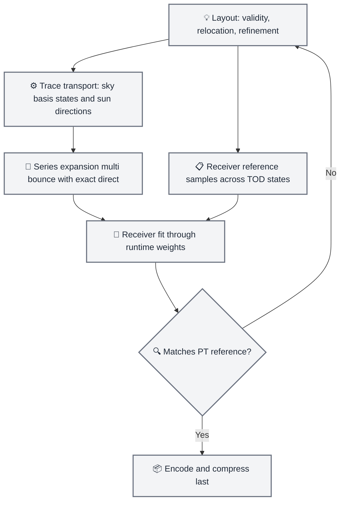
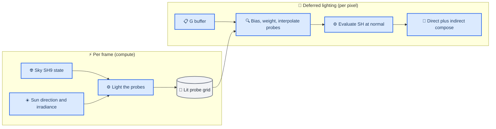

# Baked GI probe system — detailed design

_Concrete elaboration of the task016 recommendation — "Remedy's transport separation + CoD's reconstruction-aware baking + DDGI's geometric baseline + Activision's interpolation-aware compression" — into a TortureRed design: probe placement, probe payload, bake pipeline, runtime reconstruction, and compression. Builds on `task015-baked-gi-brainstorm.md` (surveys) and `task016-gi-analysis.md` (corrections and evidence limits)._

---

## 📋 Design summary

Each probe holds a **separated transport** (Remedy): a linear map from the sky state and a direction-indexed response to the sun, plus DDGI-style geometric visibility. The bake is **reconstruction-aware** (CoD IW): probe values are solved so that the *runtime interpolation*, evaluated at receiving surfaces, matches path-traced references — jointly across TOD states. Runtime is a cheap two-stage recombination: a per-frame "light the probes" pass folds the current sun/sky state into the transport, and the deferred pass interpolates lit probes with geometric weights. Compression is **interpolation-aware** (Activision) and applied last, per data class.

| Component | From | What it contributes here |
| --- | --- | --- |
| Transport separation | Remedy 2015[^1] | Sun response, sky transport, (later) local-light term as independent probe payloads |
| Reconstruction-aware baking | CoD IW 2017, Sloan 2020[^2] | Solve probe values through the runtime interpolation weights, against receiver references, across TOD states; error-driven layout |
| Geometric baseline | DDGI 2019/2021[^3] | Offline relocation, directional distance moments, weighted query, unified self-shadow bias |
| Interpolation-aware compression | Silvennoinen 2021[^4] | Reachable-lighting manifold projection, MBD as end-game; Sloan ratio encoding where signals are non-negative |

> 📌 **Path ownership (fixed up front):** direct sun on camera-visible surfaces stays runtime-exact (shadow/RT + ReSTIR DI); everything arriving after ≥1 scene bounce belongs to the bake; **first-bounce sky with occlusion is part of the sky transport** — it must not be dropped alongside the excluded direct sun[^5].

---

## 📍 Probe distribution and placement

### Structure

A **brick-sparse uniform grid with per-probe offsets**, refined by reconstruction error:

1. **Base lattice** — uniform spacing over the scene free-space AABB (start 2 m for a Bistro-class scene). Bricks of 4³ probes are allocated only where any probe in the brick is *relevant*: within a surface-adjacent band, near the playable volume, or needed as interpolation support. Empty-space bricks are never allocated (memory), though unlike Treyarch we do not need their 1/27 bake skip — bake cost is not our binding constraint.
2. **Offline relocation (DDGI 2021)** — for each candidate probe, trace 32-64 distance-only fibonacci rays: if >25% hit backfaces the probe is inside geometry and is pushed through the closest backface (offset capped at a fraction of spacing to preserve grid indexing); otherwise it is nudged away from frontfaces closer than one spacing. ~5 iterations; survivors still in walls are marked `Off`. All of this is offline, so we can afford far more iterations and rays than the dynamic original.
3. **Error-driven refinement (CoD IW)** — bake at the current layout, then measure reconstruction error at receiver reference samples (below) across a spread of TOD states. Subdivide bricks (one level, 2 m → 1 m, optionally 0.5 m for hero interiors) where error exceeds threshold; demote where error is negligible. The error metric is computed **per receiver**, not per probe — "a probe is not embedded in a wall" does not mean "it correctly serves every surrounding surface"[^5]. Coverage is checked specifically on both sides of walls, at window openings, and in narrow corridors.
4. **Cross-level interpolation** — subdivision is restricted to one level at a time and a refined brick always keeps its parent allocated, so every trilinear neighborhood resolves within one or two levels (the Quantum Break rule). A missing finer corner falls back to the parent value. This is the deliberate v1 simplification of Remedy's partial dilation.

The alternatives stay on the shelf with explicit triggers: a height-warped domain if terrain-heavy outdoor scenes dominate[^4]; tetrahedral/sparse placement (letianyu, Wang 2019[^6]) only if the probe budget becomes the binding constraint; a Neural-Light-Grid-style influence domain is a quality investigation, not a v1 dependency[^7].

### Influence domains (v1.5 investigation)

V1 uses explicit geometric weights only (trilinear × backface × visibility). The follow-up, motivated by the Neural Light Grid: per-probe influence functions `Φ_p(x)` that stop at walls but bend around small occluders, fit offline from the same multi-state receiver references used by the reconstruction-aware solve. A probe blocked by a thin column should not be rejected for the entire room behind it — plain line-of-sight visibility over-rejects and produces dark leaks[^7]. Start with a parametric form (anisotropic falloff, fit by least squares on reference residuals) before considering anything learned.

Planning number: ~100K valid probes for a large scene, matching the task016 memory analysis (§ compression).

---

## 💾 What each probe stores

| Field | Content | Includes / excludes |
| --- | --- | --- |
| `T_sky(p)` | 9×9×3 transport: sky SH state → directional irradiance SH (RGB) at the probe | Includes **first-bounce occluded sky** and all sky-sourced bounces |
| `R_sun(p, ω_i)` | Response to unit sun at direction `ω_i`, as directional irradiance SH (RGB), for an adaptive set of K directions | Sun **indirect only** (≥1 bounce); direct sun never enters |
| Visibility | Octahedral 16×16 RG16F per-direction depth mean / mean² (+ border texels) | Pure geometry, no lighting |
| Meta | Position offset, state (`valid`/`off`/`refined`), brick index, direction-set index | — |

The output of both transport fields is *directional irradiance* — a function of receiver normal `E(n)`, evaluated as plain SH (the cosine response to the incoming field is already inside the coefficients). Material response of receivers is applied exactly once, at final shading.

The sun response is **not assumed smooth**: narrow windows and light shelves make indirect sunlight change rapidly with direction, so K and the direction layout are chosen adaptively from measured error, and intermediate directions are validated, not just the nodes[^5]. If the product's TOD follows a fixed sun trajectory, the direction set degenerates to a 1D arc and the problem shrinks; the design keeps the 2D dome parameterization so that restriction is a sampling policy, not a representation change.

### Bake pipeline

_Worked top-to-bottom; stages 3-4 are where the CoD reconstruction-aware mechanism lives._

_Bake pipeline: reference sampling feeds both the transport trace and the receiver-fit solve; the series expansion accelerates multi-bounce; validation gates every stage against the independent path tracer_



1. **Receiver reference samples.** Sample the scene's surfaces area-weighted (plus play-space points for dynamics). For each TOD training state `s` — sun directions spanning the arc/dome (48-96 states) times a few turbidity/albedo variants — path-trace the *indirect* directional irradiance at every receiver. This uses the existing `PathTracing.hlsl` machinery with real-time optimizations disabled: no firefly clamp relaxation, full bounce depth, optional ray guiding for dark interiors[^8]. These references are the ground truth for everything downstream; the series expansion below is an accelerator, never its own validator[^5].
2. **Transport trace.**
   - *Sky:* trace each probe against environment basis states (PRT quadrature directions, responses weighted into SH), or directly against the reachable Hosek-Wilkie sky states — see step 4 for why the latter is attractive.
   - *Sun:* for each `(probe, ω_i)`, trace with the sun as the only source.
   - During all tracing, **direct lighting at ray hits is recomputed exactly** (RT/shadow visibility), never read back from the probe cache — Sloan's retrace-sun discipline, applied inside the bake so a coarse cache never pollutes the bounce source[^2].
3. **Series-expansion multi-bounce.** Iterate radiosity-style using the probe grid itself as the bounce cache (sub-path reuse). Convergence checked against the step-1 references; where it disagrees, raise ray counts rather than trusting the cache.
4. **Reconstruction-aware solve (the CoD IW mechanism[^2]).** Probe-center values are only the initialization. Solve, per TOD state, for probe values that reconstruct the receiver references *through the exact weights runtime will use*:
   ```text
   step 1 (per state s):   min_v  Σ_r ‖ Σ_p w_p(x_r, n_r) · v_p − e_ref^s(x_r) ‖²  +  λ‖v − v_traced‖²
   step 2 (per probe):     T_p = argmin_T Σ_s ‖ T · l^s − v_p^s ‖²
   ```
   `w_p` are the runtime weights (trilinear × backface × Chebyshev, evaluated at the receiver), `v_p^s` the per-state solved probe values, `l^s` the sky SH state. The Tikhonov anchor `λ` keeps the solve physical where references are sparse. Step 2 is where a pleasant property falls out: the SVD of `{v_p^s}` over states *is* the reachable-sky basis used for compression in the last section. The sun table gets step 1 per direction slot (sun-only references), with the same runtime weights — and, critically, the same joint treatment across states so one slot's fit does not fight its neighbors'.
5. **Validation gates** (task016's order, enforced as pass/fail): small uncompressed scene with thin walls, a narrow window, a two-story room, columns, colored bounces; sky-only, then sun-only, then combined; intermediate sun directions, not only nodes; per-class leak accounting (transport / spatial / angular / compression)[^5].

---

## ⚡ Runtime reconstruction

_Runtime dataflow: the per-frame pass recombines transport with the live sun/sky state; the deferred pass interpolates lit probes with geometric weights and composes with the unchanged direct path_



### Per-frame "light the probes" pass

One compute dispatch over all valid probes (~100K, trivial cost), reproducing Sloan's "resample the dynamic lightgrid every frame" pattern[^2]:

```text
e_sky(p) = T_sky(p) · s_sky                    // 9×9×3 matvec; s_sky = live SkySH9 state
e_sun(p) = ( Σ_i b_i(ω_sun) · R_sun(p, ω_i) ) ⊙ E_sun   // b_i: weights over the direction set
e(p)     = e_sky(p) + e_sun(p)                 // (+ e_fixed(p) when local lights join)
```

The sky state is the existing `SkySH9` buffer. Two conventions must be pinned before implementation, per the task016 landing points[^5]: `Sky_ProjectSH9.hlsl` currently stores **cosine-convolved irradiance SH** (bands l ≥ 3 ≈ 0), so either the transport is standardized against exactly that vector — legitimate, since the map stays linear — or a raw radiance projection variant is added. Decide once, encode the choice in the bake, never mix. `E_sun` is the spectral sun irradiance already computed by `Sky::GetSunIrradiance()`; transport is linear in it, so intensity and color changes are free. Turbidity and ground-albedo changes re-project the sky (existing dirty flag) — also free. Only geometry invalidates the bake.

Because `e(p)` is a sum of non-negative-signal reconstructions, apply the cheap angular guards here: per-probe non-negativity clamp; if colored-bounce color shifts appear, the Silvennoinen RKHS constrained projection (YCoCg box, alternating projections over 64-128 Fibonacci points) runs in this same pass — it is a bake-quality tool that also fits the runtime budget at 100K probes[^4].

### Per-pixel query (deferred)

In `Lighting.hlsl`, replacing the disabled Tier-2 ambient block (`Lighting.hlsl:116-120`):

```text
x'    = x + (n·0.2 + ωo·0.8) · (0.75·D) · B        // DDGI 2021 unified self-shadow bias, B ≈ 0.3, D = probe spacing
w_p   = trilinear_p(x') · max(0, n·(x_p − x')) · chebyshev_p(dir_p→x', |x' − x_p|)
e(x') = Σ_p w_p · e(p) / Σ_p w_p                   // blend SH coefficients, 8-probe cage
E(x,n) = Σ_lm e_lm(x') · Y_lm(n)                   // plain SH evaluation — irradiance, no extra cosine
L_ind = albedo/π · E
```

The Chebyshev term reads the probe's stored depth moments in the probe→receiver direction — this is where the offline-computed DDGI visibility pays off with zero runtime tracing. Backface texels relative to the shading normal are excluded from the moment lookups, matching the DDGI update-side rule.

### Composition rules

- **Exclusive modes (decision).** The indirect contribution comes from either the probe system or ReSTIR GI — never both. `enableBakedGI` disables the raster indirect-GI path wholesale: the `FinalDiffuse`/`FinalSpecular` read in `Lighting.hlsl:125-143` is skipped and the probe query supplies the indirect term. Two conscious consequences while exclusive: *local-light* indirect is absent in probe mode (the bake carries sun/sky transport only, until step-5 lightsets), and *indirect specular* is absent with it (recoverable via the step-5 items). The hybrid — ReSTIR GI restricted to local-light indirect with sky/sun excluded from its radiance and target function — is parked, and would need de-double-counting rules (sky-zeroed ray miss, sun-free NEE) if ever revisited.
- **Dynamic objects** query the same lit grid with the same bias — this is the consistency argument every probe-volume source makes, and it upgrades dynamics over the current ReSTIR-GI-only situation at zero marginal cost.
- **Specular keeps the RT/SSR path.** The re-fit formula `R_baked/E_probe · E_frame` is a fallback-tier tool, not the endpoint[^5].
- **Comparison mode (task016 recommendation):** a short-range RT final gather (1 diffuse ray/pixel, ½ res) whose secondary paths terminate in the baked grid — the existing ReSTIR GI resolve infrastructure makes this a mode flip, and it answers "pure probes vs. final gather for contact detail" empirically.

### How sun and sky actually reach a receiver (worked example)

Dawn: `ω_sun` low, `E_sun` warm and dim; `b_i` selects the low-elevation direction slots (baked with long corridor bounces through east windows); `s_sky` is a dim, horizon-heavy sky — `T_sky · s_sky` dims and cools the occluded-sky field. Noon: high-elevation slots dominate, short sharp bounces; overhead-weighted `s_sky` brightens interiors through skylight transport that already encodes window occlusion. Moving the sun continuously interpolates *within* the baked response — no re-tracing, no state switch; a light switch flipped at noon changes only `E_sun` (and, when local lights join, `e_fixed`).

---

## 🗜️ Compression plan

Applied per data class, last, per the task016 rule: spend probes on error first, pick ratios afterwards[^5].

| Data | Raw (fp16, 100K probes) | Stage 1 | Stage 2 (end-game) |
| --- | --- | --- | --- |
| `T_sky` 9×9×3 | 486 B → 46 MiB | **Reachable-sky manifold projection**: keep only the r ≈ 8-16 sky-state modes from the step-2 SVD → 9×r×3 ≈ 130-260 B | MBD across probes (interpolation-aware, no block seams) |
| `R_sun` K×9×3 | K=32 → 1728 B → 165 MiB | Adaptive K per region (8-32) + **Sloan ratio encoding per slot** (DC fp16 + band/DC in SNORM8, bound `sqrt(2L+1)`) + BC → ~350-500 B | Low-rank in ω where the response is smooth; MBD jointly |
| Visibility 16×16 RG16F | 1024 B → 98 MiB | 8×8 or RG8 moments → 256-512 B | 4-byte SG variant as an *experiment* (insufficient public disclosure to trust as equivalent)[^5] |
| Meta | ~8 B | — | — |
| Lit output `e(p)` | 54 B, transient | Not stored — regenerated per frame | — |

Raw total ≈ 310 MiB; Stage 1 lands around **90-120 MiB**, before brick sparsity.

Three principles govern this table:

- **Ratio encoding is signal-conditional.** `R_sun` slots and lit outputs are non-negative lighting signals — ratio encoding and block compression are legal there. `T_sky` columns are signed (responses to signed SH inputs), so the Sloan encoding does not apply; the manifold projection and MBD carry that side[^5].
- **The manifold projection is not lossy where it matters.** Truncating the sky input to the modes reachable by the Hosek-Wilkie model (plus trained turbidity/albedo variants) spends zero capacity on environments the game can never produce. The step-2 fit already lives in exactly that subspace, so compression and bake are consistent by construction.
- **MBD's real lesson applies earlier than MBD itself.** Interpolation built into the optimization objective — that is also precisely what the CoD IW receiver fit does with the runtime weights. The v1 pipeline is already "interpolation-aware compression with a physical prior"; MBD is the generalized production form of the same idea when Stage 1 is not enough[^4].

---

## 🗺️ Implementation steps

Each step is a complete, runnable state — it bakes, lights, and composes — and ends with a validation gate against the path-tracer references. Techniques are deliberately deferred, not skipped: spatial leaks from missing visibility are *expected* in steps 1-2 and are exactly the step-3 work items; compression and visibility stay out of the first pass by design.

### Step 1 — uniform probes, runtime sun and sky

The vertical slice: the smallest system that lights the static scene from baked transport with live TOD.

- **Placement:** uniform grid inside a scene volume, 2 m spacing; the only placement logic is free-space validity (probe center not inside geometry). No offsets, no refinement, no brick sparsity — a dense volume is fine at test-scene scale
- **Bake:** raw probe-center transport in fp16, no compression — `T_sky` from the environment-state trace plus series-expansion bounces, and `R_sun` on a *fixed uniform direction set* (16 slots: 8 azimuth × 2 elevation, or the sun arc if the test scene pins a trajectory). The retrace-sun discipline (exact direct at every trace hit) is in from day one — it is a correctness property, not a refinement
- **Runtime:** the per-frame lit-probe pass (`T_sky·s_sky + R_sun(ω)·E_sun`), deferred fetch with plain trilinear, SH evaluation at the normal, `albedo/π`, composed in `Lighting.hlsl` behind a new `enableBakedGI` flag — **exclusive with the raster indirect-GI path**: when set, the `FinalDiffuse`/`FinalSpecular` read is skipped entirely and the probe query supplies the indirect term. Internal order: sky-only first (it re-enables the disabled ambient, now with occlusion), then add the sun table — two milestones, one step
- **Deliverable:** drag the sun; the indirect updates with zero re-tracing
- **Gate:** test scene (thin walls, a narrow window, a two-tone room) diffed against PT at the direction nodes and a few intermediate directions. Spatial leaks are logged, not fixed

> 📌 **Status: implemented and smoke-tested.** Landed as `Sources/Rendering/BakedGI.{h,cpp}` + `Sources/Shaders/BakedGI_{Bake,Update,Debug}.hlsl` + `BakedGI.hlsli`, wired through `Renderer`, `Application` (combo "Indirect GI Source" — Probe default, ReSTIR GI exclusive; spacing slider; "Rebuild GI Probes" button; "Show Probe Placement" cube overlay; auto-bake after scene load on a synced command list), `FrameConstants.bakedGI*` fields, and the probe branch in `Lighting.hlsl` (validity-renormalized manual trilinear — the renormalization is the step-1 stand-in for placement work). One driver lesson worth keeping: the bake gather loop MUST stay `[loop]` (rolled) — `[unroll]` on the 64-ray loop produces 64 unrolled inline RayQuery objects and the driver's PSO compilation appears to hang (Windows logs it as Application Hang; DXC itself compiles it fine). Runtime bake on Sponza: 28³ = 21,952 probes, 3 series iterations, seconds.

### Step 2 — placement: offsets and error measurement

- Offline DDGI relocation — backface push-through with capped offsets, `Off` classification, per-probe offset storage
- Receiver references become a standing asset: per-receiver reconstruction error across the TOD training states
- Error-driven subdivision (2 m → 1 m) with the parent-fallback cross-level rule
- The reconstruction-aware solve — per-state least squares through the runtime weights, then the per-probe regression that produces `T_sky`; the SVD of the state matrix doubles as the compression basis for step 4
- **Gate:** wrong-side receivers fixed at the training states; the error-vs-spacing curve is recorded

### Step 3 — visibility

- Bake the octahedral 16×16 RG16F depth moments per probe (+ border texels)
- Query upgrade: trilinear × backface × Chebyshev, and the unified self-shadow bias (`B ≈ 0.3`), tuned against bright-leak / dark-leak pairs
- **Gate:** doorway and under-roof shadow detail survives without interior darkening; the task016 spatial-vs-angular leak classes are now separated and measurable

### Step 4 — compression

- Reachable-sky manifold projection (from the step-2 SVD), adaptive K plus Sloan ratio encoding + BC for the sun slots, visibility reduction last (8×8 / RG8; the 4-byte SG stays an experiment)
- **Gate:** every reduction re-runs the step-1 and step-3 diffs — compression is its own error class, not a free win

### Step 5 — composition, comparison, and beyond

- Short-range RT final-gather comparison mode (1 ray/pixel, ½ res, secondary paths terminating in the baked grid)
- Local-light transport (lightsets) — the principled way to recover local-light indirect inside the exclusive probe mode
- Influence-domain investigation (`Φ_p`), reflection re-fit fallback (recovers indirect specular), streaming and bricks at scale
- Parked, only if the local-light/specular gap in probe mode proves unacceptable before the items above land: the hybrid — ReSTIR GI restricted to local-light indirect, requiring sky-zeroed ray miss and sun-free NEE exclusion semantics

---

## 🤔 Open items

- Sky state vector standardization: irradiance-convolved `SkySH9` as-is vs a raw radiance projection — decide before the first bake, encode everywhere
- Direction-set layout for the sun response: uniform dome grid vs adaptive per-region sets (shared sets keep interpolation cheap; adaptive sets fight aperture aliasing)
- Regularization weight `λ` schedule for the receiver fit, and whether step 1 runs per state independently or jointly with neighbor smoothness
- Whether the influence-domain fit (v1.5) shares the receiver reference set with the reconstruction solve or needs denser sampling

---

## 🔗 References

[^1]: Silvennoinen, A., & Timonen, V. (2015). "Multi-Scale Global Illumination in Quantum Break." SIGGRAPH 2015: Advances in Real-Time Rendering course. Local extract: `_tmp_remedy.txt`.
[^2]: Iwanicki, M., & Sloan, P.-P. (2017). "Precomputed Lighting in Call of Duty: Infinite Warfare." SIGGRAPH 2017: Advances in Real-Time Rendering course, pp. 51-58, 108-109. https://www.ppsloan.org/publications/CoD_IW.pptx ; and Sloan, P.-P., & Silvennoinen, A. (2020). "Precomputed Lighting Advances in Call of Duty: Modern Warfare." SIGGRAPH 2020 course. Local extracts: `_tmp_sloan.txt`, `E:\Paper\GI\Precomputed_Lighting_in_CoD_IW.pptx`.
[^3]: Majercik, Z., et al. (2019). "Dynamic Diffuse Global Illumination with Ray-Traced Irradiance Fields." _JCGT 8(2)_. https://jcgt.org/published/0008/02/01/ ; Majercik, Z., et al. (2021). "Scaling Probe-Based Real-Time Dynamic Global Illumination for Production." _JCGT 10(2)_. https://jcgt.org/published/0010/02/01/ — local copy: `E:\Paper\GI\paper-lowres.pdf`, extract `_tmp_treyarch.txt`-adjacent analysis in `task015-baked-gi-brainstorm.md`.
[^4]: Silvennoinen, A. (2021). "Large-Scale Global Illumination at Activision." SIGGRAPH 2021: Advances in Real-Time Rendering course. Local extract: `_tmp_silvennoinen2021.txt`; MBD paper: Silvennoinen & Sloan, "Moving Basis Decomposition for Precomputed Light Transport," EGSR 2021.
[^5]: TortureRed internal analysis: `docs/task016-gi-analysis.md` — evidence limits, corrections to the task015 draft, and the TOD scope table.
[^6]: Wang, Y., Khiat, S., Kry, P. G., & Nowrouzezahrai, D. (2019). "Fast Non-Uniform Radiance Probe Placement and Tracing." _I3D 2019_. https://doi.org/10.1145/3306131.3317024
[^7]: Iwanicki, M., Sloan, P.-P., Silvennoinen, A., & Shirley, P. (2024). "The Neural Light Grid: A Scalable Production-Ready Learned Irradiance Volume." Activision Technical Report ATVI-TR-24-03. https://www.ppsloan.org/publications/Neural_Light_Grid.pdf
[^8]: Silvennoinen, A. (2019). "Ray Guiding for Production Lightmap Baking." SIGGRAPH Asia 2019 technical brief.
